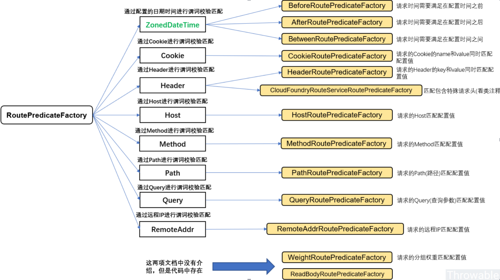
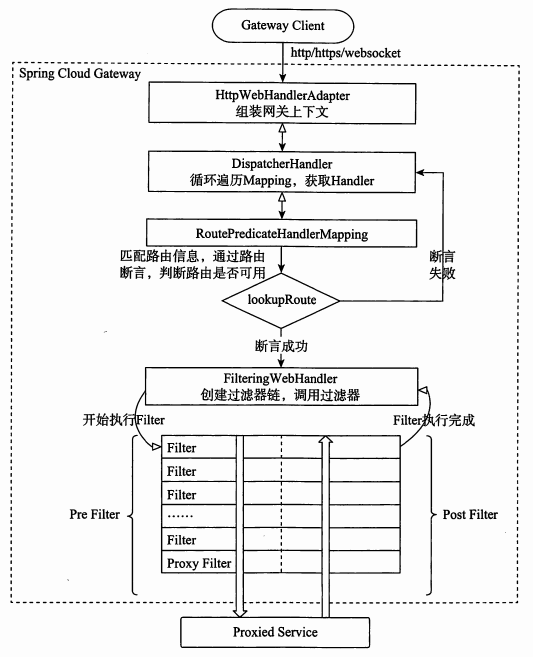

## 一、简介

网关提供 API 全托管服务，丰富的 API 管理功能，辅助企业管理大规模的 API，以降低管理成本和安全风险，包括协议适配、协议转发、安全策略（WAF）、防刷、流量、监控日志等功能。一般来说，网关对外暴露的 URL 或者接口信息，统称为路由信息;

### 1. 三个重要概念:

- 路由(route): 路由是网关最基础的部分，路由信息由一个 ID(自定义,不可重复)、一个目的 URL、一组断言工厂和一组 Filter 组成；如果路由断言为真，则说明请求的 URL 和配置的路由匹配。
- 断言(predicate): 在 Spring Cloud Gateway 中的断言函数允许开发者去定义匹配来自于 Http Request 中的任何信息，比如请求头和参数等。
- 过滤器(filter): 一个标准的 Spring Web Filter， Filter 分为两种类型，分别是 Gateway Filter 和 Global Filter，过滤器 Filter 将会对请求和响应进行修改处理。

### 2. 为什么要用gateway

- Spring Cloud Gateway 可以看做是一个 Zuul 1.x 的升级版和代替品，比 Zuul 2 更早的使用 **Netty 实现异步 IO**，从而实现了一个简单、比 Zuul 1.x 更高效的、与 Spring Cloud 紧密配合的 API 网关。
- Spring Cloud Gateway 里明确的区分了 Router 和 Filter，并且一个很大的特点是内置了非常多的开箱即用功能，并且都可以通过 SpringBoot 配置或者手工编码链式调用来使用。比如内置了 **10 种 Router**，使得我们可以直接配置一下就可以随心所欲的根据 Header、或者 Path、或者 Host、或者 Query 来做路由。
- 比如区分了一般的 Filter 和全局 Filter，**内置了 20 种 Filter 和 9 种全局 Filter**，也都可以直接用。当然自定义 Filter 也非常方便。



### 3. 基本原理

客户端向Spring Cloud Gateway发出请求。如果Gateway Handler Mapping确定请求与路由匹配，则将其发送到Gateway Web Handler。此handler通过特定于该请求的过滤器链处理请求。图中filters被虚线划分的原因是filters可以在发送代理请求之前或之后执行逻辑。先执行所有“pre filter”逻辑，然后进行请求代理。在请求代理执行完后，执行“post filter”逻辑。

值得一提的是，在配置路由的时候，如果不指定端口的话，HTTP 默认设置端口为 80，HTTPS 默认设置端口为 443，Spring Cloud Gateway 的启动容器目前只支持 Netty。



## 二、路由规则

- id: 路由ID,唯一，一般为各个服务名称
- uri: 目标URI
  - Http方式: uri:  http://localhost:8001
  - lb(注册中心中服务名字)方式: uri: lb://user-service
    - 注意: 服务名称不可使用下划线(_)，否则会报错
  - ws(websocket)方式: uri: ws://localhost:8001

- predicates: 断言，匹配对应的URL请求，将匹配到的请求追加在目标 URI 之后

### 1. path路由匹配规则

Path 路由断言 Factory 有2个参数: 一个Spring **`PathMatcher`表达式列表**和**可选`matchOptionalTrailingSeparator`标识** .

```yml
spring:
  application:
    name: gateway-server
  cloud:
    gateway:
      # 路由规则
       routes:
          - id: user-service   # 路由ID,唯一，一般为各个服务名称
           uri: http://localhost:8001/ #目标URI,路由到微服务的地址
           predicates:
              - Path=/user/{id},/info/**  # 匹配对应的URL请求，将匹配到的请求追加在目标 URI 之后,多个之间用逗号隔开
```

请求路径:http://localhost:8004/user/info

实际路径:http://localhost:8001/user/info

URI 模板变量 (如上例中的 `id` ) 将以Map的方式保存,可以使用以下方法来更方便地访问这些变量。

```java
Map<String, String> uriVariables = ServerWebExchangeUtils.getPathPredicateVariables(exchange);
String segment = uriVariables.get("id");
```

### 2. query路由匹配规则

Query 路由断言 Factory 有2个参数: 必选项 `param` 和可选项 `regexp`.

```yml
spring:
  application:
    name: gateway-service
  cloud:
    gateway:
      routes:
        - id: user-service
          uri: http://localhost:8001/ 
          predicates: 
           # - Query=token # 匹配请求参数中包含 token 的请求
           - Query=token, ba. # 如果请求参数里包含token参数，并且值匹配为ba. 表达式，则将会被路由，如：token=bar,token=baz
```

### 3. Method 路由

Method 路由断言 Factory只包含一个参数: 需要匹配的HTTP请求方式

```yml
spring:
  application:
    name: gateway-service
  cloud:
    gateway:
      routes:
        - id: user-service
          uri: http://localhost:8001/ 
          predicates: 
            - Method=GET,POST
```

### 4.  After 路由

After Route Predicate Factory采用一个参数——日期时间。在该日期时间之后发生的请求都将被匹配。

```yml
spring:
  cloud:
    gateway:
      routes:
      - id: user-service
        uri: http://localhost:8001/ 
        predicates:
        - After=2017-01-20T17:42:47.789-07:00[America/Denver]
```

### 5. Before 路由

Before Route Predicate Factory采用一个参数——日期时间。在该日期时间之前发生的请求都将被匹配。

```yml
spring:
  cloud:
    gateway:
      routes:
      - id: user-service
        uri: http://localhost:8001/ 
        predicates:
        - Before=2017-01-20T17:42:47.789-07:00[America/Denver]
```

### 6. Between 路由

Between 路由断言 Factory有两个参数，datetime1和datetime2。在datetime1和datetime2之间的请求将被匹配。datetime2参数的实际时间必须在datetime1之后。

```yml
spring:
  cloud:
    gateway:
      routes:
      - id: user-service
        uri: http://localhost:8001/ 
        predicates:
        - Between=2017-01-20T17:42:47.789-07:00[America/Denver], 2017-01-21T17:42:47.789-07:00[America/Denver]
```

### 7. Cookie 路由

Cookie 路由断言 Factory有两个参数，cookie名称和正则表达式。请求包含次cookie名称且正则表达式为真的将会被匹配。

```yml
spring:
  cloud:
    gateway:
      routes:
      - id: user-service
        uri: http://localhost:8001/ 
        predicates:
        - Cookie=chocolate, ch.p
```

### 8. Header  路由

Header 路由断言 Factory有两个参数，header名称和正则表达式。请求包含次header名称且正则表达式为真的将会被匹配。

```yml
spring:
 cloud:
   gateway:
     routes:
     - id: user-service
       uri: http://localhost:8001/ 
       predicates:
       - Header=X-Request-Id, \d+
```

### 9. Host 路由

Host 路由断言 Factory包括一个参数：host name列表。使用Ant路径匹配规则，`.`作为分隔符。 

```yml
spring:
  cloud:
    gateway:
      routes:
      - id: user-service
        uri: http://localhost:8001/ 
        predicates:
        - Host=**.somehost.org,**.anotherhost.org
```

### 10. RemoteAddr 路由

RemoteAddr 路由断言 Factory的参数为 一个CIDR符号（IPv4或IPv6）字符串的列表，最小值为1，例如192.168.0.1/16（其中192.168.0.1是IP地址并且16是子网掩码）。

```yml
spring:
  cloud:
    gateway:
      routes:
      - id: user-service
        uri: http://localhost:8001/ 
        predicates:
        - RemoteAddr=192.168.1.1/24
```

如果请求的remote address 为 `192.168.1.10`则将被路由;

## 三、拦截器

### 1. 内置拦截器(常见)

过滤器允许以某种方式修改传入的HTTP请求或返回的HTTP响应。过滤器的作用域是某些特定路由。Spring Cloud Gateway包括许多内置的 Filter工厂。

#### AddRequestParameter

```yml
spring:
  cloud:
    gateway:
      routes:
      - id: add_request_parameter_route
        uri: http://example.org
        filters:
        - AddRequestParameter=foo, bar
```

对于所有匹配的请求，这将向下游请求添加`foo=bar`查询字符串;

#### AddResponseHeader

```yml
spring:
  cloud:
    gateway:
      routes:
      - id: add_request_header_route
        uri: http://example.org
        filters:
        - AddResponseHeader=X-Response-Foo, Bar
```

对于所有匹配的请求，这会将`x-response-foo:bar`头添加到下游响应的header中;

#### PrefixPath

PrefixPath GatewayFilter 只有一个 `prefix` 参数.

```yml
spring:
  cloud:
    gateway:
      routes:
      - id: prefixpath_route
        uri: http://example.org
        predicates:
        - Path=/hello
        filters:
        - PrefixPath=/mypath
```

这将给所有匹配请求的路径加前缀`/mypath`。因此，向`/hello`发送的请求将发送到`/mypath/hello`。

#### RedirectTo

该过滤器有一个 `status` 和一个 `url`参数。status是300类重定向HTTP代码，如301。该URL应为有效的URL，这将是 `Location` header的值。

```yml
spring:
  cloud:
    gateway:
      routes:
      - id: prefixpath_route
        uri: http://example.org
        filters:
        - RedirectTo=302, http://acme.org
```

这将发送一个302状态码和一个`Location:http://acme.org` header来执行重定向。

#### RewritePath

包含一个 `regexp`正则表达式参数和一个 `replacement` 参数. 通过使用Java正则表达式灵活地重写请求路径。

```yml
spring:
  cloud:
    gateway:
      routes:
      - id: rewritepath_route
        uri: http://example.org
        predicates:
        - Path=/foo/**
        filters:
        - RewritePath=/foo/(?<segment>.*), /$\{segment}
```

对于请求路径`/foo/bar`，将在发出下游请求之前将路径设置为`/bar`。注意,由于YAML规范，请使用 `$\`替换 `$`。

#### StripPrefix

StripPrefix GatewayFilter Factory 包括一个`parts`参数。 `parts`参数指示在将请求发送到下游之前，要从请求中去除的路径中的节数。

```yml
spring:
  cloud:
    gateway:
      routes:
      - id: nameRoot
        uri: http://nameservice
        predicates:
        - Path=/name/**
        filters:
        - StripPrefix=2
```

当通过网关发出`/name/bar/foo`请求时，向`nameservice`发出的请求将是`http://nameservice/foo`。

### 2. 全局过滤器

过滤器执行流程如下，**order 越大，优先级越低**

 

实现 GlobalFilter 和 Ordered，重写相关方法，加入到spring容器管理即可，无需配置，全局过滤器对所有的路由都有效。

```java
@Configuration
public class FilterConfig {

    @Bean
    @Order(-1)
    public GlobalFilter a() {
        return new AFilter();
    }

    @Bean
    @Order(0)
    public GlobalFilter b() {
        return new BFilter();
    }

    @Bean
    @Order(1)
    public GlobalFilter c() {
        return new CFilter();
    }

    @Slf4j
    public class AFilter implements GlobalFilter, Ordered {
        @Override
        public Mono<Void> filter(ServerWebExchange exchange, GatewayFilterChain chain) {
            log.info("AFilter前置逻辑");
            return chain.filter(exchange).then(Mono.fromRunnable(() ->
            {
                log.info("AFilter后置逻辑");
            }));
        }

        //   值越小，优先级越高
//    int HIGHEST_PRECEDENCE = -2147483648;
//    int LOWEST_PRECEDENCE = 2147483647;
        @Override
        public int getOrder() {
            return HIGHEST_PRECEDENCE + 100;
        }
    }

    @Slf4j
    public class BFilter implements GlobalFilter, Ordered {
        @Override
        public Mono<Void> filter(ServerWebExchange exchange, GatewayFilterChain chain) {
            log.info("BFilter前置逻辑");
            return chain.filter(exchange).then(Mono.fromRunnable(() ->
            {
                log.info("BFilter后置逻辑");
            }));
        }

        //   值越小，优先级越高
//    int HIGHEST_PRECEDENCE = -2147483648;
//    int LOWEST_PRECEDENCE = 2147483647;
        @Override
        public int getOrder() {
            return HIGHEST_PRECEDENCE + 200;
        }
    }

    @Slf4j
    public class CFilter implements GlobalFilter, Ordered {

        @Override
        public Mono<Void> filter(ServerWebExchange exchange, GatewayFilterChain chain) {
            log.info("CFilter前置逻辑");
            return chain.filter(exchange).then(Mono.fromRunnable(() ->
            {
                log.info("CFilter后置逻辑");
            }));
        }

        //   值越小，优先级越高
//    int HIGHEST_PRECEDENCE = -2147483648;
//    int LOWEST_PRECEDENCE = 2147483647;
        @Override
        public int getOrder() {
            return HIGHEST_PRECEDENCE + 300;
        }
    }
}
```

### 3. 自定义过滤器

1. 需要实现GatewayFilter, Ordered，实现相关的方法
2. 加入到过滤器工厂，并且注册到spring容器中
3. 在配置文件中进行配置，如果不配置则不启用此过滤器规则

```java
@Component
@Slf4j
public class UserIdCheckGateWayFilter implements GatewayFilter, Ordered {
    @Override
    public Mono<Void> filter(ServerWebExchange exchange, GatewayFilterChain chain) {
        String url = exchange.getRequest().getPath().pathWithinApplication().value();
        log.info("请求URL:" + url);
        log.info("method:" + exchange.getRequest().getMethod());
       /*   String secret = exchange.getRequest().getHeaders().getFirst("secret");
        if (StringUtils.isBlank(secret)){
            return chain.filter(exchange);
        }*/
        //获取param 请求参数
        String uname = exchange.getRequest().getQueryParams().getFirst("uname");
        //获取header
        String userId = exchange.getRequest().getHeaders().getFirst("user-id");
        log.info("userId：" + userId);

        if (StringUtils.isBlank(userId)) {
            log.info("*****头部验证不通过，请在头部输入  user-id");
            //终止请求，直接回应
            exchange.getResponse().setStatusCode(HttpStatus.NOT_ACCEPTABLE);
            return exchange.getResponse().setComplete();
        }
        return chain.filter(exchange);
    }

    //   值越小，优先级越高
//    int HIGHEST_PRECEDENCE = -2147483648;
//    int LOWEST_PRECEDENCE = 2147483647;
    @Override
    public int getOrder() {
        return HIGHEST_PRECEDENCE;
    }
}
```

```java
@Component
public class UserIdCheckGatewayFilterFactory extends AbstractGatewayFilterFactory<Object>{
    @Override
    public GatewayFilter apply(Object config){
        return new UserIdCheckGateWayFilter();
    }
}
```

```yml
- id: service_provider_demo_route_filter
  uri: lb://service-provider-demo
  predicates:
  - Path=/filter/**
  filters:
  - RewritePath=/filter/(?<segment>.*), /provider/$\{segment}
  - UserIdCheckGateWayFilter
```

## 四、限流

不想整理了，用到了再整理吧


**参考:**

- https://www.cnblogs.com/crazymakercircle/p/11704077.html
- http://www.macrozheng.com/#/cloud/gateway