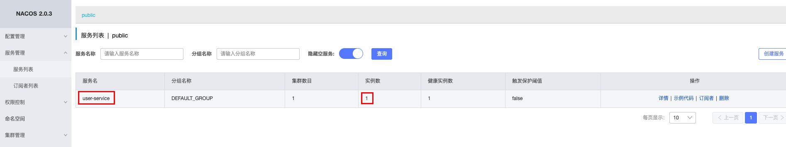
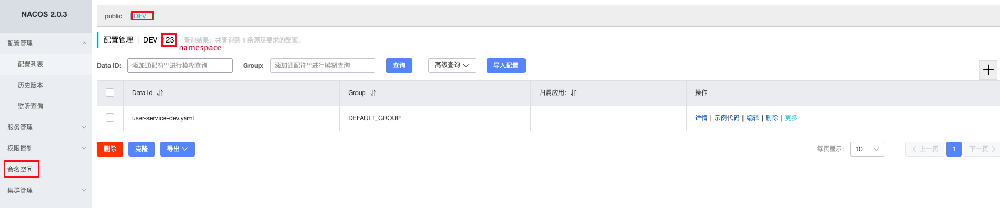
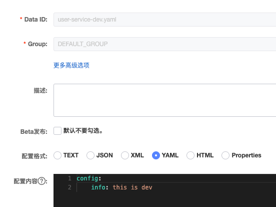
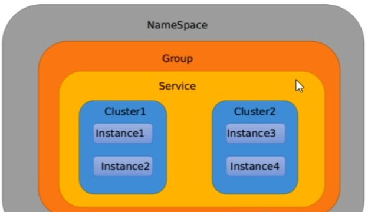

## 一、什么是Nacos

- **注册中心：支持基于DNS和基于RPC的服务发现，支持对服务的实时的健康检查，阻止向不健康的主机或服务实例发送请求；**
- **配置中心：动态配置服务可以让您以中心化、外部化和动态化的方式管理所有环境的应用配置和服务配置；**
- 动态 DNS 服务：动态 DNS 服务支持权重路由，让您更容易地实现中间层负载均衡、更灵活的路由策略、流量控制以及数据中心内网的简单DNS解析服务；
- 服务及其元数据管理：支持从微服务平台建设的视角管理数据中心的所有服务及元数据。

#### 几种注册中心的比较:

- Zookeeper

  Zookeeper的功能主要是他的树形节点来实现的，遵守CAP理论中的CP，即一致性和分区容错性，在集群中，当leader挂了，或者超半数follower投票得出leader不可用，那么会重新选举，**这段期间zk服务是不可用的**。

- Nacos

  Nacos同时支持CP和AP原则，支持切换，AP模式下服务以临时实例注册，CP模式下服务以永久实例注册，Nacos集成了配置中心的功能。

- Eureka

  Eureka则追求可用性(AP)，只存在Eureka Server，就可以获取到服务注册列表信息，**但是可能获取到不是最新的**，这就是为了可用性放弃了一致性；

## 二、下载安装

[nacos官网](https://nacos.io/zh-cn/docs/what-is-nacos.html)

[nacos安装包下载地址](https://github.com/alibaba/nacos/releases)

**启动:**

- 解压后进入nacos/bin目录目录下
- linux：`sh startup.sh -m standalone`(单机启动，默认是集群)
- windows：`cmd startup.cmd`
- http://ip:8848/nacos，账号密码默认nacos

## 三、注册中心

```java
// 服务发现的依赖
<dependency>
    <groupId>com.alibaba.cloud</groupId>
    <artifactId>spring-cloud-starter-alibaba-nacos-discovery</artifactId>
</dependency>
```

```yml
server:
  port: 8001
spring:
  application:
    name: user-service # 服务名称
  cloud:
    nacos:
      discovery:
        server-addr: localhost:8848 # 配置Nacos地址
```

```java
// 添加服务发现注解
@EnableDiscoveryClient
@SpringBootApplication
public class UserApplication8001 {
    public static void main(String[] args) {
        SpringApplication.run(UserApplication8001.class, args);
    }
}
```



这里的服务名与yml配置的一样，如果存在两个服务名一样的话，这里的实例数量就会变成多个，访问的时候会负载均衡到不同的实例上。

## 四、配置中心

```java
<dependency>
    <groupId>com.alibaba.cloud</groupId>
    <artifactId>spring-cloud-starter-alibaba-nacos-config</artifactId>
</dependency>
```

#### 1. 文件配置

添加配置文件**bootstrap.yml**（配置文件中优先级最高）

```yml
server:
  port: 8001
spring:
  application:
    name: user-service
  profiles:
    active: dev
  cloud:
    nacos:
      discovery:
        server-addr: 101.43.51.245:8848 #配置Nacos地址
      config:
        server-addr: 101.43.51.245:8848 #Nacos地址
        file-extension: yaml # 指定文件后缀名
        prefix: user-service
        # namespace: 123
        # group: DEFAULT_GROUP
      
```

- file-extension: 默认后缀properties
- prefix: 文件名 -- 如果没有配置则默认为 ${spring.appliction.name}
- namespace: 默认为Public命名空间则不用填写，填写的是创建命名空间时的那个ID
- group: 指定配置群组，如果是Public命名空间，则默认为DEFAULT_GROUP



 

- **DataID**: ${spring.application.name}-${spring.profiles.active}.${spring.cloud.nacos.config.file-extension},其中${spring.application.name}可以由prefix配置。
- **Group:** 群组，由group配置。

#### 2. 自动刷新

- **在@Value注入的变量所在类上添加注解@RefreshScope；**

```java
@RestController
@RefreshScope
public class UserController{

    @Value("${config.info}")
    private String configInfo;

    @GetMapping("/configInfo")
    public String getConfigInfo() {
        return configInfo;
    }
}
```

- **使用@ConfigurationProperties注解**

### 3. 总结

 

可以使用namespace进行环境隔离，比方说我们现在有三个环境:开发、测试、生产环境,我们就可以创建三个Namespace,不同的Namespace之间是隔离的。Group可以把不同的微服务划分到同一个分组里面去。