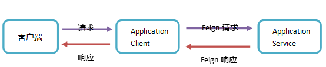
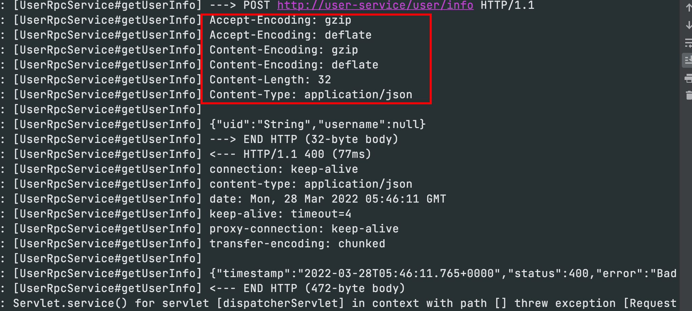

## 一、什么是openFeign

### 1. 简介

Feign**集成了Ribbon、RestTemplate**实现了负载均衡的执行Http调用，只不过对原有的方式（Ribbon+RestTemplate）进行了封装，开发者不必手动使用RestTemplate调服务，而是定义一个接口，在这个接口中标注一个注解即可完成服务调用，这样更加符合面向接口编程的宗旨，简化了开发，但是Feign已经停止迭代。

OpenFeign是在Feign的基础上支持了SpringMVC的注解，如@RequestMapping等等。OpenFeign的@FeignClient可以解析SpringMVC的@RequestMapping注解下的接口，并通过动态代理的方式产生实现类，实现类中做负载均衡并调用其他服务。

### 2. 其他RPC框架

Dubbo: 基于TCP连接，效率速度更高

openFeign: 基于Http连接，相对于速度慢点

具体选用哪一种Rpc框架，我司的想法是因为openFeign可以通过http请求连接，可以方便的进行参数校验；

## 二、接口调用

```java
<dependency>
    <groupId>org.springframework.cloud</groupId>
    <artifactId>spring-cloud-starter-openfeign</artifactId>
</dependency>
```

```java
// 开启openFeign
@EnableFeignClients
@EnableDiscoveryClient
@SpringBootApplication
public class OpenFeignApplication8003 {
    public static void main(String[] args) {
        SpringApplication.run(OpenFeignApplication8003.class, args);

    }
}
```

**生产者提供的接口：**

```java
@RestController
@RequestMapping("/user")
public class UserController {

    @PostMapping("/info")
    public User getUserInfo(@Validated @RequestBody UserReq req) {
        User user = new User();
        user.setPassword(req.getUid());
        return user;
    }

    @PostMapping("/allUser")
    public List<String> listUser(UserReq req) {
        List<String> strings = Arrays.asList("user1", "user2", req.getUid(), req.getUsername());
        return strings;
    }

    @GetMapping("/info/{id}")
    public String getUser(@PathVariable("id") String id) {
        return "this is info/{id}" + id;
    }

    @GetMapping("/getOther")
    public String getOther(String id, Integer num) {
        return "this is getOther" + id + "==" + num;
    }

    @PutMapping("/putUser")
    public String putUser(String username) {
        return "update user" + username;
    }

}
```

**消费者提供的接口:**

```java
@FeignClient(value = "user-service", path = "user" ,contextId = "menu-client")
public interface UserRpcService {

  	// openFeign默认使用JSON传参，可以不用@RequestBody，这里仅为了规范使用
    @PostMapping("/info")
    User getUserInfo(@RequestBody UserReq req);

  	// 当参数为POJO表单传参，需要添加@SpringQueryMap注解
    @PostMapping("/allUser")
    List<String> listUser(@SpringQueryMap UserReq req);

  	// 路径传参使用@PathVariable("id")
    @GetMapping("/info/{id}")
    String getUser(@PathVariable("id") String id);
		
  	// 普通表单传参，使用@RequestParam("id")表明参数名称，每个都要
    @GetMapping("/getOther")
    String getOther(@RequestParam("id") String id, @RequestParam("num") Integer num);

  	// 普通表单传参，使用@RequestParam("id")表明参数名称，每个都要
    @PutMapping("/putUser")
    String putUser(@RequestParam("username") String username);

}
```

- user-service: 消费者的服务名称
- path: 接口统一前缀（/user）
- contextId: 如果存在两个相同的**value = "user-service"**,就需要使用**contextId = "menu-client"**来区分不同的Bean，不然会报错Bean重复
- 请求路径，请求方式和参数都必须与生产者保持一致

**调用者接口：**

```java
@RestController
@RequestMapping("/openFeign")
public class OpenFeignController {

    @Autowired
    private UserRpcService userRpcService;

    @DeleteMapping("test1")
    public User getUserInfo(String uid) {
        UserReq userReq = new UserReq();
        userReq.setUid(uid);
        User userInfo = userRpcService.getUserInfo(userReq);
        return userInfo;
    }

    @DeleteMapping("/test2")
    public List<String> listUser() {
        UserReq userReq = new UserReq();
        userReq.setUid("123");
        userReq.setUsername("255555");
        List<String> strings = userRpcService.listUser(userReq);
        return strings;
    }

    @DeleteMapping("/test3")
    public String getUser() {
        return userRpcService.getUser("gggg");
    }

    @DeleteMapping("/test4")
    public String getOther() {
        return userRpcService.getOther("id", 123);
    }

    @DeleteMapping("/test5")
    public String putUser(String username) {
        return userRpcService.putUser(username);
    }

}
```

- **调用者用什么请求方式，参数类型均不用管，正常调用消费者的接口即可。**

## 三、熔断降级

常见的熔断降级框架有`Hystrix`、`Sentinel`，openFeign默认支持的就是`Hystrix`；

但是对于功能，性能来说，阿里的Sentinel的都完胜Hystrix，所以我们也将使用Sentinel进行服务降级；

```xml
<dependency>
    <groupId>com.alibaba.cloud</groupId>
    <artifactId>spring-cloud-starter-alibaba-sentinel</artifactId>
</dependency>
```

```yml
feign:
  sentinel:
    enabled: true
```

**实现openFeign的接口:UserRpcService**

```java
@Component
public class UserRpcFallbackServiceImpl implements UserRpcService {
    @Override
    public User getUserInfo(UserReq req) {
        return null;
    }

    @Override
    public List<String> listUser(UserReq req) {
        return Arrays.asList("fallback", "listUser");
    }

    @Override
    public String getUser(String id) {
        return "this is getUser fallback";
    }

    @Override
    public String getOther(String id, Integer num) {
        return "this is getOther fallback";
    }

    @Override
    public String putUser(String username) {
        return "this is putUser fallback";
    }
}
```

- **fallback = UserRpcFallbackServiceImpl.class,这里是那个实现类**
- **这样如果提供方的接口出现问题(超时/报错/抛出异常),就会走UserRpcFallbackServiceImpl实现类中的接口返回,实现降级功能**

```java
@FeignClient(value = "user-service", path = "user", fallback = UserRpcFallbackServiceImpl.class)
public interface UserRpcService {
    @PostMapping("/info")
    User getUserInfo(@RequestBody UserReq req);

    @PostMapping("/allUser")
    List<String> listUser(@SpringQueryMap UserReq req);

    @GetMapping("/info/{id}")
    String getUser(@PathVariable("id") String id);

    @GetMapping("/getOther")
    String getOther(@RequestParam("id") String id, @RequestParam("num") Integer num);

    @PutMapping("/putUser")
    String putUser(@RequestParam("username") String username);
}
```

## 四、使用HttpClient

Feign在默认情况下使用的是JDK原生的**URLConnection**发送HTTP请求，没有连接池，但是对每个地址会保持一个长连接，即利用HTTP的persistence connection。

可以在SynchronousMethodHandler类，executeAndDecode方法中查看到:


在生产环境中，通常不使用默认的http client，通常有如下两种选择：

- 使用**ApacheHttpClient(推荐，更稳定)**
- 使用**OkHttp**

### 1. 添加依赖

```java
<!--使用Apache HttpClient替换Feign原生httpclient-->
  <dependency>
  <groupId>org.apache.httpcomponents</groupId>
  <artifactId>httpclient</artifactId>
</dependency>    
<dependency>
  <groupId>io.github.openfeign</groupId>
  <artifactId>feign-httpclient</artifactId>
</dependency>
```

### 2. yml配置文件

```yml
feign:
  client:
    httpclient:
      # 开启 Http Client
      enabled: true
```


## 五、超时重试

**这里我将提供者的一个方法睡眠3秒钟，发现读超时了。**

```java
@GetMapping("/info/{id}")
public String getUser(@PathVariable("id") String id) throws InterruptedException {
    Thread.sleep(3000);
    return "this is info/{id}" + id;
}
```


**这是为什么呢？**

```java
public Options() {
    this(10L, TimeUnit.SECONDS, 60L, TimeUnit.SECONDS, true);
}
```

在源码类FeignLoadBalancer中有一个execute方法：

```java
public FeignLoadBalancer.RibbonResponse execute(FeignLoadBalancer.RibbonRequest request, IClientConfig configOverride) throws IOException {
    Options options;
    if (configOverride != null) {
        RibbonProperties override = RibbonProperties.from(configOverride);
        options = new Options(override.connectTimeout(this.connectTimeout), override.readTimeout(this.readTimeout));
    } else {
        options = new Options(this.connectTimeout, this.readTimeout);
    }

    Response response = request.client().execute(request.toRequest(), options);
    return new FeignLoadBalancer.RibbonResponse(request.getUri(), response);
}
```

**源码解读：**

- openFeign其实是有默认的超时时间的，默认分别是连接超时时间10秒、读超时时间60秒，但是没有用到
- 由于openFeign继承了Ribbon，Ribbon的默认超时连接时间、读超时时间都是是1秒
- 如果openFeign没有设置对应得超时时间，那么将会采用Ribbon的默认超时时间

**解决:**

- 设置openFeign的超时时间(推荐)

```yml
feign:
  client:
    config:
			# default 设置的全局超时时间，对所有的openFeign接口服务都生效
      default:
        connectTimeout: 2000 # 单位: 毫秒
        readTimeout: 2000 # 单位: 毫秒
      # 指定服务名称可以设置单个服务的超时时间,该优先级大于default
      user-service:
        connectTimeout: 5000 # 单位: 毫秒
        readTimeout: 5000 # 单位: 毫秒
```

- 设置Ribbon的超时时间(不推荐)

```yml
ribbon:
  # 值的是建立链接所用的时间，适用于网络状况正常的情况下， 两端链接所用的时间
  ReadTimeout: 5000
  # 指的是建立链接后从服务器读取可用资源所用的时间
  ConectTimeout: 5000
```

以上只是服务级别的设置超时时间，那如果我一个服务下，只是某个接口的超时时间该怎么设置呢？？？

**目前不知道**

## 六、开启GZIP配置

### **1. GZIP** 压缩算法

- gzip是一种数据格式，采用用deflate算法压缩数据；
- gzip是一种流行的数据压缩算法，应用十分广泛，尤其是在Linux平台。

当GZIP压缩到一个纯文本数据时，效果是非常明显的，大约可以减少70％以上的数据大小。

> 网络数据经过压缩后实际上降低了网络传输的字节数，最明显的好处就是可以加快网页加载的速度。网页加载速度加快的好处不言而喻，除了节省流量，改善用户的浏览体验外，另一个潜在的好处是GZIP与搜索引擎的抓取工具有着更好的关系。例如 Google就可以通过直接读取GZIP文件来比普通手工抓取更快地检索网页。

### 2. GZIP 压缩算法原理

 

**按照上图拆解出的步骤如下：**

- 客户端向服务器请求头中带有：Accept-Encoding:gzip,deflate 字段，向服务器表示，客户端支持的压缩格式（gzip或者deflate)，如果不发送该消息头，服务器是不会压缩的。
- 服务端在收到请求之后，如果发现请求头中含有Accept-Encoding字段，并且支持该类型的压缩，就对响应报文压缩之后返回给客户端，并且携带Content-Encoding:gzip消息头，表示响应报文是根据该格式压缩过的。
- 客户端接收到响应之后，先判断是否有Content-Encoding消息头，如果有，按该格式解压报文。否则按正常报文处理。

openFeign支持**请求/响应**开启GZIP压缩，整体的流程如下图:

 

- 上图中涉及到GZIP传输的只有两块，分别是Application client -> Application Service、 Application Service->Application client。

- **openFeign支持的GZIP仅仅是在openFeign接口的请求和响应，即是openFeign消费者调用服务提供者的接口。**

### 3. 开启GZIP

```yml
feign:
  ## 开启压缩
  compression:
    request:
      enabled: true
      ## 开启压缩的阈值，单位字节，默认2048，即是2k，这里为了演示效果设置成10字节
      min-request-size: 10
      # 配置压缩支持的MIME TYPE
      mime-types: text/xml,application/xml,application/json 
    response:
      enabled: true # 配置响应GZIP压缩
```



## 七、增强日志

openFeign虽然提供了日志增强功能，但是默认是不显示任何日志的，不过开发者在调试阶段可以自己配置日志的级别。

**openFeign的日志级别如下:**

- NONE：默认的，不显示任何日志;
- BASIC：仅记录请求方法、URL、响应状态码及执行时间;
- HEADERS：除了BASIC中定义的信息之外，还有请求和响应的头信息;
- FULL：除了HEADERS中定义的信息之外，还有请求和响应的正文及元数据;

### 1. 配置类中配置日志等级

```java
import feign.Logger;
@Configuration
public class OpenFeignConfig {

    /**
     * 日志级别定义
     */
    @Bean
    Logger.Level feignLoggerLevel() {
        return Logger.Level.FULL;
    }

}
```

注意: 这里的Logger是feign.Logger包里的

### 2. yml配置

只需要在配置文件中调整指定包或者openFeign的接口日志级别

```yml
logging:
  level:
    com.sun: debug
```

**com.sun**是openFeign接口所在包名，当然你也可以配置一个特定的openFeign接口；


参考:

- https://blog.csdn.net/agonie201218/article/details/121154769