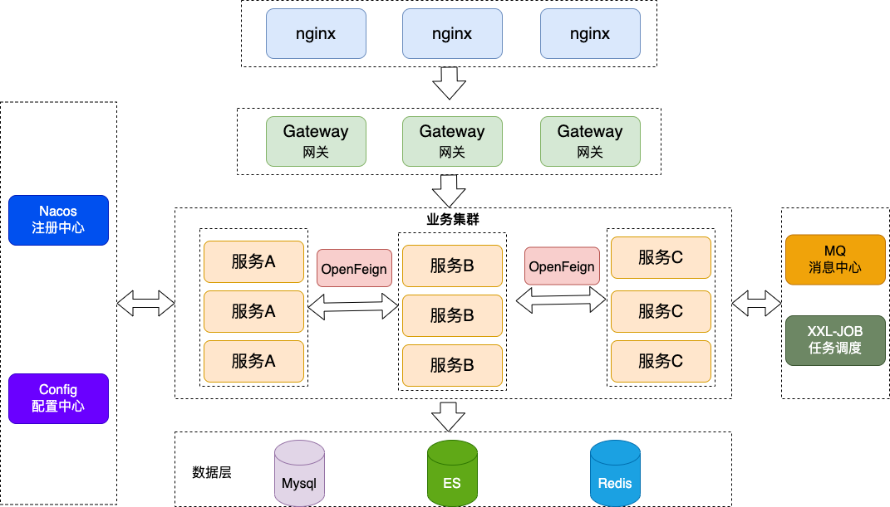

## 一、微服务基本架构图



## 二、微服务版本关系

| SpringCloud Version | SpringBoot Version |
| ------------------- | ------------------ |
| Hoxton              | 2.2.x              |
| Greenwich           | 2.1.x              |
| Finchley            | 2.0.x              |
| Edgware             | 1.5.x              |
| Dalston             | 1.5.x              |

### 三、父POM文件

```java
<?xml version="1.0" encoding="UTF-8"?>
<project xmlns="http://maven.apache.org/POM/4.0.0"
         xmlns:xsi="http://www.w3.org/2001/XMLSchema-instance"
         xsi:schemaLocation="http://maven.apache.org/POM/4.0.0 http://maven.apache.org/xsd/maven-4.0.0.xsd">
    <modelVersion>4.0.0</modelVersion>

    <groupId>com.sun</groupId>
    <artifactId>springcloud</artifactId>
    <version>1.0-SNAPSHOT</version>
    <packaging>pom</packaging>

    <!--统一管理jar包版本-->
    <properties>
        <project.build.sourceEncoding>UTF-8</project.build.sourceEncoding>
        <maven.compiler.source>12</maven.compiler.source>
        <maven.compiler.target>12</maven.compiler.target>
        <junit.version>4.12</junit.version>
        <lombok.version>1.18.10</lombok.version>
        <log4j.version>1.2.17</log4j.version>
        <mysql.version>8.0.27</mysql.version>
        <druid.version>1.2.8</druid.version>
        <mybatis.spring.boot.version>2.1.3</mybatis.spring.boot.version>
        <spring.cloud>Hoxton.SR3</spring.cloud>
    </properties>

    <!--子模块继承之后，提供作用：锁定版本+子module不用写groupId和version-->
    <dependencyManagement>
        <dependencies>
            <dependency>
                <groupId>org.apache.maven.plugins</groupId>
                <artifactId>maven-compiler-plugin</artifactId>
                <version>2.3.2</version>
            </dependency>
            <dependency>
                <groupId>org.apache.maven</groupId>
                <artifactId>maven-project</artifactId>
                <version>2.2.1</version>
            </dependency>
            <!--spring boot 2.2.2-->
            <dependency>
                <groupId>org.springframework.boot</groupId>
                <artifactId>spring-boot-dependencies</artifactId>
                <version>2.2.5.RELEASE</version>
                <type>pom</type>
                <scope>import</scope>
            </dependency>
            <!--spring cloud Hoxton.SR3-->
            <dependency>
                <groupId>org.springframework.cloud</groupId>
                <artifactId>spring-cloud-dependencies</artifactId>
                <version>${spring.cloud}</version>
                <type>pom</type>
                <scope>import</scope>
            </dependency>
            <!--spring cloud 阿里巴巴-->
            <dependency>
                <groupId>com.alibaba.cloud</groupId>
                <artifactId>spring-cloud-alibaba-dependencies</artifactId>
                <version>2.1.0.RELEASE</version>
                <type>pom</type>
                <scope>import</scope>
            </dependency>
            <!--mysql-->
            <dependency>
                <groupId>mysql</groupId>
                <artifactId>mysql-connector-java</artifactId>
                <version>${mysql.version}</version>
                <scope>runtime</scope>
            </dependency>
            <!-- druid-->
            <dependency>
                <groupId>com.alibaba</groupId>
                <artifactId>druid-spring-boot-starter</artifactId>
                <version>${druid.version}</version>
            </dependency>

            <!--mybatis-->
            <dependency>
                <groupId>org.mybatis.spring.boot</groupId>
                <artifactId>mybatis-spring-boot-starter</artifactId>
                <version>${mybatis.spring.boot.version}</version>
            </dependency>
            <!--junit-->
            <dependency>
                <groupId>junit</groupId>
                <artifactId>junit</artifactId>
                <version>${junit.version}</version>
            </dependency>
            <!--log4j-->
            <dependency>
                <groupId>log4j</groupId>
                <artifactId>log4j</artifactId>
                <version>${log4j.version}</version>
            </dependency>
        </dependencies>

    </dependencyManagement>
</project>
```

