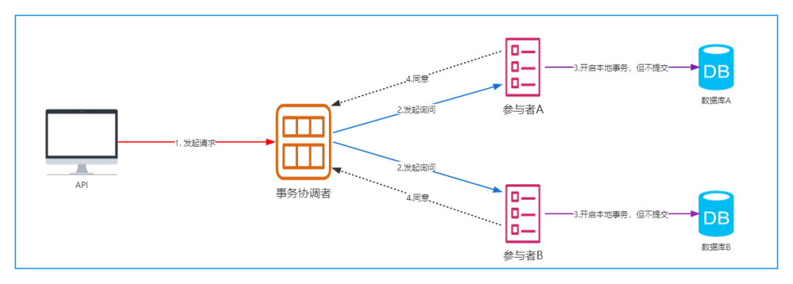
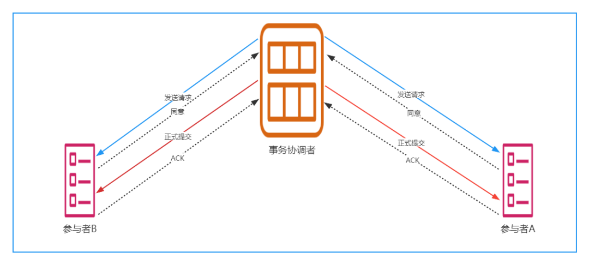
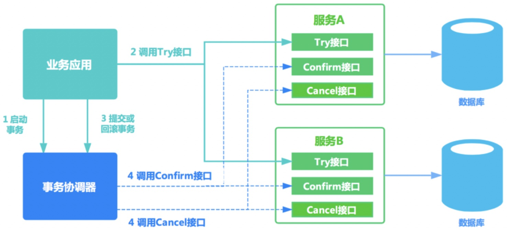
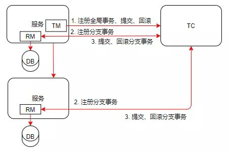

## XA规范

在分布式架构下，每个节点只知道自己的操作是成功还是失败，无法得知其他节点的状态，当一个事物跨多个节点的时候，为了保证事物的原子性和一致性，从而引入一个`协调者`来统筹掌管所有的`参与者`的操作结果，并指示它们是否对操作结果进行真正的`提交`或`回滚`。

分布式事务的实现方式有很多种，最具有代表性的是由Oracle Tuxedo系统提出的`XA分布式事务协议`。XA协议包括两阶段提交（2PC）和三阶段提交（3PC）两种实现

### 二阶段提交(2PC)

两个阶段分别为:

- 准备阶段
- 提交阶段

两个角色:

- 事物的协调者(事物管理器):事物的发起者
- 事物的参与者(资源管理器):事物的执行者

#### 准备阶段(投票阶段)

这是二阶段提交的第一阶段,由事物协调者发起询问参与者是否可以提交事物,但是这一阶段并没有真正提交事物

1. 事物协调者向所有参与者询问是否可以提交事物,并等待答复
2. 各参与者执行事务操作,将undo和redo日志都记录好,但并未真正提交事物
3. 如参与者都准备好了,则恢复协调者同意,反之回复中止

**但是如果在第一阶段任意参与者回复`终止`,或者协调者在询问超时之前不能收到参与者的回复,那么这个事物将会被回滚,结束当前事物**

#### 提及阶段(执行阶段)

这一阶段属于二阶段提价的第二阶段,执行事物阶段,协调者向所有参与者发送执行事物的请求,当所有参与者都回复同意时,则意味着完成了事物.流程图如下:

1. 协调者向各个参与者发送提交事物(commit)的请求
2. 参数者收到请求后执行事物提交,并释放事物期间被占用的资源
3. 参与者向协调者回复ack成功的消息
4. 协调者收到了所有的参与者的回复后,完成事物

#### 2pc的缺点

- **性能问题:**执行过程中,所有的参与者都是线程阻塞状态,各个操作数据库的节点此时都占用着数据库资源，只有当所有节点准备完毕，事务协调者才会通知进行全局提交，参与者进行本地事务提交后才会释放资源。这样的过程会比较漫长，对性能影响比较大
- **可靠性问题:**当参与者发生故障,协调者给参与者响应设置响应时间,超时后回滚事物.当协调者发生故障,参与者就会一直阻塞下去,需要对协调者进行集群容错处理
- **数据一致性问题:**在第二阶段,协调者向所有参与者发送提交(commit)请求后发生了故障,而此时的参与者也同时发生了故障,即使通过选举选出了新的协调者,那也无法得知参与者事物的状态,是否被提交成功.

### 三阶段提交(3PC)

三阶段提交是二阶段提交的优化版本,在二阶段提交的基础上新增`CanCommit阶段`和`参与者的超时机制`,在二阶段提交中只有协调者有超时机制,3PC把2PC的准备阶段再次一分为二，这样三阶段提交就有`CanCommit`、`PreCommit`、`DoCommit`三个阶段

#### canCommit阶段:

1. 协调者向所有的参与者发送包含事物内容的canCommit请求,询问是否可以提交事物,并等待回复
2. 参与者收到请求后,如果认为可以执行事物操作,则返回yes进入预提交状态,否则返回no

#### preCommit阶段:

该阶段在canCommit阶段的基础上有两种情况,**如果一阶段参与者返回的都是yes:**

1. 协调者向所有参与者发送preCommit请求,并进入准备阶段
2. 参与者接收到协调者的preCommit请求后,执行事物操作,把undo日志和redo日志写入事物中,`但不提交事物`
3. 如果参与者都执行了事物操作,则返回ACK响应,等待最后的指令

**如果一阶段返回的参与者有no:**

1. 协调者向所有的参与者发送abort请求
2. 参与者收到协调者的abort请求或者超时未收到协调者任何请求,则执行事物的中断

#### doCommit阶段:

1. 该阶段进行真正的事务提交，在阶段二中如果所有的参与者节点都可以进行PreCommit提交，那么协调者就会从“预提交状态” 转变为 “提交状态”。
2. 然后向所有的参与者节点发送"doCommit"请求，参与者节点在收到提交请求后就会各自执行事务提交操作，并向协调者节点反馈“Ack”消息，协调者收到所有参与者的Ack消息后完成事务。
3. 如果其中存在参与者返回no或者超时未响应,协调者则终止事物

##### 优点:

1. 相比二阶段提交，三阶段提交降低了阻塞范围，在等待超时后协调者或参与者会中断事务;

2. 避免了协调者单点问题，阶段 3 中协调者出现问题时，参与者会继续提交事务。

##### 缺点:

数据不一致问题依然存在，当在参与者收到 `preCommit` 请求后等待 `doCommit` 指令时，此时如果协调者请求中断事务，而协调者无法与参与者正常通信，会导致参与者继续提交事务，造成数据不一致

## TCC(事务补偿)

TCC（Try Confirm Cancel）方案是一种应用层面侵入业务的两阶段提交。是目前最火的一种柔性事务方案，其核心思想是：**针对每个操作，都要注册一个与其对应的确认和补偿（撤销）操作**。

TCC分为两个阶段，分别如下：

- 第一阶段：Try（尝试），主要是对业务系统做检测及资源预留 **(加锁，锁住资源)**

- 第二阶段：本阶段根据第一阶段的结果，决定是执行confirm还是cancel

- 1. Confirm（确认）：执行真正的业务（执行业务，释放锁）
  2. Cancle（取消）：是预留资源的取消（出问题，释放锁）

## AT(Auto Transaction)模式

AT 模式是一种无侵入的分布式事务解决方案。在 AT 模式下，用户只需关注自己的“业务 SQL”，用户的 “业务 SQL” 作为一阶段，Seata 框架会自动生成事务的二阶段提交和回滚操作。

- 一阶段：业务数据和回滚日志记录在同一个本地事务中提交，释放本地锁和连接资源。

- 二阶段：提交异步化，非常快速地完成,回滚通过一阶段的回滚日志进行反向补偿。

在 AT 模式下，用户只需关注自己的**业务SQL**，用户的**业务SQL** 作为一阶段，Seata 框架会自动生成事务的二阶段提交和回滚操作。

一个典型的分布式事务过程：

- TM 向 TC 申请开启一个全局事务，全局事务创建成功并生成一个全局唯一的 XID；
- XID 在微服务调用链路的上下文中传播；
- RM 向 TC 注册分支事务，将其纳入 XID 对应全局事务的管辖；
- TM 向 TC 发起针对 XID 的全局提交或回滚决议；
- TC 调度 XID 下管辖的全部分支事务完成提交或回滚请求。