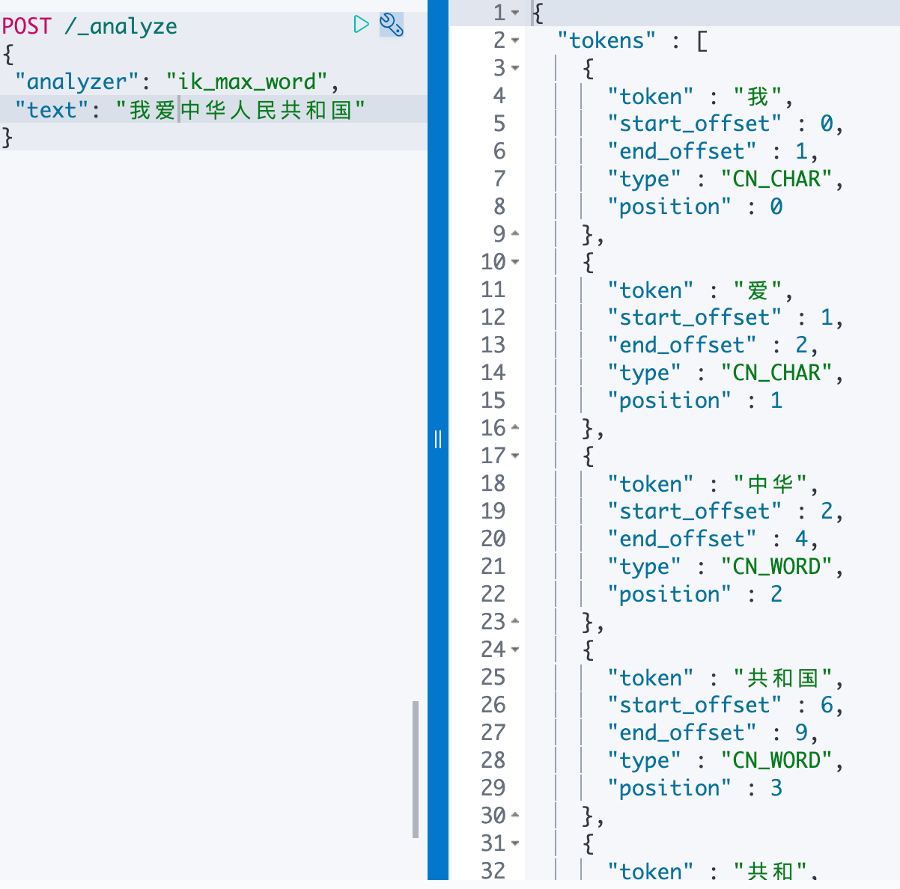
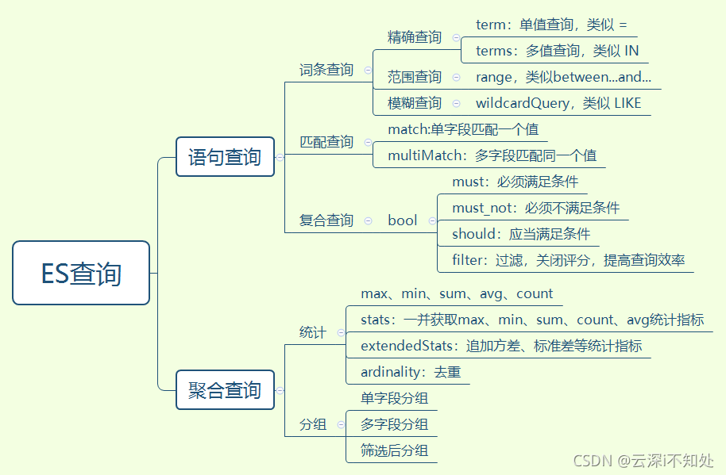
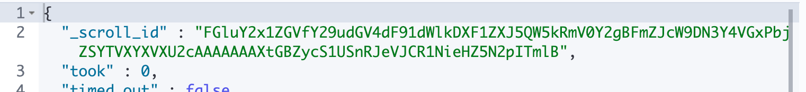
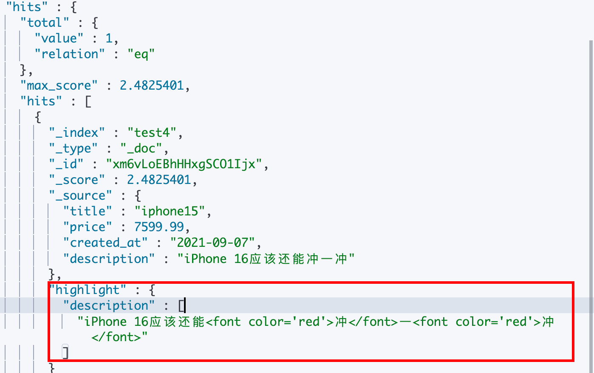

## 一、基本概念

[ES数据准备](https://github.com/elastic/elasticsearch/blob/master/docs/src/test/resources/accounts.json )

### 1. 与传统数据库的概念对比

| RDBS               | ES                                             |
| ------------------ | ---------------------------------------------- |
| 数据库（database） | 索引（index）                                  |
| 表（table）        | 类型（type）（ES6.0之后被废弃，es7中完全删除） |
| 表结构（schema）   | 映射（mapping）                                |
| 行（row）          | 文档（document）                               |
| 列（column）       | 字段（field）                                  |

**什么是倒排索引？**

1. 先将文档中包含的关键字全部提取出来，比如我爱中国，会通过分词器分成我，爱，中国，然后分别对应‘我爱中国’
2. 然后再将关键字与文档的对应关系保存起来
3. 最后对关键字本身做索引排序

### 2. 数据类型

| 一级分类     | 具体类型                                       |
| ------------ | ---------------------------------------------- |
| 字符串类型   | text(分词，全文检索),keyword(不分词，聚合排序) |
| 整数类型     | integer,long,short,byte                        |
| 浮点类型     | double,float,half_float,scaled_float           |
| 逻辑类型     | boolean                                        |
| 日期类型     | date                                           |
| 范围类型     | range                                          |
| 二进制类型   | binary                                         |
| 复合类型     | array                                          |
| 对象类型     | object                                         |
| 数组类型     | nested                                         |
| 地理类型     | geo_point                                      |
| 地理地图     | geo_shape                                      |
| IP类型       | ip                                             |
| 范围类型     | completion                                     |
| 令牌计数类型 | token_count                                    |
| 附件类型     | attachment                                     |
| 抽取类型     | percolator                                     |

### 3. 分词器

**ES内置分词器**

- standard - **默认分词器**，英⽂按单词词切分，并⼩写处理
- simple - 按照单词切分(符号被过滤), ⼩写处理
- stop - ⼩写处理，停⽤词过滤(the,a,is)
- whitespace - 按照空格切分，不转⼩写
- keyword - 不分词，直接将输⼊当作输出

**验证分词器**

```java
POST /_analyze
{
 "analyzer": "simple",
 "text": "This is AB , good Man 中华⼈⺠共和国" 
}
```

**中文分词器:IK分词器**(需要手动安装)

- ik_smart : 会做最粗粒度的拆分
- ik_max_word : 会将⽂本做最细粒度的拆分



### 4. fields

ES允许同一个字段有两个不同的类型，例如一个字段可以拥有`keyword`类型来进行聚合与排序，也可以拥有`text`来做全文检索；

- text字段，分词，可用于**分词查询（模糊）**、全文检索
- keyword字段，不分词，可用于**精确查询**、排序、聚合

```java
PUT my_index
{
  "mappings": {
    "type": {
      "properties": {
        "city": {
          "type": "text",
          "fields": {
            "raw": {
              "type": "keyword"
            }
          }
        }
      }
    }
  }
}
```

```java
GET my_index/_search
{
  "query": {
    "match": {
      "city": "york" 
    }
  },
  "sort": {
    "city.raw": "asc" 
  },
  "aggs": {
    "Cities": {
      "terms": {
        "field": "city.raw" 
      }
    }
  }
}
```

这样`city`字段就有两个属性了分别是`text`和`keyword`，`city`字段可以用作全文检索，`city.raw`可以用作排序和聚合,但是通常我们都会把`raw`定义成`keyword`，方便认知这个另外字段是什么类型。此外也可分别定义分词器，方便中英文的不同分词要求。

### 5. 日期类型使用

```java
PUT tax
{
  "mappings": {
    "properties": {
      "date": {
        "type": "date"
      }
    }
  }
}
```

- 对于`yyyy-MM-dd HH:mm:ss`或`2021-11-1T12:20:00Z`，ES 的自动映射器**完全无法识别**，即便是事先声明日期类型，数据强行写入也会失败。
- 对于`时间戳`和`yyyy-MM-dd`这样的时间格式，ES 自动映射器无法识别，但是如果事先说明了日期类型是**可以正常写入**的。
- 对于标准的日期时间类型是可以正常自动识别为日期类型，并且也可以通过手工映射来实现声明字段类型。

```java
PUT test_index
{
  "mappings": {
    "properties": {
      "time": {
        "type": "date",
        "format": "yyyy-MM-dd HH:mm:ss||yyyy-MM-dd||epoch_millis"
      }
    }
  }
}
```

`"format": "yyyy-MM-dd HH:mm:ss||yyyy-MM-dd||epoch_millis"`，这样就可以避免因为数据格式不统一而导致数据无法写入的窘境

## 二、基本操作

### 1. 索引操作

#### 查询所有索引

```java
GET _cat/indices?v
```

- ?v 的意思 显示列出项 的title
- ?pretty 结果 json 格式化的方式输出

#### 创建索引

```java
PUT /test
{
 	"settings": {
	"number_of_shards": 1, #指定主分⽚的数量
	"number_of_replicas": 0 #指定副本分⽚的数量
 }
}
```

####  查询指定索引

```
GET /test
```

#### 删除索引

```
DELETE /test
```

### 2. 映射操作

类似于Mysql中创建表字段

#### 创建索引时一并创建映射

```java
PUT /test
{
  "settings": {
    "number_of_replicas": 0,
    "number_of_shards": 1
  },
  "mappings": {
    "properties": {
      "title": {
        "type": "keyword"
        "ignore_above": 256
      },
      "price":{
        "type": "double"
      },
      "create_time":{
        "type": "date",
        "format": "yyyy-MM-dd HH:mm:ss||yyyy-MM-dd||epoch_millis"
      },
      "description":{
        "type": "text",
        "fields": {
          "keyword":{
             "type":"keyword",
             "ignore_above" : 256
          }
        }, 
    		"analyzer": "ik_max_word" // 指定分词器
      }
    }
  }
}
```

- `keyword`类型字段可以设置`ignore_above`属性(默认是10) ，表示最大的字段值长度，超出这个长度的字段将不会被索引，但是会存储。

#### 查看索引映射

```java
GET /test/_mapping
```

#### 新增映射

```java
PUT /test/_mapping
{
  "properties": {
       "is_display": {
           "type":"boolean"
       }
   }
}
```

#### 修改映射/删除映射

在ES中一旦声明了字段名称，就不能对字段名称进行修改了。只能新增字段，不能删除、修改已经声明的mapping字段

1. 创建新的索引 new_twitter

2. 把原存在的的索引数据同步到新的索引里

```java
POST _reindex
{
  "source": {
    "index": "twitter"
  },
  "dest": {
    "index": "new_twitter"
  }
}
```

把索引test里的price字段删除，并把price内容复制给新建字段age，然后把数据移动到新的索引test3中

```java
POST _reindex
{
  "source": {
    "index": "test"
  },
  "dest": {
    "index": "test3"
  },
  "script": {
    "source": "ctx._source.age = ctx._source.remove(\"price\")"
  }
}
```

### 3. 文档操作

#### 创建文档

```java
// 指定文档id，理解指定主键id
POST /test/_doc/1
{
 "title":"iphone13",
 "price":8999.99,
 "created_at":"2021-09-15",
 "description":"iPhone 13屏幕采⽤6.1英⼨OLED屏幕。",
 "is_display":true
}

// 随机生成文档id
POST /test/_doc
{
 "title":"iphone14",
 "price":8999.99,
 "created_at":"2021-09-15",
 "description":"狗都不买",
 "is_display":false
}
```

```java
"hits" : [
      {
        "_index" : "test",
        "_type" : "_doc",
        "_id" : "1",
        "_score" : 1.0,
        "_source" : {
          "title" : "iphone13",
          "price" : 8999.99,
          "created_at" : "2021-09-15",
          "description" : "iPhone 13屏幕采⽤6.1英⼨OLED屏幕。",
          "is_display" : true
        }
      },
      {
        "_index" : "test",
        "_type" : "_doc",
        "_id" : "kG4xKIEBhHHxgSCOpYir",
        "_score" : 1.0,
        "_source" : {
          "title" : "iphone14",
          "price" : 8999.99,
          "created_at" : "2021-09-15",
          "description" : "狗都不买",
          "is_display" : false
        }
      }
    ]
```

#### 批量新增文档

```java
POST test4/_bulk
{"index":{}}
{"title":"iphone10","price":1000,"created_at":"2021-09-01","description":"iPhone 10屏幕采⽤6.1英⼨OLED屏幕。"}
{"index":{}}
{"title":"iphone11","price":2000,"created_at":"2021-09-02","description":"iPhone 11的像素还是不错的"}
{"index":{}}
{"title":"iphone12","price":3000.89,"created_at":"2021-09-03","description":"iPhone 12充电打游戏容易发烫"}
{"index":{}}
{"title":"iphone13","price":4999.99,"created_at":"2021-09-04","description":"iPhone 13屏幕会失灵"}
{"index":{}}
{"title":"iphone14","price":5999.09,"created_at":"2021-09-05","description":"iPhone 14今年是没希望买了"}
{"index":{}}
{"title":"iphone15","price":6300.99,"created_at":"2021-09-06","description":"iPhone 15大概率也买不起"}
{"index":{}}
{"title":"iphone16","price":7599.99,"created_at":"2021-09-07","description":"iPhone 16应该还能冲一冲"}
{"index":{}}
{"title":"iphone17","price":8999.99,"created_at":"2021-09-08","description":"iPhone 17狗都不买"}
```

- **行为和请求体数据均不允许换行，不然执行报错**

#### 查找文档/删除文档

```java
GET /test/_doc/1
DELETE /test/_doc/1
```

#### 更新文档字段内容

**1. 全量更新文档，也就是会把原来文档删除，然后重新新建一个文档**

```java
PUT /test/_doc/kG4xKIEBhHHxgSCOpYir
{
  "title": "iphone15"
}
```

```java
"hits" : [
      {
        "_index" : "test",
        "_type" : "_doc",
        "_id" : "kG4xKIEBhHHxgSCOpYir",
        "_score" : 1.0,
        "_source" : {
          "title" : "iphone15"
        }
      }
    ]
```

**2. 仅更新修改字段的内容**

```java
POST /test/_doc/kG4xKIEBhHHxgSCOpYir/_update
{
  "doc" :{
    "title" : "iphon15"
  }
}
```

```java
 "_source" : {
    "title" : "iphon15",
    "price" : 8999.99,
    "created_at" : "2021-09-15",
    "description" : "iPhone 13屏幕采⽤6.1英⼨OLED屏幕。",
    "is_display" : true
  }
```

## 三、查询



### 1. 词条查询

所谓词条查询，也就是ES不会对查询条件进行分词处理，只有当词条和查询字符串完全匹配时，才会被查询到

#### 等值查询-term

```java
GET /test4/_search
{
 "query": {
   "term": {
     "title": {
       "value": "iphone16"
     }
   }
 } ,
 "_source": ["title","price"]
}
```

-  "`_source`": ["title","price"] 选择需要返回的字段

```java
{
  "took" : 0,
  "timed_out" : false,
  "_shards" : { // 分片信息
    "total" : 1, // 总计分片数
    "successful" : 1, // 查询成功的分片数
    "skipped" : 0, // 跳过查询的分片数
    "failed" : 0  // 查询失败的分片数
  },
  "hits" : {
    "total" : {
      "value" : 1, // 数量
      "relation" : "eq"  // 关系：等于
    },
    "max_score" : 1.7917595,// 最高分数
    "hits" : [
      {
        "_index" : "test4", // 索引
        "_type" : "_doc", // 类型
        "_id" : "rG7ILIEBhHHxgSCORYiC",
        "_score" : 1.7917595,
        "_source" : {
          "price" : 7599.99,
          "title" : "iphone16"
        }
      }
    ]
  }
}
```

#### 多值查询-terms

多条件查询类似Mysql里的IN查询

```java
GET /test4/_search
{
  "query": {
    "terms": {
      "title": [
        "iphone17",
        "iphone14"
      ]
    }
  }
}
```

#### 范围查询-range

```mysql
select * from test4 where price between 6000 and 8000;
```

```java
GET /test4/_search
{
  "query": {
    "range": {
      "price": {
        "gte": 6000,
        "lte": 8000
      }
    }
  }
}
```

#### 前缀查询-prefix

类似mysql中的右like

```mysql
select * from test4 where sect like 'iphone%';
```

```java
GET /test4/_search
{
  "query": {
    "prefix": {
      "title": {
        "value": "iphone"
      }
    }
  }
}
```

#### 通配符查询-wildcard

通配符查询，与前缀查询类似，都属于模糊查询的范畴，但通配符显然功能更强。

```mysql
select * from test4 where name like 'iPhone*买';
```

```java
GET /test4/_search
{
  "query": {
    "wildcard": {
      "description.keyword": {
        "value": "iPhone*买"
      }
    }
  }
}
```

#### 查询后修改

查询出作者为张三的记录，把该记录id设置为1

```java
POST /test_report/_update_by_query
{
  "script": {
    "source": "ctx._source.id=1" 
  },
  "query": {
    "term": {
      "author": {
        "value": "张三"
      }
    }
  }
}
```


### 2.全文搜索（模糊搜索）

#### match

match在匹配时会对所查找的关键词进行分词，然后按分词匹配查找，常见模糊搜索就用这个，term常用于精准搜索

```java
GET /test4/_search
{
  "query": {
    "match": {
      "description": "烫冲"
    }
  },
  "size": 20
}
```

match 会将关键词进行分词分成“烫”和“冲”，查找时包含其中任一均可被匹配到。

#### match_phrase

match_phrase在匹配时会对所查找的关键词整体进行搜索，也就是会把"烫冲"当做一个关键词去全文搜索

#### match_all 查询所有，就是查询类型(表)里面所有的值(整张表的内容)

### 3. Bool查询


bool 过滤器下可以有4种子条件，可以任选其中任意一个或多个

```java
{
   "bool" : {
      "must" :     [],
      "should" :   [],
      "must_not" : [],
     	"filter":[]
   }
}
```

- **`must`**：所有的语句都必须匹配，与 ‘=’ 等价
- **`must_not`**：所有的语句都不能匹配，与 ‘!=’ 或 not in 等价
- **`should`**：至少有n个语句要匹配，n由参数控制
  - `minimum_should_match` 参数控制需要匹配的 should 语句的数量，它既可以是一个绝对的数字，又可以是个百分比

**所有 `must` 语句必须匹配，所有 `must_not` 语句都必须不匹配，但有多少 `should` 语句应该匹配呢？默认情况下，没有 `should` 语句是必须匹配的，只有一个例外：那就是当没有 `must` 语句的时候，至少有一个 `should` 语句必须匹配;**

```sql
select 
	*
from
	test4
where 
	title = 'iphone15'
and
	price between 2000 and 6000
and 
	created_at != '2021-09-03'
and 
	(description = 'iPhone 17狗都不买' OR description = 'iPhone 15大概率也买不起')
```

```java
GET /test4/_search
{
  "query": {
    "bool": {
      "must": [
        {
          "term": {
            "title": {
              "value": "iphone15"
            }
          }
        },
        {
          "range": {
            "price": {
              "gte": 2000,
              "lte": 7000
            }
          }
        }
      ],
      "must_not": [
        {
          "term": {
            "created_at": {
              "value": "2021-09-04"
            }
          }
        }
      ],
      "should": [
        {
          "term": {
            "description.keyword": {
              "value": "iPhone 17狗都不买"
            }
          }
        },
        {
          "term": {
            "description.keyword": {
              "value": "iPhone 15大概率也买不起"
            }
          }
        }
      ],
      "minimum_should_match": "1"
    }
  }
}
```

### 3. Filter查询

- query查询的时候，会先比较查询条件，然后计算分值，最后返回文档结果；
- filter是先判断是否满足查询条件，如果不满足会缓存查询结果（记录该文档不满足结果），满足的话，就直接缓存结果
- **filter不会对结果进行评分，能够提高查询效率**。

#### 单独使用

单独使用时，filter与must基本一样，不同的是**filter不计算评分，效率更高**

```java
GET /test4/_search
{
  "query": {
    "bool": {
      "filter": [
        {
          "term": {
            "description.keyword": "iPhone 17狗都不买"
          }
        }
      ]
    }
  }
}
```

#### **和must、must_not同级，相当于子查询**

```mysql
select * from (select * from test4 where sect = 'iphone15')) a where price = '2000';
```

```java
GET /test4/_search
{
  "query": {
    "bool": {
      "must": [
        {
          "term": {
            "title": {
              "value": "iphone15"
            }
          }
        }
      ],
      "filter": [
        {
          "term": {
            "price": "2000"
          }
        }
      ]
    }
  }
}
```

#### 将must、must_not置于filter下,这是最常见的

```java
GET /test4/_search
{
	"query": {
		"bool": {
			"filter": [
				{
					"bool": {
						"must": [
							{
								"term": {
									"description": {
										"value": "狗"
									}
								}
							},
							{
								"range": {
									"price": {
										"from": 2000,
										"to": 9000
									}
								}
							}
						],
						"must_not": [
							{
								"term": {
									"title": {
										"value": "iphone18"
									}
								}
							}
						]
					}
				}
			]
		}
	}
}
```

### 4. 聚合查询

#### 最值 max/min

```java
GET /test4/_search
{
  "size":0, // 只要聚合结果，不要数据
  // 先查询出来address=mill
	"query": {
		"match": {
			"address": "mill"
		}
	},
	"aggs": {
		"ageAvg": { // 只是名称，叫什么都行
			"avg": { // 关键字，平均
				"field": "age" // 平均的字段
			}
		},
		"ageSum": {
			"sum": {
				"field": "age"
			}
		},
		"ageMax":{
		  "max": {
		    "field": "age"
		  }
		},
		"ageMin":{
		  "min": {
		    "field": "age"
		  }
		},
		"ageCount":{
		  "value_count": {
		    "field": "age"
		  }
		}
	},
	"size": 0
}
```

Terms聚合:比如性别有男、女，就会创建两个桶，分别存放男女的信息。

默认会搜集 doc_count 的信息，即记录有多少男生，有多少女生，然后返回给客户端，这样就完成了一个 terms 的统计。

https://blog.csdn.net/zjun1001/article/details/124536727

#### 分组查询

```java
GET /srp_backend_report_center/_search
{
    "size":0, // 只要buckets结果，不要查询的数据
    "aggs":{
        "suibian":{ // 随便叫啥名称
            "terms":{
                "field":"author" // 根据author分组
                "min_doc_count": 100 // 最少数量，100个
                  
                //"size":3 // 分组后展示的条数
                
                //"order": { // 分组后按照数量排序 _count关键字
				        //    "_count": "asc"
				        //},
                  
              	"order": { // 分组后按照搜索字段排序
				            "_key": "asc"
				        }
              
              
            }
        }
    }
}
返回的结构： key=>分组的名称 doc_count=>分组后各组的数量
```

```java
"aggregations" : {
    "suibian" : {
      "doc_count_error_upper_bound" : 0,
      "sum_other_doc_count" : 14310,
      "buckets" : [
        {
          "key" : "大越期货研究所",
          "doc_count" : 208
        },
        {
          "key" : "格林期货研究所",
          "doc_count" : 182
        },
        {
          "key" : "信达期货研究所",
          "doc_count" : 151
        },
        {
          "key" : "admin名",
          "doc_count" : 146
        },
        {
          "key" : "华融期货研究所",
          "doc_count" : 128
        },
        {
          "key" : "宝城期货研究所",
          "doc_count" : 112
        }
      ]
    }
  }
```

#### 分组后取第一条数据

```java
GET test/_search
{
  "size": 0,
  "aggs": {
    "stationAgg": {
      "terms": {
        "field": "Station",
        "size": 100,        // 比站点数量多就行
        "min_doc_count": 1
      },
      "aggs": {
        "top1": {
          "top_hits": { // 关键字
            "size": 1, // 分组后取第一条
            "sort": [
              {
                "time": { // 根据时间排序
                  "order": "desc"
                }
              }
            ]
          }
        }
      }
    }
  }
}
```

## 四、排序

```java
GET /test4/_search
{
  "query": {
    "match_all": {}
  },
  "sort": [
    {
      "created_at": {
        "order": "desc"
      },
      "title": {
        "order": "asc"
      }
    }
  ],
  "_source": ["created_at","title"],
  "size": 20
}
```

多级排序，先根据`created_at`倒叙排列，然后在根据`title`升序排列

## 五、分页

### from/size方案

```java
GET /test5/_search
{
  "from": 2,
  "size": 2, 
  "query": {
    "match_all": {}
  },
  "sort": [
    {
      "account_number": {
        "order": "asc"
      }
    }
  ]
}
```

- 不过ES默认的分页深度是10000，也就是说from+size超过10000就会报错，看系统的数据量而定使用方案
- 因为es是基于分片的，假设有5个分片，from=100，size=10。则会根据排序规则从5个分片中各取回100条数据数据，然后汇总成500条数据后选择最后面的10条数据，越往后的分页，执行的效率越低

### scroll api方案

还有一种查询场景，我们需要一次性或者每次查询大量的文档，但是对实时性要求并不高。ES针对这种场景提供了scroll api的方案。这个方案牺牲了实时性，但是查询效率确实非常高。

```java
GET /test5/_search?scroll=5m
{
  "size": 2, 
  "query": {
    "match_all": {}
  },
  "sort": [
    {
      "account_number": {
        "order": "asc"
      }
    }
  ]
}
```

- `from`: 只能填0，不填默认就是0
- scroll=5m，在内存中保持5分钟有效
- 首先我们第一次查询，会生成一个当前查询条件结果的快照，后面的每次滚屏（或者叫翻页）都是基于这个快照的结果，**也就是即使有新的数据进来也不会别查询到**。



上面这个查询结果会返回一个`scroll_id`，拷贝过来，组成下一条查询语句

```java
GET _search/scroll
{
  "scroll_id": "FGluY2x1ZGVfY29udGV4dF91dWlkDXF1ZXJ5QW5kRmV0Y2gBFmZJcW9DN3Y4VGxPbjZSYTVXYXVXU2cAAAAAAAXuKBZycS1USnRJeVJCR1NieHZ5N2pITmlB",
  "scroll": "5m"
}
```

- scroll 参数相当于告诉了 ES我们的`search context`要保持多久，后面每个 scroll 请求都会设置一个新的过期时间，以确保我们可以一直进行下一页操作。

### search after方案

有时候我们会遇到一些业务场景，需要进行很深度的分页，但是可以不指定页数翻页，只要可以实时请求下一页就行。比如一些实时滚动的场景。

search after利用实时有游标来帮我们解决实时滚动的问题，简单来说前一次查询的结果会返回一个唯一的字符串，下次查询带上这个字符串，进行下一页的查询;

```java
GET /test5/_search
{
  "from": 0,
  "size": 2, 
  "query": {
    "match_all": {}
  },
  "sort": [
    {
      "account_number": "asc",
      "_id": "asc"
    }
  ]
}
```

唯一的区别在于`sort`部分我多加了id，这个是为了在`order_date`字段一样的情况下告诉ES一个可选的排序方案。因为search after的游标是基于排序产生的；

获取最后一个数据的sort结果：


在`下一页`的查询中，我们带上这个玩意，如下:

```java
GET /test5/_search
{
  "from": 0,
  "size": 2, 
  "query": {
    "match_all": {}
  },
  "search_after": 
      [
          1,
          "1"
        ],
  "sort": [
    {
      "account_number": "asc",
      "_id": "asc"
    }
  ]
}
```

#### 总结：

- from/size 方案的优点是简单，缺点是在深度分页的场景下系统开销比较大，占用较多内存，**如果使用跳页使用这种**。

- search after基于ES内部排序好的游标，可以实时高效的进行分页查询，但是它只能做下一页这样的查询场景，不能随机的指定页数查询。

- scroll方案也很高效，但是它基于快照，不能用在实时性高的业务场景，建议用在类似报表导出，或者ES内部的reindex等场景。

## 六、搜索高亮

```java
GET /test4/_search
{
  "query": {
    "term": {
       "description": {
          "value": "冲"
       }  
    }
  },
  "highlight": {
      "fields": {
        "description": {}
      },
      "pre_tags": "<font color='red'>",
      "post_tags": "</font>",
      "fragment_size": 10,
      "number_of_fragments": 10
    },
    "size": 20
}
```



- `fragment_size`主要控制了每个高亮片段的大小
- `number_of_fragments`控制了返回多少个高亮片段