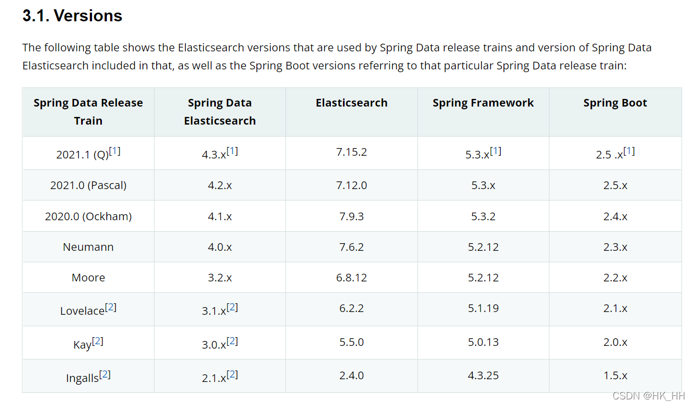

## 一、相关依赖

```java
<dependency>
    <groupId>org.elasticsearch</groupId>
    <artifactId>elasticsearch</artifactId>
    <version>7.14.2</version>
</dependency>
<dependency>
    <groupId>org.springframework.boot</groupId>
    <artifactId>spring-boot-starter-data-elasticsearch</artifactId>
</dependency>
<dependency>
    <groupId>org.elasticsearch.client</groupId>
    <artifactId>elasticsearch-rest-high-level-client</artifactId>
    <version>7.14.2</version>
</dependency>
```

**需要注意的是保持springboot，es客户端，es服务端的版本匹配；**

**SpringBoot版本: 2.6.4**

**es服务: 7.14**

**es客户端: 7.14.2**

## 二、相关配置

**yml配置**

```yaml
elasticsearch:
  host: xxx.xxx.xxx
  port: 9200
```

**配置类**

```java
package com.sun.es.config;

import com.sun.es.util.EsUtils;
import org.apache.http.HttpHost;
import org.elasticsearch.action.DocWriteRequest;
import org.elasticsearch.action.bulk.*;
import org.elasticsearch.client.RequestOptions;
import org.elasticsearch.client.RestClient;
import org.elasticsearch.client.RestClientBuilder;
import org.elasticsearch.client.RestHighLevelClient;
import org.elasticsearch.common.unit.ByteSizeUnit;
import org.elasticsearch.common.unit.ByteSizeValue;
import org.elasticsearch.core.TimeValue;
import org.slf4j.Logger;
import org.slf4j.LoggerFactory;
import org.springframework.beans.factory.annotation.Value;
import org.springframework.context.annotation.Bean;
import org.springframework.context.annotation.Configuration;

import java.util.List;
import java.util.stream.Collectors;

/**
 * @author sun
 */
@Configuration
public class ElasticsearchConfig {

    private static final Logger log = LoggerFactory.getLogger(ElasticsearchConfig.class);

    @Value("${elasticsearch.host:''}")
    private String host;

    @Value("${elasticsearch.port:9200}")
    private int port;

    public static int CONNECT_TIMEOUT_MILLIS = 10000;
    public static int SOCKET_TIMEOUT_MILLIS = 30000;
    public static int CONNECTION_REQUEST_TIMEOUT_MILLIS = 5000;
    public static int MAX_CONN_PER_ROUTE = 10;
    public static int MAX_CONN_TOTAL = 30;

    /**
     * 获取连接。
     *
     * @return RestHighLevelClient
     */
    @Bean
    public RestHighLevelClient initRestClient() {
        RestClientBuilder builder = RestClient.builder(new HttpHost(host, port, "http"))
                // 配置连接时间延时
                .setRequestConfigCallback(requestConfigBuilder -> requestConfigBuilder
                        .setConnectTimeout(CONNECT_TIMEOUT_MILLIS)
                        .setSocketTimeout(SOCKET_TIMEOUT_MILLIS)
                        .setConnectionRequestTimeout(CONNECTION_REQUEST_TIMEOUT_MILLIS))
                // 使用异步httpclient时设置并发连接数
                .setHttpClientConfigCallback(httpAsyncClientBuilder -> httpAsyncClientBuilder
                        .setMaxConnTotal(MAX_CONN_TOTAL)
                        .setMaxConnPerRoute(MAX_CONN_PER_ROUTE));
        return new RestHighLevelClient(builder);
    }

  	// 批量新增工具，放在bean里保证单例
    @Bean
    public BulkProcessor createBulkProcessor() {
        BulkProcessor.Listener listener = new BulkProcessor.Listener() {
            @Override
            public void beforeBulk(long executionId, BulkRequest request) {
                log.info("1. 【beforeBulk】批次[{}] 携带 {} 请求数量", executionId, request.numberOfActions());
            }

            @Override
            public void afterBulk(long executionId, BulkRequest request, BulkResponse response) {
                if (!response.hasFailures()) {
                    log.info("2. 【afterBulk-成功】批量 [{}] 完成在 {} ms", executionId, response.getTook().getMillis());
                } else {
                    BulkItemResponse[] items = response.getItems();
                    for (BulkItemResponse item : items) {
                        if (item.isFailed()) {
                            log.info("2. 【afterBulk-失败】批量 [{}] 出现异常的原因 : {}", executionId, item.getFailureMessage());
                            break;
                        }
                    }
                }
            }

            @Override
            public void afterBulk(long executionId, BulkRequest request, Throwable failure) {
                List<DocWriteRequest<?>> requests = request.requests();
                List<String> esIds = requests.stream().map(DocWriteRequest::id).collect(Collectors.toList());
                log.error("3. 【afterBulk-failure失败】es执行bluk失败,失败的esId为：{}", esIds, failure);
            }
        };
        BulkProcessor.Builder builder = BulkProcessor.builder(((bulkRequest, bulkResponseActionListener) -> {
            initRestClient().bulkAsync(bulkRequest, RequestOptions.DEFAULT, bulkResponseActionListener);
        }), listener);
        //如果消息数量到达1000 或者消息大小到大5M 或者时间达到5s 任意条件满足，客户端就会把当前的数据提交到服务端处理
        //到达1000条时刷新
        builder.setBulkActions(1000);
        //内存到达5M时刷新
        builder.setBulkSize(new ByteSizeValue(5L, ByteSizeUnit.MB));
        //设置的刷新间隔5s
        builder.setFlushInterval(TimeValue.timeValueSeconds(5));
        //设置允许执行的并发请求数。
        builder.setConcurrentRequests(8);
        //设置重试策略,初始等待1ms，后面指数级增加，总共重试3次
        builder.setBackoffPolicy(BackoffPolicy.constantBackoff(TimeValue.timeValueSeconds(1), 3));
        return builder.build();
    }
}
```

**ES异常类**

```java
public class EsException extends RuntimeException {
    private Integer code;

    private String msg;

    public EsException() {
        super();
    }

    public EsException(Throwable cause) {
        super(cause);
    }

    public EsException(String msg) {
        super(msg);
        this.msg = msg;
    }

    public EsException(Integer code, String msg) {
        super(msg);
        this.code = code;
        this.msg = msg;
    }

    public Integer getCode() {
        return code;
    }

    public String getMsg() {
        return msg;
    }
}
```

## 三、工具类

**Es的基础实体对象，所有Es实体需要继承它**

```java
/**
 * @author sunhw
 * @date 2022/6/7
 * 需要使用@JsonProperty来对应
 */
public class EsBase {

    private String id;

    @JsonProperty("create_time")
    @JsonFormat(pattern = "yyyy-MM-dd HH:mm:ss", timezone = "GMT+8")
    private LocalDateTime createTime;

    public String getId() {
        return id;
    }

    public void setId(String id) {
        this.id = id;
    }

    public LocalDateTime getCreateTime() {
        return createTime;
    }

    public void setCreateTime(LocalDateTime createTime) {
        this.createTime = createTime;
    }
}
```

**EsReportDoc: 定义索引名称和映射关系**

```java
package com.sun.es.bean;

import com.sun.es.exception.EsException;
import com.sun.es.util.EsUtils;
import org.elasticsearch.client.RequestOptions;
import org.elasticsearch.client.indices.CreateIndexRequest;
import org.elasticsearch.client.indices.CreateIndexResponse;
import org.elasticsearch.common.settings.Settings;
import org.elasticsearch.common.xcontent.XContentBuilder;
import org.elasticsearch.common.xcontent.json.JsonXContent;

import javax.annotation.Resource;
import java.io.IOException;
import java.util.HashMap;
import java.util.Map;

/**
 * @author sunhw
 * @date 2022/6/7
 */
public class EsReportDoc {

    public static String indexName = "test_report";

    /**
     * 创建映射
     */
    public static XContentBuilder createMapping() throws IOException {

        Map<String, Map<String, Object>> fields = new HashMap<>(1);
        Map<String, Object> keyword = new HashMap<>(2);
        keyword.put("type", "keyword");
        keyword.put("ignore_above", 256);
        fields.put("keyword", keyword);

        // 日期格式化
        String dateFormat = "yyyy-MM-dd HH:mm:ss||yyyy-MM-dd||epoch_millis";

        // 映射
        XContentBuilder mapping = JsonXContent.contentBuilder()
                .startObject()
                .startObject("properties")
                .startObject("report_id").field("type", "text").endObject()
                .startObject("title").field("type", "text").field("analyzer", "ik_max_word").endObject()
                .startObject("author").field("type", "text").field("analyzer", "ik_max_word").endObject()
                .startObject("write_time").field("type", "date").field("format", dateFormat).endObject()
                .startObject("content").field("type", "text").field("fields", fields).field("analyzer", "ik_max_word").endObject()
                .startObject("read").field("type", "boolean").endObject()
                .startObject("create_time").field("type", "date").field("format", dateFormat).endObject()
                .endObject()
                .endObject();
        return mapping;
    }

}
```

**数据的实体对象，需要注意的是要用@JsonProperty注解对应es中的字段**

**@JsonInclude(JsonInclude.Include.NON_NULL)是为了更新数据时，只更新有数据的字段**

```java
/**
 * @author sunhw
 * @date 2022/6/6
 */
@JsonInclude(JsonInclude.Include.NON_NULL)
public class EsReportDto extends EsBase {

    @JsonProperty("report_id")
    private String reportId;

    private String title;

    private String author;

    @JsonProperty("write_time")
    @JsonFormat(pattern = "yyyy-MM-dd HH:mm:ss", timezone = "GMT+8")
    private LocalDateTime writeTime;

    private Boolean read;

    private String content;
}
```

**工具类，包括索引的新增，数据的新增/批量新增/修改/删除/查询后修改/查询后删除**

```java
package com.sun.es.util;

import com.fasterxml.jackson.databind.ObjectMapper;
import com.sun.es.bean.EsBase;
import com.sun.es.config.ElasticsearchConfig;
import com.sun.es.exception.EsException;
import org.apache.http.client.utils.HttpClientUtils;
import org.elasticsearch.action.ActionListener;
import org.elasticsearch.action.DocWriteRequest;
import org.elasticsearch.action.bulk.*;
import org.elasticsearch.action.delete.DeleteRequest;
import org.elasticsearch.action.index.IndexRequest;
import org.elasticsearch.action.index.IndexResponse;
import org.elasticsearch.action.support.WriteRequest;
import org.elasticsearch.action.update.UpdateRequest;
import org.elasticsearch.action.update.UpdateResponse;
import org.elasticsearch.client.RequestOptions;
import org.elasticsearch.client.indices.CreateIndexRequest;
import org.elasticsearch.client.indices.CreateIndexResponse;
import org.elasticsearch.client.indices.GetIndexRequest;
import org.elasticsearch.common.settings.Settings;
import org.elasticsearch.common.unit.ByteSizeUnit;
import org.elasticsearch.common.unit.ByteSizeValue;
import org.elasticsearch.common.xcontent.XContentBuilder;
import org.elasticsearch.common.xcontent.XContentType;
import org.elasticsearch.core.TimeValue;
import org.elasticsearch.index.get.GetResult;
import org.elasticsearch.index.query.MatchQueryBuilder;
import org.elasticsearch.index.query.QueryBuilder;
import org.elasticsearch.index.query.TermQueryBuilder;
import org.elasticsearch.index.reindex.DeleteByQueryRequest;
import org.elasticsearch.index.reindex.UpdateByQueryRequest;
import org.elasticsearch.script.Script;
import org.elasticsearch.script.ScriptType;
import org.slf4j.Logger;
import org.slf4j.LoggerFactory;
import org.springframework.stereotype.Component;

import javax.annotation.Resource;
import java.io.IOException;
import java.time.LocalDateTime;
import java.util.*;
import java.util.concurrent.TimeUnit;
import java.util.stream.Collectors;

/**
 * @author sunhw
 * @date 2022/6/5
 */
@Component
public class EsUtils {

    @Resource
    private ElasticsearchConfig elasticsearchConfig;

    @Resource
    private ObjectMapper objectMapper;

    /**
     * 创建索引
     *
     * @param indexName 索引名称
     * @param mapping   映射
     */
    public boolean createIndex(String indexName, XContentBuilder mapping) throws IOException {
        // 判断索引是否存在
        if (existsIndex(indexName)) {
            throw new EsException("索引已存在:" + indexName);
        }
        // 配置分片
        Settings.Builder settings = Settings.builder()
                .put("number_of_shards", 2)
                .put("number_of_replicas", 1);
        // 添加索引
        CreateIndexRequest request = new CreateIndexRequest(indexName);
        request.mapping(mapping);
        request.settings(settings);
        CreateIndexResponse response = elasticsearchConfig.initRestClient().indices().create(request, RequestOptions.DEFAULT);
        return response.isAcknowledged();
    }

    public boolean existsIndex(String index) throws IOException {
        GetIndexRequest request = new GetIndexRequest(index);
        return elasticsearchConfig.initRestClient().indices().exists(request, RequestOptions.DEFAULT);
    }

    /**
     * 保存文档记录
     *
     * @param index 索引名称
     * @param data  数据
     */
    public <T extends EsBase> int save(String index, T data) throws Exception {
        LocalDateTime createTime = data.getCreateTime();
        if (Objects.isNull(createTime)) {
            data.setCreateTime(LocalDateTime.now());
        }
        // IndexRequest
        IndexRequest indexRequest = new IndexRequest(index);
        indexRequest.create(true);
        String id = getId(data);
        String source = objectMapper.writeValueAsString(data);
        indexRequest.id(id).source(source, XContentType.JSON);
        // 操作ES
        IndexResponse indexResponse = elasticsearchConfig.initRestClient().index(indexRequest, RequestOptions.DEFAULT);
        return indexResponse.status().getStatus();
    }

    /**
     * 批量插入
     *
     * @param index    索引名称
     * @param dataList 数据集合
     */
    public <T extends EsBase> int saveBatch(String index, List<T> dataList) throws Exception {
        BulkRequest request = new BulkRequest();
        for (T data : dataList) {
            LocalDateTime createTime = data.getCreateTime();
            if (Objects.isNull(createTime)) {
                data.setCreateTime(LocalDateTime.now());
            }
            String id = getId(data);
            String source = objectMapper.writeValueAsString(data);
            request.add(new IndexRequest(index).id(id).source(source, XContentType.JSON));
        }
        //设置刷新策略
        request.setRefreshPolicy(WriteRequest.RefreshPolicy.WAIT_UNTIL);
        // 操作ES批量插入，此为同步写入，如果存在性能问题，可考虑自行封装异步批量插入
        BulkResponse bulkResponse = elasticsearchConfig.initRestClient().bulk(request, RequestOptions.DEFAULT);
        return bulkResponse.status().getStatus();
    }


    /**
     * 修改数据
     *
     * @param index 索引
     * @param data  数据类型
     * @param <T>   数据类型
     * @param id    主键id
     * @return 修改成功标识
     * @throws Exception 异常
     */
    public <T extends EsBase> int update(String index, T data, String id) throws Exception {
        String source = objectMapper.writeValueAsString(data);
        UpdateRequest updateRequest = new UpdateRequest(index, id);
        updateRequest.doc(source, XContentType.JSON);
        // 操作ES
        UpdateResponse updateResponse = elasticsearchConfig.initRestClient().update(updateRequest, RequestOptions.DEFAULT);
        return updateResponse.status().getStatus();
    }

    /**
     * 根据条件更新
     *
     * @param index        索引名称
     * @param queryBuilder 查询条件
     * @param script       修改
     * @throws IOException
     */
    public void updateQuery(String index, QueryBuilder queryBuilder, Script script) throws IOException {
        UpdateByQueryRequest updateByQueryRequest = new UpdateByQueryRequest();
        updateByQueryRequest.indices(index);
//        new TermQueryBuilder("id", 3001);
        updateByQueryRequest.setQuery(queryBuilder);
//        new Script(ScriptType.INLINE,
//                "painless",
//                "ctx._source.tag='电脑'", Collections.emptyMap());
        updateByQueryRequest.setScript(script);
        //数据为存储而不是更新
        elasticsearchConfig.initRestClient().updateByQuery(updateByQueryRequest, RequestOptions.DEFAULT);
    }

    /**
     * 删除数据
     *
     * @param index 索引名称
     * @param id    主键id
     * @throws IOException 异常
     */
    public void delete(String index, String id) throws IOException {
        DeleteRequest deleteRequest = new DeleteRequest(index, id);
        elasticsearchConfig.initRestClient().delete(deleteRequest, RequestOptions.DEFAULT);
    }

    /**
     * 根据条件删除
     *
     * @param index        索引名称
     * @param queryBuilder 条件
     * @throws IOException
     */
    private void deleteQuery(String index, QueryBuilder queryBuilder) throws IOException {
        DeleteByQueryRequest deleteByQueryRequest = new DeleteByQueryRequest();
        deleteByQueryRequest.indices(index);
        deleteByQueryRequest.setQuery(queryBuilder);
        elasticsearchConfig.initRestClient().deleteByQuery(deleteByQueryRequest, RequestOptions.DEFAULT);
    }


    /**
     * 批量保存数据，效率会更高，但是需要满足以下三个条件之一
     *
     * @param index    索引名称
     * @param dataList 数据
     * @throws Exception 异常
     */
    public <T extends EsBase> void saveBulkProcessor(String index, List<T> dataList) throws Exception {
        List<IndexRequest> indexRequests = new ArrayList<>();
        for (T data : dataList) {
            LocalDateTime createTime = data.getCreateTime();
            if (Objects.isNull(createTime)) {
                data.setCreateTime(LocalDateTime.now());
            }
            IndexRequest request = new IndexRequest(index);
            String source = objectMapper.writeValueAsString(data);
            request.id(getId(data)).source(source, XContentType.JSON);
            request.opType(DocWriteRequest.OpType.CREATE);
            indexRequests.add(request);
        }
        BulkProcessor bulkProcessor = elasticsearchConfig.createBulkProcessor();
        indexRequests.forEach(bulkProcessor::add);
        bulkProcessor.awaitClose(10, TimeUnit.MINUTES);
    }


    private <T extends EsBase> String getId(T data) {
        return Optional.ofNullable(data.getId())
                .orElse(UUID.randomUUID().toString());
    }

}
```

## 四、测试

**数据的增删改测试**

``` java
package com.sun.es;

import com.sun.es.bean.EsReportDoc;
import com.sun.es.dto.EsReportDto;
import com.sun.es.util.EsUtils;
import org.elasticsearch.common.xcontent.XContentBuilder;
import org.junit.Test;
import org.junit.runner.RunWith;
import org.springframework.boot.test.context.SpringBootTest;
import org.springframework.test.context.junit4.SpringRunner;

import javax.annotation.Resource;
import java.io.IOException;
import java.time.LocalDateTime;
import java.util.ArrayList;
import java.util.List;

/**
 * @author sunhw
 * @date 2022/6/5
 */
@SpringBootTest
@RunWith(SpringRunner.class)
public class EsTest {

    @Resource
    private EsUtils esUtils;

    @Test
    public void createIndex() throws IOException {
        XContentBuilder mapping = EsReportDoc.createMapping();
        String indexName = EsReportDoc.indexName;
        boolean index = esUtils.createIndex(indexName, mapping);
        System.out.println(index);
    }

    @Test
    public void save() throws Exception {
        EsReportDto esReportDto = new EsReportDto();
        esReportDto.setReportId("1");
        esReportDto.setAuthor("张三");
        esReportDto.setTitle("测试标题");
        esReportDto.setRead(false);
        esReportDto.setCreateTime(LocalDateTime.now());
        esReportDto.setWriteTime(LocalDateTime.now());
        esUtils.save(EsReportDoc.indexName, esReportDto);
    }

    private List<EsReportDto> beforeData() {
        List<EsReportDto> list = new ArrayList<>();

        for (int i = 0; i < 10000; i++) {
            EsReportDto esReportDto = new EsReportDto();
            esReportDto.setReportId(i + "");
            esReportDto.setAuthor("张三" + i);
            esReportDto.setTitle("测试标题" + i);
            esReportDto.setRead(i % 2 == 0);
            esReportDto.setCreateTime(LocalDateTime.now());
            esReportDto.setWriteTime(LocalDateTime.now());
            list.add(esReportDto);
        }
        return list;
    }

    @Test
    public void saveBatch() throws Exception {
        EsReportDto esReportDto = new EsReportDto();
        esReportDto.setId("2");
        esReportDto.setReportId("2");
        esReportDto.setAuthor("里斯");
        esReportDto.setTitle("里斯测试标题");
        esReportDto.setRead(true);
        esReportDto.setCreateTime(LocalDateTime.now().minusDays(1));
        esReportDto.setWriteTime(LocalDateTime.now().minusDays(2));


        EsReportDto esReportDto2 = new EsReportDto();
        esReportDto2.setId("3");
        esReportDto2.setReportId("3");
        esReportDto2.setAuthor("王二");
        esReportDto2.setTitle("测王二试标题");
        esReportDto2.setRead(false);
        esReportDto2.setCreateTime(LocalDateTime.now().minusDays(4));
        esReportDto2.setWriteTime(LocalDateTime.now().minusDays(5));

        EsReportDto esReportDto3 = new EsReportDto();
        esReportDto3.setId("4");
        esReportDto3.setReportId("4");
        esReportDto3.setAuthor("找刘");
        esReportDto3.setTitle("测试找刘标题");
        esReportDto3.setRead(false);
        esReportDto3.setCreateTime(LocalDateTime.now().minusDays(6));
        esReportDto3.setWriteTime(LocalDateTime.now().minusDays(7));

        List<EsReportDto> list = new ArrayList<>();
        list.add(esReportDto);
        list.add(esReportDto2);
        list.add(esReportDto3);
        int save = esUtils.saveBatch(EsReportDoc.indexName, list);
        System.out.println(save);
    }

    @Test
    public void update() throws Exception {
        EsReportDto esReportDto = new EsReportDto();
        esReportDto.setAuthor("里斯测试修嘎，怎么说");
        int save = esUtils.update(EsReportDoc.indexName, esReportDto, "2");
        System.out.println(save);
    }

    @Test
    public void saveBulkProcessor() throws Exception {
        List<EsReportDto> list = beforeData();
        long start = System.currentTimeMillis();
        System.out.println("开始保存");
        esUtils.saveBulkProcessor(EsReportDoc.indexName, list);
        long end = System.currentTimeMillis();
        System.out.println("保存结束,用时:" + (end - start));

    }

    @Test
    public void saveBulk() throws Exception {
        List<EsReportDto> list = new ArrayList<>();

        for (int i = 0; i < 10000; i++) {
            EsReportDto esReportDto = new EsReportDto();
            esReportDto.setReportId(i + "");
            esReportDto.setAuthor("张三" + i);
            esReportDto.setTitle("测试标题" + i);
            esReportDto.setRead(i % 2 == 0);
            esReportDto.setCreateTime(LocalDateTime.now());
            esReportDto.setWriteTime(LocalDateTime.now());
            list.add(esReportDto);
        }

        long start = System.currentTimeMillis();
        System.out.println("开始保存");
        esUtils.saveBatch(EsReportDoc.indexName, list);
        long end = System.currentTimeMillis();
        System.out.println("保存结束,用时:" + (end - start));

    }

    @Test
    public void delete() throws Exception {
        esUtils.delete(EsReportDoc.indexName, "2");
    }

}
```

**数据的查询测试,基本查询自己去了解，这里包括了分页，排序，高亮**

```java
package com.sun.es;

import com.fasterxml.jackson.databind.ObjectMapper;
import com.sun.es.config.ElasticsearchConfig;
import com.sun.es.vo.ArticleVo;
import org.apache.lucene.search.TotalHits;
import org.elasticsearch.action.search.SearchRequest;
import org.elasticsearch.action.search.SearchResponse;
import org.elasticsearch.client.RequestOptions;
import org.elasticsearch.common.text.Text;
import org.elasticsearch.index.query.BoolQueryBuilder;
import org.elasticsearch.index.query.QueryBuilders;
import org.elasticsearch.search.SearchHit;
import org.elasticsearch.search.SearchHits;
import org.elasticsearch.search.builder.SearchSourceBuilder;
import org.elasticsearch.search.fetch.subphase.highlight.HighlightBuilder;
import org.elasticsearch.search.fetch.subphase.highlight.HighlightField;
import org.elasticsearch.search.sort.FieldSortBuilder;
import org.elasticsearch.search.sort.SortBuilder;
import org.elasticsearch.search.sort.SortBuilders;
import org.elasticsearch.search.sort.SortOrder;
import org.junit.Test;
import org.junit.runner.RunWith;
import org.springframework.boot.test.context.SpringBootTest;
import org.springframework.data.elasticsearch.core.query.NativeSearchQueryBuilder;
import org.springframework.test.context.junit4.SpringRunner;

import javax.annotation.Resource;
import java.io.IOException;
import java.util.Map;

/**
 * @author sunhw
 * @date 2022/6/9
 */
@SpringBootTest
@RunWith(SpringRunner.class)
public class SearchTest {

    @Resource
    private ElasticsearchConfig elasticsearchConfig;
    @Resource
    private ObjectMapper objectMapper;

    @Test
    public void query1() throws IOException {
        int size = 2;
        // 搜索请求对象
        SearchRequest searchRequest = new SearchRequest("srp_backend_report_center");

        // 搜索源构建对象
        SearchSourceBuilder searchSourceBuilder = new SearchSourceBuilder();
        BoolQueryBuilder boolQuery = QueryBuilders.boolQuery();
        boolQuery.must(QueryBuilders.termQuery("title", "开门红"));
        searchSourceBuilder.query(boolQuery);

        // 设置源字段过虑,第一个参数结果集包括哪些字段，第二个参数表示结果集不包括哪些字段
        searchSourceBuilder.fetchSource(null, new String[]{"content"});

        // 分页，由前端传来after，after是第一次后端返回的searchAfter，看下方
//        Object[] after = new Object[]{};
        searchSourceBuilder.size(size);
//        if (after != null) {
//            searchSourceBuilder.searchAfter(after);
//            //当我们使用 search_after 参数的时候，from参数必须被设置成 0 或 -1 （当然你也可以不设置这个from参数）。
//            // -1 往前查一条，0 正常分页
//            searchSourceBuilder.from(0);
//        }

        // 排序
        SortBuilder<FieldSortBuilder> score = SortBuilders.fieldSort("_score").order(SortOrder.DESC);
        searchSourceBuilder.sort(score);
        SortBuilder<FieldSortBuilder> publishTime = SortBuilders.fieldSort("publish_time").order(SortOrder.DESC);
        searchSourceBuilder.sort(publishTime);

        // 高亮
        HighlightBuilder highlightBuilder = new HighlightBuilder();
        // 前后标签和加标签的字段
        highlightBuilder.preTags("<span style='color:red'>").postTags("</span>").field("title").requireFieldMatch(true);
        searchSourceBuilder.highlighter(highlightBuilder);

      	// 聚合 terms
      	TermsAggregationBuilder aggregation = AggregationBuilders
                .terms("title")
                .field("title")
                .size(Integer.MAX_VALUE);
     	  searchSourceBuilder.aggregation(aggregation);
      
        System.out.println(searchSourceBuilder.toString());
        // 向搜索请求对象中设置搜索源
        searchRequest.source(searchSourceBuilder);
        // 执行搜索,向ES发起http请求
        SearchResponse searchResponse = elasticsearchConfig.initRestClient().search(searchRequest, RequestOptions.DEFAULT);
        // 搜索结果
        SearchHits hits = searchResponse.getHits();

        // 匹配到的总记录数
        TotalHits totalHits = hits.getTotalHits();
        long value = totalHits.value;
        // 得到匹配度高的文档
        SearchHit[] searchHits = hits.getHits();
        for (SearchHit searchHit : searchHits) {
            String id = searchHit.getId();
            Map<String, HighlightField> highlightFields = searchHit.getHighlightFields();
            HighlightField title = highlightFields.get("title");
            Map<String, Object> sourceAsMap = searchHit.getSourceAsMap();
            if (title != null) {
                Text[] fragments = title.fragments();
                StringBuilder n_title = new StringBuilder();
                for (Text text : fragments) {
                    n_title.append(text);
                }
                //把高亮字段替换掉原本的内容即可
                sourceAsMap.put("title", n_title.toString());
            }
            ArticleVo articleVo = objectMapper.convertValue(sourceAsMap, ArticleVo.class);
            System.out.println(articleVo);
        }

        // 判断是否还有下一页
        Boolean hasNextPage = searchHits.length >= size;
        Object[] searchAfter = searchHits.length >= 1 ? searchHits[searchHits.length - 1].getSortValues() : null;
        System.out.println(searchAfter.toString());
    }


}
```

**接受的对象也要使用@JsonProperty("article_id")注解**

```java
package com.sun.es.vo;

import com.fasterxml.jackson.annotation.JsonProperty;

/**
 * @author sunhw
 * @date 2022/6/9
 */
public class ArticleVo {

    @JsonProperty("article_id")
    private String articleId;

    private String title;

    @JsonProperty("section_num")
    private Long sectionNum;

    @JsonProperty("section_total")
    private Long sectionTotal;

    @JsonProperty("file_format")
    private String fileFormat;

    private String institution;

    private String author;

    @JsonProperty("first_report_type")
    private String firstReportType;

    private String content;

    ...get/set

}
```