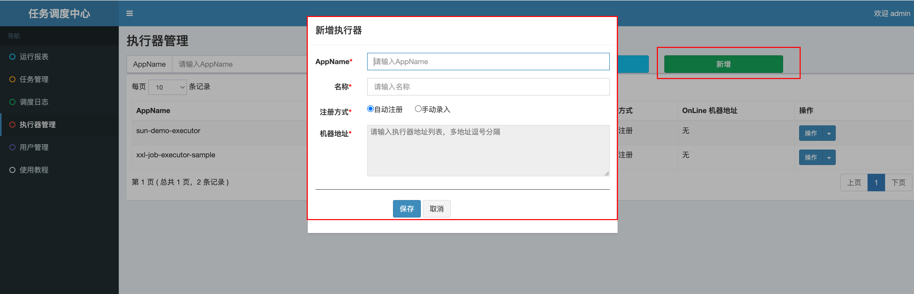

## xxl-job的基本使用

xxl-job是分布式的调度平台调度执行器执行任务，使用的是DB锁(`for update`)来保证集群分布式调用的一致性，学习简单，操作容易，成本不高。

- 准备阶段
- 服务端配置
- 基本使用

### 1. 准备阶段

源码仓库地址：https://github.com/xuxueli/xxl-job


**xxl-job-admin: 调度中心,统一管理任务调度平台上的调度任务，负责触发调度执行，并且提供任务管理平台。**

**xxl-job-core: 接收调度中心的调度并且执行,公共的jar包。**

**xxl-job-executor-samples: 服务端,这里展示的是xxl-job的演示案例**

- 执行xxl-job准备好的sql


- 修改admin模块中的数据库连接,并启动该模块,也可以达成jar包部署


- http://localhost:8080/xxl-job-admin  默认账号密码:admin/123456


### 2. 服务端配置

- 引入xxl-job的starter

```java
<dependency>
    <groupId>com.xuxueli</groupId>
    <artifactId>xxl-job-core</artifactId>
    <version>${版本}</version>
</dependency>
```

- 配置文件

```java
xxl:
  job:
    # 执行器开关
    enabled: true
    # 调度中心地址：如调度中心集群部署存在多个地址则用逗号分隔。
    admin-addresses: http://localhost:8080/xxl-job-admin
    # 执行器通讯TOKEN：非空时启用
    access-token: default_token
    # 执行器配置
    executor:
      # 执行器AppName：执行器心跳注册分组依据；为空则关闭自动注册
      appname: demo-executor
      # 执行器端口号 执行器从19901开始往后写
      port: 9901
      # 执行器注册：默认IP:PORT
      address:
      # 执行器IP：默认自动获取IP
      ip:
      # 执行器运行日志文件存储磁盘路径
      logpath: ./logs/${spring.application.name}/xxl-job
      # 执行器日志文件保存天数：大于3生效
      logretentiondays: 30
```



**客户端需要配置的执行器就是这里的`executor`,页面的`AppName`对应的就是`demo-executor`,名称随意填写**

**注册方式如果选择自动注入,服务端又没有配置的话就会自动读取服务端的地址,手动录入就是手动输入服务端的地址,就是`executor`中配置的ip和port**

这里的`access-token`执行器通讯TOKEN,非空时启用,启动的话需要跟admin模块application.yml的配置文件中的token保持一致

```java
### xxl-job, access token
xxl.job.accessToken=default_token
```

- 注入bean

```java
@Data
@ConfigurationProperties(prefix = "xxl.job")
public class XxlJobProperties {

    private Boolean enabled;

    private String adminAddresses;

    private String accessToken;

    private Executor executor;

    @Data
    @NoArgsConstructor
    public static class Executor {

        private String appname;

        private String address;

        private String ip;

        private int port;

        private String logPath;

        private int logRetentionDays;
    }
}
```

```java
@EnableConfigurationProperties(XxlJobProperties.class)
@AutoConfiguration
@AllArgsConstructor
@ConditionalOnProperty(prefix = "xxl.job", name = "enabled", havingValue = "true")
@Slf4j
public class XxlJobConfig {

    private final XxlJobProperties xxlJobProperties;

    @Bean
    public XxlJobSpringExecutor xxlJobExecutor() {
        log.info(">>>>>>>>>>> xxl-job config init.");
        XxlJobSpringExecutor xxlJobSpringExecutor = new XxlJobSpringExecutor();
        xxlJobSpringExecutor.setAdminAddresses(xxlJobProperties.getAdminAddresses());
        xxlJobSpringExecutor.setAccessToken(xxlJobProperties.getAccessToken());
        XxlJobProperties.Executor executor = xxlJobProperties.getExecutor();
        xxlJobSpringExecutor.setAddress(executor.getAddress());
        xxlJobSpringExecutor.setIp(executor.getIp());
        xxlJobSpringExecutor.setPort(executor.getPort());
        xxlJobSpringExecutor.setLogPath(executor.getLogPath());
        xxlJobSpringExecutor.setLogRetentionDays(executor.getLogRetentionDays());
        return xxlJobSpringExecutor;
    }
}
```

### 3. 基本使用

这里就使用最简单的使用注解的方式来执行定时任务

- 定时任务的业务逻辑

```java
@Service
@Slf4j
public class JobService {

    @XxlJob(value = "demoJobHandler", init = "init", destroy = "destroy")
    public void demoJobHandler2() throws Exception {
        System.out.println("欢迎来到定时任务");
        XxlJobHelper.log("XXL-JOB, Hello World.");
        for (int i = 0; i < 5; i++) {
            XxlJobHelper.log("beat at:" + i);
        }
        // default success
    }

    // 初始化执行
    public void init() {
        log.info("init");
    }

    // 销毁执行
    public void destroy() {
        log.info("destory");
    }

}
```

- 新增任务


```java
- 执行器: 选择刚刚自定义好的执行器
- 调度类型: 选择定时任务的执行方式
- Cron: 定时任务的执行周期
- 运行模式: 如果我们使用的是注解的方式,就选择BEAN类型
- JobHandler: 就设置成服务端@XxlJob(value = "demoJobHandler")这里面的值
```

- 执行


执行一次就只执行一次,启动就是根据设置的执行周期开始定时任务


更加详细的使用可见官方文档: https://www.xuxueli.com/xxl-job/