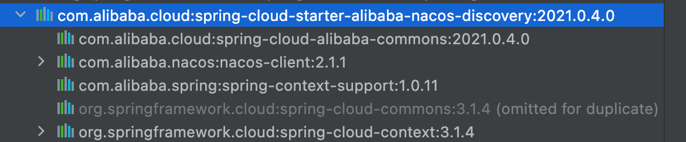

## Nacos服务跨分组调用

### 一、 问题背景

nacos有两种服务隔离的机制,一个是空间namespace,一般我们用namespace区分环境,另外一个是分组group,nacos的默认调用机制是同namespace下的同group的服务才可以相互调用;

那现在有个问题: **在测试阶段,由于测试环境和开发环境数据库等不一致,在测试出bug后,开发人员需要连接到测试环境上复线定位bug,但是如果开发人员本地启动测试环境,那么就会导致测试环境服务多了个本地的实例,这样测试在调用这个服务的时候很有可能就会访问这个本地服务,导致服务异常,所以一般我们都会采用本地服务自定义group分组的方式注册;**

**一般来说,一个服务关连多个其他服务,开发人员就需要把所有相关的服务都注册到自定义的group分组中,这样才能保证接口通常,但是起很多服务又会导致电脑内存消耗巨大,所以就想着能不能只启动存在问题的那个服务,其他关联服务还是使用测试环境的服务,基于这种考虑才想实现跨分组调用,减少无关服务的启动.**

### 二、实现方案

#### 1.版本要求

```java
<dependency>
    <groupId>com.alibaba.cloud</groupId>
    <artifactId>spring-cloud-starter-alibaba-nacos-discovery</artifactId>
    <version>2021.0.4.0</version>
</dependency>
```



**如果 Java 项目的 `nacos discovery` 版本用的是 `2021`以上，则不需要重写 Ribbon 的负载均衡类，因为该版本的 Nacos 不依赖 Ribbon,只需要重写服务发现即可**

#### 2.重写服务发现

```java
public class NacosServiceDiscoveryV2 extends NacosServiceDiscovery {

    public NacosServiceDiscoveryV2(NacosDiscoveryProperties discoveryProperties, NacosServiceManager nacosServiceManager) {
        super(discoveryProperties, nacosServiceManager);
        this.discoveryProperties = discoveryProperties;
        this.nacosServiceManager = nacosServiceManager;
    }

    private NacosDiscoveryProperties discoveryProperties;
    private NacosServiceManager nacosServiceManager;

  	// 重写该方法
    public List<ServiceInstance> getInstances(String serviceId) throws NacosException {
        String group = this.discoveryProperties.getGroup();
      	// 优先保证同分组下的服务调用
        List<Instance> instances = this.namingService().selectInstances(serviceId, group, true);
        if (CollUtil.isEmpty(instances)) {
          	// 如果同分组下找不到服务,那么就从默认分组下找服务
            instances = this.namingService().selectInstances(serviceId, "DEFAULT_GROUP", true);
        }
        return hostToServiceInstanceList(instances, serviceId);
    }

    public List<String> getServices() throws NacosException {
        String group = this.discoveryProperties.getGroup();
        ListView<String> services = this.namingService().getServicesOfServer(1, Integer.MAX_VALUE, group);
        return services.getData();
    }

    public static List<ServiceInstance> hostToServiceInstanceList(List<Instance> instances, String serviceId) {
        List<ServiceInstance> result = new ArrayList(instances.size());
        Iterator var3 = instances.iterator();

        while (var3.hasNext()) {
            Instance instance = (Instance) var3.next();
            ServiceInstance serviceInstance = hostToServiceInstance(instance, serviceId);
            if (serviceInstance != null) {
                result.add(serviceInstance);
            }
        }

        return result;
    }

    public static ServiceInstance hostToServiceInstance(Instance instance, String serviceId) {
        if (instance != null && instance.isEnabled() && instance.isHealthy()) {
            NacosServiceInstance nacosServiceInstance = new NacosServiceInstance();
            nacosServiceInstance.setHost(instance.getIp());
            nacosServiceInstance.setPort(instance.getPort());
            nacosServiceInstance.setServiceId(serviceId);
            nacosServiceInstance.setInstanceId(instance.getInstanceId());
            Map<String, String> metadata = new HashMap();
            metadata.put("nacos.instanceId", instance.getInstanceId());
            metadata.put("nacos.weight", instance.getWeight() + "");
            metadata.put("nacos.healthy", instance.isHealthy() + "");
            metadata.put("nacos.cluster", instance.getClusterName() + "");
            if (instance.getMetadata() != null) {
                metadata.putAll(instance.getMetadata());
            }

            metadata.put("nacos.ephemeral", String.valueOf(instance.isEphemeral()));
            nacosServiceInstance.setMetadata(metadata);
            if (metadata.containsKey("secure")) {
                boolean secure = Boolean.parseBoolean((String) metadata.get("secure"));
                nacosServiceInstance.setSecure(secure);
            }

            return nacosServiceInstance;
        } else {
            return null;
        }
    }

    private NamingService namingService() {
        return this.nacosServiceManager.getNamingService();
    }

}
```

#### 3.重写自动配置类,更早的加载到Nacos容器中

```java
@Configuration(proxyBeanMethods = false)
@ConditionalOnDiscoveryEnabled
@ConditionalOnNacosDiscoveryEnabled
@AutoConfigureBefore({NacosDiscoveryAutoConfiguration.class})
public class NacosDiscoveryAutoConfigurationV2 {

    @Bean
    @ConditionalOnMissingBean
    public NacosServiceDiscovery nacosServiceDiscovery(NacosDiscoveryProperties nacosDiscoveryProperties, NacosServiceManager nacosServiceManager) {
        return new NacosServiceDiscoveryV2(nacosDiscoveryProperties, nacosServiceManager);
    }
}
```

其他版本的nacos的话,可能需要借助Ribbon负载均衡来处理跨分组调用,具体可参考以下:

参考:

- https://blog.csdn.net/m0_71777195/article/details/128350690


