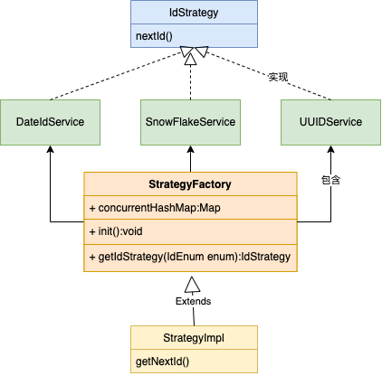

## 一、 什么是策略模式

定义一系列的算法,把每一个算法封装起来, 并且使它们可相互替换。本模式使得算法可独立于使用它的客户而变化。

假设一个场景：比如在分布式系统中需要使用到分布式ID保证ID的唯一性，目前常用到的有雪花算法，UUID，时间随机数等等，现在的需求是在订单模块使用雪花算法，在用户ID使用UUID，在奖品模块使用日期随机数，根据模块的不同而自动切换不同的算法，这就是策略模式。常见跟工厂模式配合。



## 二、 策略模式怎么写

### 1. 接口类

```java
public interface IdStrategy {
    
    String nextId();

}
```

### 2. 三个实现类

```java
@Component
public class DateIdService implements IdStrategy {
    @Override
    public String nextId() {
        // 获取当前时间戳，并发情况下可能会重复
        String dateId = String.valueOf(System.currentTimeMillis());
        return dateId;
    }
}
```

```java
@Component
public class SnowFlakeService implements IdStrategy {
    @Override
    public String nextId() {
        // 使用hutool工具包
        Snowflake snowflake = IdUtil.getSnowflake(1, 1);
        String nextId = snowflake.nextIdStr();
        return nextId;
    }
}
```

```java
@Component
public class UUIDService implements IdStrategy {
    @Override
    public String nextId() {
        // 使用hutool工具类产生的UUID
        String uuid = IdUtil.simpleUUID();
        return uuid;
    }
}
```

### 3. 使用工厂模式把这三个实现类给封装起来

```java
/**
 * @author sunhw
 * @date 2022/3/8
 * 工厂模式有很多种情况，以下只是其中的一种，也可以将这些服务使用Bean的方式注入。
 */
public class IdFactory {

    @Resource
    private DateIdService dateService;

    @Resource
    private UUIDService uUIDService;

    @Resource
    private SnowFlakeService snowFlakeService;

    private static ConcurrentHashMap<Enum<IdEnum>, IdStrategy> concurrentHashMap = new ConcurrentHashMap<>();

  	// 项目初始化的时候自动运行
    @PostConstruct
    public void init() {
        concurrentHashMap.put(IdEnum.DATE_ID, dateService);
        concurrentHashMap.put(IdEnum.UUID_ID, uUIDService);
        concurrentHashMap.put(IdEnum.SNOW_FLAKE, snowFlakeService);
    }
  
  	// 获取类对象
  	public IdStrategy getIdStrategy(Enum<IdEnum> idEnum) {
        return concurrentHashMap.get(idEnum);
    }

}
```

### 4. 调用策略模式的模块

```java
@Component
public class Strategy extends IdFactory {

   	public String getNextId(IdEnum idEnum) {
        IdStrategy idStrategy = getIdStrategy(idEnum);
        String id = idStrategy.nextId();
        return id;
    }

}
```

### 5. 测试

```java
/**
 * @author sunhw
 * @date 2022/3/8
 */
@SpringBootTest
@RunWith(SpringRunner.class)
public class StrategyTest {

    @Resource
    private Strategy strategy;

    @Test
    public void getNextId() {
        System.out.println("雪花ID:" + strategy.getNextId(IdEnum.SNOW_FLAKE));
        System.out.println("日期ID:" + strategy.getNextId(IdEnum.DATE_ID));
        System.out.println("UUID:" + strategy.getNextId(IdEnum.UUID_ID));
    }
}
```

```java
雪花ID:1501107642804867072
日期ID:1646726925933
UUID:db125108bafa4c55968821474e670d0d
```

