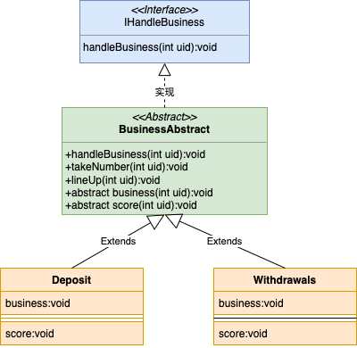

## 一、 什么是模版模式

完成一件事情，有固定的数个步骤，但是每个步骤根据对象的不同，而实现细节不同；就可以在父类中定义一个完成该事情的总方法，按照完成事件需要的步骤去调用其每个步骤的实现方法。每个步骤的具体实现，由子类完成。

举个例子: 每个人去银行办理业务的步骤: 取号，排队，办理业务，给工作人员打分，但是这里面的取号，排队这两个步骤每个人都是一样的，只有办理业务(取钱，存款)，给工作人员打分(1分,2分,3分)是不一样的，所以不同的人只要对这两个步骤特殊实现，取号，排队使用公共方法即可。

## 二、 模版模式怎么写



### 1. 办理业务总接口

```java
/**
 * @author sunhw
 * @date 2022/3/9
 * 处理业务的接口
 */
public interface IHandleBusiness {

    /**
     * 去银行处理业务
     */
    void handleBusiness(int uid);

}
```

### 2. 模版抽象类

```java
/**
 * @author sunhw
 * @date 2022/3/9
 */
public abstract class BusinessAbstract implements IHandleBusiness {

    @Override
    public void handleBusiness(int uid) {
        System.out.println(uid + "走进了银行的大门");
        // 第一步：取号
        int num = takeNumber(uid);
        // 第二步：排队等待
        lineUp(uid, num);
        // 第三步：办理业务
        business(uid);
        // 第四步：给工作人员打分
        score(uid);
    }

    /**
     * 取号
     */
    public int takeNumber(Integer uid) {
        int random = new Random().nextInt(100);
        System.out.println(uid + "取号了:" + random);
        return random;
    }

    /**
     * 排队
     */
    public void lineUp(Integer uid, int num) {
        System.out.println(uid + "拿着" + num + "正在排队");
    }

    /**
     * 办理业务
     */
    public abstract void business(int uid);

    /**
     * 打分
     */
    public abstract void score(int uid);


}
```

### 3. 取钱和存钱实现类

```java
/**
 * @author sunhw
 * @date 2022/3/9
 * 存款
 */
@Component
public class Deposit extends BusinessAbstract {

    @Override
    public void business(int uid) {
        System.out.println(uid + "想存入1块钱");
    }

    @Override
    public void score(int uid) {
        System.out.println(uid + "不太满意，打了0分");
    }

}
```

```java
/**
 * @author sunhw
 * @date 2022/3/9
 * 取钱
 */
@Component
public class Withdrawals extends BusinessAbstract {

    @Override
    public void business(int uid) {
        System.out.println(uid + "办理取钱业务");
    }

    @Override
    public void score(int uid) {
        System.out.println(uid + "表示很满意，打了3分");
    }
}
```

### 4. 测试类

```java
@Resource
private Deposit deposit;

@Resource
private Withdrawals withdrawals;

@Test
public void template() {
    deposit.handleBusiness(123);
    System.out.println("==========");
    withdrawals.handleBusiness(456);
}
```

```java
123走进了银行的大门
123取号了:13
123拿着13正在排队
123想存入1块钱
123不太满意，打了0分
==========
456走进了银行的大门
456取号了:52
456拿着52正在排队
456办理取钱业务
456表示很满意，打了3分
```

