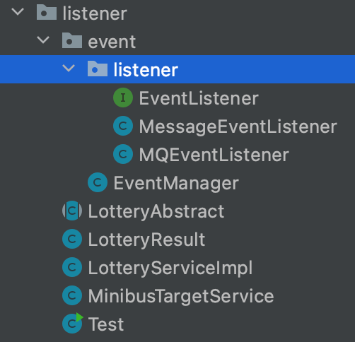

## 一、什么是观察者模式

简单来说，观察者模式就是当一个行为发生时，传递信息给另外多个监听者，然后由监听者做出相应的处理，两者之间无任何耦合，跟消息队列中的生产者，消费者差不多。

例如: 用户在购买商品下单付款后，另外一个系统会监听到付款行为，然后通知商家某某已付款，请准备商品发货。

## 二、观察者模式怎么写

模拟抽奖抽中了，系统记录抽奖记录和给你发短信的场景；

 

从上图可以看出，观察者模式主要分为三大部分，一是事件监听者，负责监听到后处理的事情，二是事件处理中心，包括监听者的订阅，取消订阅和通知，三是事件的发起者。

### 1. 事件监听接口

```java
public interface EventListener {

    void doEvent(LotteryResult result);

}
```

所有的监听者都要实现这个接口；

### 2. MQ监听者和Message监听者

```java
public class MessageEventListener implements EventListener{

    private Logger logger = LoggerFactory.getLogger(MessageEventListener.class);

    @Override
    public void doEvent(LotteryResult result) {
        logger.info("给用户{}发送短信通知:{}",result.getUid(),result.getMsg());
    }
}
```

```java
public class MQEventListener implements EventListener {

    private Logger logger = LoggerFactory.getLogger(MQEventListener.class);

    @Override
    public void doEvent(LotteryResult result) {
        logger.info("记录用户 {} 摇号结果(MQ)：{}", result.getUid(), result.getMsg());
    }
}
```

这就是不同监听者，监视发起者的动态而做出不同的反应处理；

### 3. 事件处理中心

```java
public class EventManager {

    public enum EventType {
        MQ, MESSAGE;
    }

    Map<Enum<EventType>, com.sun.listener.event.listener.EventListener> listeners = new HashMap<>();

    /**
     * 订阅
     *
     * @param eventType 事件类型
     * @param listener  监听
     */
    public void subscribe(EventType eventType, com.sun.listener.event.listener.EventListener listener) {
        listeners.put(eventType, listener);
    }

    /**
     * 取消订阅
     *
     * @param eventType 事件类型
     */
    public void unsubscribe(EventType eventType) {
        listeners.remove(eventType);
    }

    /**
     * 通知
     *
     * @param eventType 事件类型
     * @param result    请求参数
     */
    public void notify(Enum<EventType> eventType, LotteryResult result) {
        EventListener eventListener = listeners.get(eventType);
        eventListener.doEvent(result);
    }

}
```

事件处理中心的主要作用就是监听者的订阅，取消订阅和通知。使用枚举是控制传参类型。

### 4. 业务抽象类

```java
public abstract class LotteryAbstract {

    private EventManager eventManager;

  	// 初始化监听者
    public LotteryAbstract() {
        eventManager = new EventManager();
        eventManager.subscribe(EventManager.EventType.MQ, new MQEventListener());
        eventManager.subscribe(EventManager.EventType.MESSAGE, new MessageEventListener());
    }

    public LotteryResult draw(String uid) {
        LotteryResult lotteryResult = doDraw(uid);
        // 需要什么通知就给调用什么方法
        eventManager.notify(EventManager.EventType.MQ, lotteryResult);
        eventManager.notify(EventManager.EventType.MESSAGE, lotteryResult);
        return lotteryResult;
    }

    protected abstract LotteryResult doDraw(String uid);

}
```

这里就是封装内部调用，让调用者不用关心内部的调用关系。这里我感觉有点像模版模式。

### 5. 被监听的业务

```java
public class MinibusTargetService {

    /**
     * 模拟摇号，但不是摇号算法
     *
     * @param uId 用户编号
     * @return 结果
     */
    public String lottery(String uId) {
        return Math.abs(uId.hashCode()) % 2 == 0 ? "恭喜你，编码".concat(uId).concat("在本次摇号中签") : "很遗憾，编码".concat(uId).concat("在本次摇号未中签或摇号资格已过期");
    }

}
```

```java
public class LotteryServiceImpl extends LotteryAbstract {

    private MinibusTargetService minibusTargetService = new MinibusTargetService();

    @Override
    protected LotteryResult doDraw(String uId) {
        // 摇号
        String lottery = minibusTargetService.lottery(uId);
        // 结果
        return new LotteryResult(uId, lottery);
    }

}
```

### 6. 测试

```java
public class Test {

    public static void main(String[] args) {
        LotteryAbstract lotteryService = new LotteryServiceImpl();
        LotteryResult lotteryResult = lotteryService.draw("123455");
        System.out.println(lotteryResult.getUid() + "==" + lotteryResult.getMsg());
    }
}
```

利用抽象类的多态，调用抽象类的draw的方法，作用到LotteryServiceImpl的doDraw()方法。

```java
13:31:45.172 [main] INFO com.sun.listener.event.listener.MQEventListener - 记录用户 123455 摇号结果(MQ)：恭喜你，编码123455在本次摇号中签
13:31:45.176 [main] INFO com.sun.listener.event.listener.MessageEventListener - 给用户123455发送短信通知:恭喜你，编码123455在本次摇号中签
123455==恭喜你，编码123455在本次摇号中签
```

### 7. 总结

观察者模式又叫做订阅-消费模式，整体的作用就是用于业务代码的解耦，但是个人感觉作用并不是很明显，可以直接在业务代码下直接调用监听者，效果和结构方面都差不多，并没有耦合多严重。

参考:

- https://bugstack.cn/