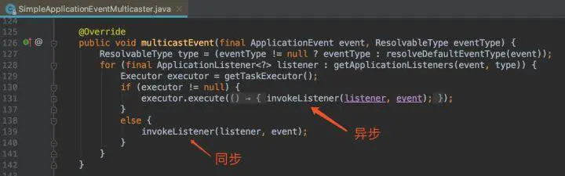

## 一、简单描述

ApplicationContext中事件处理是由ApplicationEvent类和ApplicationListener接口来提供的。如果一个Bean实现了**ApplicationListener**接口，并且已经发布到容器中去，每次ApplicationContext发布一个**ApplicationEvent**事件，这个Bean就会接到通知。Spring事件机制是观察者模式的实现。

## 二、案例说明

商城系统中，当用户下单后需要发送短信通知，并且通知物流开始发货，类似一个MQ的作用。

### 1.创建订单成功事件

需要继承`ApplicationEvent`接口

```java
@Getter
@Setter
public class OrderSuccessEvent extends ApplicationEvent {
    private String id;
    private String msg;
  	// 传递所需要的参数
    public OrderSuccessEvent(Object source, String id, String msg) {
        super(source);
        this.id = id;
        this.msg = msg;
    }
}
```

### 2.创建监听者

当触发订单成功事件后，该监听者需要做出的一些反应;

监听者都需要实现`ApplicationListener`接口，范型`OrderSuccessEvent`就是监听的事件对象

```java
@Service
public class SmsListener implements ApplicationListener<OrderSuccessEvent> {
    @Override
    public void onApplicationEvent(OrderSuccessEvent event) {
      	// 获取自定义参数
        String id = event.getId();
        String msg = event.getMsg();
        this.sendMsg(id, msg);
    }
  
 		// 监听到后开始发送短信 
    private void sendMsg(String id, String msg) {
        try {
            Thread.sleep(3000);
        } catch (InterruptedException e) {
            e.printStackTrace();
        }
        System.out.println("发送短信..." + msg + id);
    }
}
```

### 3.创建推送者

订单服务，再创建完订单后，需要发送订单成功的事件，由那些监听这个事件的服务做出其他处理

```java
@Service
public class OrderService {

    @Resource
    private ApplicationContext applicationContext;

    public void order() {
        System.out.println("下单成功...");
        // 发送通知
        applicationContext.publishEvent(new OrderSuccessEvent("order task handle","1213","测试消息"));
        System.out.println("做其他的事情去了");
    }

}
```

### 4.测试

```java
@RestController
public class Controller {

    @Resource
    private OrderService orderService;

    @GetMapping("listener")
    public void orderTest() {
        orderService.order();
    }
}
```

由于spring的观察者模式默认是同步方式，所以会等监听者的事情都处理完了才会继续主线程。

```java
下单成功...
发送短信...测试消息1213
// 等待了3秒
做其他的事情去了
```

### 5.使用注解的方式

创建其他两个监听者,还是监听了订单成功的那个事件

这里就好像MQ中开了广播传递，每个事件都能收到消息

```java
@Component
public class OtherListener {

    @EventListener(OrderSuccessEvent.class)
    public void sendOther1(OrderSuccessEvent event) {
        String msg = event.getMsg();
        String id = event.getId();
        Object source = event.getSource();
        System.out.println("this is other1:" + source + id + msg);
    }

    @EventListener(OrderSuccessEvent.class)
    public void sendOther2(OrderSuccessEvent event) throws InterruptedException{
      	Thread.sleep(2000);
        String msg = event.getMsg();
        String id = event.getId();
        Object source = event.getSource();
        System.out.println("this is other2:" + source + id + msg);
    }

}
```

```java
下单成功...
this is other1:order task handle1213测试消息
// 休眠了2秒
this is other2:order task handle1213测试消息
 // 休眠了三秒
发送短信...测试消息1213
做其他的事情去了
```

## 三、异步和排序

讲道理，这个通知的话是用了同步消息还不如不用，Spring官方当然也考虑到了，这里我们可以使用自定的线程池来做异步，或者使用制定的方式异步。



自定义线程异步

```java
new Thread(() ->{
     applicationContext.publishEvent(new OrderSuccessEvent(this));
}).start();
```

当SimpleApplicationEventMulticaster中的Executor不为null，就会执行异步通知

```java
@Configuration
public class AsyncEventConfig {
    @Bean(name = "applicationEventMulticaster")
    public ApplicationEventMulticaster simpleApplicationEventMulticaster() {
        SimpleApplicationEventMulticaster eventMulticaster
                = new SimpleApplicationEventMulticaster();
        eventMulticaster.setTaskExecutor(new SimpleAsyncTaskExecutor());
        return eventMulticaster;
    }
}

```

**或者**

```java
@Configuration
@EnableAsync//启用异步支持
public class SpringConfig implements AsyncConfigurer {
 
    @Override
    public Executor getAsyncExecutor() {
        //线程池
        ThreadPoolTaskExecutor pool = new ThreadPoolTaskExecutor();
        pool.setCorePoolSize(5);
        pool.setMaxPoolSize(200);
        pool.setQueueCapacity(25);
        pool.setThreadNamePrefix("sys-thread-");
        pool.initialize();
        return pool;
    }
 
    @Override
    public AsyncUncaughtExceptionHandler getAsyncUncaughtExceptionHandler() {
        return (throwable, method, objects) -> {
            log.error("异步任务执行出现异常, message {}, method {}, params {}", throwable, method, objects);
        };
    }
 
}
```


spring的观察者模式的监听者是随机的执行，并没有一定的顺序，如果想使用一定顺序的话，可以使用Order(0)注解，数字越小优先级越高，当然在并发高了的时候使用MQ更加合适。