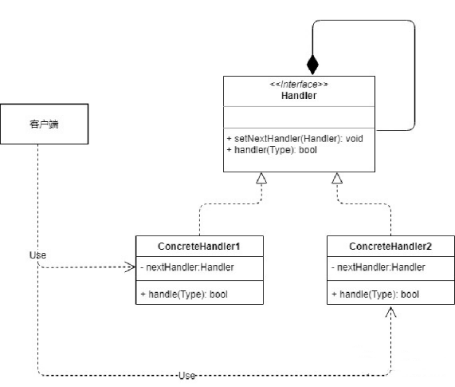

## 一、简单描述

避免请求发送者与接收者耦合在一起,让多个对象都有可能接受请求,将这些对象连成一条链,并且沿着这条链传递请求,直到有对象处理它为止。一个请求需要被多个对象中的某一个处理，但是到底是哪个对象必须在运行时根据条件决定。




## 二、使用场景

工作中处理研报,一共有4个步骤:

- 1.从有道云链接把内容转成PDF格式
- 2.解析PDF文件中的文本内容
- 3.解析PDF文件中的图表内容
- 4.上传完成,存入ES中

然而这四步不一定就是从第一步开始的,比如有的研报是从有道云链接来的,有的研报直接就是pdf文件,也有的研报是doc文件,但最终都是解析文本和图表,然后存入数据库中,这里我们就可以使用责任链一步一步的去执行.

可以选择在某一个链接执行完结束,也可以必须执行到底,具体看业务如何.


**这个与模版模式的区别就是可以从任意环节进入,并且可以从任意环节结束,具体看代码业务**

## 三、代码样例

#### 定制抽象类(接口):

```java
/**
 * 研报处理器
 */
public abstract class ReportHandler {

    protected ReportHandler reportHandler;

    public void setNextHandler(ReportHandler nextHandler) {
        this.reportHandler = nextHandler;
    }

    public abstract int handle(int reportId);

}
```

#### PDFHander

```java
public class PDFHandler extends ReportHandler {

    private final Logger logger = LoggerFactory.getLogger(PDFHandler.class);

    /**
     * PDF的执行器
     * @param reportId 研报id
     * @return 当前研报的执行流程
     */
    @Override
    public int handle(int reportId) {
        //  根据研报查询的执行状态，选择是否解析PDF
        int reportCode = getReportCode(reportId);
        if (reportCode == 1) {
            logger.info("把有道云链接解析成PDF文档");
        }
        // 传递给下一个流程
        if (Objects.nonNull(reportHandler)) {
            return reportHandler.handle(reportId);
        }
        return reportCode;
    }

    private int getReportCode(int reportId) {
        return 1;
    }

}
```

#### TextHandler

```java
public class TextHandler extends ReportHandler {

    private final Logger logger = LoggerFactory.getLogger(TextHandler.class);

    /**
     * 解析文本的执行器
     * @param reportId 研报id
     * @return 当前研报的执行流程
     */
    @Override
    public int handle(int reportId) {
        //  根据研报查询的执行状态，选择是否解析Text
        int reportCode = getReportCode(reportId);
        if (reportCode == 2) {
            logger.info("解析PDF文件中的文本内容");
        }
        // 传递给下一个流程
        if (Objects.nonNull(reportHandler)) {
            return reportHandler.handle(reportId);
        }
        return reportCode;
    }

    private int getReportCode(int reportId) {
        return 2;
    }
}
```

#### ChartHandler

```java
public class ChartHandler extends ReportHandler {

    private final Logger logger = LoggerFactory.getLogger(ChartHandler.class);

    /**
     * 解析图表的执行器
     * @param reportId 研报id
     * @return 当前研报的执行流程
     */
    @Override
    public int handle(int reportId) {
        //  根据研报查询的执行状态，选择是否解析Text
        int reportCode = getReportCode(reportId);
        if (reportCode == 3) {
            logger.info("解析PDF文件中的图表内容");
        }
        // 传递给下一个流程
        if (Objects.nonNull(reportHandler)) {
            return reportHandler.handle(reportId);
        }
        return reportCode;
    }

    private int getReportCode(int reportId) {
        return 3;
    }
    
}
```

#### EsHandler

```java
public class EsHandler extends ReportHandler {

    private final Logger logger = LoggerFactory.getLogger(EsHandler.class);

    /**
     * 存入ES的执行器
     * @param reportId 研报id
     * @return 当前研报的执行流程
     */
    @Override
    public int handle(int reportId) {
        //  根据研报查询的执行状态，选择是否解析Text
        int reportCode = getReportCode(reportId);
        if (reportCode == 4) {
            logger.info("把数据存入ES数据库中");
        }
        // 传递给下一个流程
        if (Objects.nonNull(reportHandler)) {
            return reportHandler.handle(reportId);
        }
        return reportCode;
    }

    private int getReportCode(int reportId) {
        return 4;
    }

}
```

#### 测试类

```java
public class Test {

    public static void main(String[] args) {
        PDFHandler pdfHandler = new PDFHandler();
        TextHandler textHandler = new TextHandler();
        ChartHandler chartHandler = new ChartHandler();
        EsHandler esHandler = new EsHandler();
      	// 按照执行顺序配置责任链,从开始位置执行到结束
        pdfHandler.setNextHandler(textHandler);
        textHandler.setNextHandler(chartHandler);
        chartHandler.setNextHandler(esHandler);
				// 可以根据研报的状态,从任意位置开始执行
        int handle = pdfHandler.handle(1234);
        System.out.println(handle);
    }

}
```

```java
[main] INFO com.sun.design.zeren.PDFHandler - 把有道云链接解析成PDF文档
[main] INFO com.sun.design.zeren.TextHandler - 解析PDF文件中的文本内容
[main] INFO com.sun.design.zeren.ChartHandler - 解析PDF文件中的图表内容
[main] INFO com.sun.design.zeren.EsHandler - 把数据存入ES数据库中
4
```

