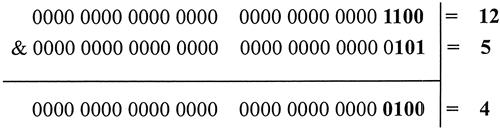

> 计算机中所有数都是补码存储,因此执行位运算时是对补码进行位运算 
>
> 两个二进制运算时，从最低为开始对齐，高位不够补0

## 一、 &（与运算符）

 两个二进制数值如果同一个位置上都是1运算结果才为1，其他情况均为0

  

X % 2^ n = X & (2^ n – 1)
2^ n表示2的n次方，也就是说，一个数对2^ n取模 == 一个数和(2^n – 1)做按位与运算 。

## 二、“|”（或运算符）

两个二进制数值如果在同一位上有一个为1，则结果中该位为1，否则为0

  

## 三、 ^（异或运算符）

 两个二进制数值如果在同一位上相同，则结果中该位为0，否则为1

  

## 四、<<（左移运算符）

 **<<表示左移移，不分正负数，低位补0；**

注：以下数据类型默认为byte-8位

左移时不管正负，低位补0

正数：**r = 20 << 2**

　　20的二进制补码：**0001 0100**

　　向左移动两位后：**0101 0000**

　　　　  　　结果：**r = 80**

负数：**r = -20 << 2**

　　-20 的二进制原码 ：**1001 0100**

　　-20 的二进制反码 **：1110 1011**

　　-20 的二进制补码 ：**1110 1100**

　　左移两位后的补码：**1011 0000**

　　　　　　　　反码：**1010 1111**

　　　　　　　　原码：**1101 0000**

　　　　　　　　结果：**r = -80**

## 五、 >>(右移运算符）

 **>>表示右移，如果该数为正，则高位补0，若为负数，则高位补1；** 

注：以下数据类型默认为byte-8位

正数：**r = 20 >> 2**

　　20的二进制补码：**0001 0100**

　　向右移动两位后：**0000 0101**

　　　　　　　结果：**r = 5**

负数：**r = -20 >> 2**

　　-20 的二进制原码 ：**1001 0100**

　　-20 的二进制反码 **：1110 1011**

　　-20 的二进制补码 ：**1110 1100** 

　　右移两位后的补码：**1111 1011** 

　　　　　　　　反码：**1111 1010**

　　　　　　　　原码：**1000 0101**

　　　　　　　　结果：**r = -5**

## 六、 >>>(无符号右移)

**>>>表示无符号右移，也叫逻辑右移，即若该数为正，则高位补0，而若该数为负数，则右移后高位同样补0**

正数：　**r = 20 >>> 2**的结果与 r = 20 >> 2 相同；

负数：　**r = -20 >>> 2**

注：以下数据类型默认为int 32位

　　-20:原码：**10000000 00000000 00000000 00010100**

　　　　反码：**11111111 11111111  11111111  11101011**

　　　　补码：**11111111 11111111  11111111  11101100**

　　　　右移：**00111111 11111111  11111111  11111011**

　　　　结果：**r = 1073741819**

**补充:  ^=、|=、&=、<<=、>>=、>>>=与不加等号差不多，只是加入了赋值操作** 

参考：https://www.cnblogs.com/chuijingjing/p/9405598.html

