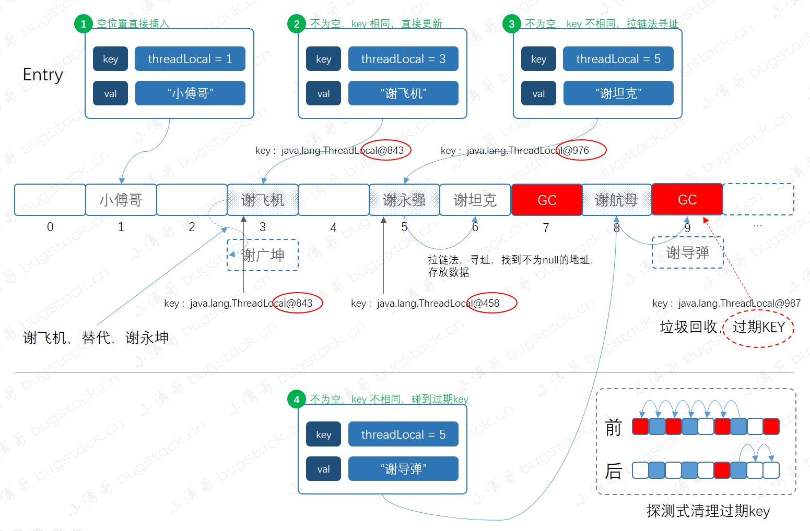

## 一、简介

ThreadLocal是JDK包提供的，它提供线程本地变量，具有线程隔离的效果，如果创建一个ThreadLocal变量，那么访问这个变量的每个线程都会有这个变量的一个副本，在实际多线程操作的时候，操作的是自己本地内存中的变量，从而规避了线程安全问题。

## 二、应用场景

### 1. 案例

比如现在有个场景，多线程情况下,拼接不同的消息

```java
public static ThreadLocal<StringBuilder> localMessage = new ThreadLocal<>();

public static void addMeg(String msg) {
  StringBuilder builder = localMessage.get();
  if (builder == null) {
    builder = new StringBuilder();
    localMessage.set(builder);
  }
  builder.append(msg);
}

 public static void main(String[] args) {
   addMeg("张三");
   addMeg("李四");
   System.out.println(Thread.currentThread() + ":" + localMessage.get());
   localMessage.remove();
   new Thread(() -> {
     addMeg("张三1");
     addMeg("李四1");
     addMeg("王武1");
     System.out.println(Thread.currentThread() + ":" + localMessage.get());
     localMessage.remove();
   }).start();
   new Thread(() -> {
     addMeg("张三2");
     System.out.println(Thread.currentThread() + ":" + localMessage.get());
     localMessage.remove();
   }).start();
 }
```

```java
Thread[main,5,main]:张三李四
Thread[Thread-0,5,main]:张三1李四1王武1
Thread[Thread-1,5,main]:张三2
```

###  2. 应用场景

- 比如说DAO的数据库连接，我们知道DAO是单例的，那么他的属性Connection就不是一个线程安全的变量。而我们每个线程都需要使用他，并且各自使用各自的。
- 日志框架 `MDC` 的组件
- 获取当前登录用户上下文

### 3. 怎么用

```java
// 创建ThreadLocal对象并规定类型
ThreadLocal<String> threadLocal = new ThreadLocal<>();
// 设置值
threadLocal.set("123");
// 读取值
String str = threadLocal.get();
// 移除数据
threadLocal.remove();
// 创建对象并使用lambda初始化数据
ThreadLocal<Map<String, String>> sThreadLocal = ThreadLocal.withInitial(HashMap::new);
```

## 三、数据结构


每个线程Thread对象都存放着一个变量threadLocals，其类型是ThreadLocal的静态内部类ThreadLocalMap，而Entry又是ThreadLocalMap的静态内部类，key是ThreadLocal（声明为弱引用），value是Object，也就是我们要存的值。


1. **它是一个数组结构，`默认长度为16`**
2. `Entry`，这里没用再打开，其实它是一个弱引用实现，`static class Entry extends WeakReference<ThreadLocal<?>>`。这说明只要没用强引用存在，发生GC时就会被垃圾回收。
3. 数据元素采用哈希散列方式进行存储，不过这里的散列使用的是 `斐波那契（Fibonacci）散列法`。
4. 另外由于这里不同于HashMap的数据结构，发生哈希碰撞不会存成链表或红黑树，而是使用拉链法进行存储。也就是同一个下标位置发生冲突时，则`+1向后寻址`，直到找到空位置或垃圾回收位置进行存储。

### 1. 斐波那契算法

ThreadLocal底层是使用数组来存储数据的，这里就使用到了斐波那契散列表。

```java
int i = key.threadLocalHashCode & len - 1;
```

```java
private final int threadLocalHashCode = nextHashCode();
private static AtomicInteger nextHashCode = new AtomicInteger();
private static final int HASH_INCREMENT = 1640531527;

private static int nextHashCode() {
    return nextHashCode.getAndAdd(1640531527);
}
```

#### 黄金分割点

1640531527这个常量就是黄金分割点，也就是我们高中说的(√5 - 1) / 2，取10位近似 0.6180339887；

2 ^ 32 * 0.6180339887，得到的结果是：1640531527

#### 比较其他散列

```java
public class Demo {
    public static void main(String[] args) {
        AtomicInteger nextHashCode = new AtomicInteger();
        for (int i = 0; i < 16; i++) {
            int hash = nextHashCode.getAndAdd(1640531527);
            int strHash = String.valueOf(i).hashCode();
            System.out.println("普通散列:" + (strHash & 15) + "  斐波那契散列:" + (hash & 15));
        }
    }
}
```

```java
普通散列:0  斐波那契散列:0
普通散列:1  斐波那契散列:7
普通散列:2  斐波那契散列:14
普通散列:3  斐波那契散列:5
普通散列:4  斐波那契散列:12
普通散列:5  斐波那契散列:3
普通散列:6  斐波那契散列:10
普通散列:7  斐波那契散列:1
普通散列:8  斐波那契散列:8
普通散列:9  斐波那契散列:15
普通散列:15  斐波那契散列:6
普通散列:0  斐波那契散列:13
普通散列:1  斐波那契散列:4
普通散列:2  斐波那契散列:11
普通散列:3  斐波那契散列:2
普通散列:4  斐波那契散列:9
```

很明显，普通散列在9之后就会产生重复数据，而斐波那契散列很均匀的分配到了16个位置上，减少碰撞也就可以让数据存储的更加分散，获取数据的时间复杂度基本保持在O(1)；

### 2. set()方法

```java
public void set(T value) {
  	// 获取当前线程
    Thread t = Thread.currentThread();
  	// 获取当前线程的threadLocals，默认情况下threadlocals是为null
    ThreadLocal.ThreadLocalMap map = this.getMap(t);
    if (map != null) {
      	// 如果该线程存在ThreadLocalMap，则新增ThreadLocal的值
        map.set(this, value);
    } else {
      	// 如果该线程还不存在ThreadLcoalMap，则初始化该threadLocals
        this.createMap(t, value);
    }
}
```

```java
ThreadLocal.ThreadLocalMap getMap(Thread t) {
    return t.threadLocals;
}
```



0. 中间是 `ThreadLocal` 的数组结构，之后在设置元素时分为四种不同的情况，另外元素的插入是通过斐波那契散列计算下标值，进行存放的。

1. 情况1，待插入的下标，是空位置直接插入。
2. 情况2，待插入的下标，不为空，key 相同，直接更新
3. 情况3，待插入的下标，不为空，key 不相同，拉链法寻址
4. 情况4，不为空，key 不相同，碰到过期key。其实情况4，遇到的是弱引用发生GC时，产生的情况。碰到这种情况，`ThreadLocal` 会进行探测清理过期key;

```java
private void set(ThreadLocal<?> key, Object value) {
  	// 获取该线程中的数组
    ThreadLocal.ThreadLocalMap.Entry[] tab = this.table;
    int len = tab.length;
  	// 根据当前ThreadLocal，通过斐波那契算法获取下标
    int i = key.threadLocalHashCode & len - 1;

  	// 从计算后的下标开始，依次往后找
    for(ThreadLocal.ThreadLocalMap.Entry e = tab[i]; e != null; e = tab[i = nextIndex(i, len)]) {
        ThreadLocal<?> k = (ThreadLocal)e.get();
      	// 如果key相同，则覆盖原来的值
        if (k == key) {
            e.value = value;
            return;
        }
				// 如果key不存在，则探测式清理过期元素，然后插入
        if (k == null) {
            this.replaceStaleEntry(key, value, i);
            return;
        }
    }
		
  	// 如果该下标元素为空，则直接插入
    tab[i] = new ThreadLocal.ThreadLocalMap.Entry(key, value);
    int sz = ++this.size;
    if (!this.cleanSomeSlots(i, sz) && sz >= this.threshold) {
      	// 扩容
        this.rehash();
    }

}
```

### 3. 扩容

#### 扩容条件

```java
if (!this.cleanSomeSlots(i, sz) && sz >= this.threshold) {
    this.rehash();
}
```

```java
this.threshold = len * 2 / 3;
```

- 自发式清理，把无效ThreadLocal清理后，看数组空间是否足够；
- 查看当前数组有效元素是否超过 `len * 2 / 3,取整后的值是：10`

#### 扩容方式


```java
private void rehash() {
  	// 探测式清理，把无效的元素清理掉,
    this.expungeStaleEntries();
  	// 判断清理后的数据是否满足扩容条件
    if (this.size >= this.threshold - this.threshold / 4) {
        this.resize();
    }
}
```

```java
// 两倍扩容
int newLen = oldLen * 2;
```

- `2倍扩容`
- **`重新计算hash值`，放入新的数组中**。
- **在放置数组的过程中，如果发生哈希碰撞，则链式法顺延。**
- **探测式清理，是以当前遇到的 GC 元素开始，向后不断的清理。直到遇到 null 为止，才停止 rehash 计算。**

### 4. get()


按照不同的数据元素存储情况，基本包括如下情况；

1. 直接定位到，没有哈希冲突，直接返回元素即可。
2. 没有直接定位到了，key不同，需要拉链式寻找。
3. 没有直接定位到了，key不同，拉链式寻找，遇到GC清理元素，需要探测式清理，再寻找元素。

```java
public T get() {
    Thread t = Thread.currentThread();
  	// 获取当前线程的ThreadLocalMap对象
    ThreadLocal.ThreadLocalMap map = this.getMap(t);
    if (map != null) {
      	// 根绝当前的ThreadLocal，获取设置的value值
        ThreadLocal.ThreadLocalMap.Entry e = map.getEntry(this);
        if (e != null) {
            T result = e.value;
            return result;
        }
    }
  	// 如果为空，则初始化一个null当作value
    return this.setInitialValue();
}
```

```java
// 计算hash值在数组中找
private ThreadLocal.ThreadLocalMap.Entry getEntry(ThreadLocal<?> key) {
    int i = key.threadLocalHashCode & this.table.length - 1;
    ThreadLocal.ThreadLocalMap.Entry e = this.table[i];
  	// 若不存在，则拉链法往后寻找getEntryAfterMiss
    return e != null && e.get() == key ? e : this.getEntryAfterMiss(key, i, e);
}
```

## 4、常见问题

- 强引用：Java中默认的引用类型，一个对象如果具有强引用那么只要这种引用还存在就不会被GC。
- 软引用：简言之，如果一个对象具有软引用，在JVM发生OOM之前（即内存充足够使用），是不会GC这个对象的；只有到JVM内存不足的时候才会GC掉这个对象。软引用和一个引用队列联合使用，如果软引用所引用的对象被回收之后，该引用就会加入到与之关联的引用队列中
- 弱引用（这里讨论ThreadLocalMap中的Entry类的重点）：如果一个对象只具有弱引用，那么这个对象就会被垃圾回收器GC掉(**被弱引用所引用的对象只能生存到下一次GC之前，当发生GC时候，无论当前内存是否足够，弱引用所引用的对象都会被回收掉**)。弱引用也是和一个引用队列联合使用，如果弱引用的对象被垃圾回收期回收掉，JVM会将这个引用加入到与之关联的引用队列中。**若引用的对象可以通过弱引用的get方法得到，当引用的对象呗回收掉之后，再调用get方法就会返回null**
- 虚引用：虚引用是所有引用中最弱的一种引用，其存在就是为了将关联虚引用的对象在被GC掉之后收到一个通知。（不能通过get方法获得其指向的对象）
- **内存溢出（Out Of Memory）** ：就是申请内存时，JVM没有足够的内存空间。
- **内存泄露 （Memory Leak）**：就是申请了内存，但无法释放已申请的内存空间，导致内存空间浪费。


```java
static class Entry extends WeakReference<ThreadLocal<?>> {
    Object value;

    Entry(ThreadLocal<?> k, Object v) {
        super(k);
        this.value = v;
    }
}
```

#### 内存泄漏的原因

- Entry对象的key是以ThreadLocal作为弱引用，value作为当前线程的本地变量
- 当发生GC的时候，key作为弱引用会被回收掉，key=null，但是value并不会回收
- ThreadLocalMap的生命周期和线程一样长的，如果该线程不销毁，该ThreadLocalMap会一直存在
- 如果此时该线程被收回到线程池中，并没有被销毁，那么这个key=null，value=value就会一直存在，永远无法回收，导致内存泄漏

#### 为什么key不使用强引用

**强引用:**

如果当ThreadLocalMap.Entry的key使用强引用的话，如果不手动回收，会随着当前线程的一直保存下去，永远无法回收，导致内存泄漏

**弱引用:**

如果当ThreadLocalMap.Entry的key使用弱引用的话，下次GC的时候被把当前的key设置为null，当key为null，在下一次ThreadLocalMap调用set(),get(),remove()方法的时候会清理掉key=null的Entry对象，把该下标的数组元素设置为null。

#### 总结:

用完ThreadLocal之后，及时手动remove()

```java
private void remove(ThreadLocal<?> key) {
    ThreadLocal.ThreadLocalMap.Entry[] tab = this.table;
    int len = tab.length;
    int i = key.threadLocalHashCode & len - 1;

    for(ThreadLocal.ThreadLocalMap.Entry e = tab[i]; e != null; e = tab[i = nextIndex(i, len)]) {
        if (e.get() == key) {
          	// 把当前引用key设置为null
            e.clear();
          	// 根据hash计算出数组下标，然后清理掉key=null的entry对象
            this.expungeStaleEntry(i);
            return;
        }
    }
}
```

## 五、父子线程之间的通信

在实际工作中,可能会遇到父子线程中共享数据,即在父ThreadLocal设置值,在子线程中能够获取到.

使用`InheritableThreadLocal`，它是JDK自带的类，继承了ThreadLocal类。

```java
    @Test
    public void inheritableThreadLocalTest() {
        InheritableThreadLocal<Integer> threadLocal = new InheritableThreadLocal<>();
        threadLocal.set(6);
        log.info(Thread.currentThread().getName() + "父线程数据:" + threadLocal.get());
        Thread thread = new Thread(() -> {
            log.info(Thread.currentThread().getName() + "子线程数据:" + threadLocal.get());
        });
        thread.setName("son");
        thread.start();
    }
```

参考：

- https://zhuanlan.zhihu.com/p/102571059
- https://bugstack.cn/md/java/interview/2020-09-23-%E9%9D%A2%E7%BB%8F%E6%89%8B%E5%86%8C%20%C2%B7%20%E7%AC%AC12%E7%AF%87%E3%80%8A%E9%9D%A2%E8%AF%95%E5%AE%98%EF%BC%8CThreadLocal%20%E4%BD%A0%E8%A6%81%E8%BF%99%E4%B9%88%E9%97%AE%EF%BC%8C%E6%88%91%E5%B0%B1%E6%8C%82%E4%BA%86%EF%BC%81%E3%80%8B.html
- https://www.cnblogs.com/fsmly/p/11020641.html