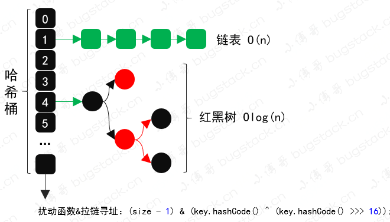
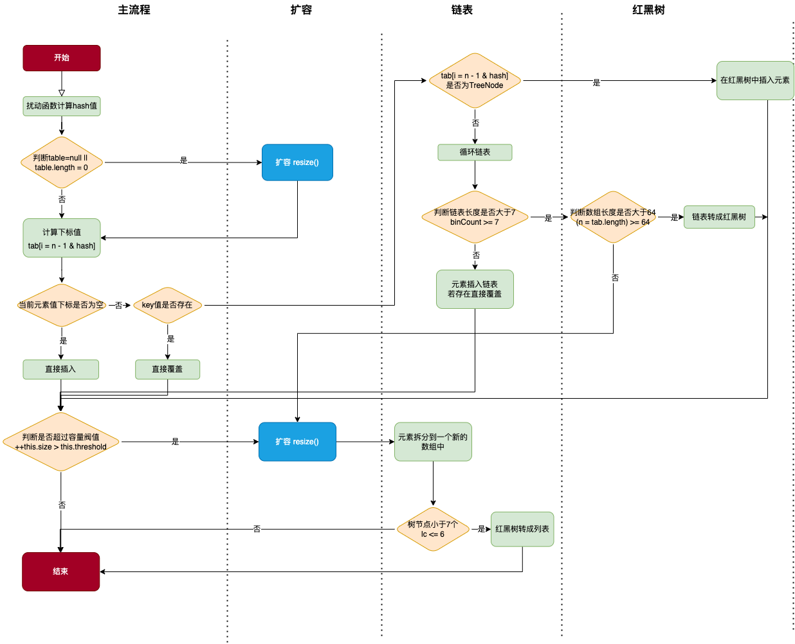

## 一、 扰动函数



```java
static final int hash(Object key) {
    int h;
    return key == null ? 0 : (h = key.hashCode()) ^ h >>> 16;
}
```

增加随机性，让数据元素更加均匀的散列，减少碰撞。

## 二、初始容量和负载因子

### 1. 初始容量

默认初始容量为16；

```java
static final int DEFAULT_INITIAL_CAPACITY = 16;
```

```java
public HashMap(int initialCapacity, float loadFactor) {
    if (initialCapacity < 0) {
        throw new IllegalArgumentException("Illegal initial capacity: " + initialCapacity);
    } else {
        if (initialCapacity > 1073741824) {
            initialCapacity = 1073741824;
        }

        if (!(loadFactor <= 0.0F) && !Float.isNaN(loadFactor)) {
            this.loadFactor = loadFactor;
            this.threshold = tableSizeFor(initialCapacity);
        } else {
            throw new IllegalArgumentException("Illegal load factor: " + loadFactor);
        }
    }
}
```

当自定义传入初始容量和负载因子时，负载因子直接给予赋值，容量大小通过tableSizeFor方法计算得出。

```java
this.loadFactor = loadFactor;
this.threshold = tableSizeFor(initialCapacity);
```

```java
static final int tableSizeFor(int cap) {
    int n = -1 >>> Integer.numberOfLeadingZeros(cap - 1);
    return n < 0 ? 1 : (n >= 1073741824 ? 1073741824 : n + 1);
}
```

```java
public static int numberOfLeadingZeros(int i) {
    if (i <= 0) {
        return i == 0 ? 32 : 0;
    } else {
        int n = 31;
        if (i >= 65536) {
            n -= 16;
            i >>>= 16;
        }

        if (i >= 256) {
            n -= 8;
            i >>>= 8;
        }

        if (i >= 16) {
            n -= 4;
            i >>>= 4;
        }

        if (i >= 4) {
            n -= 2;
            i >>>= 2;
        }

        return n - (i >>> 1);
    }
}
```

经过以上计算得出，初始化容量为大于等于自定义容量大小的最小2的幂次方数。

比如你自定义初始化容量为3，则计算后的容量为4，自定义的为14，则计算后的为16.

至于为什么要用2的幂次方，是因为在计算下标的时候使用了&运算，(2^n -1) & hash() 才会使得二进制的最后一个数字为1，增加数组的散列程度，减少hash碰撞。

```java
if ((p = tab[i = n - 1 & hash]) == null) {
    tab[i] = this.newNode(hash, key, value, (HashMap.Node)null);
}
```

### 2. 负载因子

默认的负载因子为0.75；

```java
static final float DEFAULT_LOAD_FACTOR = 0.75F;
```

负载因子指的是当该数组所使用容量已经达到了最大容量的75%，就会触发数组的扩容机制，减少hash碰撞。

比如数组容量为16，当插入第12个元素的时候，就会达到负载因子的百分比容量，就会进行数组扩容。

## 三、扩容机制

### 1. resize() 扩容

```java
// 如果扩容后<1073741824 并且 原来的容量>=16
if ((newCap = oldCap << 1) < 1073741824 && oldCap >= 16) {
  	// 两倍扩容
    newThr = oldThr << 1;
}
```

### 2. put




- 根据扰动函数计算出hash值
- 如果数组不存在或者数组长度为0，则进行扩容
- 根据hash值计算该数组下标，如果该下标不存在元素，则直接插入，如果存在相同元素，则直接覆盖
- 若当上述中数组下标位置不为空，并且也不存在相同的元素，判断该节点是否为树节点，如果该节点是树节点，直接插入红黑树中
- **如果不是树节点，则循环该下标的链表，如果该链表长度大于7且数组长度大于64，则进行链表转成红黑树**
- 在扩容的情况下，若树节点小于7，则把红黑树转换成链表结构


参考:

https://bugstack.cn/md/java/interview/2020-08-07-%E9%9D%A2%E7%BB%8F%E6%89%8B%E5%86%8C%20%C2%B7%20%E7%AC%AC3%E7%AF%87%E3%80%8AHashMap%E6%A0%B8%E5%BF%83%E7%9F%A5%E8%AF%86%EF%BC%8C%E6%89%B0%E5%8A%A8%E5%87%BD%E6%95%B0%E3%80%81%E8%B4%9F%E8%BD%BD%E5%9B%A0%E5%AD%90%E3%80%81%E6%89%A9%E5%AE%B9%E9%93%BE%E8%A1%A8%E6%8B%86%E5%88%86%EF%BC%8C%E6%B7%B1%E5%BA%A6%E5%AD%A6%E4%B9%A0%E3%80%8B.html