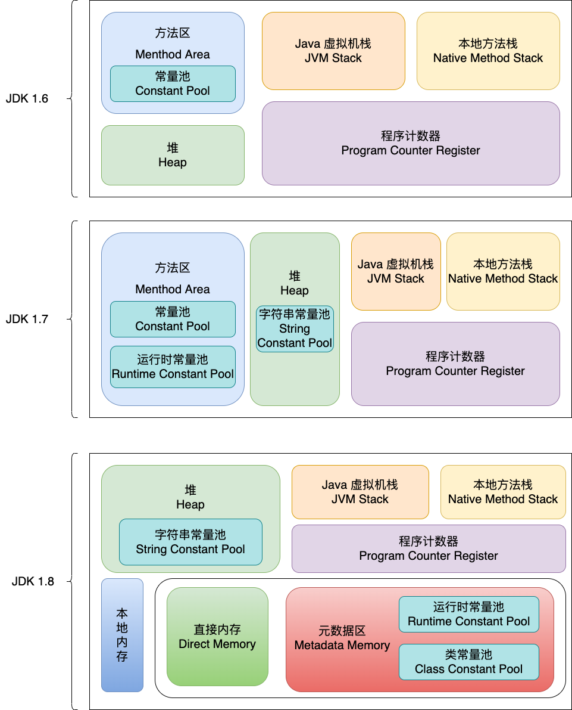
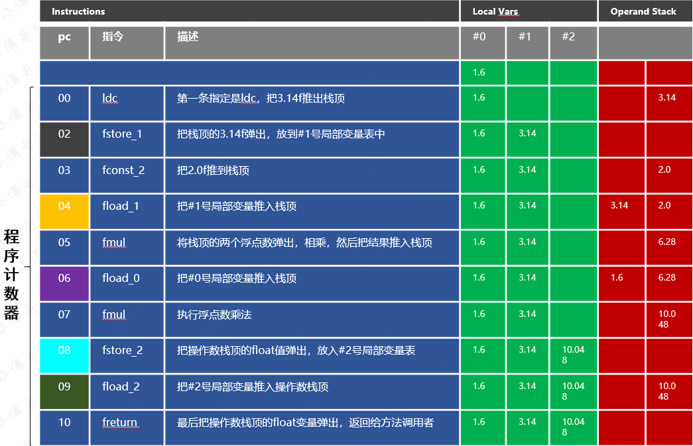
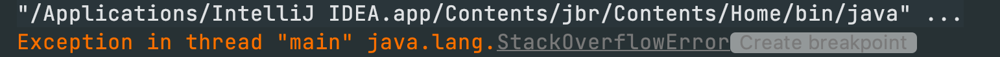
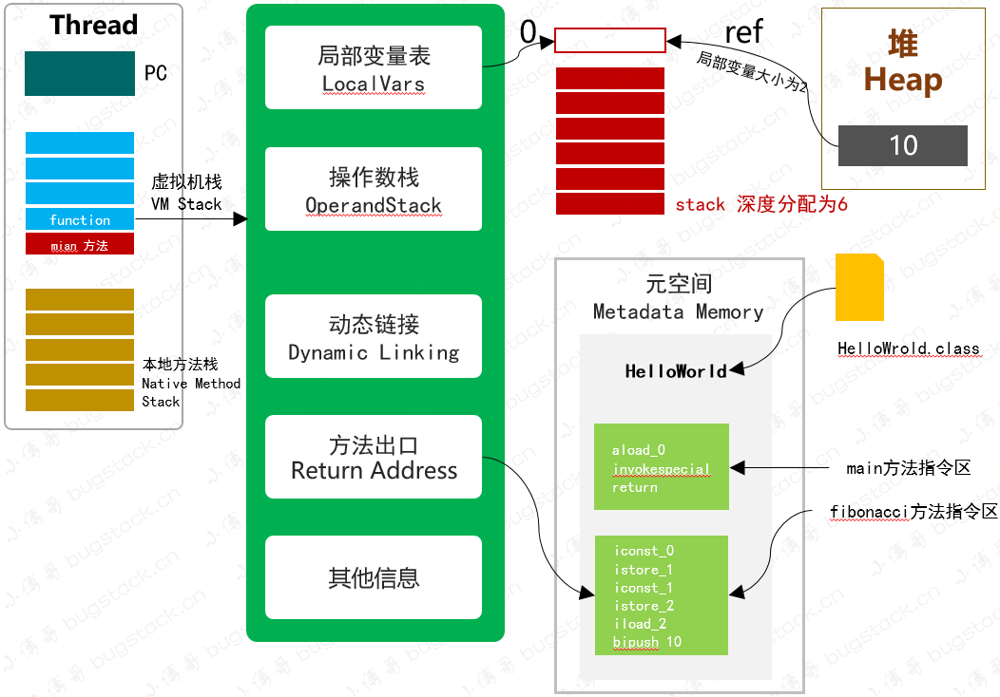
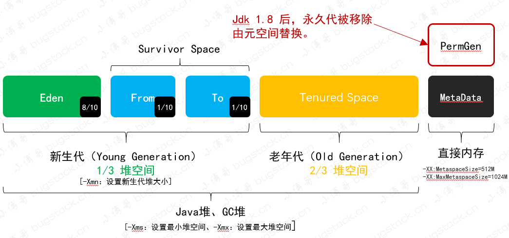

## 一、JVM的内存模型



> 方法区和永久代的关系很像Java中接口和类的关系，类实现了接口，而永久代就是HotSpot虚拟机对虚拟机规范中方法区的一种实现方式；

这些版本的JDK内存模型主要有以下差异:

- JDK1.6：有永久代，静态变量存放在永久代上
- JDK1.7：有永久代，但是已经把字符串常量，静态变量存放在堆上，逐渐减少永久代的使用
- JDK1.8：无永久代，运行时常量，类常量池都保存在元数据中，也就是常说的元空间，但是字符串常量还是放在堆上

## 二、内存模型区域介绍

### 程序计数器

- 内存空间较小，**线程私有，记录当前线程所执行的字节码行号**
- 如果执行Java方法，计数器记录虚拟机字节码当前指令的地址，本地方法为空
- 这一块区域不存在内存溢出

例如:

```java
public static float circumference(float r){
        float pi = 3.14f;
        float area = 2 * pi * r;
        return area;
}
```

这段代码的在虚拟机中的执行过程，左侧是它的程序计数器对应的行号。



- 这些行号每一个都会对应一条需要执行的字节码指令，是压栈还是弹出或者执行计算
- 如果程序计数器不是私有的话，则计算的结果将会出现错误

### Java虚拟机栈

- 线程私有
- 每一个方法在执行的同时，都会创建出一个栈桢，用于存放**局部变量表，操作数栈，动态链接，方法出口，线程等信息**
- 方法从调用到执行完成，都对应着栈桢从虚拟机中入栈和出栈的过程，最终栈桢会随着方法的结束而销毁
- 会导致栈溢出

栈溢出代码：递归一个空方法，栈桢里一直入栈没有出栈，导致栈溢出。

```java
public static void main(String[] args) {
  stackOut();
}

private static void stackOut() {
  stackOut();
}
```





### 本地方法栈

- 线程共有。
- 本地方法栈与Java虚拟机栈作用类似，唯一不同的就是本地方法栈执行的是Native方法，而虚拟机栈是为JVM执行Java方法服务的。
- 另外，与 Java 虚拟机栈一样，本地方法栈也会抛出 StackOverflowError 和 OutOfMemoryError 异常。
- JDK1.8 HotSpot虚拟机直接就把本地方法栈和虚拟机栈合二为一。

### 堆和元空间



- Java堆，由年轻代和老年代组成，分别占据1/3和2/3
- 年轻代又可分为三个部分，Eden，From Survivor，To Survivor，占据比例8 ： 1 ： 1，可调整
- 元空间从虚拟机Java堆中转移到本地内存，默认情况下，元空间大小仅受本地内存限制，也就是不会产生OOM异常了

参考:

- https://bugstack.cn