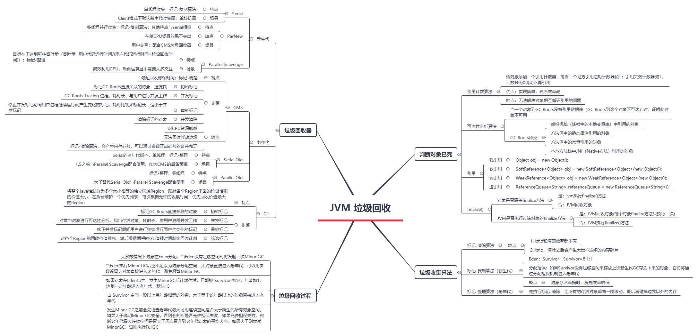
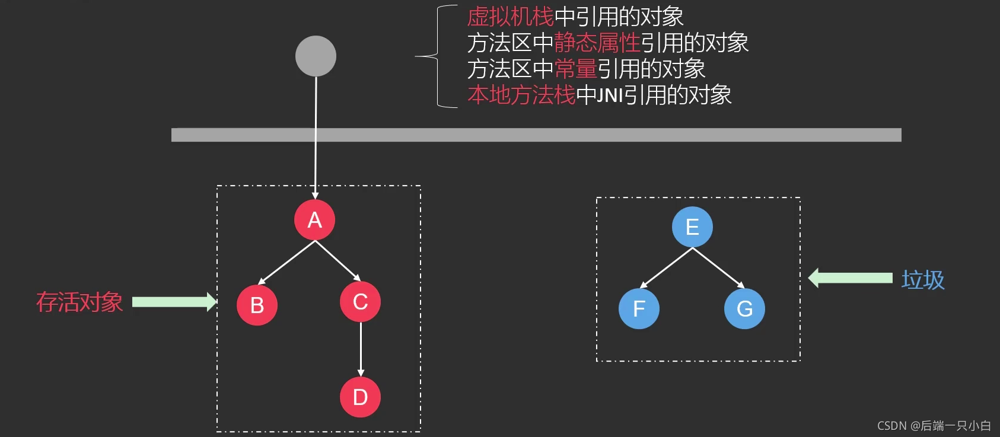
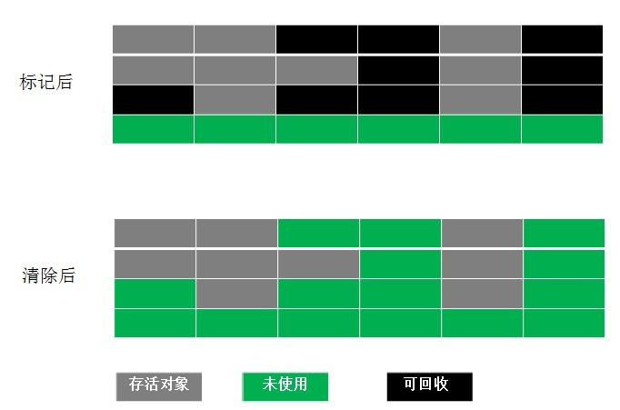
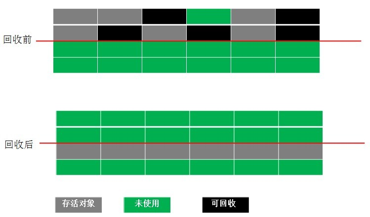
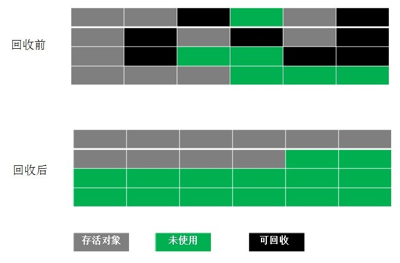

## 一、判断对象已死

### 引用计数器

- 为每一个对象添加一个引用计数器，统计指向该对象的引用次数
- 当一个对象有相应的引用更新操作时，则对目标对象的引用计数器进行增减
- 一旦当某个对象的引用计数器为0时，则表示该对象已经死亡，可以被垃圾回收

**但是，在主流的Java虚拟机中并没有选择用引用计数算法来管理内存，主要是因为这个简单的计数器方式在处理一些相互依赖，循环引用等就会非常复杂，可能会存在不在使用但又不能回收的内存，造成内存泄漏。**

### 可达性算法

通过定义一系列成为GC Roots的根对象作为起始节点集，从这些节点出发，穷举该集合引用到的全部对象田中到该集合中，这个过程将会标记，只标记那些存活的对象，那么现在未标记的对象就是可以被回收的对象。

GC Roots包括：

- 全局性引用，对方法区的静态对象，常量对象的引用
- 执行上下文，对Java方法栈桢中的局部对象引用，对JNI handles对象引用
- 已启动且未停止的java线程

## 二、垃圾回收算法

### 标记-清除算法

标记阶段是标记出所有需要被回收的对象，清除阶段就是回收被标记的对象所占的空间。

- 这种清理方式其实非常简单有效，但是也有一个问题**内存碎片化太严重**
- Java虚拟机的堆中对象，必须是连续分布的，所以极端的情况下可能即使总剩余空间充足，但寻找连续内存分配效率低，或者严重到无法分配内存

### 标记-复制算法

为了解决标记清除算法的内存碎片化问题，提出了复制算法。

**它将可用内存按照内存容量划分为大小相等的两块，每次只使用其中的一块，当这一块的内存块用完了，就将还存活着的对象复制到另外一块上去，然后再把已使用的内存空间一次性清理掉。**

虽然该算法运行高效且不容易产生碎片空间，但是却对内存空间的使用做出了高昂的代价，因为能够使用的内存只有原来的一半。

### 标记-整理算法

为了解决以上算法浪费空间的问题，提出了标记整理算法；

在标记阶段标记处需要被回收的空间，在标记完成后，他不是直接清理可回收对象，**而是将存活对象都移向一端，然后清理掉一端边界以外的所有内存。**

### 分代收集思想

分代收集算法是目前大部分JVM的垃圾收集器采用的算法。一般情况下将堆区划分为老年代和新生代，老年代的特点是每次垃圾收集时只有少量对象需要被回收，而新生代的特点是每次垃圾回收时都有大量的对象需要被回收，那么可以根据不同代的特点采取最合适的收集算法。

- 新生代采用`标记-复制算法`，因为新生代中的每次都要回收大部分对象，也就是说需要复制的次数较少，一般说将新生代分为一块较大的Eden空间和两块较小的Survivor空间，当每次使用Eden空间和其中的一块Survivor空间，当进行回收时，将Eden和Survivor中还存活的对象复制到另外一块Survivor空间中，然后清理掉Eden和刚才使用过的Survivor空间。
- 老年代的特点是每次回收少量对象，一般使用`标记-整理算法`
