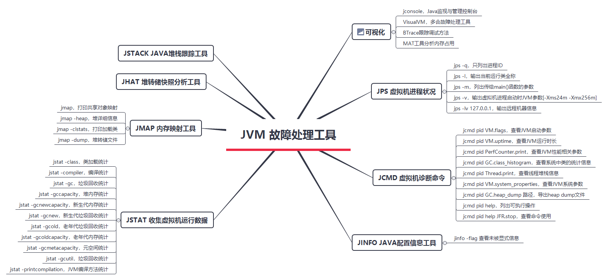
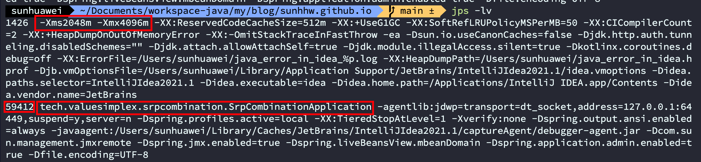

## 一、基础故障处理工具

### 1. Jps虚拟机进程状况

jps(jvm process status tool)，它的功能和ps命令相似，可以列出正在运行的虚拟机进程，并显示虚拟机执行主类名称以及这些进程的本地虚拟机唯一ID，类似于ps -ef｜ grep java的功能,主要的功能就是找出进程的pid

| 选项 | 描述                                           |
| ---- | ---------------------------------------------- |
| -q   | 只输出进程ID，忽略主类信息                     |
| -l   | 输出主类全名，或者执行JAR包则输出路径          |
| -m   | 输出虚拟机进程启动时传递给主类main()函数的参数 |
| -v   | 输出虚拟机进程启动时的JVM参数                  |

##### jps -lv,输出进程ID，当前运行类全称，虚拟机进程启动时JVM参数【-Xms24m -Xmx256m】

### 2. jinfo查看JVM的详细运行参数

这个方法跟以上的jps类似,只不过这个方法可以更加清楚的看到jvm的运行参数

参考：

- https://bugstack.cn/