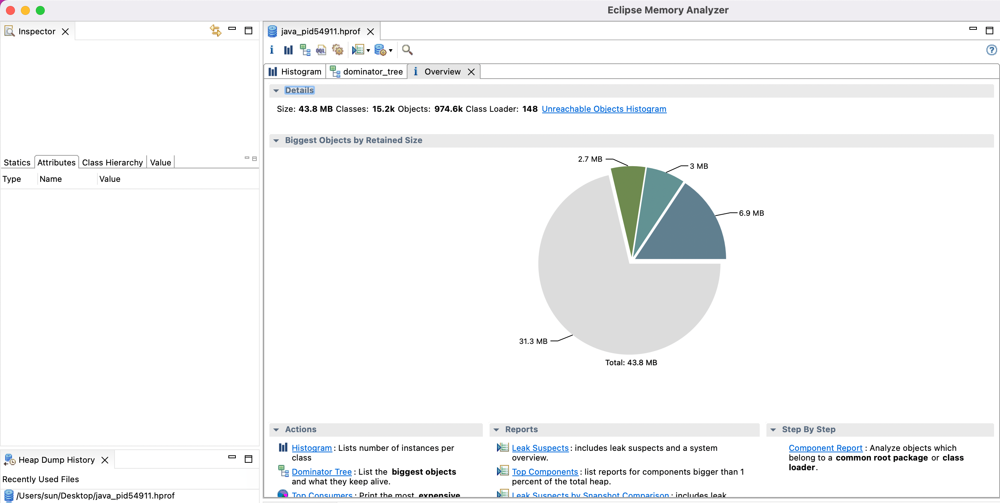
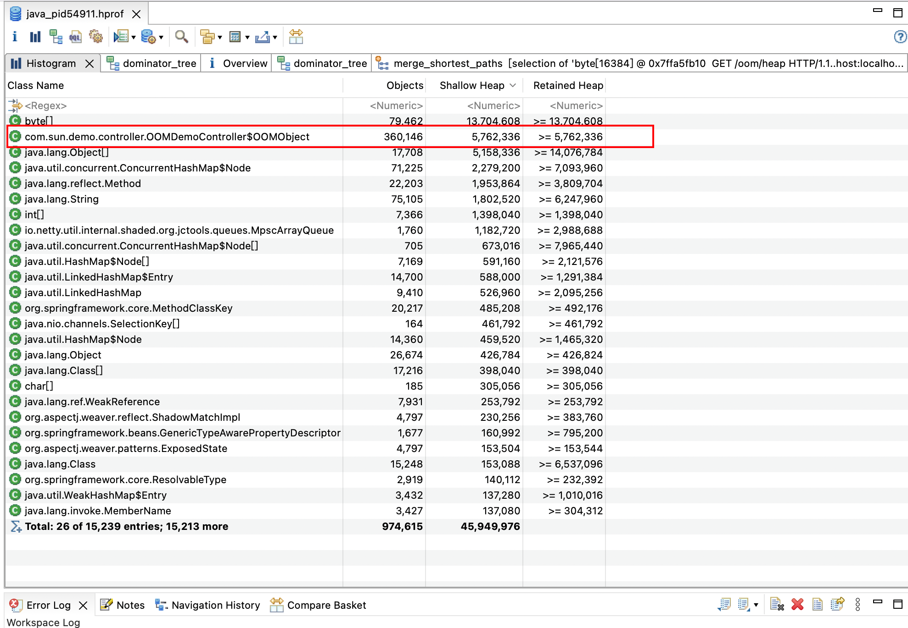
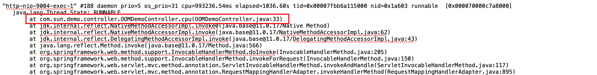

## 一、JVM参数

- **-D 可以是系统默认有的参数，也可以是自己定义的参数**

```java
-Dfile.encoding=UTF-8
-Dmaven.test.skip=true
-Dspring.profiles.active=test
-Dhsf.server.port=12404
-Dhsf.http.port=12402
```

- **堆内存参数**

```java
-Xmx5M 指定最大堆内存。 如 -Xmx4g。这只是限制了 Heap 部分的最大值为4g。这个内存不包括栈内存，也不包括堆外使用的内存，默认是物理内存的1/4。
-Xms5M 指定堆内存空间的初始大小。 如 -Xms4g。 而且指定的内存大小，并不是操作系统实际分配的初始值，而是 GC 先规划好，用到才分配。 专用服务器上需要保持 –Xms 和 –Xmx 一致，否则应用刚启动可能就有好几个FullGC。当两者配置不一致时，堆内存扩容可能会导致性能抖动，默认是物理内存的1/64。
-Xmn: 设置年轻代大小，等价于 -XX:NewSize，使用 G1 垃圾收集器不应该设置该选项，在其他的某些业务场景下可以设置。官方建议设置为 -Xmx 的 1/2 ~ 1/4。
-Xss：设置每个线程栈的字节数，影响栈的深度。例如 -Xss1m 指定线程栈为1MB，与-XX:ThreadStackSize=1m 等价。
```

- ##### GC 设置参数

```java
-XX:+UseG1GC：使用 G1 垃圾回收器。
-XX:+UseConcMarkSweepGC：使用 CMS 垃圾回收器。
-XX:+UseSerialGC：使用串行垃圾回收器。
-XX:+UseParallelGC：使用并行垃圾回收器。
-XX:+UnlockExperimentalVMOptions -XX:+UseZGC： jdk 11 以上开启 ZGC.
-XX:+UnlockExperimentalVMOptions -XX:+UseShenandoahGC：jdk 12 以上开启 ShenandoahGC。
```

- **分析诊断参数**

```java
-XX:+HeapDumpOnOutOfMemoryError：当 OutOfMemoryError 产生，即内存溢出（堆内存或持久代/元空间) 时，自动 Dump 堆内存。
-XX:HeapDumpPath：与 HeapDumpOnOutOfMemoryError 搭配使用，指定内存溢出时 Dump 文件的目录。如果没有指定则默认为启动 Java 程序的工作目录。
```

```java
java -Xmx5m -XX:+HeapDumpOnOutOfMemoryError -XX:HeapDumpPath=/log/dump HeapOOM
自动 Dump 的 hprof 文件会存储到 /log/dump 目录下。
```

## 二、内存溢出排查


**导致内存溢出的原因:**

- 内存中加载的数据量过于庞大，如一次从数据库取出过多数据；
- 资源使用之后没有及时关闭，导致对象无法被GC回收；
- 代码中存在死循环或循环产生过多重复的对象实体；
- 启动参数内存值设定的过小；

**1. 测试内存溢出的代码:**

```java
@RestController
@RequestMapping
public class OOMDemoController {

    class OOMObject {
    }

    @GetMapping("/oom/heap")
    public void OOMHeap() {
        List<OOMObject> list = new ArrayList<>();
        while (true) {
            list.add(new OOMObject());
        }
    }

}
```

**2.启动的时候设置堆内存大小和产生OOM的时候dump文件的输出:**

```java
-XX:+HeapDumpOnOutOfMemoryError -XX:HeapDumpPath=/Users/sun/Desktop -Xms10m -Xmx50m
```

**3.调用`/oom/heap`接口就会堆内存溢出,此时桌面会生成一个java_pid1234.hprof的文件,然后用MAT工具打开该文件**



点击工具栏上的  图标可以打开Histogram（直方图)视图，可以列出每个类产生的实例数量，以及所占用的内存大小和百分比。主界面如下图所示：



图中Shallow Heap 和 Retained Heap分别表示对象自身不包含引用的大小和对象自身并包含引用的大小;

其实从图中占用内存大小排序后,基本上就能看到那个类产生了OOM,然后从代码的角度去排查一下就好了,更加详细的MAT使用教程,可参考https://www.javatang.com/archives/2017/11/08/11582145.html

## 三、Java服务CPU飙升排查

```java
@RestController
@RequestMapping
public class OOMDemoController {
    @GetMapping("/cpu")
    public void cpu() {
        while (true) {

        }
    }
}
```

- 使用**top**命令找出CPU最高的进程PID
- 使用**jps**命令找出对应的java程序
- 使用**top -H -p pid**单独查看该**进程**的所有**线程**nid,此时nid是10进制,-H是进行排序
- 找到CPU占用最高的线程号,然后转换为16进制,可以使用**printf "%x\n" pid**打印出来
- 使用**jstack -l [pid] | grep  -A 20 [16进制线程号] (jstack -l 62170 | grep -A 20 f2da)**



- 可以输出到文件中查看**jstack -l [pid]  jstackLog.out**
- 根据**WAITING**或者**BLOCKED**大致判断是死循环还是死锁，然后回到程序中定位代码并且根据业务场景解决

