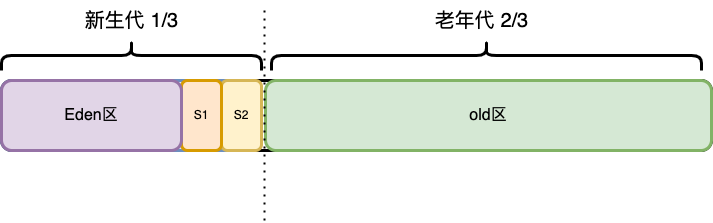

## 一、GC的原理介绍

- JVM的堆分为新生代和老年代,**新生代占1/3,老年代占2/3**;
- 新生代中又分为Eden,s1和s2区,分别占8:1:1,因为当新生代内存达到`90%`的时候,就会触发垃圾回收,也不一定非要90%才触发;

### 1. 新生代

- 当有新对象产生的时候,优先会放在新生代里,新生代的目的就是快速收集掉那些生命周期短的对象;

- 新生代采用的是**标记-复制算法**,每次使用s1或者s2其中一个,当eden区和s1区满了,就会标记存活对象复制到s2区域,然后清空eden区和s1区,下次满了就把存活对象存入s2区,清空eden和s1,这样s1和s2交互使用,当s1或s2不足以装下存活对象时,就会放入老年代;
- 新生代发生GC叫做MinorGC,也叫YGC,触发MinorGC的频率较高;

### 2. 老年代

- YGC时,s区不足以存放存活对象时,就会移动到老年代;
- 经过多次YGC后，如果**存活对象的年龄达到了设定阈值（默认15）**，则会晋升到老年代中。
- 动态年龄判定规则，s区中相同年龄的对象，如果其大小之和占到了s区一半以上的空间，那么大于此年龄的对象会直接进入老年代，而不需要达到默认的分代年龄;
- 大对象：由**-XX:PretenureSizeThreshold**启动参数控制，若对象大小大于此值，就会绕过新生代, 直接在老年代中分配;
- 当老年代满了的时候,就会触发FGC,此时就会回收新生代和老年代;

### 3. YGC的触发时机

大多数情况下,新对象都是直接放入新生代的,**只有当Eden区没有足够的空间的时候, 才会触发YGC**,每经过一次YGC,存活下来的对象的年龄就会+1

### 4. FGC的触发时机 

- **当晋升到老年代的对象大于老年代的剩余空间时**，就会触发FGC（Major GC）;
- **老年代的内存使用率达到了一定阈值**（可通过参数调整），直接触发FGC;
- **System.gc() 或者Runtime.gc()** 被显式调用时，触发FGC;
- **Metaspace（元空间）在空间不足时会进行扩容**，当扩容到了-XX:MetaspaceSize 参数的指定值时，也会触发FGC;
- 空间分配担保：在YGC之前，会先检查老年代最大可用的连续空间是否大于新生代所有对象的总空间。如果小于，说明YGC是不安全的，则会查看参数 HandlePromotionFailure 是否被设置成了允许担保失败，如果不允许则直接触发Full GC；如果允许，那么会进一步检查老年代最大可用的连续空间是否大于历次晋升到老年代对象的平均大小，如果小于也会触发 Full GC;

### 5. GC会对程序产生影响

不管YGC还是FGC，都会造成一定程度的程序卡顿（即Stop The World问题：GC线程开始工作，其他工作线程被挂起），即使采用ParNew、CMS或者G1这些更先进的垃圾回收算法，也只是在减少卡顿时间，而并不能完全消除卡顿。

- FGC过于频繁：FGC通常是比较慢的，少则几百毫秒，多则几秒，正常情况FGC每隔几个小时甚至几天才执行一次，对系统的影响还能接受。但是，一旦出现FGC频繁（比如几十分钟就会执行一次），这种肯定是存在问题的，它会导致工作线程频繁被停止，让系统看起来一直有卡顿现象，也会使得程序的整体性能变差。
- YGC耗时过长：一般来说，YGC的总耗时在几十或者上百毫秒是比较正常的，虽然会引起系统卡顿几毫秒或者几十毫秒，这种情况几乎对用户无感知，对程序的影响可以忽略不计。但是如果YGC耗时达到了1秒甚至几秒（都快赶上FGC的耗时了），那卡顿时间就会增大，加上YGC本身比较频繁，就会导致比较多的服务超时问题。 
-  FGC耗时过长：FGC耗时增加，卡顿时间也会随之增加，尤其对于高并发服务，可能导致FGC期间比较多的超时问题，可用性降低，这种也需要关注。 
-  YGC过于频繁：即使YGC不会引起服务超时，但是YGC过于频繁也会降低服务的整体性能，对于高并发服务也是需要关注的。

## 二、对于FGC问题的排查步骤

https://cloud.tencent.com/developer/article/1953209