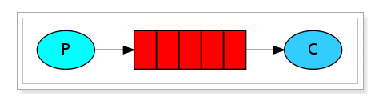
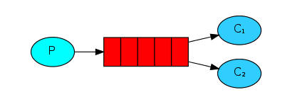
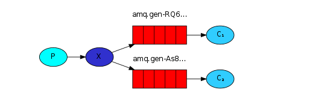
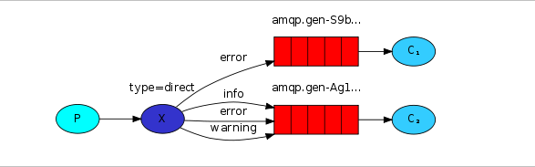
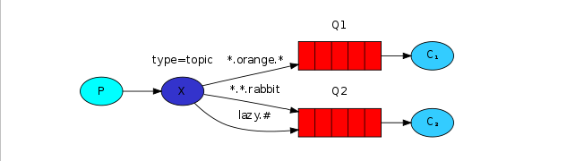
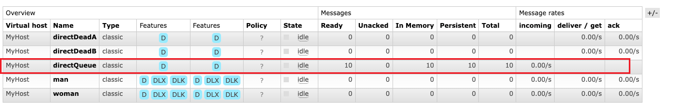
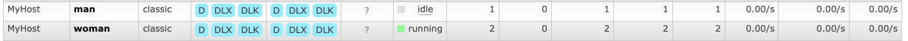
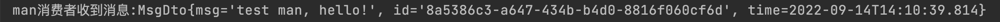

## 一、消息模型

### **1.基本消息模型**



### 2.work消息模型



C1和C2共同消费队列的消息，也就是说两个消费者消费的消息是不同的。

### 3.订阅模型

Exchange的常见类型有以下几种：

- **Fanout：广播，将消息交给所有绑定到交换机的队列中去的。**
- **Direct：定向，也是默认类型，叫消息交给符合指定routing key的队列**
  - P：生产者，向Exchange发送消息，发送消息时，会指定一个routing key。
  - X：Exchange（交换机），接收生产者的消息，然后把消息递交给 与routing key完全匹配的队列
  - C1：消费者，其所在队列指定了需要routing key 为 error 的消息
  - C2：消费者，其所在队列指定了需要routing key 为 info、error、warning 的消息
- **Topic：通配符，将消息交给符合routing pattern（路由模式）的队列**
- 

通配符规则：

- #:  匹配一个或者多个词, `audit.#`：能够匹配 `audit.irs.corporate` 或者 `audit.irs`
- *: 仅仅匹配一个词,  `audit.*`：只能匹配`audit.irs`

注意：

- 交换机使用来管理分发消息的，一边接受发布者提交的消息，根据消息提供的参数选择相应的处理办法
- **交换机是不会存储消息的，只有转发或丢弃功能；**
- **如果消息携带的路由键没有对应的路由队列，交换机会将消息丢弃；**

## 二、基础代码

首先建立两模块，一个是rabbitmq-provider（生产者），另外一个是rabbitmq-consumer（消费者）

### rabbitmq-provider

##### pom.xml

```java
        <!--rabbitmq-->
        <dependency>
            <groupId>org.springframework.boot</groupId>
            <artifactId>spring-boot-starter-amqp</artifactId>
        </dependency>
        <dependency>
            <groupId>org.springframework.boot</groupId>
            <artifactId>spring-boot-starter-web</artifactId>
        </dependency>
```

##### application.yml

```apl
server:
  port: 8001
spring:
  #给项目来个名字
  application:
    name: rabbitmq-provider
  #配置rabbitMq 服务器
  rabbitmq:
    host: 127.0.0.1
    port: 5672
    username: admin
    password: admin
    #虚拟host 可以不设置,使用server默认host
    virtual-host: MyHost
```

先使用Direct Exchange，创建DirectRabbitConfig，配置交换机和队列:

```java
package com.sun.provider.config;

import org.springframework.amqp.core.Binding;
import org.springframework.amqp.core.BindingBuilder;
import org.springframework.amqp.core.DirectExchange;
import org.springframework.amqp.core.Queue;
import org.springframework.context.annotation.Bean;
import org.springframework.context.annotation.Configuration;

/**
 * 直连交换机
 */
@Configuration
public class DirectRabbitConfig {
    public final static String DIRECT_EXCHANGE = "directExchange";
    public final static String QUEUE_DIRECT = "directQueue";
    public final static String DIRECT_ROUTING = "directRouting";

    @Bean
    public Queue directQueue() {
        /**
         * durable:是否持久化，默认false，持久化队列会把数据保存在磁盘中，消息代理重启时仍然存在
         * exclusive：默认false，只能被当前创建的链接使用，true则表示连接关闭后队列就被删除，优先级高于durable
         * autoDelete: 是否自动删除，默认为false，true时表示没有生产者或者消费者，则队列自动删除
         */
        Queue directQueue = new Queue(QUEUE_DIRECT, true);
        return directQueue;
    }

    @Bean
    public DirectExchange directExchange() {
        // 同上参数
        DirectExchange directExchange = new DirectExchange(DIRECT_EXCHANGE, true, false);
        return directExchange;
    }
		
  	// 绑定交换机和队列，根据routing key
    @Bean
    public Binding bindingDirect() {
        return BindingBuilder.bind(directQueue()).to(directExchange()).with(DIRECT_ROUTING);
    }

}
```

发送消息:发送10条消息到消息队列

```java
@Test
public void sendMsg() {
  //将消息携带绑定键值：directRouting 发送到交换机directExchange
  for (int i = 0; i < 10; i++) {
    String messageId = String.valueOf(UUID.randomUUID());
    String messageData = "test,hello-" + i;
    MsgDto msgDto = new MsgDto();
    msgDto.setId(messageId);
    msgDto.setMsg(messageData);
    msgDto.setTime(LocalDateTime.now());
    rabbitTemplate.convertAndSend(DirectRabbitConfig.DIRECT_EXCHANGE, DirectRabbitConfig.DIRECT_ROUTING,msgDto);
  }
}
```



此时队列上已经有了刚刚发送的10条消息了

### rabbitmq-consumer

##### pom.xml

```java
        <!--rabbitmq-->
        <dependency>
            <groupId>org.springframework.boot</groupId>
            <artifactId>spring-boot-starter-amqp</artifactId>
        </dependency>
        <dependency>
            <groupId>org.springframework.boot</groupId>
            <artifactId>spring-boot-starter</artifactId>
        </dependency>
```

##### application.yml

```apl
server:
  port: 8002
spring:
  #给项目来个名字
  application:
    name: rabbitmq-consumer
  #配置rabbitMq 服务器
  rabbitmq:
    host: 127.0.0.1
    port: 5672
    username: admin
    password: admin
    #虚拟host 可以不设置,使用server默认host
    virtual-host: MyHost
```

创建监听器，监听队列中的消息：

```java
@Component
public class DirectListener {

    @RabbitListener(queues = "directQueue")
    public void process1(MsgDto dto, Message message, Channel channel) throws IOException, ClassNotFoundException {
        long deliveryTag = message.getMessageProperties().getDeliveryTag();
        byte[] body = message.getBody();
        ObjectInputStream ois = new ObjectInputStream(new ByteArrayInputStream(body));
        MsgDto msgMap = (MsgDto) ois.readObject();
        System.out.println(msgMap.getMsg());
        channel.basicAck(deliveryTag, false);
    }

}
```

```java
@Component
public class DirectListener {
		
  	// 监听directQueue队列里的消息
    @RabbitListener(queues = "directQueue")
    public void process1(MsgDto dto, Message message, Channel channel) {
        System.out.println("消费：" + dto.getMsg());
    }

}
```

**注意:** 

1. 首先这个MsgDto需要实例化

```java
public class MsgDto implements Serializable {...}
```

2. 其次消费者如果想这样接受MsgDto的话，那么这里的MsgDto和发送方的MsgDto必须是**全类路径相同，也就是必须是同一个实体。**

**启动项目会自动消费：**

```java
消费：test,hello-0
消费：test,hello-1
消费：test,hello-2
消费：test,hello-4
消费：test,hello-5
消费：test,hello-3
消费：test,hello-7
消费：test,hello-6
消费：test,hello-8
消费：test,hello-9
```

#### ok,以上就是direct Exchange的基础用法，我们再来说一下Topic的用法，这个在工作中用到的比较多

创建TopicRabbitConfig:

```java
package com.sun.provider.config;

import org.springframework.amqp.core.*;
import org.springframework.context.annotation.Bean;
import org.springframework.context.annotation.Configuration;

import java.util.HashMap;
import java.util.Map;

/**
 * @author sunhw
 * @date 2022/9/13
 */
@Configuration
public class TopicRabbitConfig {

    public final static String TOPIC_EXCHANGE = "topicExchange";
    public final static String QUEUE_MAN = "man";
    public final static String QUEUE_WOMAN = "woman";
    public final static String MAN_ROUTING = "topic.man";
    public final static String WOMAN_ROUTING = "topic.woman";

    @Bean
    public Queue manQueue() {
        return new Queue(QUEUE_MAN, true);
    }

    @Bean
    public Queue womanQueue() {
        return new Queue(QUEUE_WOMAN, true);
    }

    @Bean
    public TopicExchange exchange() {
        return new TopicExchange(TOPIC_EXCHANGE,true,false);
    }

    @Bean
    public Binding bindingExchangeMan() {
        return BindingBuilder.bind(manQueue()).to(exchange()).with(MAN_ROUTING);
    }

    /**
     * 通配符topic.#,只要是topic开头的，都会发到这个队列
     * @return
     */
    @Bean
    public Binding bindingExchangeWoman() {
        return BindingBuilder.bind(womanQueue()).to(exchange()).with("topic.#");
    }

}
```

然后发送两种消息：

```java
// 由于women的队列通配符是topic.#，所以这个消息man和woman的队列都会收到
@Test
public void sendMsgMan() {
    String messageId = String.valueOf(UUID.randomUUID());
    String messageData = "test man, hello!";
    MsgDto msgDto = new MsgDto();
    msgDto.setId(messageId);
    msgDto.setMsg(messageData);
    msgDto.setTime(LocalDateTime.now());
    rabbitTemplate.convertAndSend(TopicRabbitConfig.TOPIC_EXCHANGE, TopicRabbitConfig.MAN_ROUTING, msgDto);
}
```

```java
// 只有woman队列能收到
@Test
public void sendMsgManAndWoman() {
  String messageId = String.valueOf(UUID.randomUUID());
  String messageData = "test man and woman, hello!";
  MsgDto msgDto = new MsgDto();
  msgDto.setId(messageId);
  msgDto.setMsg(messageData);
  msgDto.setTime(LocalDateTime.now());
  rabbitTemplate.convertAndSend(TopicRabbitConfig.TOPIC_EXCHANGE, TopicRabbitConfig.WOMAN_ROUTING, msgDto);
}
```

所以能看到woman 有两条消息，而man只有一条消息：



创建监听者：

```java
@Component
public class TopicListener {

    @RabbitListener(queues = "woman")
    public void process2(MsgDto testMessage, Message message, Channel channel) throws IOException {
        System.out.println("woman消费者收到消息:" + testMessage.toString());
    }

    @RabbitListener(queues = "man")
    public void process3(MsgDto testMessage, Message message, Channel channel) throws IOException {
        System.out.println("man消费者收到消息:" + testMessage.toString());
    }

}
```



结果也是正常消费