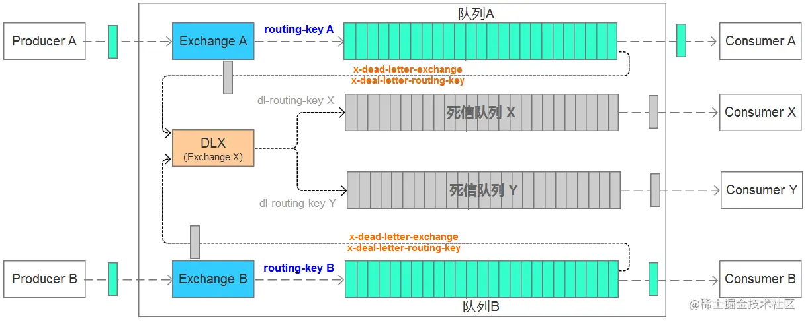

## 一、死信队列的概念



死信出现的情况:

- 消息被否定确认（使用channel.basicNack或channel.basicReject），并且requeue属性被设置为false
- 消息在队列中存活时间超过设置的TTL时间
- 消息队列的消息数量超过最大队列长度

**注意：**

死信队列并不是一个公共队列，而是为每个需要使用死信的业务配置一个死信交换机，同一个项目的死信交换机可以共用一个，然后为每个业务分配一个单独的路由key。

## 二、代码示例

配置rabbitmq-consumer工程的application.yml:

**default-requeue-rejected: false**

```apl
server:
  port: 8003
spring:
  application:
    name: rabbitmq-consumer
  rabbitmq:
    host: localhost
    port: 5673
    username: admin
    password: admin
    virtual-host: MyHost
    listener:
      type: simple
      simple:
        acknowledge-mode: manual #消费端收到消息后的确认方式 manual手动确认  none自动确认
        default-requeue-rejected: false
        retry:
          enabled: true  #开启消费者 程序异常情况下会进行重试
          max-attempts: 5 #重试次数
          initial-interval: 2000 #消费者重试间隔次数 2s
```

配置死信队列的交换机和队列：

```java
@Configuration
public class DeadRabbitConfig {

    public final static String EXCHANGE_DEAD = "exchangeDead";
    public final static String QUEUE_DEAD_A = "directDeadA";
    public final static String QUEUE_DEAD_B = "directDeadB";
    public final static String ROUTING_DEAD_A = "routingDeadA";
    public final static String ROUTING_DEAD_B = "routingDeadB";

    @Bean
    DirectExchange deadExchange() {
        return new DirectExchange(EXCHANGE_DEAD, true, false);
    }

    // 声明死信队列A
    @Bean
    public Queue deadLetterQueueA() {
        return new Queue(QUEUE_DEAD_A, true);
    }

    // 声明死信队列B
    @Bean
    public Queue deadLetterQueueB() {
        return new Queue(QUEUE_DEAD_B, true);
    }

    // 声明死信队列A绑定关系
    @Bean
    public Binding deadLetterBindingA() {
        return BindingBuilder.bind(deadLetterQueueA()).to(deadExchange()).with(ROUTING_DEAD_A);
    }

    // 声明死信队列B绑定关系
    @Bean
    public Binding deadLetterBindingB() {
        return BindingBuilder.bind(deadLetterQueueB()).to(deadExchange()).with(ROUTING_DEAD_B);
    }
}
```

然后把业务队列绑定到对应的死信交换机上，并配置routing key:

```java
 		@Bean
    public Queue manQueue() {
        return QueueBuilder.durable(QUEUE_MAN)
          			// 绑定死信队列交换机
                .deadLetterExchange(DeadRabbitConfig.EXCHANGE_DEAD)
          			// 绑定死信队列routing key
                .deadLetterRoutingKey(DeadRabbitConfig.ROUTING_DEAD_A)
                .build();
    }

    @Bean
    public Queue womanQueue() {
        return QueueBuilder.durable(QUEUE_WOMAN)
                .deadLetterExchange(DeadRabbitConfig.EXCHANGE_DEAD)
                .deadLetterRoutingKey(DeadRabbitConfig.ROUTING_DEAD_B)
                .build();
    }
```

配置死信队列的监听者：

```java
@Component
public class DeadListener {

    @RabbitListener(queues = "directDeadA")
    public void process1(MsgDto testMessage, Message message, Channel channel) throws IOException {
        System.out.println("directDeadA:" + testMessage.toString());
        channel.basicAck(message.getMessageProperties().getDeliveryTag(),false);
    }

    @RabbitListener(queues = "directDeadB")
    public void process2(MsgDto testMessage, Message message, Channel channel) throws IOException {
        System.out.println("directDeadB:" + testMessage.toString());
        channel.basicAck(message.getMessageProperties().getDeliveryTag(),false);
    }

}
```

#### 案例模拟消息消费失败，重试了三次后放入死信队列

还是在rabbitmq-provider工程中

##### 方案一、自动ACK + RabbitMQ重试机制

```apl
server:
  port: 8003
spring:
  application:
    name: rabbitmq-consumer
  rabbitmq:
    host: localhost
    port: 5673
    username: admin
    password: admin
    virtual-host: MyHost
    listener:
      type: simple
      simple:
        acknowledge-mode: auto #消费端收到消息后的确认方式 manual手动确认  none自动确认
        default-requeue-rejected: false
        retry:
          enabled: true  #开启消费者 程序异常情况下会进行重试
          max-attempts: 5 #重试次数
          initial-interval: 2000 #消费者重试间隔次数 2s
```

```java
@RabbitListener(queues = "woman",concurrency = "3")
public void process2(MsgDto testMessage, Message message, Channel channel) throws IOException {
  System.out.println("woman消费者收到消息:" + testMessage.toString());
  int i = 1/0;
}
```

**注意：**

- 只有开启自动ACK，才能在达到最大重试上线后发送到死信队列
- 在**重试过程中会独占当前线程**，如果是**单线程**的消费者会**导致其他消息阻塞**，直至重试完成，所以可以使用**@RabbitListener**上的**concurrency**属性来控制并发数量

##### 方案二、手动ACK + 手动重试

```apl
server:
  port: 8003
spring:
  application:
    name: rabbitmq-consumer
  rabbitmq:
    host: localhost
    port: 5673
    username: admin
    password: admin
    virtual-host: MyHost
    listener:
      type: simple
      simple:
        acknowledge-mode: manual #消费端收到消息后的确认方式 manual手动确认  none自动确认
        default-requeue-rejected: false
```

```java
/**
 * 消息最大重试次数
 */
private static final int MAX_RETRIES = 3;
/**
* 重试间隔(秒)
*/
private static final long RETRY_INTERVAL = 5;

@RabbitListener(queues = "man")
public void process1(MsgDto testMessage, Message message, Channel channel) throws IOException {
  long deliveryTag = message.getMessageProperties().getDeliveryTag();
  boolean isAck = false;
  int retryCount = 0;
  // 如果失败了重试三次
  while (!isAck && retryCount < 3) {
    System.out.println("第" + retryCount + "次尝试。。。");
    retryCount++;
    isAck = doSomeThing(testMessage);
    // 如果失败则重试
    if (!isAck) {
      String errorTip = "第" + retryCount + "次消费失败" + ((retryCount < 3) ? "," + RETRY_INTERVAL + "s后重试" : ",进入死信队列");
      System.out.println(errorTip);
      Thread.sleep(RETRY_INTERVAL * 1000);
    }
  }
  // 依旧失败放入私信队列
  if (!isAck) {
    channel.basicReject(deliveryTag, false);
  } else {
    channel.basicAck(deliveryTag, false);
  }
}

private Boolean doSomeThing(MsgDto testMessage) {
  try {
    int i = 1 / 0;
  } catch (Exception e) {
    return false;
  }
  return true;
}
```

**注意：**

- 如果是**手动ACK**配置了**重试机制**，在抛出异常的时候**仍会触发重试**，但是达到重试上限之后，会永远处于**Unacked**状态，**不会进入到死信队列**，必须要**手动拒绝**才可以进入死信队列，所以说这里**不用配置重试机制**而是采用**手动重试**的方式