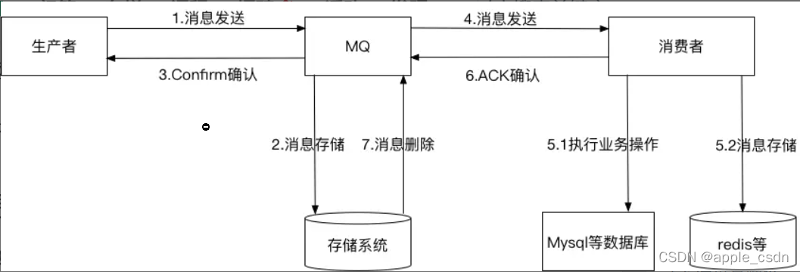

## 如何保证消息不丢失



#### 第二步:消息存储(交换机和队列消息持久化)

在声明交换机和队列时配置：

```java
@Bean
public Queue directQueue() {
    /**
     * durable:是否持久化，默认false，持久化队列会把数据保存在磁盘中，消息代理重启时仍然存在
     * exclusive：默认false，只能被当前创建的链接使用，true则表示连接关闭后队列就被删除，优先级高于durable
     * autoDelete: 是否自动删除，默认为false，true时表示没有生产者或者消费者，则队列自动删除
     */
    Queue directQueue = new Queue(QUEUE_DIRECT, true);
    return directQueue;
}
```

```java
@Bean
public DirectExchange directExchange() {
  // 同上参数
  DirectExchange directExchange = new DirectExchange(DIRECT_EXCHANGE, true, false);
  return directExchange;
}
```

#### 第三部:confirm确认(交换机确认和队列确认)

在发送方**rabbitmq-provider**的**rabbitmq-provider**配置：

```apl
server:
  port: 8002
spring:
  application:
    name: rabbitmq-provider
  rabbitmq:
    host: localhost
    port: 5673
    username: admin
    password: admin
    virtual-host: MyHost
    #确认消息已发送到交换机(Exchange)
    #publisher-confirms: true
    publisher-confirm-type: correlated
    #确认消息已发送到队列(Queue)
    publisher-returns: true
```

```java
@Configuration
public class RabbitConfig {

    @Bean
    public RabbitTemplate createRabbitTemplate(ConnectionFactory connectionFactory) {
        RabbitTemplate rabbitTemplate = new RabbitTemplate();
        rabbitTemplate.setConnectionFactory(connectionFactory);
        //设置开启Mandatory,才能触发回调函数,无论消息推送结果怎么样都强制调用回调函数
        rabbitTemplate.setMandatory(true);

        // 确认消息到达交换机位置
        rabbitTemplate.setConfirmCallback(new RabbitTemplate.ConfirmCallback() {
            @Override
            public void confirm(CorrelationData correlationData, boolean ack, String cause) {
                System.out.println("ConfirmCallback:     " + "相关数据：" + correlationData);
                System.out.println("ConfirmCallback:     " + "确认情况：" + ack);
                System.out.println("ConfirmCallback:     " + "原因：" + cause);
            }
        });

        // 确认消息从交换机到队列中
        rabbitTemplate.setReturnCallback(new RabbitTemplate.ReturnCallback() {
            @Override
            public void returnedMessage(Message message, int replyCode, String replyText, String exchange, String routingKey) {
                System.out.println("ReturnCallback:     " + "消息：" + message);
                System.out.println("ReturnCallback:     " + "回应码：" + replyCode);
                System.out.println("ReturnCallback:     " + "回应信息：" + replyText);
                System.out.println("ReturnCallback:     " + "交换机：" + exchange);
                System.out.println("ReturnCallback:     " + "路由键：" + routingKey);
            }
        });

        return rabbitTemplate;
    }

}
```

其中当消息到达Exchange中会触发ConfirmCallback方法，当消息到达队列Queue时会触发ReturnCallback方法；

1⃣️ **消息没有到交换机**（**写个错的交换机**）

```c
ConfirmCallback:     相关数据：null
ConfirmCallback:     确认情况：false
ConfirmCallback:     原因：channel error; protocol method: #method<channel.close>(reply-code=404, reply-text=NOT_FOUND - no exchange 'topicExchange1' in vhost 'MyHost', class-id=60, method-id=40)
```

2⃣️**消息没有到队列**（**写个不存在的队列**）

```java
ReturnCallback:     消息：(Body:'[B@bb63eb9(byte[223])' MessageProperties [headers={}, contentType=application/x-java-serialized-object, contentLength=0, receivedDeliveryMode=PERSISTENT, priority=0, deliveryTag=0])
ReturnCallback:     回应码：312
ReturnCallback:     回应信息：NO_ROUTE
ReturnCallback:     交换机：topicExchange
ReturnCallback:     路由键：333
  
ConfirmCallback:     相关数据：null
ConfirmCallback:     确认情况：true
ConfirmCallback:     原因：null
```

3⃣️正常发送消息（消息无丢失）

```java
ConfirmCallback:     相关数据：null
ConfirmCallback:     确认情况：true
ConfirmCallback:     原因：null
```

#### 第六步: 消费者开启手动确认

消息接受的确认机制主要有三种模式：

- 自动确认：默认模式，Rabbitmq成功将消息发出后立即认为本次的投递是被正确处理，删除消息，不管消费者是否成功处理，这种情况的话如果消费端抛出异常，消费方也没有正确处理该消息，则该消息丢失
- 手动确认：只有当消费者手动调用basic.ack/basic.nack/basic.reject后，Rabbitmq收到这些消息后，才认为本次投递成功。
  - basic.ack用于肯定确认 
  - basic.nack用于否定确认
  - basic.reject用于否定确认，但与basic.nack相比有一个限制:一次只能拒绝单条消息 
- 根据情况确认：不做介绍

**channel.basicReject(deliveryTag,true):** 拒绝消费当前消息，如果第二个参数传入true，就是将数据重新丢入到队列里（队列头部），那么下次还会消费这个消息。设置false，表明我已经知道这个消息了，因为一些原因拒绝了他，而且服务器把这个消息丢掉就行，下次也不用再次消费这个消息了。

使用拒绝后重新入列是个危险的动作，因为一般都是出现异常时，catch再次入列，选择是否入列，如果使用不当可能会导致一直异常->入列->异常->入列的循环，而且还是入列头部，这样就会导致消息堆积问题。

**channel.basicNack(deliveryTag, false, true):**

- 第一个参数是消息的唯一id
- 第二个参数指的是否针对多条消息，如果是true，就是把通道中的消息tagId小于当前这条消息的，都拒绝确认
- 第三个参数指的是是否重新入列

修改消费者rabbitmq-consummer的application.yml文件；

```apl
server:
  port: 8003
spring:
  application:
    name: rabbitmq-consumer
  rabbitmq:
    host: localhost
    port: 5673
    username: admin
    password: admin
    virtual-host: MyHost
    listener:
      type: simple
      simple:
        acknowledge-mode: manual  # ACK模式(none,auto,manual,默认为auto)

```

```java
@Component
public class DirectListener {

    @RabbitListener(queues = "directQueue")
    public void process1(MsgDto dto, Message message, Channel channel) throws IOException {
        long deliveryTag = message.getMessageProperties().getDeliveryTag();
        try {
            System.out.println(dto.getMsg());
            channel.basicAck(deliveryTag, false);
        } catch (Exception e) {
            channel.basicReject(deliveryTag, false);
        }
    }
  
}
```