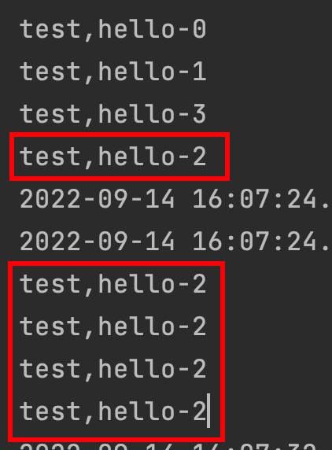

## 一、重试机制

重试机制就是在消息消费失败后进行重试

重试的触发条件：

- 显示的抛出异常，就是不能用try...catch包裹异常，或者手动抛出异常

重试机制是**默认开启**的，如果没有配置相关的配置会导致消息**一直无间隔的重试**，直到成功，所以使用重试机制要有相关配置。

## 二、实例代码

在rabbitmq-consumer工程中，配置application.yml:

```apl
server:
  port: 8003
spring:
  application:
    name: rabbitmq-consumer
  rabbitmq:
    host: localhost
    port: 5673
    username: admin
    password: admin
    virtual-host: MyHost
    listener:
      type: simple
      simple:
        acknowledge-mode: manual #消费端收到消息后的确认方式 manual手动确认  none自动确认
        retry:
          enabled: true  #开启消费者 程序异常情况下会进行重试
          max-attempts: 5 #重试次数
          initial-interval: 2000 #消费者重试间隔次数 2s
```

```java
@Component
public class DirectListener {

    @RabbitListener(queues = "directQueue")
    public void process1(MsgDto dto, Message message, Channel channel) throws IOException, ClassNotFoundException {
        long deliveryTag = message.getMessageProperties().getDeliveryTag();
        System.out.println(dto.getMsg());
        if ("test,hello-2".equals(dto.getMsg())) {
            int i = 1 / 0;
        }
        channel.basicAck(deliveryTag, false);
    }
}
```

当消息的msg等于“test,hello-2”的时候，触发异常，然后这条消息会间隔2s重试一次，一共重试5次，如果5次后还是有问题就抛出异常，丢失该消息，执行其余的消息。



