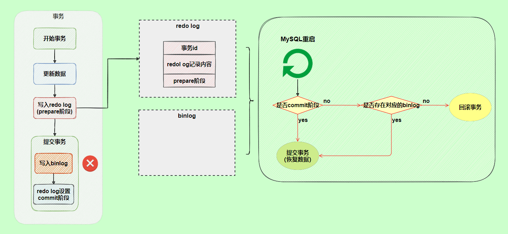

## 一、Redolog（重做日志）

### 1.什么是redolog

redolog是InnoDB存储引擎独有的，是保证事物持久性的重要机制。当mysql意外宕机或崩溃时，保证已提交的事物，确定持久化到磁盘的一种措施。

### 2.为什么要redolog

- Mysql的数据是以页为单位(16KB)，查询一条数据，会从硬盘中把一页的数据都加载出来，加载出来的数据叫做数据页，会放入Buffer Pool中
- 后续的查询都是从Buffer Pool中找，如果没有命中再从磁盘中加载，减少硬盘IO开销
- 更新数据也是如此，发现Buffer Pool有需要更新的数据，则直接在Buffer Pool中进行更新

#### **那么为什么需要redolog呢？**

假设我们只在内存的Buffer Pool中更新了页数据，事物提交后突然数据库崩溃，导致内存中的数据丢失了，那么这个更新后的数据也一起丢失了，这肯定是不能接受的。那我们要怎么保证数据的持久性呢？**有一个方法就是每次事物提交的时候把该次事物提交修改的所有数据页都更新到磁盘中**，但是这样做有一个问题：

- 刷新一个完整的数据页太过浪费
  - 有时候我们仅仅是修改了一个数据页上的一条记录，提交事物时却要把整个数据页都刷新到磁盘中，这未免有点太过浪费
- 随机IO开销大，效率慢
  - 一个事物中可能会包含多条sql语句，这些语句可能会对Buffer Pool中不相邻的数据页进行操作。当把该事物修改的数据页刷新到磁盘中会产生很多随机IO，**随机IO的开销要大于顺序IO**

#### **redolog的作用**

由于以上种种原因，我们的想法就是想保存事物提交后的数据，即使在数据库崩溃，重启后也能恢复事物提交后的数据；

所以我们可以**在事物提交的时候，只需要把这次事物提交修改的数据记录一下**，比如：

```java
将第 0 号表空间第 100 号页面中偏移量为 1000 处的值更新为 2。
```

这就是我们所说的redolog日志，即使数据库崩溃了，重启后只要根据redolog日志恢复即可

- redolog日志占用内存空间非常小
  - 在存储表空间 ID、页号、偏移量以及需要更新的值时，需要的存储空间很小
- redolog日志是顺序写入磁盘的
  - 在执行事物过程中，可能会产生多条redolog日志，这些日志是按照产生的顺序写入磁盘的，也就是顺序写入磁盘

### 3.刷盘机制

`InnoDB` 存储引擎为 `redo log` 的刷盘策略提供了 `innodb_flush_log_at_trx_commit` 参数，它支持三种策略：

- **0** ：设置为 0 的时候，表示每次事务提交时不进行刷盘操作
  - mysql宕机了可能会有1秒钟的数据丢失
- **1** ：设置为 1 的时候，表示每次事务提交时都将进行刷盘操作（**默认值**）
  - 不会有数据丢失，即使在事物未提交时宕机，也没有影响
- **2** ：设置为 2 的时候，表示每次事务提交时都只把 redo log buffer 内容写入 page cache
  - mysql宕机了会有1秒钟的数据丢失

Inndb存储引擎有一个后台线程，每隔1秒，就会把`redo log buffer`中的内容写到文件系统缓存`page cache`，然后调用fsync刷盘


因为在事物执行过程中`redolog` 记录是会写入`redo log buffe`中，这些`redo log`记录会被后台线程刷盘。


除了后台线程每秒`1`次的轮询操作，还有一种情况，当 `redo log buffer` 占用的空间即将达到 `innodb_log_buffer_size` 一半的时候，后台线程会主动刷盘。

## 二、binlog(归档日志)

- 查看binlog日志是否开启 `show variables like 'log_%';`
- mysql的binlog日志位置 `show variables like '%datadir%';`
- 查看binlog文件 `show binary logs;`
- 查看指定binlog文件的内容`show binlog events in 'mysql-bin.000002';`
- 日志被刷新时，新生成一个日志文件`flush logs;`
- 正在写入的binlog文件`show master status\G;`
- binlog的详细说明 `mysqlbinlog --base64-output=decode-rows -v mysql-bin.000002`
- 查看mysql的系统参数 `show variables;` `show variables like 'binlog_format';` `show variables like 系统配置`

### 什么是binlog？

binlog记录的是语句的原始逻辑,`insert inot value(1,2,3)`这种语句，所以Mysql数据的**数据备份，主备等**都离不开binlog日志，需要通过binlog日志来实现数据一致性。


### 记录格式

binlog日志有三种格式，可以通过**binlog_format**参数指定。

- **statement**
  - 记录的内容是`SQL`语句原文，比如执行一条`update T set update_time=now() where id=1`，就记录原文，但是这里的now（）随着时间的变化是不一样的，所以会导致产生的结果不一致。
- **row**(默认)
  - 
  - 记录的内容不再是简单的`SQL`语句了，还包含操作的具体数据，update_time=now()`变成了具体的时间` update_time=1627112756247，后面的条件后面的@1、@2、@3 都是该行数据第 1 个~3 个字段的原始值；
- **mixed**
  - `MySQL`会判断这条`SQL`语句是否可能引起数据不一致，如果是，就用`row`格式，否则就用`statement`格式。

### 写入机制

在事物执行过程中，先把日志写到binlog cache中，事物提交时候，再把binlog cache写到binlog文件中。

因为一个事物的binlog不能拆开，无论这个事物多大，也要确保一次性写入，所以系统会给每个线程分配一个内存作为binlog cache

可以通过参数 binlog_cache_size控制单个binlog cache的大小，如果存储内存超过了这个参数就会触发刷盘。


- write只是把binlog cache数据刷新懂啊page cache中，并没有把数据持久化到磁盘中，fsync才是刷新到磁盘中
- **其中write和fsync的时机，可以由参数sync_binlog控制，默认为0**

#### sync_binlog说明

- **0:** 为0的时候，每次提交事物只执行write操作，fsync的操作有系统自行判断执行
  - 如果Mysql宕机了，page cache里的binlog数据会丢失
- **1:**为1的时候，每次提交事物的时候都会执行fsync操作，跟redolog日志刷盘机制一样

### 两阶段提交

`redolog`**重做日志**让`Inndb`存储引擎拥有崩溃恢复能力

`binlog`**归档日志**保证了`mysql`集群架构的数据一致性

在执行更新语句过程中，会记录redolog和binlog日志，以基本的事物为单位，redolog在事物执行过程中可以不断的写入，而binlog只有在提交事物时才写入，所以redolog与binlog的写入时机不一样，**那么当redolog和binlog两份日志的数据不一致会导致什么问题？**

假设原字段c=0，id=2的记录改成c=1，update T set c=1 where id=2；


由于binlog没有写入的时候就发生了异常，此时binlog日志中没有变更记录，如果之后用binlog日志恢复数据时，就会少了这一条记录的更新，回复出来的c=0，而原来库由于redolog日志恢复过来的日志c=1，最终导致数据不一致。


为了避免以上的数据不一致问题，Innodb存储引擎使用的**两阶段提**交方案。

把redolog的写入拆成了两个步骤**prepare**和**commit**


- 如果在binlog日志写入过程中发生了异常，因为mysql通过redolog回复数据时，发现redolog还在prepare阶段，并且没有对应的binlog日志，就会回滚
  - 
- 如果在redolog提交commit时异常时，虽然redolog处于prepare阶段，但是能通过事物id找到对应的binlog日志，所以mysql认为数据时完整的，就会提交redolog日志，恢复数据。
  - 

## 三、undolog(回滚日志)

### undolog日志的作用

#### 1. 提供回滚操作(undolog日志保证事物的原子性)

我们在进行数据更新操作的时候，不仅会记录redolog日志，而且也会记录undolog，如果因为某些原因导致事物回滚，那么这个时候mysql就需要回滚保证事物的一致性，使用undolog将数据恢复到事物开始之前的状态。

例如删除一条数据：

```mysql
delete from user where id = 1;
```

此时undolog日志就会记录一条对应的insert语句(**反向操作的语句**) ，保证在事物回滚的时候，可以把数据还原回去。

更新一条数据：

```mysql
update user set name = "李四" where id = 1; ---修改之前name=张三
```

undolog日志就会记录一条相反的update语句；

```mysql
update user set name = "张三" where id = 1;
```

#### 2. 提供多版本控制(MVCC)

MVCC即多版本并发控制，在Musql数据库InnoDB存储引擎中，用undolog日志来实现多版本并发控制。当读取到某一行被其他事物锁定时，它可以从undolog日志中分析出该行数据以前的版本数据是怎样的，从而让用户能够读取到当前事物操作之前的数据。


undolog 日志中不仅存放着数据更新前的数据，还记录着RowId，事物id，回滚指针，其中事物id每次递增，回滚指针第一次如果是insert语句的话，回滚指针为null，第二次update之后的undolog的回滚指针就会指向刚刚那一条的undolog日志，一次类推，就会形成一条undolog回滚链，方便找到该条记录的历史版本。

### undolog的工作原理

在更新数据之前，mysql会提前生成undolog日志，当事物提交时，并不会立即删除undolog，因为后面可能需要进行回滚操作，要执行回滚操作时，从缓存中读取数据。undolog日志的删除是通过后台purge线程进行回收处理的。


- 事物A执行update操作，此时事物还没提交，会将数据进行备份到对应的undo buffer中，然后由undo buffer持久化到磁盘中的undolog日志中，此时undolog日志保存了未提交之前的日志，接着将操作的的数据，也就是Tearcher表的数据持久化到Innodb的IBD文件中。
- 此时事物B进行查询操作，直接从undo buffer缓存中进行读取，这是事物A还没提交事物，如果要回滚事物，是不读磁盘的，先直接从undo buffer缓存读取。

## 四、使用binlog恢复日志

https://developer.aliyun.com/article/935803

参考:

- https://javaguide.cn/database/mysql/mysql-logs.html#%E4%B8%A4%E9%98%B6%E6%AE%B5%E6%8F%90%E4%BA%A4
- https://www.jb51.net/article/244620.htm


