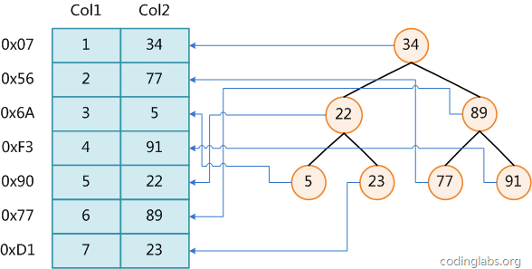
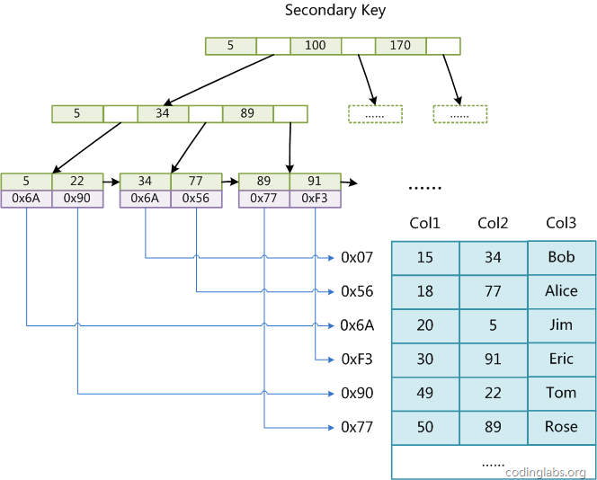
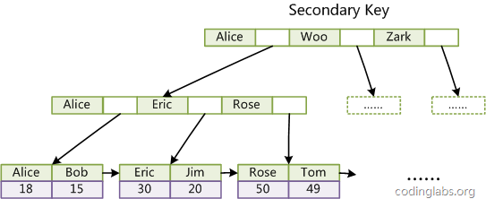
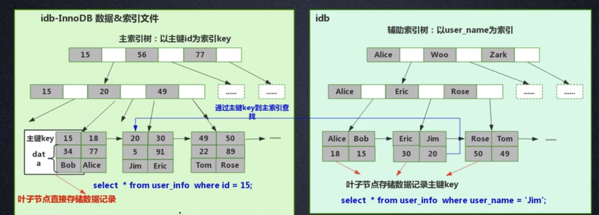

## 一、索引

**定义: 索引是帮助Mysql高效获取数据的数据结构**



以上展示了一种可能的索引方式，左边是数据表，一共有两列七条数据，最左边的是数据记录的物理地址(注意逻辑上相邻的记录在磁盘上也并不一定是物理相邻的),为了加快Col2的的查找，可以维护一个右边所示的二叉查找数，每个节点分别包含索引建值和一个指向对应数据记录的物理地址的指针，这样就可以运用二叉查找在O(log2n)的复杂度内获取到相应数据。

虽然以上是一种索引的设计，但是实际数据库几乎没有使用二叉查找树或者红黑树实现的，一般都是都是使用B+树实现的。

### B-Tree


- key为记录的键值，对于不同数据记录，key是互不相同的
- data为数据记录除key外的数据

弊端: 由于插入删除新的数据记录会破坏B-Tree的性质，因此在插入删除时，需要对树进行一个分裂，合并，转移等操作以保持B-Tree性质，导致性能上不能很好的发挥。

## 二、MyISAM索引实现

MyISAM引擎使用B+Tree作为索引结构，**叶节点的data域存放的是数据记录的地址**，如下原理图：


假设表一共有三裂，我们以col1为主键，上图则是一个MyISAM的主键索引(Primary Key) ,可以看出MyISAM的索引文件仅仅保存数据记录的地址。在MyISAM中，主索引和辅助索引(Secondary Key)在结构上没有任何区别，只是主索引要求key是唯一的，而辅助索引的key是可以重复的，如果我们在col2建立一个辅助索引，则此索引的机构如下图所示：



MyISAM中索引检索的算法为首先按照B+Tree搜索算法搜索引擎，如果指定的Key存在，则取出其中的date域的值，然后以data域的值为地址，读取相应的数据记录。

MyISAM的索引方式也叫`非聚集索引`,之所以这么称呼是因为要和InnoDB的`聚集索引`区分；

## 三、InnoDB索引实现

InnoDB虽然也是使用B+Tree作为索引结构，但是具体的实现方式与MyISAM不同。

#### 区别一

InnoDB的数据文件本身就是索引文件，而**MyISAM索引文件和数据文件是否分开的**，索引文件仅保存了数据记录的地址，而InnoDB中，表数据文件本身就是按B+Tree组织的一个索引结构，**这棵树的叶节点data域保存了完整的数据记录**，这个索引的key是数据表的主键，因此InnoDB表数据文件本身就是主索引。


以上是InnoDB的主索引示意图，可以看到叶子结点包含了完整的数据记录，这种索引叫做`聚集索引`。

因为InnoDB的数据文件本身要按照主键聚集，所以InnoDB要求表必须有主键(MyISAM可以没有)，如果没有显示的执行，**则mysql会自动选择一个可以唯一标识数据记录的列作为主键，如果不存在这种列，则mysql自动为InnoDB表生成一个隐含字段作为主键，这个字段长6个字节，类型为长整形。**

#### 区别二

与MyISAM索引不同的是InnoDB的**辅助索引data域存储的相应记录主键的值而不是地址**。换句话说，InnoDB的所有辅助索引都引用主键作为data域，下图为一个辅助索引col3字段：





聚集索引这种实现方式使得按主键的搜索十分高效，但是辅助索引搜索需要检索两遍索引:首**先检索辅助索引获得主键，然后用主键到主索引中检索获得记录**，这样做的话是InnoDB需要节省存储空间，没必要在每个节点上都存储数据，数据冗余。

## 四、覆盖索引和回表

定义: 简单来说，就是查询字段和索引字段完全一致，比如定义一个indexI(name,age,gender)的索引，然后你查询的时候

```mysql
select name,age,gender from user where name = '张三' and age = '12' and gender = '1'
```

这种就叫覆盖索引，并不是一种特别的索引类型。

从上的InnoDB的索引结构中可以看出，一般辅助索引是需要搜索两遍，**在流程中从辅助索引树搜索回到主键索引树搜索的过程称为：回表。**

覆盖索引（covering index ，或称为索引覆盖）即**从非辅助索引中就能查到的记录，而不需要查询主键索引中的记录，避免了回表的产生减少了树的搜索次数，显著提升性能**。

## 五、总结

了解不同的存储引擎的实现方式，对于正确使用和优化索引都有非常大的帮助；

- InnoDB为什么不建议使用过长的字段作为主键，因为所有的辅助索引都引用主索引，过长的主索引会令辅助索引过大
- 不建议使用非单调的字段作为主键，因为InnoDB数据文件本身就是一颗B+Tree，非单调的主键会造成在插入新纪录时，数据文件为了维持B+Tree的特性而频繁的分裂调整，效率低下，而使用递增字段作为主键是个很好的选择

参考:

- https://blog.csdn.net/u013967628/article/details/84305511#B-Tree%E5%92%8CB%2BTree