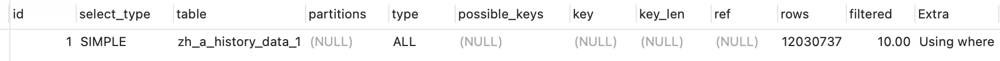
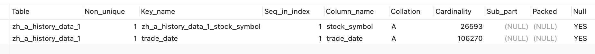
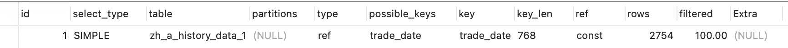
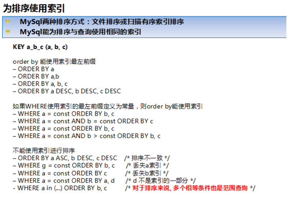

## 一、索引设计规范

### 1. 索引操作

**查询索引**

```mysql
show index from table_name
```

**创建索引:**idx_表名_字段名

```mysql
普通索引:
create index idx_user_name on user(name);
非空索引:
create unique index idx_user_namePassword on user(name,password) ;
主键索引:
create primary key index idx_user_namePassword on user(name,password) ;
添加 FULLTEXT(全文索引)
ALTER TABLE `table_name` ADD FULLTEXT ( `column`);
使用ALTER TABLE语句创建索引:
alter table table_name add index index_name (column_list) ;
alter table table_name add unique index_name (column_list) ;
alter table table_name add primary key index_name (column_list) ;
```

**删除索引**

```mysql
drop index index_name on table_name
```

### 2. 选择合适的字段创建索引

- 不为NULL的字段: 索引字段的数据应该尽量不为NULL，因为对数据为NULL的字段，数据库优化困难。如果字段频繁被查询，但又避免不了为NULL，建议使用0，1，true，false这样的语意较为清晰的短值或字符代替；
- 被频繁查询的字段
- 被作为条件查询的字段
- 频繁需要排序的字段
- 被频繁用于连接的字段,比如多表中的on的关联字段

## 二、Explain分析

准备数据，表数据大概一千多万条数据

没加索引之前：

```mysql
SELECT * FROM zh_a_history_data_1 WHERE trade_date = '2016-11-09';  // 13.273秒
```

使用EXPLAIN执行一下:

```mysql
EXPLAIN SELECT * FROM zh_a_history_data_1 WHERE trade_date = '2016-11-09';
```



添加trade_date索引

```mysql
create index trade_date on zh_a_history_data_1(trade_date);
```



```mysql
SELECT * FROM zh_a_history_data_1 WHERE trade_date = '2016-11-09'; // 0.34秒
```



#### type:

type显示的是访问类型，是一个比较重要的指标，结果值从最好到最坏依次是：

system > const > eq_ref > **`ref`** > fulltext > ref_or_null > index_merge > unique_subquery > index_subquery > **`range`(尽量保证)** > index > ALL 

一般来说，得保证查询至少达到range级别，最好能达到ref级别。

- **ref**: 非唯一性索引扫描，返回匹配某个单独值的所有行，本质上也是一种索引访问
- **rang**：只检索给定范围的行，使用一个索引来选择行，**一般就是在你的where语句中出现了between、<、>、in等的查询**
- **all**：遍历全表找到需要的行

#### key：显示使用了哪个索引，查询中若使用了覆盖索引，则该索引和查询的select字段重叠

> 覆盖索引并不是索引类型，而是指查询的字段刚好与所以的字段一摸一样

Extra的值为using idnex，这就是说明用到了覆盖索引。

#### ref：显示索引那一列被使用了，如果可能的话，是个常量

#### rows：显示执行查询时必须检查的行数，越少越好

## 三、索引优化

### mysql单个索引和联合索引的区别

如果我们创建了**(area, age,salary)**的复合索引，那么其实相当于创建了：(area,age,salary)，(area,age)、(area)三个索引，这被称为最佳左前缀特性。

因此我们在创建复合索引时应该将最常用作限制条件的列放在最左边，依次递减。

```mysql
-- 有索引
select * from test where area='11'
select * from test where area='11' and age=1
select * from test where area='11' and age=1 and salary=2.0
```

```mysql
-- 无索引
select * from test where age=11
select * from test where age=1 and salary=2.0
```

**如果在查询中需要匹配多个字段的条件，可以把这几个字段做个联合索引，效率要比在每个字段上加索引高多了**

### 索引优化

- 全值匹配我最爱
  - 索引idx_staffs_nameAgePos建立索引时以 name,age,pos 的顺序建立的,全值匹配表示按顺序匹配的
- **最佳左前缀法则**:指的是查询从索引的最左前列开始并且**不跳过索引中的列**
- 不在索引列上做任何操作（**计算、函数、(自动or手动)类型转换**）会导致索引失效而转向全表扫描
- **尽量使用覆盖索引**(只访问索引的查询(索引列和查询列一致))，减少select *
- mysql 在使用**不等于(!= 或者<>)**的时候无法使用索引会导致全表扫描
- **is not null** 也无法使用索引,但是**is null**是可以使用索引的
- like以通配符开头**('%abc...')**mysql索引，失效会变成全表扫描的操作,**(abc%)**可以走索引
- 字符串不加单引号索引失效，底层进行转换使索引失效，使用了函数造成索引失效
- 少用or,用它来连接时会索引失效

### 总结

假设index(a,b,c)

| Where语句                                                | 索引是否被使用                          |
| -------------------------------------------------------- | --------------------------------------- |
| where a = 3                                              | Y,使用到a                               |
| where a = 3 and b = 5                                    | Y,使用到a，b                            |
| where a = 3 and b = 5 and c = 4                          | Y,使用到a,b,c                           |
| where b = 3 或者 where b = 3 and c = 4  或者 where c = 4 | N                                       |
| where a = 3 and c = 5                                    | 使用到a， 但是c不可以，b中间断了        |
| where a = 3 and b > 4 and c = 5                          | 使用到a和b， c不能用在范围之后，b后断了 |
| where a = 3 and b like 'kk%' and c = 4                   | Y,使用到a,b,c                           |
| where a = 3 and b like '%kk' and c = 4                   | Y,只用到a                               |
| where a = 3 and b like '%kk%' and c = 4                  | Y,只用到a                               |
| where a = 3 and b like 'k%kk%' and c = 4                 | Y,使用到a,b,c                           |

### 关联查询优化:小表驱动大表

- 保证被驱动表的join字段已经被索引
  - 如果是left join就给右表建立索引，如果是right join就给左表建立索引
- left join 时，选择小表作为驱动表，大表作为被驱动表
- 子查询尽量不要放在被驱动表，有可能使用不到索引
- inner join 时，mysql会自己帮你把小结果集的表选为驱动表

### ORDER BY(排序)关键字优化

**ORDER BY子句，尽量使用Index方式排序,避免使用FileSort方式排序:**

MySQL支持二种方式的排序，FileSort和Index，Index效率高.它指MySQL扫描索引本身完成排序。FileSort方式效率较低。

**ORDER BY满足两情况，会使用Index方式排序:**

- ORDER BY 语句使用索引最左前列
- 使用Where子句与Order BY子句条件列组合满足索引最左前列
- where子句中如果出现索引的范围查询(即explain中出现range)会导致order by 索引失效



### GROUP BY(分组)关键字优化

- group by实质是先排序后进行分组，遵照索引建的最佳左前缀
- 当无法使用索引列，增大max_length_for_sort_data参数的设置+增大sort_buffer_size参数的设置
- where高于having，能写在where限定的条件就不要去having限定了

**尽量不要使用 distinct 关键字去重**：优化

```mysql
select distinct kcdz form t_mall_sku where id in( 3,4,5,6,8 )   -- 使用 distinct 关键字去重消耗性能;
select  kcdz form t_mall_sku where id in( 3,4,5,6,8 )  -- group by kcdz 能够利用到索引 group by kcdz 能够利用到索引;
```


