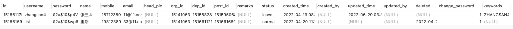

## 一、正则搜索

常规的like的模糊搜索就不做介绍了，这里介绍一下mysql的正则搜索

```mysql
// 不区分大小写的查询
SELECT field1, field2,....,fieldN FROM table_name WHERE field1 regexp condition;
// 区分大小写的查询
SELECT field1, field2,....,fieldN FROM table_name WHERE field1 regexp binary condition;
```

- **regexp** 操作符也在 WHERE 子句中使用，若 condition 不能为明确的数据，需要为正则表达式
- 默认 **regexp** 操作符 的查询不区分大小写，如若想区分大小写，可以在 **regexp** 操作符后 加上 **binary** 关键字即可

**regexp_like()是一个函数**

```mysql
SELECT * FROM sys_user WHERE regexp_like(`name`,"张三|里斯");
select * from sys_user where `name` regexp  "张三|里斯";
```



但是使用这种方式的话效率应该不高

## 二、全文索引

