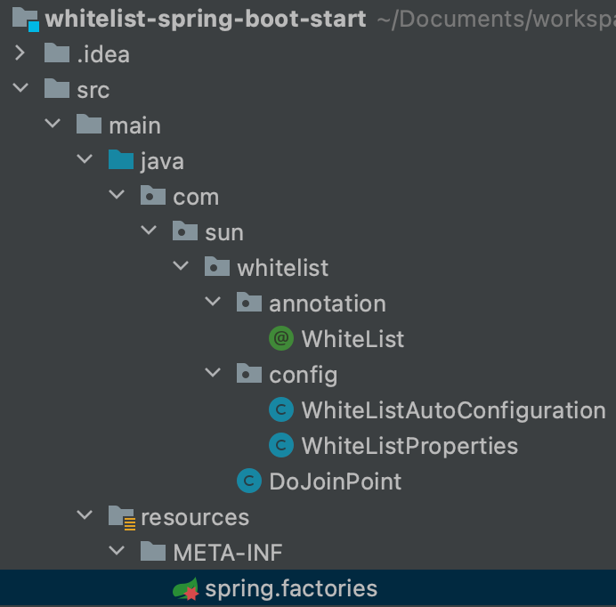

## 一、为什么要自定义starter

​        在我们的日常开发工作中，经常会有一些独立于业务之外的配置模块，我们经常将其放到一个特定的包下，然后如果另一个工程需要复用这块功能的时候，需要将代码硬拷贝到另一个工程，重新集成一遍，麻烦至极。如果我们将这些可独立于业务代码之外的功能配置模块封装成一个个starter，复用的时候只需要将其在pom中引用依赖即可。

## 二、springboot自动装配原理

- Spring Boot启动的时候会通过@EnableAutoConfiguration注解找到依赖的starter下的META-INF/spring.factories配置文件
- 根据 spring.factories配置加载xxxAutoConfiguration类
- 根据 @Conditional注解的条件，进行自动配置并将Bean注入Spring Context 上下文当中。
- 也可以使用@ImportAutoConfiguration({MyServiceAutoConfiguration.class}) 指定自动配置哪些类。

## 三、自定义白名单starter

整体结构如下:

 

#### 1. 自定义白名单注解

```java
@Retention(RetentionPolicy.RUNTIME)
@Target(ElementType.METHOD)
public @interface WhiteList {

    String key() default "";

    String returnJson() default "";

}
```

**@Target:表示该注解可以应用的java元素类型**

- ElementType.TYPE: 应用于类、接口（包括注解类型）、枚举
- ElementType.FIELD: 作用于属性上(包括枚举类的常量)
- ElementType.METHOD: 作用于方法上

**@Retention: 表示该注解的生命周期**

- SOURCE:注解将被编译器忽略掉
- CLASS:注解将被编译器记录在class文件中，但在运行时不会被虚拟机保留，这是一个默认的行为
- RUNTIME(常用):注解将被编译器记录在class文件中，而且在运行时会被虚拟机保留，因此它们能通过反射被读取到

#### 2. 配置类

```java
@ConfigurationProperties(prefix = "sun.white")
public class WhiteListProperties {

    private String userStr;

    public String getUserStr() {
        return userStr;
    }

    public void setUserStr(String userStr) {
        this.userStr = userStr;
    }
}
```

@ConfigurationProperties: 通常配合@Component注解使用，或者配合@EnableConfigurationProperties使用，从yml配置文件中获取前缀为sun.white的配置赋值到userStr属性上。

#### 3. 创建Bean对象

```java
@Configuration
@ConditionalOnClass(WhiteListProperties.class)
@EnableConfigurationProperties(WhiteListProperties.class)
public class WhiteListAutoConfiguration {

    @Bean("whiteListConfig")
    @ConditionalOnMissingBean
    @ConditionalOnProperty(prefix = "sun.white", value = "enabled", havingValue = "true")
    public String whiteListConfig(WhiteListProperties properties) {
        return properties.getUserStr();
    }

}
```

- @Configuration: 声明该类是一个配置类，常见用来创建Bean对象并交由Spring管理。

- @ConditionalOnClass(WhiteListProperties.class): 当在classpath类路径上存在WhiteListProperties.class时，才会实例话WhiteListAutoConfiguration这个Bean对象。

  > @ConditionalOnBean（仅仅在当前上下文中存在某个对象时，才会实例化一个Bean）
  > @ConditionalOnClass（某个class位于类路径上，才会实例化一个Bean）
  > @ConditionalOnExpression（当表达式为true的时候，才会实例化一个Bean）
  > @ConditionalOnMissingBean（仅仅在当前上下文中不存在某个对象时，才会实例化一个Bean）
  > @ConditionalOnMissingClass（某个class类路径上不存在的时候，才会实例化一个Bean）

- @EnableConfigurationProperties(WhiteListProperties.class): 使使用 @ConfigurationProperties 注解的类生效。

#### 4. AOP逻辑代码

```java
@Aspect
@Component
public class DoJoinPoint {
    Logger logger = LoggerFactory.getLogger(DoJoinPoint.class);

    @Resource
    private String whiteListConfig;

    // 切点,扫描所有带WhiteList注解的方法
    @Pointcut("@annotation(com.sun.whitelist.annotation.WhiteList)")
    public void aopPoint() {
    }

    @Around("aopPoint()")
    public Object doRouter(ProceedingJoinPoint jp) throws Throwable {
        // 获取注解方法对象
        Method method = getMethod(jp);
        // 获取注解本身
        WhiteList annotation = method.getAnnotation(WhiteList.class);
        // 获取制定参数的值
        String keyValue = getFiledValue(annotation.key(), jp.getArgs());
        logger.info("方法名:{},参数是:{}", method.getName(), keyValue);
        if (null == keyValue || "".equals(keyValue)) {
            // 通过
            return jp.proceed();
        }

        String[] list = whiteListConfig.split(",");
        for (String s : list) {
            if (s.equals(keyValue)) {
                // 通过
                return jp.proceed();
            }
        }
        // 拦截，返回结果
        return returnObject(annotation, method);
    }

    // 返回对象
    private Object returnObject(WhiteList whiteList, Method method) throws IllegalAccessException, InstantiationException {
        // 获取方法返回值类型
        Class<?> returnType = method.getReturnType();
        String returnJson = whiteList.returnJson();
        if ("".equals(returnJson)) {
            // 初始化
            return returnType.newInstance();
        }
        return JSON.parseObject(returnJson, returnType);
    }


    // 获取方法对象
    private Method getMethod(JoinPoint jp) throws NoSuchMethodException {
        Signature signature = jp.getSignature();
        MethodSignature methodSignature = (MethodSignature) signature;
        // 获取方法名称
        String methodName = methodSignature.getName();
        // 获取方法类型
        Class[] parameterTypes = methodSignature.getParameterTypes();
        // 获取该方法对象
        return jp.getTarget().getClass().getMethod(methodName, parameterTypes);
    }


    /**
     * 获取属性值
     *
     * @param filed 参数名称
     * @param args  全部参数
     * @return 参数值
     * 当传入参数为对象时，则获取对象中参数为filed的值
     * 反之，如果只有一个参数，则默认该参数的值就是白名单的数据
     */
    private String getFiledValue(String filed, Object[] args) {
        String filedValue = null;
        for (Object arg : args) {
            try {
                if (null == filedValue || "".equals(filedValue)) {
                    filedValue = BeanUtils.getProperty(arg, filed);
                } else {
                    break;
                }
            } catch (Exception e) {
                if (args.length == 1) {
                    return args[0].toString();
                }
            }
        }
        return filedValue;
    }
}
```

#### 5. spring.factories文件

```java
org.springframework.boot.autoconfigure.EnableAutoConfiguration=com.sun.whitelist.config.WhiteListAutoConfiguration
```

使springboot能够自动装配WhiteListAutoConfiguration类对象，使该类生效。

#### 6. pom文件

```java
<?xml version="1.0" encoding="UTF-8"?>
<project xmlns="http://maven.apache.org/POM/4.0.0"
         xmlns:xsi="http://www.w3.org/2001/XMLSchema-instance"
         xsi:schemaLocation="http://maven.apache.org/POM/4.0.0 http://maven.apache.org/xsd/maven-4.0.0.xsd">
    <modelVersion>4.0.0</modelVersion>

    <groupId>com.sun</groupId>
    <artifactId>whitelist-spring-boot-start</artifactId>
    <version>1.0-SNAPSHOT</version>

    <packaging>jar</packaging>

    // 如果引用的这个starter存在parent，该parent可省略
    <parent>
        <groupId>org.springframework.boot</groupId>
        <artifactId>spring-boot-starter-parent</artifactId>
        <version>2.2.5.RELEASE</version>
        <relativePath/> <!-- lookup parent from repository -->
    </parent>

    <dependencies>
        <dependency>
            <groupId>org.springframework.boot</groupId>
            <artifactId>spring-boot-starter</artifactId>
        </dependency>
        <dependency>
            <groupId>org.springframework.boot</groupId>
            <artifactId>spring-boot-configuration-processor</artifactId>
            <optional>true</optional>
        </dependency>
        <dependency>
            <groupId>org.springframework.boot</groupId>
            <artifactId>spring-boot-autoconfigure</artifactId>
        </dependency>
        <dependency>
            <groupId>org.springframework.boot</groupId>
            <artifactId>spring-boot-starter-aop</artifactId>
        </dependency>
        <dependency>
            <groupId>commons-beanutils</groupId>
            <artifactId>commons-beanutils</artifactId>
            <version>1.8.3</version>
        </dependency>
        <dependency>
            <groupId>com.alibaba</groupId>
            <artifactId>fastjson</artifactId>
            <version>1.2.62</version>
        </dependency>
    </dependencies>

    <build>
        <plugins>
            <plugin>
                <groupId>org.apache.maven.plugins</groupId>
                <artifactId>maven-compiler-plugin</artifactId>
                <version>2.3.2</version>
                <configuration>
                    <source>1.8</source>
                    <target>1.8</target>
                    <encoding>UTF-8</encoding>
                </configuration>
            </plugin>
            <plugin>
                <groupId>org.apache.maven.plugins</groupId>
                <artifactId>maven-jar-plugin</artifactId>
                <version>2.3.2</version>
                <configuration>
                    <archive>
                        <addMavenDescriptor>false</addMavenDescriptor>
                        <index>true</index>
                        <manifest>
                            <addDefaultSpecificationEntries>true</addDefaultSpecificationEntries>
                            <addDefaultImplementationEntries>true</addDefaultImplementationEntries>
                        </manifest>
                        <manifestEntries>
                            <Implementation-Build>${maven.build.timestamp}</Implementation-Build>
                        </manifestEntries>
                    </archive>
                </configuration>
            </plugin>
        </plugins>
    </build>
</project>
```

#### 7. 测试

```java
<dependencies>
    <dependency>
        <groupId>com.sun</groupId>
        <artifactId>whitelist-spring-boot-start</artifactId>
        <version>1.0-SNAPSHOT</version>
    </dependency>

    <dependency>
        <groupId>org.springframework.boot</groupId>
        <artifactId>spring-boot-starter-web</artifactId>
    </dependency>
</dependencies>
```

```java
server:
  port: 8080
sun:
  white:
    enabled: true
    user-str: 123,456
```

```java
public class Entity {

    private String userId;

    private Integer age;

		...get(),set()
}
```

```java
@WhiteList(key = "userId", returnJson = "{\"meesage\":\"失败\",\"code\":500}")
@GetMapping("/whiteList")
public String whiteList(Entity entity) {
    return entity.getUserId() + entity.getAge();
}
```

```java
http://localhost:8080/whiteList?userId=111&age=444
{
  "code": 500,
  "meesage": "失败"
}
```

```java
http://localhost:8080/whiteList?userId=123&age=444
123444
```

参考:

- https://bugstack.cn/