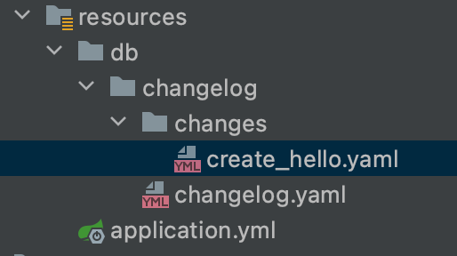

## 一、什么是Liquibase

Liquibase是一个用于跟踪、管理和应用数据库变化的开源的数据库重构工具。它将所有数据库的变化（包括结构和数据）都保存在 changelog 文件中，便于版本控制，它的目标是提供一种数据库类型无关的解决方案，通过执行 schema 类型的文件来达到迁移。

## 二、整合Springboot

springboot内置了Liquibase

### 1. 引入依赖

```xml
<dependency>
  <groupId>org.springframework.boot</groupId>
  <artifactId>spring-boot-starter-web</artifactId>
</dependency>

<dependency>
  <groupId>mysql</groupId>
  <artifactId>mysql-connector-java</artifactId>
</dependency>

<dependency>
  <groupId>org.liquibase</groupId>
  <artifactId>liquibase-core</artifactId>
</dependency>

<dependency>
  <groupId>org.springframework.boot</groupId>
  <artifactId>spring-boot-starter-jdbc</artifactId>
</dependency>
```

### 2. application.yml

 

```yaml
server:
  port: 8006
spring:
  application:
    name: liquibase-demo
  liquibase:
    change-log: "classpath:db/changelog/changelog.yaml"
    enabled: true
  datasource:
    driver-class-name: com.mysql.cj.jdbc.Driver
    username: root
    password: 123456
    url: jdbc:mysql://localhost:3306/hello?useUnicode=true&rewriteBatchedStatements=true&serverTimezone=UTC
```

#### changelog.yaml文件

```yaml
databaseChangeLog:
  - includeAll:
      path: /db/changelog/changes/
      relativeToChangelogFile: false
```

#### changes需要执行的目录

```yaml
databaseChangeLog:
  - changeSet:
      id: "create_user_table"
      author: zhangsan
      runOnChange: True
      changes:
      	# 创建表
        - createTable:
            tableName: sys_user
            columns:
              - column:
                  name: id
                  type: varchar(255)
                  # 索引
                  constraints:
                    primaryKey: true
                    nullable: false
                  # 自增
                  autoIncrement: false
              - column:
                  name: username
                  type: varchar(255)
                  constraints:
                    nullable: false
              - column:
                  name: password
                  type: varchar(255)
                  constraints:
                    nullable: false
              - column:
                  name: password_type
                  type: varchar(10)
                  constraints:
                    nullable: false
                    
  # 新增字段
 - changeSet:
      id: "add_column"
      author: liubing
      runOnChange: True
      changes:
        - addColumn:
            tableName: sys_user
            columns:
              - column:
                  name: first_login
                  type: tinyint(1)
                  defaultValueBoolean: false
                  remarks: "是否首次登录   0：首次登录   1：非首次登录"
              - column:
                  name: last_error_attempt_time
                  type: datetime
                  remarks: "最近一次错误尝试时间"
              - column:
                  name: error_attempt_count
                  type: int
                  defaultValue: 0
                  remarks: "尝试错误次数"
   # 删除字段         
  - changeSet:
      id: "delete_column"
      author: sun
      runOnChange: True
      changes:
        - dropColumn:
            tableName: sys_user
            columns:
              - column:
                  name: restrict_mac_status
              - column:
                  name: restrict_ip_status
                 
```

参考手册:

https://docs.liquibase.com/change-types/home.html#entities