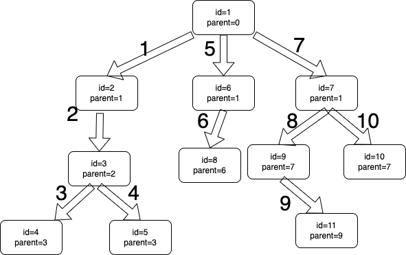

## 一、如何写好一个递归

- 方法体: **递归方法体的返回值是我们想要的最底层的数据**
- 终止条件: 或者说是触发递归的条件，不然递归会一直执行
- 执行: 执行递归方法，传递递归方法参数(下一层的参数)，获取返回值 
- 处理递归结果: **递归后会获取到该方法体的返回值，拿到这个返回值后想做什么**

## 二、案例说明

### 1.递归阶乘

#### 方法体: 想要n*n类似的结果

```java
public static int factorial(int n) {
    int j = 1;
    return j;
}
```

#### 终止条件: 当n！=1的时候，一直执行递归方法

```java
public static int factorial(int n) {
    int j = 1;
    if (n != 1) {
        
    }
    return j;
}
```

#### 执行: 执行递归方法，因为是递减，参数传减了1的数，并获取返回值

```java
public static int factorial(int n) {
    int j = 1;
    if (n != 1) {
        int i = n - 1;
        int value = factorial(i);
    }
    return j;
}
```

#### 处理递归结果: 拿到这个每次都-1的数据后，想干啥？当然是累乘起来

```java
public static int factorial(int n) {
    int j = 1;
    if (n != 1) {
     	  System.out.println(i);
        int i = n - 1;
        int value = factorial(i);
        j = value * n;
    }
    return j;
}
```

### 2.递归树结构

```java
@Data
@AllArgsConstructor
@NoArgsConstructor
public class NodeTreeVo {

    private String id;

    private String parentId;

    private String nodeName;

    private List<NodeTreeVo> children;

}
```

现在有一个NodeTreeVo集合，并且有父子结构，想法是把该机构改成树机构;

#### 方法体: 由这个树结构的children属性可看出，我们想要一个节点下的所有子节点

```java
private List<NodeTreeVo> getChildren(String rootId, List<NodeTreeVo> nodeTreeVoList) {
  	// 该集合用来存放子节点
    List<NodeTreeVo> list = new ArrayList<>();
    
    return list;
}
```

#### 终止条件: 当一条记录的parentId=rootId时，才开始递归

```java
private List<NodeTreeVo> getChildren(String rootId, List<NodeTreeVo> nodeTreeVoList) {
    List<NodeTreeVo> list = new ArrayList<>();
    for (NodeTreeVo nodeTree : nodeTreeVoList) {
        String parentId = nodeTree.getParentId();
        String id = nodeTree.getId();
      	// 只有当parentId=rootId时，才表示这个节点存在子节点
        if (parentId.equals(rootId)) {
            
        }
    }
    return list;
}
```

#### 执行: 执行该递归方法，注意传参，第一个参数是当前节点的id

```java
private List<NodeTreeVo> getChildren(String rootId, List<NodeTreeVo> nodeTreeVoList) {
    List<NodeTreeVo> list = new ArrayList<>();
    for (NodeTreeVo nodeTree : nodeTreeVoList) {
        String parentId = nodeTree.getParentId();
        String id = nodeTree.getId();
        if (parentId.equals(rootId)) {
          	// 递归方法，并获取结果集
            List<NodeTreeVo> children = getChildren(id, nodeTreeVoList);
            
           
        }
    }
    return list;
}
```

#### 处理递归结果: 拿到递归的结果后，当然把结果放进这个节点的children属性中，然后把当前节点放入list中

```java
private List<NodeTreeVo> getChildren(String rootId, List<NodeTreeVo> nodeTreeVoList) {
    List<NodeTreeVo> list = new ArrayList<>();
    for (NodeTreeVo nodeTree : nodeTreeVoList) {
        String parentId = nodeTree.getParentId();
        String id = nodeTree.getId();
        if (parentId.equals(rootId)) {
            List<NodeTreeVo> children = getChildren(id, nodeTreeVoList);
            nodeTree.setChildren(children);
            list.add(nodeTree);
        }
    }
    return list;
}
```

**树结构的递归图:**

 