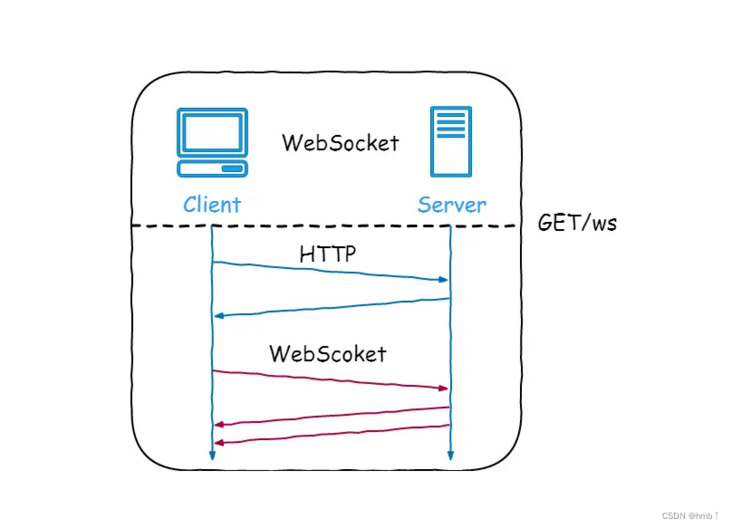

## websocket

是一种在 TCP 连接上进行全双工通信的协议，建立客户端和服务器之间的通信渠道。浏览器和服务器仅需一次握手，两者之间就直接可以创建持久性的连接，并进行双向数据传输;



### 引入依赖

```java
<!-- 引入websocket -->
<dependency>
    <groupId>org.springframework.boot</groupId>
    <artifactId>spring-boot-starter-websocket</artifactId>
</dependency>
```

### 配置Bean对象

```java
@Configuration
public class WebSocketConfig {
    @Bean
    public ServerEndpointExporter serverEndpointExporter() {
        return new ServerEndpointExporter();
    }
}
```

### WebSocketServer

服务端使用`@ServerEndpoint`注解标注当前类为一个 WebSocket 服务器，客户端可以通过`ws://localhost:8888/socket/websocket/001`来连接到 WebSocket 服务器端。

```java
@Component
@ServerEndpoint(value = "/socket/websocket/{userId}")
public class WebSocketServer {

    private final Logger logger = LoggerFactory.getLogger(WebSocketServer.class);

    private static CopyOnWriteArrayList<WebSocketServer> webSockets = new CopyOnWriteArrayList<>();
    private static ConcurrentMap<String, WebSocketServer> socketConcurrentHashMap = new ConcurrentHashMap<>();
    private Session session;
    private String userId;

    /**
     * 连接建立成功调用的方法
     */
    @OnOpen
    public void onOpen(@PathParam("userId") String userId, Session session) {
        this.session = session;
        this.userId = userId;
        socketConcurrentHashMap.put(userId, this);
        //加入set中
        webSockets.add(this);
        logger.info("有新连接加入！当前在线人数为" + socketConcurrentHashMap.size());
    }

    @OnClose
    public void onClose() {
        if (Objects.nonNull(userId)) {
            //从set中删除
            socketConcurrentHashMap.remove(userId);
        }
        webSockets.remove(this);
        logger.info("有一连接关闭！当前在线人数为" + socketConcurrentHashMap.size());
    }

    /**
     * 接收到客户端发来的信息
     */
    @OnMessage
    public void onMessage(String message) {
        logger.info("client message:" + message);
    }

    /**
     * 群发消息
     */
    public void sendAll(String message) {
        for (String userId : socketConcurrentHashMap.keySet()) {
            try {
                socketConcurrentHashMap.get(userId).sendMessage(message);
            } catch (IOException e) {
                logger.error("WebSocketServer|sendAll[error]:e={}", e.getMessage());
            }
        }
    }

    /**
     * 指定用户发消息
     */
    public void sendToUser(String message, List<String> userIds) {
        try {
            if (userIds.size() > 0) {
                for (String userId : userIds) {
                    if (Objects.isNull(socketConcurrentHashMap.get(userId))) {
                        continue;
                    }
                    socketConcurrentHashMap.get(userId).sendMessage(message);
                }
            }
        } catch (IOException e) {
            logger.error("WebSocketServer|sendToUser[error]:e={}", e.getMessage());
        }
    }

    @OnError
    public void onError(Throwable e) {
        logger.error("WebSocketServer|onError[error]:e={}", e.getMessage());
    }

    /**
     * 发送消息
     */
    public void sendMessage(String message) throws IOException {
        this.session.getAsyncRemote().sendText(message);
    }
}
```

websocket测试工具:http://www.jsons.cn/websocket/

### 测试类

```java
@Controller
@RequestMapping("/test")
public class TestController {

    @Resource
    private WebSocketServer webSocketServer;

    @GetMapping("/more")
    public void sendMsg(String msg, @RequestParam(value = "ids") List<String> userIds) {
        webSocketServer.sendToUser(msg, userIds);
    }

    @GetMapping("/all")
    public void sendMsgAll(String msg) {
        webSocketServer.sendAll(msg);
    }

}
```

