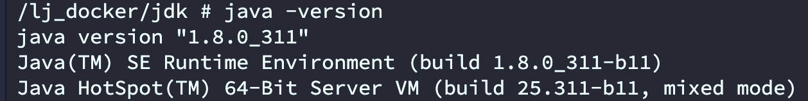

## 一、Docker基础知识

#### **镜像命令：**

- **`docker images [可选] ` 列出本机上的镜像**
- **`docker search [OPTIONS] `某个镜像的名字**
- **`docker pull `某个XXX镜像名字 [:TAG](默认为latest)**
- **`docker rmi -f `镜像ID（ 删除单个）**

#### **容器命令：**

- **新建并启动容器：docker run [OPTIONS] 镜像名称**

  ```java
  OPTIONS说明（常用）：有些是一个减号，有些是两个减号
  --name="容器新名字": 为容器指定一个名称；
  -d: 后台运行容器，并返回容器ID，也即启动守护式容器；
  -i：以交互模式运行容器，通常与 -t 同时使用；
  -t：为容器重新分配一个伪输入终端，通常与 -i 同时使用；
  -P: 随机端口映射；
  -p: 指定端口映射，有以下四种格式
        ip:hostPort:containerPort
        ip::containerPort
       	hostPort:containerPort
       	containerPort
  ```

- **`docker ps` ：列出当前所有正在运行的容器**
- **`docker start`  容器ID或者容器名 : 启动容器**
- **`docker stop` 容器ID或者容器名:停止容器**
- **`docker kill` 容器ID或者容器名:强制停止容器**
- **`docker rm` 容器ID:删除已经停止的容器**
- **`docker exec -it 容器ID bash`:进入正在运行的容器并以命令行交互**
  - 一般的容器都可以执行/bin/bash，但也有部分容器没有，那么我们可以用**sh来替换/bin/bash**

## 二、制作Alpine基础镜像

#### 1.下载JDK和Cjlib压缩包

cjlib下载地址: https://github.com/sgerrand/alpine-pkg-glibc/releases

经过测试，**alpine:3.10和jdk1.8和cjlib2.29版本是可以的**，其他版本组合不清楚会不会有问题

#### 2. 编写dockerfile文件

```dockerfile
#1.指定基础镜像，并且必须是第一条指令
#FROM alpine:latest
FROM alpine:3.10
 
#2.指明该镜像的作者和其电子邮件
MAINTAINER "sun" 

#3.在构建镜像时，指定镜像的工作目录，之后的命令都是基于此工作目录，如果不存在，则会创建目录
WORKDIR /lj_docker/jdk
 
#4.将一些安装包复制到镜像中，语法：ADD/COPY <src>... <dest>
## ADD与COPY的区别：ADD复制并解压，COPY仅复制
ADD jdk-8u311-linux-x64.tar.gz /lj_docker/jdk/
## glibc安装包如果从网络下载速度实在是太慢了，先提前下载复制到镜像中
COPY glibc-2.29-r0.apk /lj_docker/jdk/
COPY glibc-bin-2.29-r0.apk /lj_docker/jdk/
COPY glibc-i18n-2.29-r0.apk /lj_docker/jdk/
 
#5.更新Alpine的软件源为阿里云，因为从默认官源拉取实在太慢了
RUN echo http://mirrors.aliyun.com/alpine/v3.10/main/ > /etc/apk/repositories && \
    echo http://mirrors.aliyun.com/alpine/v3.10/community/ >> /etc/apk/repositories
RUN apk update && apk upgrade
 
#6.运行指定的命令
## Alpine linux为了精简本身并没有安装太多的常用软件,apk类似于ubuntu的apt-get，
## 用来安装一些常用软V件，其语法如下：apk add bash wget curl git make vim docker
## wget是linux下的ftp/http传输工具，没安装会报错“/bin/sh: 　　wget: not found”，网上例子少安装wget
## ca-certificates证书服务，是安装glibc前置依赖
RUN apk --no-cache add ca-certificates wget \
    && wget -q -O /etc/apk/keys/sgerrand.rsa.pub https://alpine-pkgs.sgerrand.com/sgerrand.rsa.pub \
    && apk add glibc-2.29-r0.apk glibc-bin-2.29-r0.apk glibc-i18n-2.29-r0.apk \
    && rm -rf /var/cache/apk/* glibc-2.29-r0.apk glibc-bin-2.29-r0.apk glibc-i18n-2.29-r0.apk
 
#7.配置环境变量
ENV JAVA_HOME=/lj_docker/jdk/jdk1.8.0_311
ENV CLASSPATH=.:$JAVA_HOME/lib/dt.jar:$JAVA_HOME/lib/tools.jar
ENV PATH=$JAVA_HOME/bin:$PATH
```

#### 3.构建docker镜像

```dockerfile
docker build -f dockerfile-alpine-jdk8 -t openjdk:8-jre-alpine .
```

**因为当前构建的目录就是Dockerfile所在的目录，所以命令中的 -f Dockerfile 可以省略，-t 表示新构建镜像的名称，最后的 . 表示当前目录。**

如果在此步出现以下报错：

```shell
ERROR: https://mirrors.aliyun.com/alpine/v3.9/main: temporary error (try again later)
WARNING: Ignoring APKINDEX.9552eaa3.tar.gz: No such file or directory
ERROR: https://mirrors.aliyun.com/alpine/v3.9/community: temporary error (try again later)
WARNING: Ignoring APKINDEX.61802f13.tar.gz: No such file or directory
```

- 在宿主机的 /etc/docker/daemon.json 文件中增加以下内容来**设置全部容器**的 DNS；

  - ```json
    {"dns" : ["114.114.114.114","8.8.8.8"]}
    ```

- 重启docker才能生`systemctl restart docker`。
- 查看是否生效 `docker run -it --rm  ubuntu  cat etc/resolv.conf` 

#### 4.创建并启动容器

```dockerfile
docker run -it --name alpineJdk 镜像的ID
```

#### 5.测试java环境

进入容器后，java -version



## 三、项目镜像

#### 1.sprintboot项目,maven

```java
		<build>
        <finalName>docker-demo</finalName>
        <plugins>
            <plugin>
                <groupId>org.apache.maven.plugins</groupId>
                <artifactId>maven-compiler-plugin</artifactId>
                <version>3.1</version>
                <configuration>
                    <source>1.8</source>
                    <target>1.8</target>
                    <encoding>UTF-8</encoding>
                </configuration>
            </plugin>
            <plugin>
                <groupId>org.springframework.boot</groupId>
                <artifactId>spring-boot-maven-plugin</artifactId>
                <executions>
                    <execution>
                        <goals>
                            <goal>repackage</goal>
                        </goals>
                    </execution>
                </executions>
            </plugin>
        </plugins>
        <resources>
            <resource>
                <directory>src/main/java</directory>
                <includes>
                    <include>**/*.xml</include>
                </includes>
            </resource>
            <resource>
                <directory>src/main/resources</directory>
                <includes>
                    <include>**/*</include>
                </includes>
            </resource>
        </resources>
    </build>
```

#### 2.Dockerfile编写

```dockerfile
FROM openjdk:8-jre-alpine

# 安装 命令工具，很多镜像是使用 alpine 作为基础镜像
# 阿里云镜像源（s/dl-cdn.alpinelinux.org/mirrors.aliyun.com/g）
# 将原装的alpine库替换成国内的ustc库
# RUN sed -i 's/dl-cdn.alpinelinux.org/mirrors.ustc.edu.cn/g' /etc/apk/repositories
# 安装curl
RUN apk add curl
# 安装telnet
RUN apk add busybox-extras
# 安装中文字体
RUN apk add --update ttf-dejavu fontconfig

RUN mkdir -p /opt/app
WORKDIR  /opt/app
COPY docker-demo.jar /opt/app/docker-demo.jar
RUN ln -sf /usr/share/zoneinfo/Asia/Shanghai /etc/localtime
RUN echo 'Asia/Shanghai' >/etc/timezone

EXPOSE 8003
ENTRYPOINT ["java", "-jar", "-Xmx2048m","-Xms512m","./docker-demo.jar"]
```

#### 3.打包好jar放入服务器，并把Dockerfile放在同一层目录下

```dockerfile
docker build -t docker-demo:1.0.0 .
```

#### 4.创建并启动容器

```
docker run -it --name docker-demo 镜像的ID
```

可以选择挂载jar包的目录，方便后期修改jar包部署

```dockerfile
docker run -it -d -p 8003:8003 --name docker-demo -v /project:/opt/app 镜像的ID
```

#### 5.测试

```shell
curl 'http://localhost:8002/docker/hello'
测试hello接口ok
```

#### 6.更新jar

只要把更新的jar包替换原来的jar包，重启容器即可