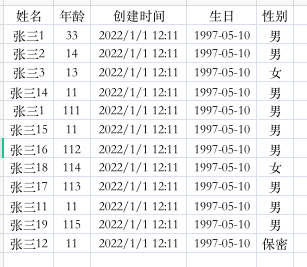
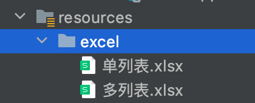
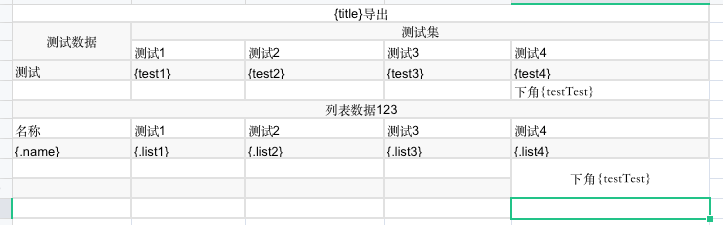
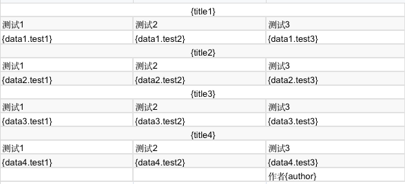

## 一、导入

#### 1.依赖导入

```java
<dependency>
    <groupId>com.alibaba</groupId>
    <artifactId>easyexcel</artifactId>
    <version>3.1.1</version>
</dependency>
```

```java
<dependency>
    <groupId>cn.hutool</groupId>
    <artifactId>hutool-core</artifactId>
    <version>5.8.8</version>
</dependency>
```

#### 2.自定义返回值

```java
public interface ExcelResult<T> {

    /**
     * 对象列表
     */
    List<T> getList();

    /**
     * 错误列表
     */
    List<String> getErrorList();

    /**
     * 导入回执
     */
    String getAnalysis();
    
}
```

```java
public class DefaultExcelResult<T> implements ExcelResult {

    /**
     * 数据对象list
     */
    private List<T> list;

    /**
     * 错误信息列表
     */
    private List<String> errorList;

    public DefaultExcelResult() {
        this.list = new ArrayList<>();
        this.errorList = new ArrayList<>();
    }

    /**
     * 数据对象
     *
     * @return List
     */
    @Override
    public List<T> getList() {
        return list;
    }

    /**
     * 错误集合
     *
     * @return List
     */
    @Override
    public List<String> getErrorList() {
        return errorList;
    }

    /**
     * 最终的返回信息，回执
     *
     * @return 信息
     */
    @Override
    public String getAnalysis() {
        int successCount = list.size();
        int errorCount = errorList.size();
        if (successCount == 0) {
            return "读取失败，未解析到数据";
        } else {
            if (errorCount == 0) {
                return StrUtil.format("全部读取成功,共{}条数据", successCount);
            } else {
                return "";
            }
        }
    }

    public void setList(List<T> list) {
        this.list = list;
    }

    public void setErrorList(List<String> errorList) {
        this.errorList = errorList;
    }


}
```

#### 3.自定义默认监听器

```java
public interface ExcelListener<T> extends ReadListener<T> {

    ExcelResult<T> getExcelResult();

}
```

```java
@NoArgsConstructor
@Slf4j
public class DefaultExcelListener<T> extends AnalysisEventListener<T> implements ExcelListener<T> {

    /**
     * 是否Validator检验，默认为是
     */
    private Boolean isValidate = Boolean.TRUE;

    /**
     * 导入回执
     */
    private ExcelResult<T> excelResult;

    /**
     * excel 表头数据
     */
    private Map<Integer, String> headMap;

    public DefaultExcelListener(boolean isValidate) {
        this.isValidate = isValidate;
        this.excelResult = new DefaultExcelResult<>();
    }

    /**
     * 异常处理 第三步
     */
    @Override
    public void onException(Exception exception, AnalysisContext context) throws Exception {
        String errMsg = "";
        // 转换异常
        if (exception instanceof ExcelDataConvertException) {
            // 如果是某一个单元格的转换异常 能获取到具体行号
            ExcelDataConvertException convertException = (ExcelDataConvertException) exception;
            // 第几行
            Integer rowIndex = convertException.getRowIndex();
            // 第几列
            Integer columnIndex = convertException.getColumnIndex();
            errMsg = StrUtil.format("第{}行-第{}列-表头{}: 解析异常<br/>",
                    rowIndex + 1, columnIndex + 1, headMap.get(columnIndex));
            if (log.isDebugEnabled()) {
                log.error(errMsg);
            }
        }
        // 校验异常
        if (exception instanceof ConstraintViolationException) {
            ConstraintViolationException constraintViolationException = (ConstraintViolationException) exception;
            Set<ConstraintViolation<?>> constraintViolations = constraintViolationException.getConstraintViolations();
            String constraintViolationsMsg = StreamUtils.join(constraintViolations, ConstraintViolation::getMessage, ", ");
            errMsg = StrUtil.format("第{}行数据校验异常: {}", context.readRowHolder().getRowIndex() + 1, constraintViolationsMsg);
            if (log.isDebugEnabled()) {
                log.error(errMsg);
            }
        }
        excelResult.getErrorList().add(errMsg);
        throw new ExcelAnalysisException(errMsg);
    }

    @Override
    public ExcelResult<T> getExcelResult() {
        return excelResult;
    }

    /**
     * 获取表头 第一步
     */
    @Override
    public void invokeHeadMap(Map<Integer, String> headMap, AnalysisContext context) {
        this.headMap = headMap;
        log.debug("解析到一条表头数据: {}", JsonUtils.toJsonString(headMap));
    }

    /**
     * 读取数据 第二步
     * 这里是一行一行执行
     */
    @Override
    public void invoke(T data, AnalysisContext analysisContext) {
        if (isValidate) {
            ValidatorUtils.validate(data);
        }
        excelResult.getList().add(data);
    }

    @Override
    public void doAfterAllAnalysed(AnalysisContext analysisContext) {
        log.debug("所有数据解析完成！");
    }

}
```

#### 4.工具类

```java
public class ExcelUtils {
    /**
     * 同步导入，建议数据量小的时候使用,基本不使用
     *
     * @param is    输入流
     * @param clazz 实体
     */
    public static <T> List<T> importExcel(InputStream is, Class<T> clazz) {
        return EasyExcel.read(is).head(clazz).autoCloseStream(true).sheet().doReadSync();
    }

    /**
     * 使用校验 监听器 异步导入，同步返回
     * 默认第一个sheet页面
     *
     * @param is         输入流
     * @param clazz      实体
     * @param isValidate 是否校验，默认true
     */
    public static <T> ExcelResult<T> importExcel(InputStream is, Class<T> clazz, boolean isValidate) {
        DefaultExcelListener<T> listener = new DefaultExcelListener<>(isValidate);
        EasyExcel.read(is, clazz, listener).sheet().doRead();
        return listener.getExcelResult();
    }

    /**
     * 使用自定义监听器 异步导入 自定义返回
     *
     * @param is       输入流
     * @param clazz    对象类型
     * @param listener 自定义监听器
     * @return 转换后集合
     */
    public static <T> ExcelResult<T> importExcel(InputStream is, Class<T> clazz, ExcelListener<T> listener) {
        EasyExcel.read(is, clazz, listener).sheet().doRead();
        return listener.getExcelResult();
    }

    public static <T> void exportExcel(List<T> list, String sheetName, Class<T> clazz, HttpServletResponse response) {
        exportExcel(list, sheetName, clazz, false, response);
    }

    /**
     * 导出excel
     *
     * @param list      导出数据集合
     * @param sheetName 工作表的名称
     * @param clazz     实体类
     * @param merge     是否合并单元格
     * @param response  响应体
     */
    public static <T> void exportExcel(List<T> list, String sheetName, Class<T> clazz, boolean merge, HttpServletResponse response) {
        try {
            resetResponse(sheetName, response);
            ServletOutputStream os = response.getOutputStream();
            ExcelWriterSheetBuilder builder = EasyExcel.write(os, clazz)
                    .autoCloseStream(false)
                    // 自动适配
                    .registerWriteHandler(new LongestMatchColumnWidthStyleStrategy())
                    // 大数值自动转换 防止失真
                    .registerConverter(new ExcelBigNumberConvert())
                    .sheet(sheetName);
            if (merge) {
                // 合并处理器
                builder.registerWriteHandler(new CellMergeStrategy(list, true));
            }
            // 构建样式
            builder.registerWriteHandler(new CellStyleStrategy());
            builder.doWrite(list);
        } catch (IOException e) {
            throw new RuntimeException("导出Excel异常");
        }
    }

    /**
     * 单表多数据模板导出 模板格式为 {.属性}
     *
     * @param filename     文件名
     * @param templatePath 模板路径 resource 目录下的路径包括模板文件名
     *                     例如: excel/temp.xlsx
     *                     重点: 模板文件必须放置到启动类对应的 resource 目录下
     * @param data         模板需要的数据
     */
    public static void exportTemplate(List<Object> data, String filename, String templatePath, HttpServletResponse response) {
        try {
            resetResponse(filename, response);
            ClassPathResource templateResource = new ClassPathResource(templatePath);
            ExcelWriter excelWriter = EasyExcel.write(response.getOutputStream())
                    .withTemplate(templateResource.getStream())
                    .autoCloseStream(false)
                    // 大数值自动转换 防止失真
                    .registerConverter(new ExcelBigNumberConvert())
                    .build();
            WriteSheet writeSheet = EasyExcel.writerSheet().build();
            if (CollUtil.isEmpty(data)) {
                throw new IllegalArgumentException("数据为空");
            }
            // 单表多数据导出 模板格式为 {.属性}
            for (Object d : data) {
                // 自动往下移动
                FillConfig fillConfig = FillConfig.builder().forceNewRow(Boolean.TRUE).build();
                excelWriter.fill(d, fillConfig, writeSheet);
            }
            excelWriter.finish();
        } catch (IOException e) {
            throw new RuntimeException("导出Excel异常");
        }
    }

    /**
     * 多表多数据模板导出 模板格式为 {key.属性}
     *
     * @param filename     文件名
     * @param templatePath 模板路径 resource 目录下的路径包括模板文件名
     *                     例如: excel/temp.xlsx
     *                     重点: 模板文件必须放置到启动类对应的 resource 目录下
     * @param data         模板需要的数据
     */
    public static void exportTemplateMultiList(Map<String, Object> data, String filename, String templatePath, HttpServletResponse response) {
        try {
            resetResponse(filename, response);
            ClassPathResource templateResource = new ClassPathResource(templatePath);
            ExcelWriter excelWriter = EasyExcel.write(response.getOutputStream())
                    .withTemplate(templateResource.getStream())
                    .autoCloseStream(false)
                    // 大数值自动转换 防止失真
                    .registerConverter(new ExcelBigNumberConvert())
                    .build();
            WriteSheet writeSheet = EasyExcel.writerSheet().build();
            if (CollUtil.isEmpty(data)) {
                throw new IllegalArgumentException("数据为空");
            }
            for (Map.Entry<String, Object> map : data.entrySet()) {
                // 设置列表后续还有数据
                FillConfig fillConfig = FillConfig.builder().forceNewRow(Boolean.TRUE).build();
                if (map.getValue() instanceof Collection) {
                    // 多表导出必须使用 FillWrapper
                    excelWriter.fill(new FillWrapper(map.getKey(), (Collection<?>) map.getValue()), fillConfig, writeSheet);
                } else {
                    excelWriter.fill(map.getValue(), fillConfig, writeSheet);
                }
            }
            excelWriter.finish();
        } catch (IOException e) {
            throw new RuntimeException("导出Excel异常");
        }
    }

    /**
     * 重置响应体
     */
    private static void resetResponse(String sheetName, HttpServletResponse response) throws UnsupportedEncodingException {
        String filename = encodingFilename(sheetName);
        FileUtils.setAttachmentResponseHeader(response, filename);
        response.setContentType("application/vnd.openxmlformats-officedocument.spreadsheetml.sheet;charset=UTF-8");
    }

    /**
     * 编码文件名
     */
    public static String encodingFilename(String filename) {
        return IdUtil.fastSimpleUUID() + "_" + filename + ".xlsx";
    }


}
```

```java
public class FileUtils {

    /**
     * 下载文件名重新编码
     *
     * @param response     响应对象
     * @param realFileName 真实文件名
     * @return
     */
    public static void setAttachmentResponseHeader(HttpServletResponse response, String realFileName) throws UnsupportedEncodingException {
        String percentEncodedFileName = percentEncode(realFileName);

        StringBuilder contentDispositionValue = new StringBuilder();
        contentDispositionValue.append("attachment; filename=")
                .append(percentEncodedFileName)
                .append(";")
                .append("filename*=")
                .append("utf-8''")
                .append(percentEncodedFileName);

        response.addHeader("Access-Control-Allow-Origin", "*");
        response.addHeader("Access-Control-Expose-Headers", "Content-Disposition,download-filename");
        response.setHeader("Content-disposition", contentDispositionValue.toString());
        response.setHeader("download-filename", percentEncodedFileName);
    }

    /**
     * 百分号编码工具方法
     * 空格符（SP）是不允许的字符，在 ASCII 码对应的二进制值是"00100000”，最终转为"%20"。
     *
     * @param s 需要百分号编码的字符串
     * @return 百分号编码后的字符串
     */
    public static String percentEncode(String s) throws UnsupportedEncodingException {
        String encode = URLEncoder.encode(s, StandardCharsets.UTF_8.toString());
        return encode.replaceAll("\\+", "%20");
    }

}
```

#### 5.自定义转换器

- ##### 时间转换器

```java
public class LocalDateConvert implements Converter<LocalDate> {
    /**
     * 支持的java类型
     */
    @Override
    public Class<?> supportJavaTypeKey() {
        return LocalDate.class;
    }

    /**
     * 支持的excel类型
     */
    @Override
    public CellDataTypeEnum supportExcelTypeKey() {
        return CellDataTypeEnum.STRING;
    }

    /**
     * Excel => java
     */
    @Override
    public LocalDate convertToJavaData(ReadCellData<?> cellData, ExcelContentProperty contentProperty, GlobalConfiguration globalConfiguration) throws Exception {
        return LocalDate.parse(cellData.getStringValue(), DateTimeFormatter.ofPattern("yyyy-MM-dd"));
    }


    /**
     * Java => Excel
     */
    @Override
    public WriteCellData<?> convertToExcelData(LocalDate value, ExcelContentProperty contentProperty, GlobalConfiguration globalConfiguration) throws Exception {
        return new WriteCellData<>(value.format(DateTimeFormatter.ofPattern("yyyy-MM-dd")));
    }

}
```

- 枚举转换器

```java
@Slf4j
public class ExcelDictConvert implements Converter<Object> {

    @Override
    public Class<?> supportJavaTypeKey() {
        return Object.class;
    }

    @Override
    public CellDataTypeEnum supportExcelTypeKey() {
        return null;
    }

    /**
     * excel => java
     *
     * @param cellData        excel中的数据
     * @param contentProperty 赋值的数据
     */
    @Override
    public Object convertToJavaData(ReadCellData<?> cellData, ExcelContentProperty contentProperty, GlobalConfiguration globalConfiguration) throws Exception {
        ExcelDictFormat anno = getAnnotation(contentProperty.getField());
        String type = anno.dictType();
        // excel传进来的数据
        String label = cellData.getStringValue();
        String value = "";
        // 使用数据库字典，获取字典服务，变成java值
        if (StringUtils.isNotBlank(type)) {
//            value = SpringUtils.getBean(DictService.class).getDictValue(type, label);
        } else {
            // 使用自定义字典转换
            value = this.reverseByExp(label, anno.readConverterExp());
        }
        // 把最终的数据转换成java对应类型
        return Convert.convert(contentProperty.getField().getType(), value);
    }

    /**
     * 反向解析
     * 1=男,2=女,3=未知
     */
    private String reverseByExp(String label, String readConverterExp) {
        // 1=男,2=女,3=未知
        String[] dictArray = readConverterExp.split(",");
        for (String dict : dictArray) {
            String[] itemArray = dict.split("=");
            if (itemArray[1].equals(label)) {
                return itemArray[0];
            }
        }
        return "";
    }


    @Override
    public WriteCellData<?> convertToExcelData(Object object, ExcelContentProperty contentProperty, GlobalConfiguration globalConfiguration) throws Exception {
        if (Objects.isNull(object)) {
            return new WriteCellData<>("");
        }
        ExcelDictFormat anno = getAnnotation(contentProperty.getField());
        String type = anno.dictType();
        // java数据
        String value = Convert.toStr(object);
        String label = "";
        // 使用数据库字典，获取字典服务，变成java值
        if (StringUtils.isNotBlank(type)) {
//            label = SpringUtils.getBean(DictService.class).getDictValue(type, label);
        } else {
            // 使用自定义字典转换
            label = this.convertByExp(value, anno.readConverterExp());
        }
        return new WriteCellData<>(label);
    }

    /**
     * 正向转换
     * 1=男,2=女,3=未知
     */
    private String convertByExp(String value, String readConverterExp) {
        // 1=男,2=女,3=未知
        String[] dictArray = readConverterExp.split(",");
        for (String dict : dictArray) {
            String[] itemArray = dict.split("=");
            if (itemArray[0].equals(value)) {
                return itemArray[1];
            }
        }
        return "";
    }

    private ExcelDictFormat getAnnotation(Field field) {
        return AnnotationUtil.getAnnotation(field, ExcelDictFormat.class);
    }

}
```

#### 6.测试



```java
@Data
public class TestDemoImport {

    @NotBlank(message = "用户姓名不可为空")
    @ExcelProperty(value = "姓名")
    private String username;

    @NotNull(message = "年龄不可为空")
    @ExcelProperty(value = "年龄")
    private Integer age;

    @NotNull(message = "创建时间不可为空")
    @ExcelProperty(value = "创建时间")
    private LocalDateTime createTime;

    @NotNull(message = "生日不可为空")
    @ExcelProperty(value = "生日",converter = LocalDateConvert.class)
    private LocalDate birthday;

    @NotBlank(message = "性别不可为空")
    @ExcelProperty(value = "性别", converter = ExcelDictConvert.class)
    @ExcelDictFormat(readConverterExp = "1=男,2=女,3=未知")
    private String sex;

}
```

` LocalDateTime类型的excel可以直接导入,LocalDate类型的需要使用时间转换器`

```java
@RestController
@RequestMapping("/excel")
@Slf4j
public class ExcelController {
    /**
     * 异步导入数据
     */
    @PostMapping("/async")
    public R readAsync(@RequestPart("file") MultipartFile file) throws IOException {
        ExcelResult<TestDemoImport> result = ExcelUtils.importExcel(file.getInputStream(), TestDemoImport.class, true);
        List<TestDemoImport> list = result.getList();
        log.info("解析后的数据:{}", list);
        log.info("解析错误:{}", result.getErrorList());
        log.info("回执:{}", result.getAnalysis());
        return R.ok();
    }

}
```

## 二、导出

##### 1.大数值转换器

```java
/**
 * 大数值转换
 * Excel 数值长度位15位 大于15位的数值转换位字符串
 */
@Slf4j
public class ExcelBigNumberConvert implements Converter<Long> {

    @Override
    public Class<Long> supportJavaTypeKey() {
        return Long.class;
    }

    @Override
    public CellDataTypeEnum supportExcelTypeKey() {
        return CellDataTypeEnum.STRING;
    }

    @Override
    public Long convertToJavaData(ReadCellData<?> cellData, ExcelContentProperty contentProperty, GlobalConfiguration globalConfiguration) {
        return Convert.toLong(cellData.getData());
    }

    @Override
    public WriteCellData<Object> convertToExcelData(Long object, ExcelContentProperty contentProperty, GlobalConfiguration globalConfiguration) {
        if (ObjectUtil.isNotNull(object)) {
            String str = Convert.toStr(object);
            if (str.length() > 15) {
                return new WriteCellData<>(str);
            }
        }
        WriteCellData<Object> cellData = new WriteCellData<>(new BigDecimal(object));
        cellData.setType(CellDataTypeEnum.NUMBER);
        return cellData;
    }

}
```

##### 2.自定义导出样式

```java
public class CellStyleStrategy extends AbstractVerticalCellStyleStrategy {

    @Override
    protected WriteCellStyle contentCellStyle(CellWriteHandlerContext context) {
        //内容样式策略
        WriteCellStyle contentWriteCellStyle = new WriteCellStyle();
        //垂直居中,水平居中
        contentWriteCellStyle.setVerticalAlignment(VerticalAlignment.CENTER);
        contentWriteCellStyle.setHorizontalAlignment(HorizontalAlignment.CENTER);
        contentWriteCellStyle.setBorderLeft(BorderStyle.THIN);
        contentWriteCellStyle.setBorderTop(BorderStyle.THIN);
        contentWriteCellStyle.setBorderRight(BorderStyle.THIN);
        contentWriteCellStyle.setBorderBottom(BorderStyle.THIN);
        //设置 自动换行
        // contentWriteCellStyle.setWrapped(true);
        // 字体策略
        WriteFont contentWriteFont = new WriteFont();
        // 字体大小
        contentWriteFont.setFontHeightInPoints((short) 12);
        contentWriteFont.setFontName("宋体");
        contentWriteCellStyle.setWriteFont(contentWriteFont);
        return contentWriteCellStyle;
    }


    @Override
    protected WriteCellStyle headCellStyle(Head head) {
        //头策略使用默认 设置字体大小
        WriteCellStyle headWriteCellStyle = new WriteCellStyle();
        WriteFont headWriteFont = new WriteFont();
        headWriteFont.setFontHeightInPoints((short) 24);
        headWriteFont.setFontName("宋体");
        headWriteFont.setBold(Boolean.TRUE);
        headWriteCellStyle.setWriteFont(headWriteFont);
        headWriteCellStyle.setFillForegroundColor(IndexedColors.SKY_BLUE.index);
        return headWriteCellStyle;
    }

}

```

##### 3.自定义单元格合并

```java
@Target(ElementType.FIELD)
@Retention(RetentionPolicy.RUNTIME)
@Inherited
public @interface CellMerge {

   /**
    * col index
    */
   int index() default -1;

}
```

```java
/**
 * 列值重复合并策略
 */
@AllArgsConstructor
@Slf4j
public class CellMergeStrategy extends AbstractMergeStrategy {

	private List<?> list;
	private boolean hasTitle;

	@Override
	protected void merge(Sheet sheet, Cell cell, Head head, Integer relativeRowIndex) {
		List<CellRangeAddress> cellList = handle(list, hasTitle);
		// judge the list is not null
		if (CollectionUtils.isNotEmpty(cellList)) {
			// the judge is necessary
			if (cell.getRowIndex() == 1 && cell.getColumnIndex() == 0) {
				for (CellRangeAddress item : cellList) {
					sheet.addMergedRegion(item);
				}
			}
		}
	}

	@SneakyThrows
	private static List<CellRangeAddress> handle(List<?> list, boolean hasTitle) {
		List<CellRangeAddress> cellList = new ArrayList<>();
		if (CollectionUtils.isEmpty(list)) {
			return cellList;
		}
		Class<?> clazz = list.get(0).getClass();
		Field[] fields = clazz.getDeclaredFields();
		// 有注解的字段
		List<Field> mergeFields = new ArrayList<>();
		List<Integer> mergeFieldsIndex = new ArrayList<>();
		for (int i = 0; i < fields.length; i++) {
			Field field = fields[i];
			if (field.isAnnotationPresent(CellMerge.class)) {
				CellMerge cm = field.getAnnotation(CellMerge.class);
				mergeFields.add(field);
				mergeFieldsIndex.add(cm.index() == -1 ? i : cm.index());
			}
		}
		// 行合并开始下标
		int rowIndex = hasTitle ? 1 : 0;
		Map<Field, RepeatCell> map = new HashMap<>();
		// 生成两两合并单元格
		for (int i = 0; i < list.size(); i++) {
			for (int j = 0; j < mergeFields.size(); j++) {
				Field field = mergeFields.get(j);
				String name = field.getName();
				String methodName = "get" + name.substring(0, 1).toUpperCase() + name.substring(1);
				Method readMethod = clazz.getMethod(methodName);
				Object val = readMethod.invoke(list.get(i));

				int colNum = mergeFieldsIndex.get(j);
				if (!map.containsKey(field)) {
					map.put(field, new RepeatCell(val, i));
				} else {
					RepeatCell repeatCell = map.get(field);
					Object cellValue = repeatCell.getValue();
					if (cellValue == null || "".equals(cellValue)) {
						// 空值跳过不合并
						continue;
					}
					if (cellValue != val) {
						if (i - repeatCell.getCurrent() > 1) {
							cellList.add(new CellRangeAddress(repeatCell.getCurrent() + rowIndex, i + rowIndex - 1, colNum, colNum));
						}
						map.put(field, new RepeatCell(val, i));
					} else if (i == list.size() - 1) {
						if (i > repeatCell.getCurrent()) {
							cellList.add(new CellRangeAddress(repeatCell.getCurrent() + rowIndex, i + rowIndex, colNum, colNum));
						}
					}
				}
			}
		}
		return cellList;
	}

	@Data
	@AllArgsConstructor
	static class RepeatCell {

		private Object value;

		private int current;

	}
}
```

##### 4.模版导出案例



单列表excel:



多列表excel:



##### 5.测试

```java
@Data
public class TestDemoExport {
    @ExcelProperty(value = "编号")
    private Long id;

    @ExcelProperty(value = "姓名")
    @CellMerge
    private String username;

    @ExcelProperty(value = "年龄")
    private Integer age;

    @ExcelProperty(value = "创建时间")
    private LocalDateTime createTime;

    @ExcelProperty(value = "生日", converter = LocalDateConvert.class)
    private LocalDate birthday;

    @ExcelProperty(value = "性别", converter = ExcelDictConvert.class)
    @ExcelDictFormat(readConverterExp = "1=男,2=女,3=未知")
    private String sex;

}
```

```java
		@GetMapping("/export")
    public void export(HttpServletResponse response) {
        List<TestDemoExport> list = new ArrayList<>();
        for (int i = 0; i < 10; i++) {
            LocalDateTime now = LocalDateTime.now();
            LocalDate now1 = LocalDate.now();
            TestDemoExport testDemoExport = new TestDemoExport();
            testDemoExport.setCreateTime(now.plusDays(Convert.toLong(i)));
            testDemoExport.setBirthday(now1.plusDays(Convert.toLong(i)));
            testDemoExport.setId(IdUtil.getSnowflakeNextId());
            testDemoExport.setSex(Convert.toStr((i % 2) + 1));
            testDemoExport.setAge(i);
            testDemoExport.setUsername("张三");
            list.add(testDemoExport);
        }
        ExcelUtils.exportExcel(list, "测试数据", TestDemoExport.class, response);
    }		

		/**
     * 单列表多数据
     */
    @GetMapping("/exportTemplateOne")
    public void exportTemplateOne(HttpServletResponse response) {
        Map<String,String> map = new HashMap<>();
        map.put("title","单列表多数据");
        map.put("test1","数据测试1");
        map.put("test2","数据测试2");
        map.put("test3","数据测试3");
        map.put("test4","数据测试4");
        map.put("testTest","666");
        List<TestObj> list = new ArrayList<>();
        list.add(new TestObj("单列表测试1", "列表测试1", "列表测试2", "列表测试3", "列表测试4"));
        list.add(new TestObj("单列表测试2", "列表测试5", "列表测试6", "列表测试7", "列表测试8"));
        list.add(new TestObj("单列表测试3", "列表测试9", "列表测试10", "列表测试11", "列表测试12"));
        ExcelUtils.exportTemplate(CollUtil.newArrayList(map,list),"单列表.xlsx", "excel/单列表.xlsx", response);
    }

    /**
     * 多列表多数据
     */
    @GetMapping("/exportTemplateMuliti")
    public void exportTemplateMuliti(HttpServletResponse response) {
        Map<String,String> map = new HashMap<>();
        map.put("title1","标题1");
        map.put("title2","标题2");
        map.put("title3","标题3");
        map.put("title4","标题4");
        map.put("author","Lion Li");
        List<TestObj1> list1 = new ArrayList<>();
        list1.add(new TestObj1("list1测试1", "list1测试2", "list1测试3"));
        list1.add(new TestObj1("list1测试4", "list1测试5", "list1测试6"));
        list1.add(new TestObj1("list1测试7", "list1测试8", "list1测试9"));
        List<TestObj1> list2 = new ArrayList<>();
        list2.add(new TestObj1("list2测试1", "list2测试2", "list2测试3"));
        list2.add(new TestObj1("list2测试4", "list2测试5", "list2测试6"));
        List<TestObj1> list3 = new ArrayList<>();
        list3.add(new TestObj1("list3测试1", "list3测试2", "list3测试3"));
        List<TestObj1> list4 = new ArrayList<>();
        list4.add(new TestObj1("list4测试1", "list4测试2", "list4测试3"));
        list4.add(new TestObj1("list4测试4", "list4测试5", "list4测试6"));
        list4.add(new TestObj1("list4测试7", "list4测试8", "list4测试9"));
        list4.add(new TestObj1("list4测试10", "list4测试11", "list4测试12"));
        Map<String,Object> multiListMap = new HashMap<>();
        multiListMap.put("map",map);
        multiListMap.put("data1",list1);
        multiListMap.put("data2",list2);
        multiListMap.put("data3",list3);
        multiListMap.put("data4",list4);
        ExcelUtils.exportTemplateMultiList(multiListMap, "多列表.xlsx", "excel/多列表.xlsx", response);
    }

    @Data
    @AllArgsConstructor
    static class TestObj1 {
        private String test1;
        private String test2;
        private String test3;
    }

    @Data
    @AllArgsConstructor
    static class TestObj {
        private String name;
        private String list1;
        private String list2;
        private String list3;
        private String list4;
    }
```

