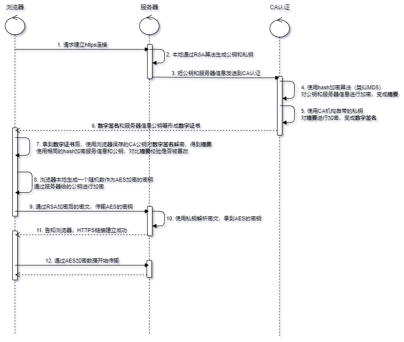

## 一、单向加密

单向加密算法又叫做不可逆算法, 就是明文被加密后,原则上是不能还原的;

| 名称    | 运行速度 | 安全性 |
| :------ | :------- | :----- |
| MD5     | 快       | 中     |
| SHA-1   | 慢       | 高     |
| SHA-256 | 更慢     | 更高   |

```java
// hutool工具包有md5,sha1,sha256等加密算法
<dependency>
  <groupId>cn.hutool</groupId>
  <artifactId>hutool-all</artifactId>
</dependency>
```

```java
public static void main(String[] args) throws NoSuchAlgorithmException {
    System.out.println(Arrays.toString(DigestUtil.md5("常见加密算法"))); //16位byte数组
    System.out.println(DigestUtil.md5Hex16("常见加密算法")); // 16位
    System.out.println(DigestUtil.md5Hex("常见加密算法")); // 32位
}

[12, 116, 39, -14, 17, -57, 63, -111, 78, -13, -14, 3, 62, -73, -64, -22]
11c73f914ef3f203
0c7427f211c73f914ef3f2033eb7c0ea
```

## 二、对称加密

**对称加密就是用钥匙key给消息加密,然后用同一把钥匙key给消息解密,就是加密解密用同一个密钥.**

| 算法 | 密钥长度    | 速度 | 安全性                                                       | 资源消耗 |
| ---- | ----------- | ---- | ------------------------------------------------------------ | -------- |
| DES  | 56/64       | 较快 | 低（完全依赖密钥，易受穷举搜索法攻击）                       | 中       |
| AES  | 128/192/256 | 快   | 高（ECB模式生成固定密钥安全性低，CBC模式每次生成的密文都不同安全性高） | 低       |
| IDEA | 128         | 较慢 | 高（军事级，可抗差值分析和相关分析）                         | 中       |

由于性能和安全性考虑,这里使用AES加密算法为例

**AES的ECB模式:每次产生的密文都是相同的**

```java
public class AESECBUtil {
    /**
     * 加密
     *
     * @param content 加密内容
     * @param aesKey  加密aeskey,一定要16个字节
     */
    public static String encryption(String content, String aesKey) throws Exception {
        SecretKeySpec secretKey = new SecretKeySpec(aesKey.getBytes(), "AES");
        Cipher cipher = Cipher.getInstance("AES");
        cipher.init(Cipher.ENCRYPT_MODE, secretKey);

        byte[] bytes = cipher.doFinal(content.getBytes(StandardCharsets.UTF_8));
        return Base64Utils.encodeToString(bytes);
    }

    /**
     * 解密
     *
     * @param content 解密内容
     * @param aesKey  加密使用的key,一定要16个字节
     */
    public static String decrypt(String content, String aesKey) throws Exception {
        byte[] bytes = StringUtils.isEmpty(content) ? null : Base64Utils.decodeFromString(content);
        SecretKeySpec secretKey = new SecretKeySpec(aesKey.getBytes(), "AES");
        Cipher cipher = Cipher.getInstance("AES/ECB/PKCS5Padding");
        cipher.init(Cipher.DECRYPT_MODE, secretKey);
        byte[] decryptBytes = cipher.doFinal(bytes);
        return new String(decryptBytes, StandardCharsets.UTF_8);
    }

    public static void main(String[] args) throws Exception {
        String msg = "这是测试内容";
        // key一定要16个字节
        String key = "123456789abcdefg";
        String encryption = encryption(msg, key);
        System.out.println(encryption);
        String decrypt = decrypt(encryption, key);
        System.out.println(decrypt);
    }
}
```

```java
vjphG35JfUn8n8l0Iqos2qrURPN7J3zZaiPXU+3Rhmk=
这是测试内容
```

**AES的CBC模式:每次产生的密文都是不相同的,安全性更高**

```java
public class AESCBCUtil {
    //这里需要设置你的32位字节密钥
    public static final String ENCRYPT_OR_DECRYPT_KEY = "1234567890abcdef1234567890abcdef";
    // 256位密钥 = 32 bytes Key:
    //CBC模式是安全性较高的AES加密模式，它需要一个随机数作为IV参数，这样对于同一份明文，每次生成的密文都不同
    public static final byte[] BYTES_KEY = ENCRYPT_OR_DECRYPT_KEY.getBytes(StandardCharsets.UTF_8);
    public static final String INSTANCE = "AES/CBC/PKCS5Padding";
    public static final String AES = "AES";

    // 加密
    public static String encrypt(String password) throws Exception {
        Cipher cipher = Cipher.getInstance(INSTANCE);
        SecretKeySpec keySpec = new SecretKeySpec(BYTES_KEY, AES);
        // CBC模式需要生成一个16 bytes的initialization vector
        SecureRandom sr = SecureRandom.getInstanceStrong();
        byte[] iv = sr.generateSeed(16);
        IvParameterSpec ivps = new IvParameterSpec(iv);
        cipher.init(Cipher.ENCRYPT_MODE, keySpec, ivps);
        byte[] data = cipher.doFinal(password.getBytes(StandardCharsets.UTF_8));
        // IV不需要保密，把IV和密文一起返回
        return DatatypeConverter.printBase64Binary(join(iv, data));
    }

    // 解密
    public static String decrypt(String password) throws Exception {
        byte[] iv = new byte[16];
        byte[] input = DatatypeConverter.parseBase64Binary(password);
        byte[] data = new byte[input.length - 16];
        // 把password分割成IV和密文
        System.arraycopy(input, 0, iv, 0, 16);
        System.arraycopy(input, 16, data, 0, data.length);
        // 解密
        Cipher cipher = Cipher.getInstance(INSTANCE);
        SecretKeySpec keySpec = new SecretKeySpec(BYTES_KEY, AES);
        IvParameterSpec ivps = new IvParameterSpec(iv);
        cipher.init(Cipher.DECRYPT_MODE, keySpec, ivps);
        return new String(cipher.doFinal(data), StandardCharsets.UTF_8);
    }

    public static byte[] join(byte[] bs1, byte[] bs2) {
        byte[] r = new byte[bs1.length + bs2.length];
        System.arraycopy(bs1, 0, r, 0, bs1.length);
        System.arraycopy(bs2, 0, r, bs1.length, bs2.length);
        return r;
    }

    public static void main(String[] args) throws Exception {
        String password = "这是CBC产生的密文";
        String encryptStr1 = encrypt(password);
        System.out.println("第一次加密:" + encryptStr1);
        String decryptStr1 = decrypt(encryptStr1);
        System.out.println("第一次解密:" + decryptStr1);

        String encryptStr2 = encrypt(password);
        System.out.println("第二次加密：" + encryptStr2);
        String decryptStr2 = decrypt(encryptStr1);
        System.out.println("第二次解密:" + decryptStr2);
    }
}
```

```java
第一次加密:ujUa1sQAYN4tWDa9vrSnaiV8oFUjwb7dyRL93C3w3G7wzf1bs+L+/l1ipyjWkfzH
第一次解密:这是CBC产生的密文
第二次加密：QYP4nzAd/2DDuKiSMck1W3TuddXf71BBUSSzzS2f9h3cXolNZEwq0IUFWclJiDcQ
第二次解密:这是CBC产生的密文
```

可以从结果看到,第一次加密和第二次加密的密文都是不同的, 但是可以解析出相同的明文,安全系数很高.

## 三、非对称加密

非对称加密算法需要两个密钥：**公开密钥（publickey:简称公钥）和私有密钥（privatekey:简称私钥）**。公钥与私钥是一对，如果用公钥对数据进行加密，只有用对应的私钥才能解密。因为加密和解密使用的是两个不同的密钥，所以这种算法叫作非对称加密算法。

常见的非对称加密有以下两种,这里以经典的RSA为例:

| 名称 | 成熟度 | 安全性 | 运算速度 | 资源消耗 |
| :--- | :----- | :----- | :------- | :------- |
| RSA  | 高     | 高     | 中       | 中       |
| ECC  | 高     | 高     | 慢       | 高       |

```java
public class RSAEncrypt {
    /**
     * 加密算法 DESEDE
     */
    private static String ALGORITHM = "RSA";
    /**
     * key值大小
     */
    private static int KEYSIZE = 1024;
    /**
     * 公钥存放文件自定义
     */
    private static final String PUBLIC_KEY_FILE = "PublicKey";
    /**
     * 私钥存放文件自定义
     */
    private static final String PRIVATE_KEY_FILE = "PrivateKey";
    /**
     * object 对象流
     */
    private static ObjectInputStream ois = null;

    /**
     * 生成密钥对
     */
    private static void generateKeyPair() throws Exception {
        //RSA算法可信任的随机数源
        SecureRandom sr = new SecureRandom();
        //RSA算法创建KeyPairGenerator对象
        KeyPairGenerator kpg = KeyPairGenerator.getInstance(ALGORITHM);
        //随机数据源初始化KeyPairGenerator对象
        kpg.initialize(KEYSIZE, sr);
        //生成密匙对
        KeyPair kp = kpg.generateKeyPair();
        //得到公钥
        Key publicKey = kp.getPublic();
        //得到私钥
        Key privateKey = kp.getPrivate();
        //用对象流将生成的密钥写入文件
        ObjectOutputStream ois = new ObjectOutputStream(new FileOutputStream(PUBLIC_KEY_FILE));
        ois.writeObject(publicKey);
        ois.close();
        ois = new ObjectOutputStream(new FileOutputStream(PRIVATE_KEY_FILE));
        ois.writeObject(privateKey);
        ois.close();
    }

    /**
     * 加密方法
     *
     * @param source 源数据
     * @return
     */
    public static String encrypt(String source) throws Exception {
        ois = new ObjectInputStream(new FileInputStream(PUBLIC_KEY_FILE));
        Key key = (Key) ois.readObject();
        ois.close();
        Cipher cipher = Cipher.getInstance(ALGORITHM);
        cipher.init(Cipher.ENCRYPT_MODE, key);
        byte[] b = source.getBytes();
        b = cipher.doFinal(b);
        return Base64.getEncoder().encodeToString(b);
    }

    /**
     * 解密算法
     *
     * @param cryptograph
     * @return
     * @throws Exception
     */
    public static String decrypt(String cryptograph) throws Exception {
        ois = new ObjectInputStream(new FileInputStream(PRIVATE_KEY_FILE));
        Key key = (Key) ois.readObject();
        Cipher cipher = Cipher.getInstance(ALGORITHM);
        cipher.init(Cipher.DECRYPT_MODE, key);
        byte[] b = Base64.getDecoder().decode(cryptograph);
        b = cipher.doFinal(b);
        return new String(b);
    }

    public static void main(String[] args) throws Exception {
//        generateKeyPair();
        String source = "Hello World 要加密的字符串!!!@@@???   ===dd!";// 要加密的字符串
        String cryptograph = encrypt(source);// 生成的密文
        String cryptograph1 = encrypt(source);// 生成的密文
        String cryptograph2 = encrypt(source);// 生成的密文
        System.out.println(cryptograph);
        System.out.println(cryptograph1);
        System.out.println(cryptograph2);
        String target = decrypt(cryptograph);// 解密密文
        String target1 = decrypt(cryptograph1);// 解密密文
        String target2 = decrypt(cryptograph2);// 解密密文
        System.out.println(target);
        System.out.println(target1);
        System.out.println(target2);
    }
}
```

- **公钥加密,私钥解,产生的密文都不相同**

```java
Ki5FfK2nZN1i8KAe6uImS220P98YopKk3aLcm2ievFPjgjt8q4EdqZAfrEwyXW0S3uo0EwBOle5e7lLqjmakk3BBaDGyyC/pZgtU8nCGLE6h56cRmi2aR/O3TrazQyOJ3vap0ex+Jc2uZmGX+Y4QYMzyd0h9hAcfcAs0xc9xnYw=
dPLgLMLgjjoljLOHYa7o9vhTtABNoYr03RqJUSDx2JCTN7n4pZbPD5BbfnrX0WsjM1+o6NgK/fVb8/FTUe7Wg/iq+HE/gW7bqprUl0k9UZXLLft6EWWNyZfoMcNXk3q3Dgb7IXK0qXf0WbWYcUBTf0g2KPsJJLmomYtkl+f9e4s=
DDE0mGZ49rBQ4Q2i4Iz01ybjTntRatTdvty5tYZXbo52GiINc/emcaqCilkL19mzUmTECVna8b/9L3duBJ9WbQoHQpes2KvSjn4Q1tYh+VZhIiUMuN/D4YqBIssFYGgK6rN2W7+f9Z+vVRxPnP2pDFh3ORbEl+ttBcHOy996XoE=
Hello World 要加密的字符串!!!@@@???   ===dd!
Hello World 要加密的字符串!!!@@@???   ===dd!
Hello World 要加密的字符串!!!@@@???   ===dd!
```

- **私钥加密,公钥解,产生的密文相同**

```java
bfYvfBB3pTWanx/uBKpEkETeulsdNW75vGBU6xbeH5c+eUCtxtTAZV4UlZuZGL3CgPd04r3oBjTCssi1efUM2eUovfgSevKFlOaXSfp+mg6A3UhY1DKWvHSSFd7NkasftbA9D34COqB8RyUVGvJMYBIk6t55v5u1K52Rq1nsjMY=
bfYvfBB3pTWanx/uBKpEkETeulsdNW75vGBU6xbeH5c+eUCtxtTAZV4UlZuZGL3CgPd04r3oBjTCssi1efUM2eUovfgSevKFlOaXSfp+mg6A3UhY1DKWvHSSFd7NkasftbA9D34COqB8RyUVGvJMYBIk6t55v5u1K52Rq1nsjMY=
bfYvfBB3pTWanx/uBKpEkETeulsdNW75vGBU6xbeH5c+eUCtxtTAZV4UlZuZGL3CgPd04r3oBjTCssi1efUM2eUovfgSevKFlOaXSfp+mg6A3UhY1DKWvHSSFd7NkasftbA9D34COqB8RyUVGvJMYBIk6t55v5u1K52Rq1nsjMY=
Hello World 要加密的字符串!!!@@@???   ===dd!
Hello World 要加密的字符串!!!@@@???   ===dd!
Hello World 要加密的字符串!!!@@@???   ===dd!
```

## 四、HTTPS原理

HTTP存在的问题:

- 无法保证消息的保密性
- 无法保证消息的完整性和准确性
- 无法保证消息来源的可靠性

HTTPS就是为了解决以上问题,这里的S值得是SSL加密,简单来说,HTTPS采用了一些加解密，数字证书，数字签名的技术来实现数据安全;



- **数字证书与数字签名**

**为了解决非对称加密中公匙来源的不安全性。我们可以使用数字证书和数字签名来解决**

1. 数字证书的申请
   - 自己本地先生成一对RSA密匙，然后拿着自己的**公匙**以及其他信息（比如说企业名称）去CA申请数字证书
   - CA在拿到这些信息后，会选择一种单向Hash算法（类似MD5）对这些信息进行加密，可以防止篡改, 加密之后的东西我们称之为摘要
   - CA还会用**自己的私匙**对摘要进行加密，摘要加密后的数据我们称之为数字签名
   - CA将会把我们的申请信息（包含服务器的公匙）和数字签名整合在一起，由此而生成数字证书给到浏览器
2. 浏览器怎么验证数字签名
   - 服务器在获取到数字证书后，服务器会将数字证书发送给客户端，客户端就需要用CA的公匙解密数字证书并验证数字证书的合法性
   - 我们的电脑和浏览器中已经内置了一部分权威机构的根证书，这些根证书中包含了CA的公匙
   - 客户端用CA的公匙解密数字证书，如果解密成功则说明证书来源于合法的认证机构。解密成功后，客户端就拿到了摘要。
   - 客户端会按照和CA一样的Hash算法将申请信息生成一份摘要，并和解密出来的那份做对比，如果相同则说明内容完整，没有被篡改
   - 最后，客户端安全的从证书中拿到服务器的公匙就可以和服务器进行安全的非对称加密通信了

- **HTTPS原理**

1. 浏览器验证完数字证书后,本地生成一个随机的AES密钥xxx
2. 通过服务器传来的公钥对xxx进行加密,服务器拿到后通过私钥进行解密,拿到xxx
3. 双方都知道了密钥,建立了HTTPS的链接,就可以用它来加密通信了
