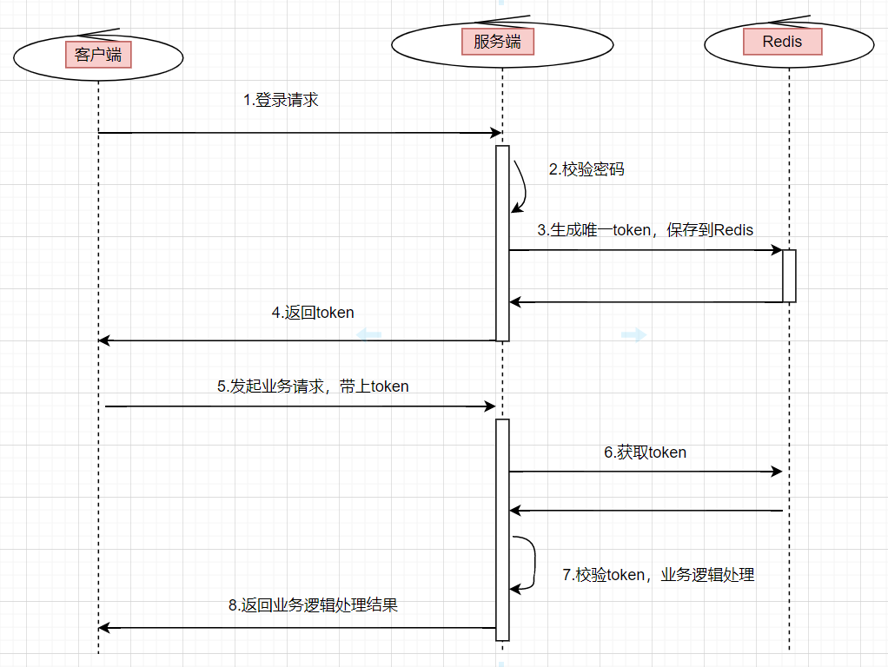
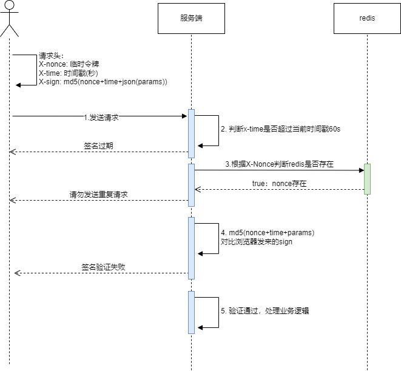
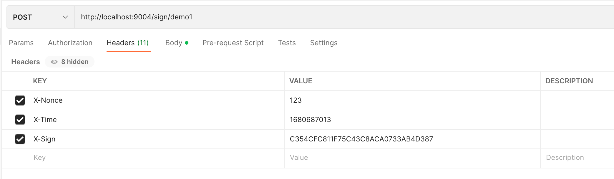
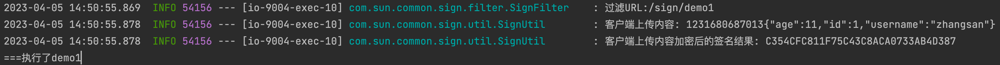

## 一、为什么要保证接口安全

在我们日常开发中,存在一些接口是敏感且重要的,比如充值接口,如果在你调用充值接口的时候被别人抓包了,然后就可以修改充值的金额,本来充值10元可以改成充值10w,产生重大生产问题,再或者说被被人抓包了,别人可以不限制的调用该充值10元的接口,调用几万次,也是会导致重大问题,那么我们该如何保证接口安全呢?

## 二、接口安全的几种方式

- #### 数据参数合法性校验

接口数据的安全性保证，还需要我们的系统，有个数据合法性校验，简单来说就是**参数校验**，比如身份证长度，手机号长度，是否是数字等等

- #### token授权认证方式

一般我们系统都会使用token鉴权登陆校验用户登陆状态和用户权限,访问接口前先校验token的合法性



- #### **数据加密,防止报文明文传输**

说到数据加密,我们不难想到使用HTTPS进行传输,HTTPS使用了RSA和AES加密的方式保证了数据传输中的安全问题,具体的HTTPS的加密原理,请看

[HTTPS原理]: /md/idea-plugin/other/2023-03-13-加密算法.md	"HTTPS原理"

数据在传输过程中被加密了，理论上，即使被抓包，数据也不会被篡改。但是**https不是绝对安全**的哦。还有一个点：`https`加密的部分只是在外网，然后有很多服务是内网相互跳转的，签名验证也可以在**这里保证不被中间人篡改**，所以一般转账类安全性要求高的接口开发，都需要**加签验签**

- #### **签名验证**

https虽然保证了在外网上数据不会被篡改,但是不能保证在内网中数据篡改的风险,所以需要有签名验证的环节

1. 客户端把参数以特定顺序进行md5加密形成签名sign,一并同参数传递到服务端
2. 服务端接收到签名和参数,也以一定的顺序对参数进行md5加密,对比传递来的sign判断是否是否被篡改

这样做的好处就是,在数据传输过程中,可以保证数据不会被篡改,如果篡改了的话sign就会不一致,验证不通过

但是这仅仅只是解决了篡改问题,那如果我拿到请求后不修改参数,原样数据多次调用,还是会产生问题,这时候就需要增加防重放功能

- #### **timestamp+nonce方案防止重放攻击**

1. timestamp是时间戳超时机制,当一个请求超过该时间后,则认定为该请求失效,需要重新发送请求,默认60s,但是如果在60s内多次调用岂不是也会导致问题? 
2. 通常来说,从抓包到重放的时间绝对不止60s,为了避免此类问题发生,我们可以在客户端发送请求的时候随机产生一个nonce随机数
3. nonce令牌是一个随机数,每次请求后都会存入redis,过期时间60s,这样就没个请求只能请求一次,避免了多次调用的问题

- ####  白名单黑名单

## 三、防重放和防篡改拦截器

这里我们使用**timestamp+nonce+sign**对接口进行安全处理



#### 1. 构建请求头

```java
@Data
@Builder
public class RequestHeader {

    /**
     * 签名
     */
    private String sign;
    /**
     * 时间戳
     */
    private Long timestamp;
    /**
     * 临时的数据
     */
    private String nonce;

}
```

#### 2. 保存请求流对象

```java
public class SignRequestWrapper extends HttpServletRequestWrapper {
    //用于将流保存下来
    private byte[] requestBody = null;

    public SignRequestWrapper(HttpServletRequest request) throws IOException {
        super(request);
        requestBody = StreamUtils.copyToByteArray(request.getInputStream());
    }

    @Override
    public ServletInputStream getInputStream() throws IOException {
        final ByteArrayInputStream bais = new ByteArrayInputStream(requestBody);

        return new ServletInputStream() {
            @Override
            public boolean isFinished() {
                return false;
            }

            @Override
            public boolean isReady() {
                return false;
            }

            @Override
            public void setReadListener(ReadListener readListener) {

            }

            @Override
            public int read() throws IOException {
                return bais.read();
            }
        };

    }

    @Override
    public BufferedReader getReader() throws IOException {
        return new BufferedReader(new InputStreamReader(getInputStream()));
    }
}
```

#### 3. 创建请求数据处理工具

```java
@Slf4j
public class HttpDataUtil {
    /**
     * post请求处理：获取 Body 参数，转换为SortedMap
     *
     * @param request
     */
    public static SortedMap<String, String> getBodyParams(final HttpServletRequest request) throws IOException {
        byte[] requestBody = StreamUtils.copyToByteArray(request.getInputStream());
        String body = new String(requestBody);
        return JsonUtils.parseObject(body, SortedMap.class);
    }


    /**
     * get请求处理：将URL请求参数转换成SortedMap
     */
    public static SortedMap<String, String> getUrlParams(HttpServletRequest request) {
        String param = "";
        SortedMap<String, String> result = new TreeMap<>();

        if (StringUtils.isEmpty(request.getQueryString())) {
            return result;
        }

        try {
            param = URLDecoder.decode(request.getQueryString(), "utf-8");
        } catch (UnsupportedEncodingException e) {
            e.printStackTrace();
        }

        String[] params = param.split("&");
        for (String s : params) {
            String[] array = s.split("=");
            result.put(array[0], array[1]);
        }
        return result;
    }
}
```

#### 4. 签名验证工具

```java
@Slf4j
public class SignUtil {

    /**
     * 验证签名
     * 验证算法：把timestamp + JsonUtil.object2Json(SortedMap)合成字符串，然后MD5
     */
    @SneakyThrows
    public static boolean verifySign(SortedMap<String, String> map, RequestHeader requestHeader) {
        String params = requestHeader.getNonce() + requestHeader.getTimestamp() + JsonUtils.toJsonString(map);
        return verifySign(params, requestHeader);
    }

    /**
     * 验证签名
     */
    public static boolean verifySign(String params, RequestHeader requestHeader) {
        log.debug("客户端签名: {}", requestHeader.getSign());
        if (StringUtils.isEmpty(params)) {
            return false;
        }
        log.info("客户端上传内容: {}", params);
        String paramsSign = DigestUtils.md5DigestAsHex(params.getBytes()).toUpperCase();
        log.info("客户端上传内容加密后的签名结果: {}", paramsSign);
        return requestHeader.getSign().equals(paramsSign);
    }

}
```

#### 5. 创建拦截器SignFilter

```java
@Slf4j
public class SignFilter implements Filter {

    private static final Long signMaxTime = 60L;

    private static final String NONCE_KEY = "x-nonce-";

    @Override
    public void doFilter(ServletRequest servletRequest, ServletResponse servletResponse, FilterChain filterChain) throws IOException, ServletException {
        HttpServletRequest httpRequest = (HttpServletRequest) servletRequest;
        log.info("过滤URL:{}", httpRequest.getRequestURI());

        //request数据流只能读取一次，这里保存request流
        HttpServletRequestWrapper requestWrapper = new SignRequestWrapper(httpRequest);

        //构建请求头
        String nonceHeader = httpRequest.getHeader("X-Nonce");
        String timeHeader = httpRequest.getHeader("X-Time");
        String signHeader = httpRequest.getHeader("X-Sign");

        //验证请求头是否存在
        if (StringUtils.isEmpty(nonceHeader) || ObjectUtils.isEmpty(timeHeader) || StringUtils.isEmpty(signHeader)) {
            throw new RuntimeException("请求头不存在");
        }

        RequestHeader requestHeader = RequestHeader.builder()
                .nonce(httpRequest.getHeader("X-Nonce"))
                .timestamp(Long.parseLong(httpRequest.getHeader("X-Time")))
                .sign(httpRequest.getHeader("X-Sign")).build();
        /*
         * 1.验证签名是否过期，防止重放
         * 判断timestamp时间戳与当前时间是否操过60s（过期时间根据业务情况设置）,如果超过了就提示签名过期。
         */
        long now = System.currentTimeMillis() / 1000;
        if (now - requestHeader.getTimestamp() > signMaxTime) {
            throw new RuntimeException("签名过期");
        }

        //2. 判断nonce，是否重复发送
        boolean nonceExists = RedisUtils.hasKey(NONCE_KEY + requestHeader.getNonce());
        if (nonceExists) {
            //请求重复
            throw new RuntimeException("请求重复");
        } else {
            RedisUtils.set(NONCE_KEY + requestHeader.getNonce(), requestHeader.getNonce(), signMaxTime);
        }

        // 3. 验证签名，防止篡改
        boolean accept;
        SortedMap<String, String> paramMap;
        switch (httpRequest.getMethod()) {
            case "GET":
                paramMap = HttpDataUtil.getUrlParams(requestWrapper);
                accept = SignUtil.verifySign(paramMap, requestHeader);
                break;
            case "POST":
                paramMap = HttpDataUtil.getBodyParams(requestWrapper);
                accept = SignUtil.verifySign(paramMap, requestHeader);
                break;
            default:
                accept = true;
                break;
        }
        if (accept) {
            filterChain.doFilter(requestWrapper, servletResponse);
        } else {
            throw new RuntimeException("签名有误，请重新请求");
        }

    }

}
```

#### 6. 配置拦截器

```java
@Configuration
public class SignFilterConfiguration {

    @Bean
    public FilterRegistrationBean contextFilterRegistrationBean() {
        FilterRegistrationBean registration = new FilterRegistrationBean();
        registration.setFilter(new SignFilter());
        registration.addUrlPatterns("/sign/*");
        registration.setName("SignFilter");
        // 设置过滤器被调用的顺序
        registration.setOrder(1);
        return registration;
    }

}
```

#### 7. 测试

```java
@RequestMapping("")
@RestController
public class SignDemoController {

    @PostMapping("/sign/demo1")
    public R demo1(@RequestBody DemoDto demoDto) {
        System.out.println("===执行了demo1");
        return R.ok();
    }

    @GetMapping("/demo2")
    public R demo2() {
        System.out.println("执行了demo2====");
        return R.ok();
    }

}

@Data
class DemoDto {
    private Integer age;

    private String username;

    private Long id;
}
```



```java
{
  "age": 11,
  "username": "zhangsan",
  "id": 1
}
```

