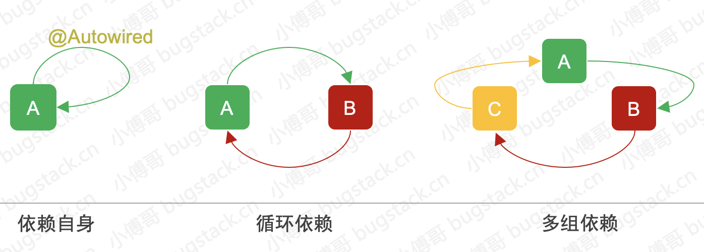
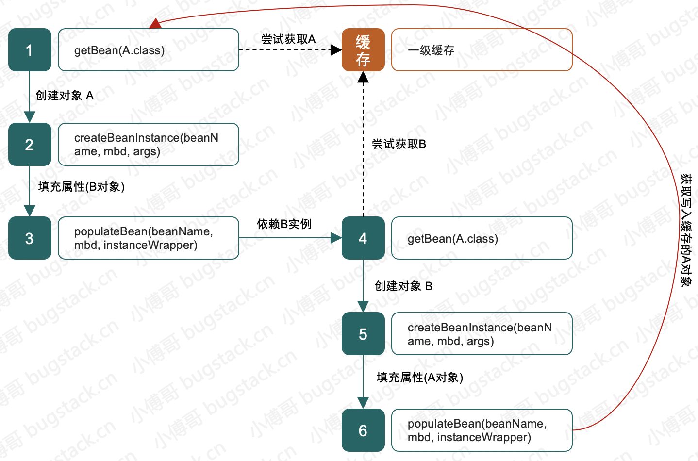
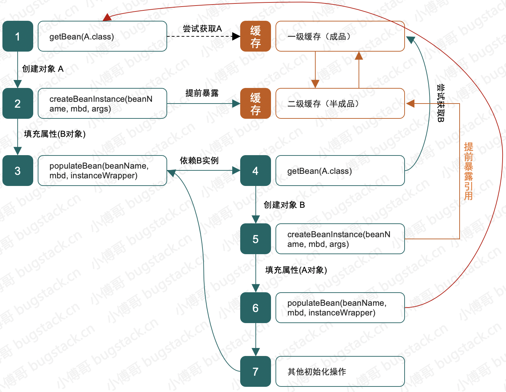
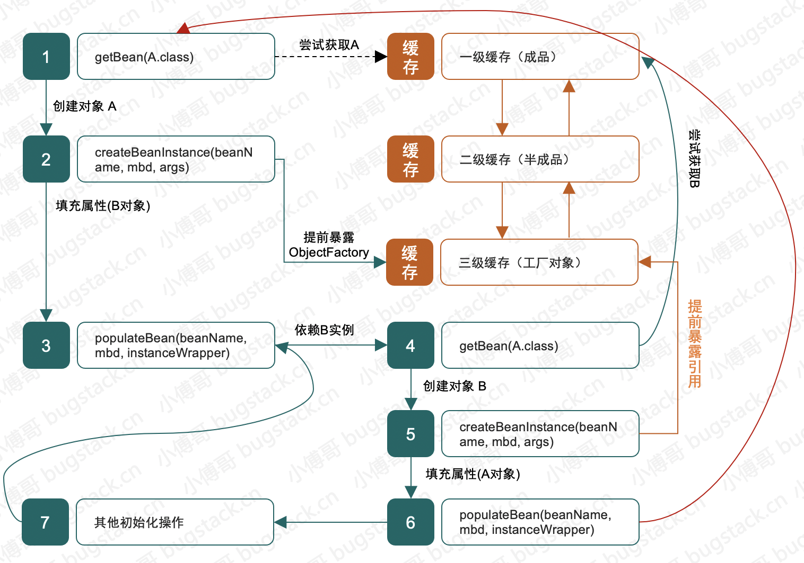

## 一、手动解决循环依赖问题

### 1.循环依赖的产生



- 循环依赖分为三种: 自身依赖自身，两者相互依赖，多组依赖
- 循环本质: 就是你的完整创建依赖于我，而我的完整创建也依赖于你，但我们互相没法解耦，最终导致依赖创建失败
- 所以 Spring 提供了除了构造函数注入和原型注入外的，setter循环依赖注入解决方案

### 2. 问题的产生

```java
public class ABTest {
    public static void main(String[] args) {
        new ClazzA();
    }
}

class ClazzA {
    private ClazzB b = new ClazzB();
}

class ClazzB {
    private ClazzA a = new ClazzA();
}
```

- 这段代码就是循环依赖最初的模样，你中有我，我中有你，运行就报错 `java.lang.StackOverflowError`
- 这样的循环依赖代码是没法解决的，当你看到 Spring 中提供了 get/set 或者注解，这样之所以能解决，首先是进行了一定的解耦。让类的创建和属性的填充分离，先创建出半成品Bean，再处理属性的填充，完成成品Bean的提供。

### 3. 手动处理

```java
public class CircleTest {

    private final static Map<String, Object> singletonObjects = new ConcurrentHashMap<>(256);

    public static void main(String[] args) throws InstantiationException, IllegalAccessException {
        System.out.println(getBean(A.class).getB());
        System.out.println(getBean(B.class).getA());
    }

    private static <T> T getBean(Class<T> beanClass) throws InstantiationException, IllegalAccessException {
        String beanName = beanClass.getSimpleName().toLowerCase();
        if (singletonObjects.containsKey(beanName)) {
            return (T) singletonObjects.get(beanName);
        }

        // 实例化对象入缓存
        Object obj = beanClass.newInstance();
        singletonObjects.put(beanName, obj);
        // 属性填充补全对象
        Field[] fields = obj.getClass().getDeclaredFields();
        for (Field field : fields) {
            // 私有属性也可访问
            field.setAccessible(true);
            // 获取字段类型
            Class<?> fieldClass = field.getType();
            // 获取字段名称
            String fieldBeanName = fieldClass.getSimpleName().toLowerCase();
            // 判断缓存中是否存在该对象
            if (singletonObjects.containsKey(fieldBeanName)) {
                // 设置属性
                field.set(obj, singletonObjects.get(fieldBeanName));
            } else {
                // 递归需要实例的对象
                getBean(fieldClass);
            }
            field.setAccessible(false);
        }
        return (T) obj;
    }
}


class A {
    private B b;
    public B getB() {
        return b;
    }
    public void setB(B b) {
        this.b = b;
    }
}

class B {
    private A a;
    public A getA() {
        return a;
    }
    public void setA(A a) {
        this.a = a;
    }
}
```

- 这段代码提供了 A、B 两个类，互相有依赖。但在两个类中的依赖关系使用的是 setter 的方式进行填充。也就是只有这样才能避免两个类在创建之初不非得强依赖于另外一个对象。
- `getBean`，是整个解决循环依赖的核心内容，A 创建后填充属性时依赖 B，那么就去创建 B，在创建 B 开始填充时发现依赖于 A，但此时 A 这个半成品对象已经存放在缓存到`singletonObjects` 中了，所以 B 可以正常创建，在通过递归把 A 也创建完整了。

## 二、Spring的三级缓存

### 1. 一级缓存

**一级缓存存放的是完整对象，也叫成品对象。**



- 一级缓存并不能解决循环依赖问题
- 一级缓存存放的是对象的成品，因为 A 的成品创建依赖于 B，B的成品创建又依赖于 A，当需要补全B的属性时 A 还是没有创建完，所以会出现死循环。

### 2. 二级缓存

**二级缓存存放的是半成品对象，就是那些属性还没赋值的对象。**



- 二级缓存是可以解决循环依赖问题的
-  A 的成品创建依赖于 B，B的成品创建又依赖于 A，当创建A时先把A的实例化对象缓存起来，到B需要A时从二级缓存中获取给B补充完成，然后再补充A，这样A，B都完整了

### 3. 三级缓存

三级缓存存放的是 `ObjectFactory<?>` 类型的 lambda 表达式，就是这用于处理 AOP 循环依赖的,只有执行getObject()方法的时候才会正真返回代理对象。



- 三级缓存主要是解决 Spring AOP 的特性。AOP 本身就是对方法的增强，是 `ObjectFactory<?>` 类型的 lambda 表达式，而 Spring 的原则又不希望将此类类型的 Bean 前置创建，所以要存放到三级缓存中处理。
- 其实整体处理过程类似，唯独是 B 在填充属性 A 时，先查询成品缓存、再查半成品缓存，最后在看看有没有单例工程类在三级缓存中。最终获取到以后调用 getObject 方法返回代理引用或者原始引用。

### 为什么要包装一层ObjectFactory对象?

如果创建的Bean有对应的代理(AOP),那其他对象注入的时候,注入的应该是代理对象,但是Spring前期无法知道这个对象是不是存在循环依赖,在正常情况下(没有循环依赖),Spring都是在创建好完成品Bean后,在BeanPostProcessor中创建对应的代理对象.

那么存在循环依赖的情况下Spring有两个选择:

1. 不管有没有循环依赖,都提前创建好代理对象,并将代理对象放入缓存中,当出现循环依赖时,其他对象直接获取到缓存中的代理对象并注入
2. 不提前创建好对象,只有出现循环依赖的时候才实时生成代理对象,这样在没有循环依赖的情况下,Bean就可以按照Spring的设计原则的步骤来创建

Spring使用的是第二种方案,在对象外面包一层ObjectFactory,提前曝光的是ObjectFactory对象,在被注入的时候才在ObjectFactory.getObject()方法中生成代理对象,并将生成好的代理对象放入到第二级缓存中(避免多次调用getObject()),并删除三级缓存中的对象;

### 为什么需要三级缓存,直接使用第二种方案生成代理对象放入代理对象中不可以吗?

如果使用二级缓存的话,需要在Bean在实例化后就需要创建代理对象,这就`违背了Spring的设计原则`

Spring结合AOP和Bean的生命周期,是在Bean创建完成后,在BeanPostProcessor的after方法中完成对Bean的代理,如果按照方案二的话,没有出现循环依赖的情况下,Bean还是会在实例化后创建了一个代理对象,但是Bean的生命周期是在最后才创建的代理对象,违背了设计原则.

## 总结

如果对象A和对象B循环依赖,并且都有代理对象(AOP),那么创建的顺序就是:

1. A实例化后(半成品)放入三级缓存
2. A填充属性B =>B实例化后(半成品)放入三级缓存
3. B填充属性A => 以此从一、二、三级缓存中查找A对象 => 从三级缓存中找到A对象,创建A代理对象并放入二级缓存中,删除三级缓存中的A对象 => B注入A的代理对象
4. 创建B对象完成 => 从三级缓存中删除B对象,生成B代理对象放入一级缓存中
5. A半成品注入B代理对象
6. 从二级缓存中删除A代理对象,A代理对象加入一级缓存


https://developer.aliyun.com/article/766880#comment

面试官：”Spring是如何解决的循环依赖？“

答：Spring通过三级缓存解决了循环依赖，其中一级缓存为单例池（`singletonObjects`）,二级缓存为早期曝光对象`earlySingletonObjects`，三级缓存为早期曝光对象工厂（`singletonFactories`）。当A、B两个类发生循环引用时，在A完成实例化后，就使用实例化后的对象去创建一个对象工厂，并添加到三级缓存中，如果A被AOP代理，那么通过这个工厂获取到的就是A代理后的对象，如果A没有被AOP代理，那么这个工厂获取到的就是A实例化的对象。当A进行属性注入时，会去创建B，同时B又依赖了A，所以创建B的同时又会去调用getBean(a)来获取需要的依赖，此时的getBean(a)会从缓存中获取，第一步，先获取到三级缓存中的工厂；第二步，调用对象工工厂的getObject方法来获取到对应的对象，得到这个对象后将其注入到B中。紧接着B会走完它的生命周期流程，包括初始化、后置处理器等。当B创建完后，会将B再注入到A中，此时A再完成它的整个生命周期。至此，循环依赖结束！

面试官：”为什么要使用三级缓存呢？二级缓存能解决循环依赖吗？“

答：如果要使用二级缓存解决循环依赖，意味着所有Bean在实例化后就要完成AOP代理，这样违背了Spring设计的原则，Spring在设计之初就是通过`AnnotationAwareAspectJAutoProxyCreator`这个后置处理器来在Bean生命周期的最后一步来完成AOP代理，而不是在实例化后就立马进行AOP代理。

参考:

- https://bugstack.cn/md/java/interview/2021-05-05-%E9%9D%A2%E7%BB%8F%E6%89%8B%E5%86%8C%20%C2%B7%20%E7%AC%AC31%E7%AF%87%E3%80%8ASpring%20Bean%20IOC%E3%80%81AOP%20%E5%BE%AA%E7%8E%AF%E4%BE%9D%E8%B5%96%E8%A7%A3%E8%AF%BB%E3%80%8B.html