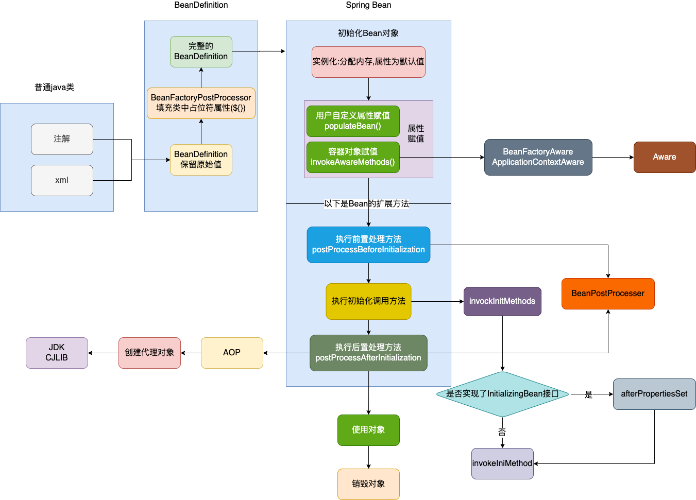
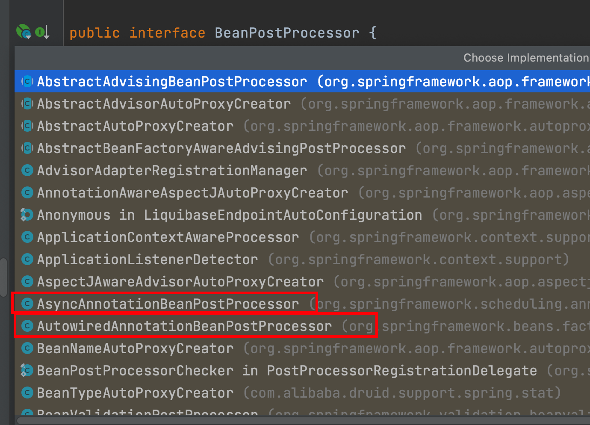

## 一、Bean的生命周期

SpringBean的总体创建流程:

- **以注解类变成Spring Bean为例,Spring会扫描指定包下的Java类,然后根据Java类构建BeanDefinition对象,然后再根据beanDefinition对象来创建Spring的Bean;**

#### 为什么要用BeanDefinition对象来创建Bean呢?而不是使用class对象来创建?

> 因为在class对象仅仅描述一个对象的创建,他不足以来描述一个SpringBean,而对于是否为懒加载,是否是首要的,初始化方法是那个,销毁方法是那个,这些Spring中特有的属性在class对象中并没有,所以Spring就定义了BeanDefinition来完成Bean的创建.




- xxxPostProcessor说明是某个xxx的后置处理器,也可以被叫做增强器

- BeanPostProcessor是在Bean创建前后的处理器,其中一些注解都是在这里处理的,例如@Autowired,@Async等

  

- 其中AOP是IOC的扩展,在**BeanPostProcessor# postProcessAfterInitialization**判断该Bean是否需要AOP代理增强,如果需要的话则返回一个代理对象

## 二、代码验证

```java
public class LouzaiBean implements InitializingBean, BeanFactoryAware, BeanNameAware, DisposableBean {

    /**
     * 姓名
     */
    private String name;

    public LouzaiBean() {
        System.out.println("1.调用构造方法：我出生了！");
    }

    public String getName() {
        return name;
    }

    public void setName(String name) {
        this.name = name;
        System.out.println("2.设置属性：我的名字叫"+name);
    }

    @Override
    public void setBeanName(String s) {
        System.out.println("3.调用BeanNameAware#setBeanName方法:我要上学了，起了个学名");
    }

    @Override
    public void setBeanFactory(BeanFactory beanFactory) throws BeansException {
        System.out.println("4.调用BeanFactoryAware#setBeanFactory方法：选好学校了");
    }

    @Override
    public void afterPropertiesSet() throws Exception {
        System.out.println("6.InitializingBean#afterPropertiesSet方法：入学登记");
    }

    public void init() {
        System.out.println("7.自定义init方法：努力上学ing");
    }

    @Override
    public void destroy() throws Exception {
        System.out.println("9.DisposableBean#destroy方法：平淡的一生落幕了");
    }

    public void destroyMethod() {
        System.out.println("10.自定义destroy方法:睡了，别想叫醒我");
    }

    public void work(){
        System.out.println("Bean使用中：工作，只有对社会没有用的人才放假。。");
    }
}
```

```java
public class MyBeanPostProcessor implements BeanPostProcessor {

    @Override
    public Object postProcessBeforeInitialization(Object bean, String beanName) throws BeansException {
        System.out.println("5.BeanPostProcessor.postProcessBeforeInitialization方法：到学校报名啦");
        return bean;
    }

    @Override
    public Object postProcessAfterInitialization(Object bean, String beanName) throws BeansException {
        System.out.println("8.BeanPostProcessor#postProcessAfterInitialization方法：终于毕业，拿到毕业证啦！");
        return bean;
    }
}
```

```java
<bean name="myBeanPostProcessor" class="demo.MyBeanPostProcessor" />
<bean name="louzaiBean" class="demo.LouzaiBean"
      init-method="init" destroy-method="destroyMethod">
    <property name="name" value="楼仔" />
</bean>
```

```java
public class MyTest {
    public static void main(String[] args) {
        ApplicationContext context =new ClassPathXmlApplicationContext("classpath:applicationContext.xml");
        LouzaiBean louzaiBean = (LouzaiBean) context.getBean("louzaiBean");
        louzaiBean.work();
        ((ClassPathXmlApplicationContext) context).destroy();
    }
}
```

```java
1.调用构造方法：我出生了！
2.设置属性：我的名字叫楼仔
3.调用BeanNameAware#setBeanName方法:我要上学了，起了个学名
4.调用BeanFactoryAware#setBeanFactory方法：选好学校了
5.BeanPostProcessor.postProcessBeforeInitialization方法：到学校报名啦
6.InitializingBean#afterPropertiesSet方法：入学登记
7.自定义init方法：努力上学ing
8.BeanPostProcessor#postProcessAfterInitialization方法：终于毕业，拿到毕业证啦！
Bean使用中：工作，只有对社会没有用的人才放假。。
9.DisposableBean#destroy方法：平淡的一生落幕了
10.自定义destroy方法:睡了，别想叫醒我
```

## 三、总结

Spring bean的生命周期可以分为四个阶段和多个扩展点

#### 四个阶段:

- 实例化:分配内存空间
- 属性赋值:自定义属性赋值,容器对象赋值(执行实现Aware接口的容器属性赋值)
- 初始化:
  - BeanPostProcessor#Before:没有做其他处理
  - 初始化:判断是否实现initliazingBean接口,实现了则执行afterPropertySet方法,然后执行自定义init方法
  - BeanPostProcessor#After:判断该bean是否需要动态代理,需要的话返回代理对象
- 销毁:停止系统自动销毁

#### 多个扩展点:

**影响所有Bean**

- BeanPostProcessor

  - postProcessBeforeInitialization

  - postProcessAfterInitialization

**影响单个Bean**

- BeanNameAware
- BeanFactoryAware
- EnvironmentAware
- ApplicatonContextAware