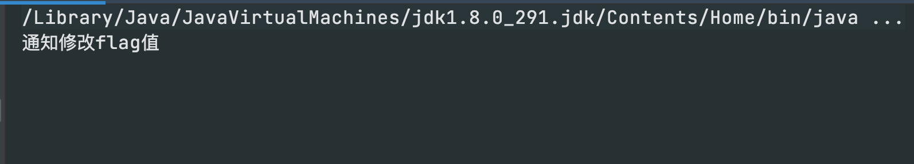
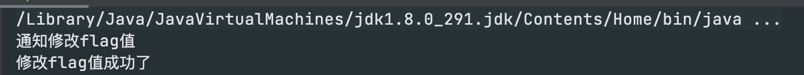
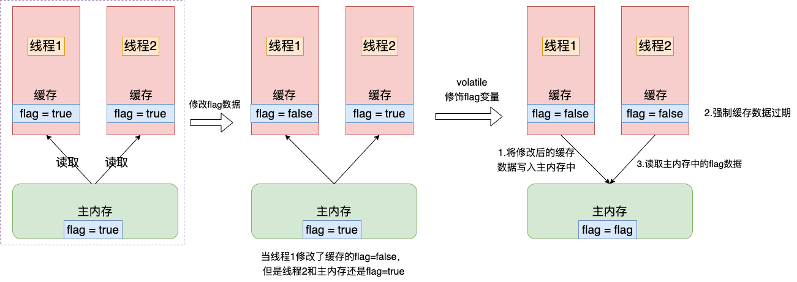

## 一、案例

### 1. 不加volatile修饰

```java
public class ApiTest {

    public static void main(String[] args) {
        Flag flag = new Flag();
        Thread thread = new Thread(flag);
        Thread thread1 = new Thread(() -> {
            try {
                Thread.sleep(1000);
                flag.flag = false;
                System.out.println("通知修改flag值");
            } catch (InterruptedException e) {
                e.printStackTrace();
            }
        });
        thread.start();
        thread1.start();
    }
}

class Flag implements Runnable {
    boolean flag = true;

    @Override
    public void run() {
        while (flag) {

        }
        System.out.println("修改flag值成功了");
    }
}
```



以上的例子“修改flag值成功了”一直没有执行，说明这个flag修改该线程并没有获取到；

### 2. 加上volatile修饰flag字段

```java
class Flag implements Runnable {
    volatile boolean flag = true;
    @Override
    public void run() {
        while (flag) {

        }
        System.out.println("修改flag值成功了");
    }
}
```



## 二、volatile解决了什么问题

**volatile主要解决了三个问题:**

1. 将修改后的缓存数据更新到主内存中
2. 强制使线程中该变量缓存置为无效，使用该变量需要从主内存中重新读取
3. 重排序时不能把后面的指令重排序到内存屏障之前的位置

### 1. 线程间可见



**1，2 解决是全局变量线程间可见问题，局部变量不行**

### 2. 但是不用volatile就不能保证线程间可见了嘛？

```java
class Flag implements Runnable {

    boolean flag = true;

    @Override
    public void run() {
        while (flag) {
            System.out.println("你好");
        }
        System.out.println("修改flag值成功了");
    }

}
```

 

当然，不使用volatile关键字，JVM也会尽力保证线程间可见性，但是使用volatile是一定能保证线程间可见。

### 3. 指令重排

**说明:** 在JVM，操作系统会对代码指令重排优化，比如代码中写: a = b, c= d，按照正常逻辑应该是先执行第一行，然后执行第二行，由于指令重排，这两行并没有任何关系，也许会被优化成c=d,a=b,先执行第二行，然后再执行第一行。

**解决:** volatile 如何防止指令重排也是内存屏障，volatile 的内存屏故障是在读写操作的前后各添加一个 StoreStore屏障，也就是四个位置，来保证重排序时不能把内存屏障后面的指令重排序到内存屏障之前的位置。

## 三、volatile原理

### 1. 汇编语言查看

```c++
   0x0000000003324cda: mov    0x74(%r8),%edx     ;*getstatic state
                                                 ; - VT::run@28 (line 27)
 
   0x0000000003324cde: inc    %edx
   0x0000000003324ce0: mov    %edx,0x74(%r8)
   0x0000000003324ce4: lock addl $0x0,(%rsp)     ;*putstatic state
                                                 ; - VT::run@33 (line 27)
```

编译后的汇编指令中，有volatile关键字和没有volatile关键字，主要差别在于多了一个 `lock addl $0x0,(%rsp)`，也就是lock的前缀指令。

**lock指令**相当于一个*内存屏障*,也就是解决了以上的三个问题。

## 四、总结

- volatile会控制被修饰的变量在内存操作上主动把值刷新到主内存，JVM会把该线程对应的缓存设置过期，从主内存中读取最新值；
- volatile 只能保证线程间变量可见，并不能解决原子性，如果需要解决原子性问题，需要使用 synchronzied 或者 lock
- volatile只能保证读取数据的原子性,因为是强制读取内存里的,但不能保证写数据是原子性的