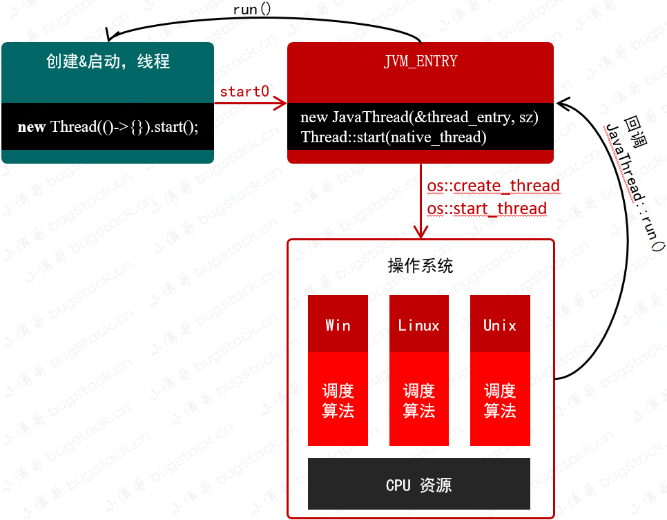

## 一、源码分析

```java
new Thread(() -> {
    // todo
}).start();
```

```java
public synchronized void start() {
    if (this.threadStatus != 0) {
        throw new IllegalThreadStateException();
    } else {
        this.group.add(this);
        boolean started = false;

        try {
           // 调用native方法，底层开启异步线程，并调用run方法。
            this.start0();
            started = true;
        } finally {
            try {
                if (!started) {
                    this.group.threadStartFailed(this);
                }
            } catch (Throwable var8) {
            }
        }
    }
}

private native void start0();

// 回调了Runable的run()接口
public void run() {
    if (this.target != null) {
        this.target.run();
    }
}
```

## 二、执行流程



- java线程启动会调用start0()本地方法，跳转到JVM层面
- JVM创建线程，利用类似适配器来操作不同的操作系统(windows,linux,unix)，进行cpu的调度
- 获取cpu后执行回调方法run()执行业务代码

**总结:**

- 如果只是执行Thread中的run()方法，并不会开始一个线程执行，还是执行在主线程中
- 如果想开启一个线程执行，只能调用start()方法，然后由JVM回调run()方法开始执行

 

参考：

- https://bugstack.cn/