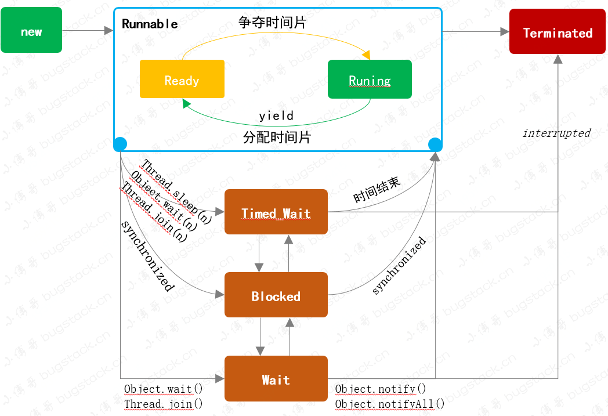

## 一、线程的几种状态

```java
NEW, RUNNABLE, BLOCKED, WAITING, TIMED_WAITING, TERMINATED
```



#### NEW: 线程创建还没有启动

```java
Thread thread = new Thread(() -> {
});
System.out.println(thread.getState());
```

#### RUNNABLE: 可运行状态，并不是已经运行，具体的线程调度各操作系统决定

在 Runnable 中包含了 **Ready**、**Running** 两个状态，当线程调用了 start() 方法后，线程则处于就绪 **Ready** 状态，等待操作系统分配 CPU 时间片，分配后则进入 **Running** 运行状态。此外当调用 yield() 方法后，只是*谦让*的允许当前线程让出CPU，但具体让不让不一定，由操作系统决定。如果让了，那么当前线程则会处于 Ready 状态继续竞争CPU，直至执行;

```java
Thread thread = new Thread(() -> {
});
thread.start();
System.out.println(thread.getState());
```

创建的线程启动后 `start()`，就会进入 RUNNABLE 状态。但此时并不一定在执行，而是说这个线程已经就绪，可以竞争 CPU 资源

#### BLOCKED: 当发生锁竞争状态下，没有获得锁的线程会处于挂起状态。

例如 synchronized 锁，先获得的先执行，没有获得的进入阻塞状态;

```java
Object o = new Object();
new Thread(() -> {
    synchronized (o) {
        try {
            Thread.sleep(10000);
        } catch (InterruptedException e) {
            e.printStackTrace();
        }
    }
}).start();

Thread thread = new Thread(() -> {
    synchronized (o) {
        try {
            System.out.println("获取了锁对象");
        } catch (Exception e) {
            e.printStackTrace();
        }
    }
});
thread.start();

Thread.sleep(1000);
System.out.println(thread.getState());
```

当第一个线程获得锁后休眠，不释放锁，这时候第二个线程就获取不到锁对象，导致第二个线程是阻塞状态。

#### WAITING: 可被唤醒的等待状态，此时线程不会被执行也不会被系统调度

此状态可以通过 synchronized 获得锁，调用 wait 方法进入等待状态。最后通过 notify、notifyall 唤醒。

下列方法都可以触发：`Object.wait`、`Thread.join`。

```java
Object o = new Object();
Thread thread = new Thread(() -> {
    synchronized (o) {
        try {
            o.wait();
        } catch (InterruptedException e) {
            e.printStackTrace();
        }
    }
});
thread.start();

Thread.sleep(1000);
System.out.println(thread.getState());
```

#### TIMED_WAITING: 指定时间内让出CPU资源，此时线程不会被执行，也不会被系统调度，直到等待时间到期后才会被执行

下列方法都可以触发：`Thread.sleep`、`Object.wait`、`Thread.join`

```java
Thread thread = new Thread(() -> {
    try {
        Thread.sleep(10000);
    } catch (InterruptedException e) {
        e.printStackTrace();
    }
});
thread.start();
Thread.sleep(1000);
System.out.println(thread.getState());
```

#### TERMINATED: 这个是终止状态，从 New 到 Terminated 是不可逆的。

一般是程序流程正常结束或者发生了异常。

## 二、常用方法

### 1. yield

yield 方法让出CPU，**但不一定，一定让出！**这种可能会用在一些同时启动的线程中，按照优先级保证重要线程的执行，也可以是其他一些特殊的业务场景（例如这个线程内容很耗时，又不那么重要，可以放在后面）。

**案例: 数字累加1000次，启动100个线程，其中10个yield让出线程，比较100个线程的执行时间和执行顺序**

```java
public class Yield implements Runnable {

    String name;
    boolean isYield;

    public Yield(String name, Boolean isYield) {
        this.name = name;
        this.isYield = isYield;
    }

    private static volatile ConcurrentHashMap<String, AtomicInteger> map = new ConcurrentHashMap<>();

    @Override
    public void run() {
        long startTime = System.currentTimeMillis();
        for (int i = 0; i < 1000; i++) {
            if (isYield) {
                Thread.yield();
            }
            AtomicInteger atomicInteger = map.get(name);
            if (Objects.isNull(atomicInteger)) {
                map.put(name, new AtomicInteger(1));
                continue;
            }
            atomicInteger.addAndGet(1);
            map.put(name, atomicInteger);
        }
        long endTime = System.currentTimeMillis();
        long time = endTime - startTime;
        System.out.println("线程编号:" + name + ",执行时间:" + time + ",是否让出线程:" + (isYield ? "YES =====" : "NO"));

    }
}
```

```java
Thread thread = new Thread(() -> {
});
thread.start();
System.out.println(thread.getState());

for (int i = 0; i < 100; i++) {
    boolean isYield = i < 10;
    Yield yield = new Yield(String.valueOf(i), isYield);
    new Thread(yield).start();
}
```

```java
线程编号:88,执行时间:1,是否让出线程:NO
线程编号:89,执行时间:0,是否让出线程:NO
线程编号:90,执行时间:0,是否让出线程:NO
线程编号:91,执行时间:0,是否让出线程:NO
线程编号:92,执行时间:0,是否让出线程:NO
线程编号:93,执行时间:0,是否让出线程:NO
线程编号:94,执行时间:1,是否让出线程:NO
线程编号:95,执行时间:1,是否让出线程:NO
线程编号:97,执行时间:1,是否让出线程:NO
线程编号:96,执行时间:1,是否让出线程:NO
线程编号:98,执行时间:0,是否让出线程:NO
线程编号:99,执行时间:0,是否让出线程:NO
线程编号:5,执行时间:42,是否让出线程:YES =====
线程编号:3,执行时间:42,是否让出线程:YES =====
线程编号:1,执行时间:42,是否让出线程:YES =====
线程编号:2,执行时间:42,是否让出线程:YES =====
线程编号:4,执行时间:42,是否让出线程:YES =====
线程编号:0,执行时间:42,是否让出线程:YES =====
线程编号:6,执行时间:43,是否让出线程:YES =====
线程编号:7,执行时间:42,是否让出线程:YES =====
线程编号:8,执行时间:42,是否让出线程:YES =====
线程编号:9,执行时间:42,是否让出线程:YES =====
```

可以明显的看出0-9编号的线程再最后执行，并且执行时间比家常，但是这个让出CPU并不是一定的；

### 2. wait&notify

wait 和 notify/nofityall，是一对方法，有一个等待，就会有一个叫醒，否则程序就夯在那不动了，配合synchronized使用；

因为wait和notify是通过监视对象锁来实现线程挂起和唤醒的.

**案例: 两个线程交替打印数字和字母，想达到的效果是1A2B3C4D....25Y26Z**

```java
public class WaitAndNotify {

    // true打印数字，false打印字母
    volatile boolean flag = true;
    // 数字的计数器
    int countNum = 1;
    // 字母的计数器
    int countLetter = 1;

    public synchronized void number() throws InterruptedException {
        // 数字大于26结束
        if (countNum > 26) {
            return;
        }
        // true执行，改变flag值，唤醒其他形成，否则就等待
        if (flag) {
            System.out.println(countNum++);
            flag = false;
            notify();
        } else {
            wait();
        }

    }

    public synchronized void letter() throws InterruptedException {
        if (countLetter > 25) {
            return;
        }
        if (!flag) {
            System.out.println((char) (countLetter + 'A'));
            flag = true;
            countLetter++;
            notify();
        } else {
            wait();
        }
    }
}
```

```java
class Test {
    public static void main(String[] args) {
        WaitAndNotify waitAndNotify = new WaitAndNotify();
        new Thread(() -> {
            while (true) {
                try {
                    waitAndNotify.number();
                } catch (InterruptedException e) {
                    e.printStackTrace();
                }
            }
        }).start();

        new Thread(() -> {
            while (true) {
                try {
                    waitAndNotify.letter();
                } catch (InterruptedException e) {
                    e.printStackTrace();
                }
            }
        }).start();
    }
}
```

### 3. join

join 是让当前线程进入 wait ，当线程执行完毕后，它执行完毕后，其实执行notify，也就是 `等待` 和 `叫醒` 操作。

```java
Thread thread = new Thread(() -> {
        System.out.println("start");
        try {
            Thread.sleep(10000);
        } catch (InterruptedException e) {
            e.printStackTrace();
        }
        System.out.println("over");
    });

    Thread thread1 = new Thread(() -> {
        System.out.println("开始执行");
        try {
            // thread1线程进入wait状态，等thread线程执行结束后notify唤醒
            thread.join();
        } catch (InterruptedException e) {
            e.printStackTrace();
        }
        System.out.println("结束执行");
    });

    thread.start();
    thread1.start();

    // 主线程wait，等待thread1线程执行结束后notify
    thread1.join();
    System.out.println("main线程");

}
```

```java
start
开始执行

over
结束执行
main线程
```

- 首先join() 是一个synchronized方法， 里面调用了wait()，这个过程的目的是让持有这个同步锁的线程进入等待,调用join()就相当于写了一个synchronized方法块；
- 然后在子线程thread执行完毕之后，JVM会调用lock.notify_all(thread),唤醒持有threadA这个对象锁的线程；

### 4. 死锁

线程1中需要A锁和B锁，线程2中需要B锁和A锁，当线程1获取到A需要B时，线程2获得B需要A，此时线程1，2就会产生互相需要锁的过程,就会死锁;

```java
		public static void main(String[] args) {
        ReentrantLock lock1 = new ReentrantLock();
        ReentrantLock lock2 = new ReentrantLock();
        new Thread(() -> {
            try {
                lock1.lock();
                System.out.println("lock1获得了锁");
                Thread.sleep(1000);
                lock2.lock();
                System.out.println("执行完毕1");
            } catch (InterruptedException e) {
                e.printStackTrace();
            } finally {
                lock1.unlock();
                lock2.unlock();
            }
        }).start();

        new Thread(() -> {
            try {
                lock2.lock();
                System.out.println("lock2获得了锁");
                Thread.sleep(1000);
                lock1.lock();
                System.out.println("执行完毕2");
            } catch (InterruptedException e) {
                e.printStackTrace();
            } finally {
                lock2.unlock();
                lock1.unlock();
            }
        }).start();


    }
```

```java
lock1获得了锁
lock2获得了锁
  
```

参考:

- https://bugstack.cn/