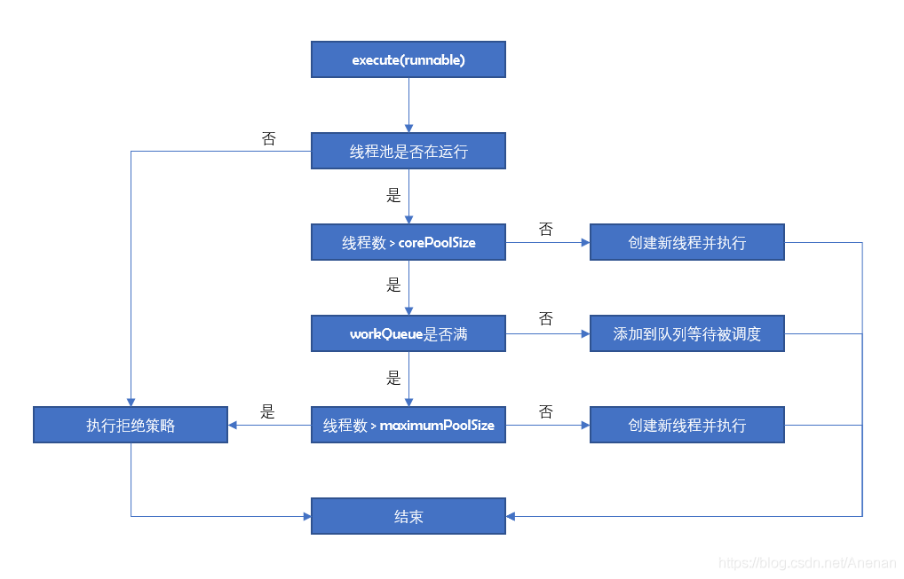

## 一、自定义线程池

```java
@Configuration
public class ExecutorConfig {

    private static final Logger logger = LoggerFactory.getLogger(ExecutorConfig.class);

    private static final ThreadFactory namedThreadFactory = new ThreadFactoryBuilder()
            .setUncaughtExceptionHandler((thread, throwable) -> logger.error("preparation-pool {} get exception", thread, throwable))
            .setNameFormat("preparation-pool-%d").build();
    /**
     * IO密集型任务  （常出现于线程中：数据库数据交互、文件上传下载、网络数据传输等等 能够体现多核处理器的优势）
     * CPU密集型任务  (常出现于线程中：复杂算法 能体现CPU版本的优势）
     * 获取该机器的CPU数量
     */
    private static final int CORE_POOL_SIZE = Runtime.getRuntime().availableProcessors() + 1;
    private static final int MAX_POOL_SIZE = Runtime.getRuntime().availableProcessors() * 2;
    private static final long KEEP_ALIVE_TIME = 60L;
    private static final TimeUnit TIME_UNIT = TimeUnit.MILLISECONDS;

    @Bean
    public ThreadPoolExecutor threadPoolExecutor() {
        ThreadPoolExecutor threadPoolExecutor = new ThreadPoolExecutor(
                CORE_POOL_SIZE,
                MAX_POOL_SIZE,
                KEEP_ALIVE_TIME,
                TIME_UNIT,
                new LinkedBlockingQueue<>(),
                namedThreadFactory,
                new ThreadPoolExecutor.AbortPolicy()
        );
        return threadPoolExecutor;
    }
}
```

### 1. 参数说明

- **corePoolSize：**核心线程数。
  - 线程池维护的最小线程数量，核心线程创建后不会被回收
  - 设置allowCoreThreadTimeout=true后，空闲的核心线程超过存活时间也会被回收
- **maximumPoolSize：**最大线程数。
  - 线程池允许创建的最大线程数量
  - 核心线程数已满，队列已满，最大线程数未满，则创建新的线程
- **keepAliveTime：**空闲线程存活时间。
  - 当一个可被回收的线程的空闲时间大于keepAliveTime，就会被回收。
  - 设置allowCoreThreadTimeout=true的核心线程。
  - 大于核心线程数的线程（非核心线程）。
- **TimeUnit：**时间单位。
  - TimeUnit.DAYS：天
  - TimeUnit.HOURS：小时
  - TimeUnit.MINUTES：分
  - TimeUnit.SECONDS：秒
  - TimeUnit.MILLISECONDS：毫秒
  - TimeUnit.MICROSECONDS：微妙
  - TimeUnit.NANOSECONDS：纳秒
- **BlockingQueue：**线程池任务队列。
  - ArrayBlockingQueue(常用) 数组型阻塞队列：数组结构，初始化时传入大小，有界，FIFO，使用一个重入锁，默认使用非公平锁，入队和出队共用一个锁，互斥。
  - LinkedBlockingQueue(常用) 链表型阻塞队列：链表结构，默认初始化大小为Integer.MAX_VALUE，有界（近似无解），FIFO，使用两个重入锁分别控制元素的入队和出队，用Condition进行线程间的唤醒和等待。
  - SynchronousQueue 同步队列：容量为0，添加任务必须等待取出任务，这个队列相当于通道，不存储元素。
  - PriorityBlockingQueue 优先阻塞队列：无界，默认采用元素自然顺序升序排列。
  - DelayQueue 延时队列：无界，元素有过期时间，过期的元素才能被取出。
- **ThreadFactory：**创建线程的工厂。
  - **Executors.defaultThreadFactory()**
  - 创建线程的工厂，可以设定线程名、线程编号等
- **RejectedExecutionHandler：**当线程池线程数已满，并且工作队列达到限制，新提交的任务使用拒绝策略处理。
  - AbortPolicy(默认)：丢弃任务并抛出RejectedExecutionException异常。
  - DiscardPolicy：丢弃任务，但是不抛出异常。可能导致无法发现系统的异常状态。
  - DiscardOldestPolicy：丢弃队列最前面的任务，然后重新提交被拒绝的任务。
  - **CallerRunsPolicy**：当触发拒绝策略，只要线程池没有关闭，则使用调用线程(main线程)直接运行任务。
    - 一般并发比较小，性能要求不高，不允许失败
    - 但是由于调用者（main线程）自己运行任务，就是串行执行任务，如果任务提交过快，可能导致程序阻塞，性能效率上有较大的损失

我们一般在Spring环境中使用线程池的，直接使用JUC原生的ThreadPoolExecutor有个问题，Spring容器关闭的时候可能任务队列里的任务还没有完成，有丢失的风险，按照SpringBean生命周期中，在关闭Spring容器的时候会调用一些销毁的方法来处理。

所以在Spring环境中，最好使用Spring提供的**ThreadPoolTaskExecutor**

```java
		@Bean
    public Executor getAsyncExecutor() {
        //线程池
        ThreadPoolTaskExecutor pool = new ThreadPoolTaskExecutor();
        pool.setCorePoolSize(5);
        pool.setMaxPoolSize(200);
        pool.setQueueCapacity(25);
        pool.setThreadNamePrefix("sys-thread-");
        pool.initialize();
        return pool;
    }
```

### 2. 流程图



### 3. shutdown和shutdownNow的区别

- 调用shutdown()方法后线程池不能接受新的任务，清除一些空闲worker,不会等待阻塞队列的任务完成。
- 调用shutdownNow()方法后线程池不能接受新的任务，中断所有线程，阻塞队列中没有被执行的任务全部丢弃。此时，poolsize=0,阻塞队列的size也为0

### 4. submit和execute的区别

```java
<T> Future<T> submit(Callable<T> var1);
<T> Future<T> submit(Runnable var1, T var2);
Future<?> submit(Runnable var1);
```

```java
void execute(Runnable var1);
```

- submit有返回值，并且可传递Callable和Runnable
- execute()没有返回值

## 二、其他线程池

```java
// 固定线程数
ExecutorService executorService = Executors.newFixedThreadPool(1);
```

- 创建一个固定大小可重复使用的线程池，以 `LinkedBlockingQueue` 无界阻塞队列存放等待线程
- 由于`LinkedBlockingQueue` 无界阻塞队列，容易造成OOM

```java
// 只创建一个执行线程
ExecutorService executorService = Executors.newSingleThreadExecutor();
```

- 只创建一个执行线程任务的线程池，如果出现意外终止则再创建一个
- 无界队列存放待执行线程，无限堆积下会出现OOM

```
ExecutorService executorService = Executors.newCachedThreadPool();
```

- 首先 `SynchronousQueue` 是一个生产消费模式的阻塞任务队列，只要有任务就需要有线程执行，线程池中的线程可以重复使用
- 如果线程任务比较耗时，又大量创建，会导致OOM

```java
    public static void main(String[] args) {
        ScheduledExecutorService executorService = Executors.newScheduledThreadPool(1);
        executorService.schedule(() -> {
            System.out.println("3秒后开始执行");
        }, 3, TimeUnit.SECONDS);
        executorService.scheduleAtFixedRate(() -> {
            System.out.println("3秒后开始执行，以后每2秒执行一次");
        }, 3, 2, TimeUnit.SECONDS);
        executorService.scheduleWithFixedDelay(() -> {
            System.out.println("3秒后开始执行，后续延迟2秒");
        }, 3, 2, TimeUnit.SECONDS);
    }
```

- 它可以延迟定时执行，有点像我们的定时任务。同样它也是一个无限大小的线程池 `Integer.MAX_VALUE`。它提供的调用方法比较多，包括：`scheduleAtFixedRate`、`scheduleWithFixedDelay`，可以按需选择延迟执行方式
- 导致OOM