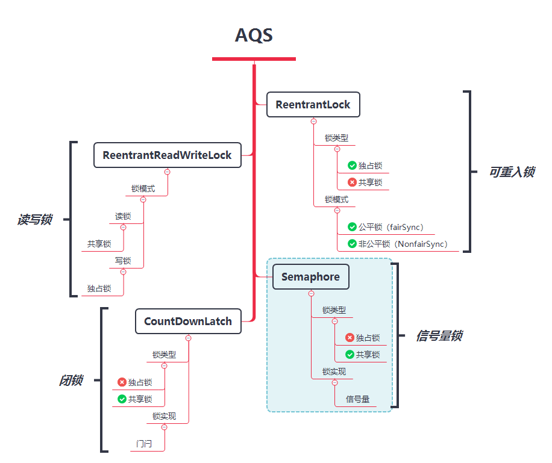

## 一、ReentrantLock

ReentrantLock 是锁中最常见的，构造函数中区分公平锁和非公平锁。

**开启十个线程，每个线程累加10000**

```java
static int count = 0;
ReentrantLock reentrantLock = new ReentrantLock(true);
for (int i = 0; i < 10; i++) {
    new Thread(() -> {
        try {
            reentrantLock.lock();
            for (int j = 0; j < 10000; j++) {
                count++;
            }
        } finally {
            reentrantLock.unlock();
        }
    }).start();
}
// 等待所有线程执行完
Thread.sleep(1000);
System.out.println(count);
```

## 二、Semaphore

信号量，每次放行n个线程执行，执行完了在放行n个线程。。。

```java
// 每次放行2个线程，true为公平锁，排队拿锁
Semaphore semaphore = new Semaphore(2, true);
for (int i = 0; i < 10; i++) {
    new Thread(() -> {
        try {
          	// 获取锁
            semaphore.acquire();
            System.out.println(Thread.currentThread().getName());
            Thread.sleep(100);
            System.out.println();
        } catch (InterruptedException e) {
            e.printStackTrace();
        } finally {
           // 释放锁
            semaphore.release();
        }
    }, "线程:" + i).start();
}
```

## 三、CountDownLatch

门闩，就是类似春游，等同学们都到齐了才能准备出发。

```java
// 初始化10个门闩
CountDownLatch latch = new CountDownLatch(10);
ExecutorService exec = Executors.newFixedThreadPool(10);
for (int i = 0; i < 10; i++) {
    exec.execute(() -> {
        try {
            Thread.sleep(1000);
            System.out.println(Thread.currentThread().getName() + "准备好了");
        } catch (Exception ignore) {
        } finally {
          	// 执行完一个线程减少一个
            latch.countDown();
        }
    });
}
// 阻塞等待，需要所有线程都执行完了在执行
latch.await();
System.out.println("都准备好了，准备入场！");
exec.shutdown();
```