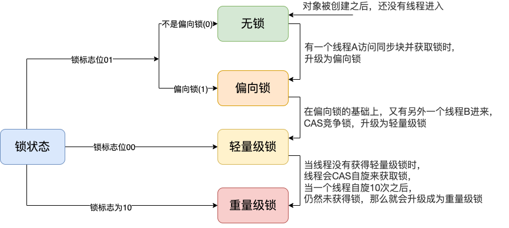

## 一、对象头

### 1.对象结构


**HotSpot虚拟机中**，对象在内存中存储的布局可以分为三块区域：`对象头（Header）`、`实例数据（Instance Data）`和`对齐填充（Padding）`。

- mark-word: 对象标记字段占4个字节，用于存储一些列的标记位，比如轻量级锁的标记位，偏向锁的标记位，分代年龄等。
- Kclass Pointer: Class对象的类型指针，Jdk1.8默认开启指针压缩后为4字节，关闭指针压缩（`-XX:-UseCompressedOops`）后，长度为8字节。其指向的位置是对象对应的Class对象（其对应的元数据对象）的内存地址。

- 对齐：最后这段空间补全并非必须，仅仅为了起到占位符的作用。由于HotSpot虚拟机的内存管理系统要求对象起始地址必须是8字节的整数倍，所以对象头正好是8字节的倍数。因此当对象实例数据部分没有对齐的话，就需要通过对齐填充来补全。

在mark-word锁类型标记中，无锁，偏向锁，轻量锁，重量锁，以及GC标记，5种类中没法用2比特标记（2 bit最终有4种组合`00`、`01`、`10`、`11`），所以无锁、偏向锁，前又占了一位偏向锁标记。最终：001为无锁、101为偏向锁。


### 2. Monitor 对象

- monitor可以把它理解成一个同步的机制，通常说是Synchronized的对象锁
- **每个java对象头中都包括monitor对象**，markword的锁标志位为10，**其中指针指向的是Monitor对象的起始地址**
- synchronized锁就是通过这种方式获取锁的，也就是为什么java中任意对象都可以作为锁的原因

**Monitor是由ObjectMonitor实现的**，数据结构如下:

```java
// initialize the monitor, exception the semaphore, all other fields
// are simple integers or pointers
ObjectMonitor() {
    _header       = NULL;
    _count        = 0;       // 记录个数
    _waiters      = 0,
    _recursions   = 0;       // 线程重入次数
    _object       = NULL;    // 存储 Monitor 对象
    _owner        = NULL;    // 持有当前线程的 owner
    _WaitSet      = NULL;    // 处于wait状态的线程，会被加入到 _WaitSet
    _WaitSetLock  = 0 ;
    _Responsible  = NULL ;
    _succ         = NULL ;
    _cxq          = NULL ;   // 单向列表
    FreeNext      = NULL ;
    _EntryList    = NULL ;   // 处于等待锁block状态的线程，会被加入到该列表
    _SpinFreq     = 0 ;
    _SpinClock    = 0 ;
    OwnerIsThread = 0 ;
    _previous_owner_tid = 0;
}
```

ObjectMonitor有两个队列，WaitSet和EntryList,用来保存ObjectWaiter（ **每个等待锁的线程都会被封装成ObjectWaiter对象** ）对象列表，owner指向持有ObjectMonitor对象的线程，当多个线程同时访问一段代码时:


- 首先进入Entry_List集合，当线程获取到对象的monitor后，进入owner区域并把monitor中的owner变量设置为当前线程，同时monitor中的计数器count加1；
- 若线程调用wait()方法，将释放当前持有的monitor，owner变量将恢复为null，count自减1，同时该线程进入waitSet集合中等待被唤醒
- 若当前线程执行完毕，也将释放monitor锁，并复位count的值，以便其他线程进入获取monitor锁

**总结：**

任何一个对象都与一个Montior对象与之关联，当一个Montior被持有后，他将处于锁定状态，synchronized在jvm中的实现都是基于进入和退出Montior对象来实现方法的同步，虽然具体的实现细节不同，但是都可以通过成对的MontorEnter和MontorExit指令来实现；

- **MonitorEnter指令**：插入在同步代码块的开始位置，当代码执行到该指令，将会尝试获取该对象的Monitor的所有权，即尝试获取该对象的锁。
- **MonterExit指令**: 插入在方法结束处和异常处，JVM保证每个MonitorEnter必须有对应的MonitorExit。

## 二、synchronized的特性

`synchronized` 关键字加到 `static` 静态方法和 `synchronized(class)` 代码块上都是是给 Class 类上锁。

`synchronized` 关键字加到实例方法上是给对象实例上锁。

### 1. 原子性

**原子性**是指一个操作是不可中断的，要么全部执行成功要么全部执行失败。

**案例说明:**

开十个线程，每个线程都累加1000遍，这样应该最后的值是10000才对；

```java
public class SyncTest {
		// volatile 保证线程之间的可见性
    private static volatile Integer count = 0;
    public static void main(String[] args) {
        for (int i = 0; i < 10; i++) {
            new Thread(() -> {
                for (int j = 0; j < 1000; j++) {
                    add();
                }
            }).start();
        }
    }

    private static void add() {
            count++;
            System.out.println(count);
    }
}
```

```java
...
9994
9995
9996
9997
```

试验多次，有时候也能到10000，但大多数都会比10000少一点；

**原因：**

- 线程A获取到数据count为10的时候，另外一个线程B也拿到的数据为10
- 当线程A的count++并更新成11时候，B也做了同样的动作，所以这两个线程就同时更新到了11，这就少了一次

**添加synchronized同步方法：**

``` java
private synchronized static void add() {
        count++;
        System.out.println(count);
}
```

这次测试的结果都是10000了

**反编译SyncTest.class类: javap -v -p AtomicityTest**


**同步方法**，即把synchronized修改方法上

`ACC_SYNCHRONIZED` 这是一个同步标识，这10个线程进入这个方法时，都会判断是否有此标识，然后开始竞争 Monitor 对象。

获取成功之后才能执行方法体，方法执行完后再释放monitor。在方法执行期间，其他任何线程都无法再获得同一个monitor对象。

**同步代码块**

```java
private  static void add() {
    synchronized (SyncTest.class) {
        count++;
        System.out.println(count);
    }
}
```


- `monitorenter`，抢先进入此方法的线程会优先拥有 Monitor 的 owner ，此时计数器 +1。
- `monitorexit`，当执行完退出后，计数器 -1，归 0 后被其他进入的线程获得。

### 2. 可见性

```java
public class ApiTest {
    static boolean flag = true;

    public static void main(String[] args) {
        new Thread(() -> {
            while (flag) {

            }
            System.out.println("执行结束");
        }).start();
        new Thread(() -> {
            try {
                Thread.sleep(1000);
                flag = false;
            } catch (InterruptedException e) {
                e.printStackTrace();
            }
        }).start();
    }
}
```

变量flag默认为true，当线程B修改flag=false后，由于两个线程之间的变量不可见，线程A会一致循环在while里，循环体里不要打印

System.out.println语句，因为这里面有synchronized；

```java
public void println(String x) {
    synchronized (this) {
        print(x);
        newLine();
    }
}
```

在while循环里添加synchronized代码块

```java
public class ApiTest {
    static boolean flag = true;

    public static void main(String[] args) {
        new Thread(() -> {
            while (flag) {
                synchronized (ApiTest.class) {
                    
                }
            }
            System.out.println("执行结束");
        }).start();
        new Thread(() -> {
            try {
                Thread.sleep(1000);
                flag = false;
            } catch (InterruptedException e) {
                e.printStackTrace();
            }
        }).start();
    }
}
```

这样flag=false就会被接收到，打印出”执行结束“，**说明synchronized也是可以保证线程的可见性**，原因如下：

1. 线程在加锁前，将清空本地缓存里共享变量的值，从而使用共享变量时需要从主内存中重新读取最新的值
2. 线程在解锁时，必须将共享变量的值更新到主内存中
3. volatile解决线程间可见性，主要是因为内存屏障
4. synchronized 靠操作系统内核互斥锁实现，退出代码块时刷新变量到主内存

### 3. 有序性

Java程序中天然的有序性可以总结为一句话：**如果在本线程内观察，所有操作都是天然有序的。如果在一个线程中观察另一个线程，所有操作都是无序的。**前半句是指“线程内似表现为串行的语义”，后半句是指“指令重排”现象和“工作内存与主内存同步延迟”现象。

经典案例，双重检验的单例模式：

```java
public class Singleton {
    private Singleton() {
    }

    private volatile static Singleton instance;

    public Singleton getInstance() {
        if (instance == null) {
            synchronized (Singleton.class) {
                if (instance == null) {
                    instance = new Singleton();
                }
            }
        }
        return instance;
    }
}
```

为什么synchronized能保证线程间的可见性还要有volatile呢？

- synchronized 的有序性是持有相同锁的两个同步块只能串行的进入，即被加锁的内容要按照顺序被多个线程执行，但是其内部的同步代码还是会发生重排序，使块与块之间有序可见。
- volatile的有序性是通过插入**内存屏障来保证指令按照顺序执行**。不会存在后面的指令跑到前面的指令之前来执行。是保证编译器优化的时候不会让指令乱序。
- synchronized 是不能保证指令重排的

### 4. 可重入性

synchronized 是可重入锁，也就是说，允许一个线程二次请求自己持有对象锁的临界资源，这种情况称为可重入锁；

```java
class Service {
    synchronized public void service1() {
        System.err.println("service1");
        service2();
    }
    synchronized public void service2() {
        System.err.println("service2");
        service3();
    }
    synchronized public void service3() {
        System.err.println("service3");
    }
}

public class SyncTest {
    public static void main(String[] args) {
        Service service = new Service();
        service.service1();
    }
}
```

```java
service1
service2
service3
```

## 三、锁的升级

在 `synchronized` 最初的实现方式是 “**阻塞或唤醒一个Java线程需要操作系统切换CPU状态来完成，这种状态切换需要耗费处理器时间，如果同步代码块中内容过于简单，这种切换的时间可能比用户代码执行的时间还长”**，这种方式就是 `synchronized`实现同步最初的方式，这也是当初开发者诟病的地方，这也是在JDK6以前 `synchronized`效率低下的原因，JDK6中为了减少获得锁和释放锁带来的性能消耗，引入了“**偏向锁**”和“**轻量级锁**”。

**锁的升级图：**



### 无锁(001)

 当一个对象被创建之后，还没有线程进入，这个时候对象处于无锁状态

### 偏向锁(101)

当锁处于无锁状态时，**有一个线程A访问同步块并获取锁时**，会在对象头和栈帧中的锁记录记录线程ID，以后该线程在进入和退出同步块时不需要进行CAS操作来进行加锁和解锁，只需要简单的测试一下啊对象头中的线程ID和当前线程是否一致。

### 轻量级锁(00)

在偏向锁的基础上，又有另外一个线程B进来，这时判断对象头中存储的线程A的ID和线程B不一致，就会使用CAS竞争锁，并且升级为轻量级锁，会在线程栈中创建一个锁记录(lock Record)，将Mark Word复制到锁记录中，然后线程尝试使用CAS将对象头的Mark Word替换成指向锁记录的指针，如果成功，则当前线程获得锁；失败，表示其他线程竞争锁，当前线程便尝试CAS来获取锁。

### 重量级锁(10)

当线程没有获得轻量级锁时，线程会CAS自旋来获取锁，当一个线程自旋10次之后，仍然未获得锁，那么就会升级成为重量级锁。成为重量级锁之后，线程会进入阻塞队列(EntryList)，线程不再自旋获取锁，而是由CPU进行调度，线程串行执行。