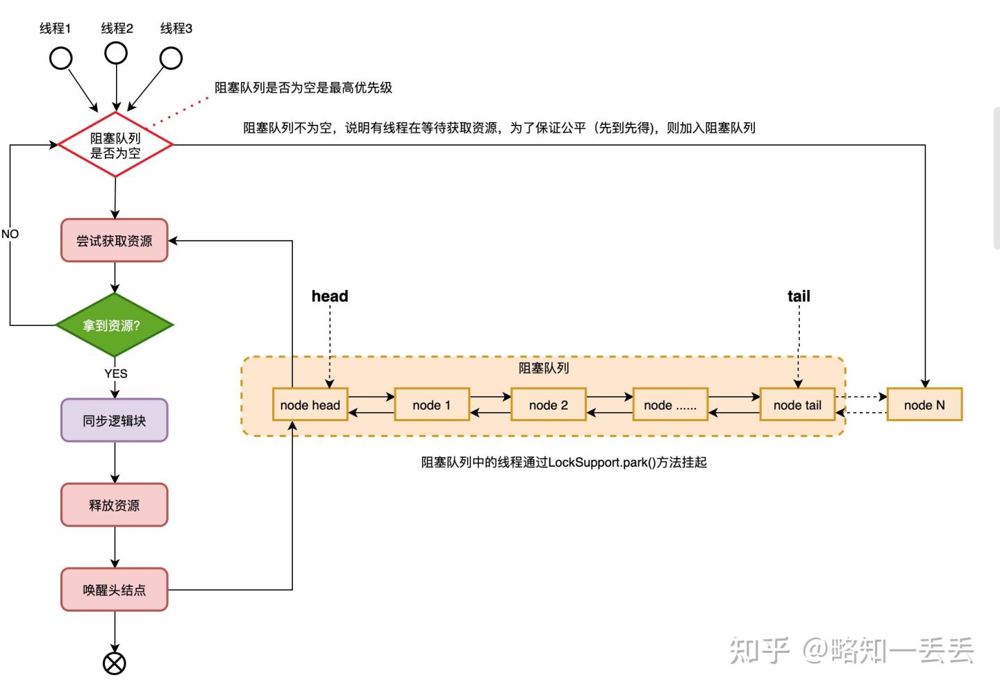
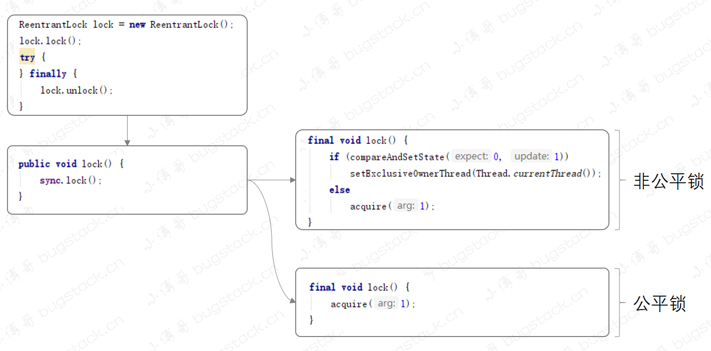
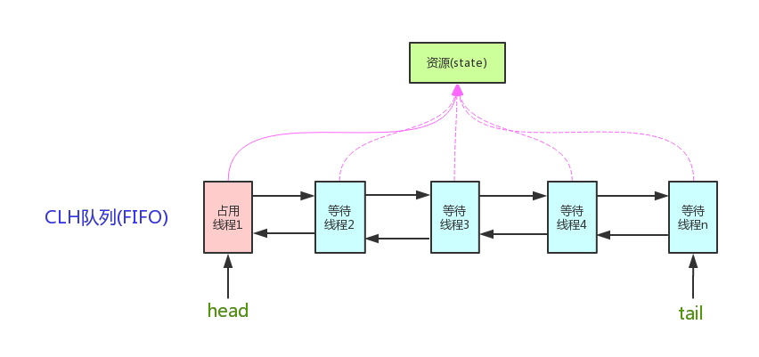

## 一、ReentrantLock

其实ReentrantLock、CountDownLatch、Semaphore这些并发工具类，底层都是基于AbstractQueuedSynchronizer

ReentrantLock分为公平锁和非公平锁，默认为非公平锁，可以通过传参改变锁类型

```java
public ReentrantLock(boolean fair) {
    sync = fair ? new FairSync() : new NonfairSync();
}
```

ReentrantLock是独占锁，同一时刻只能有一个线程能够尝试获得资源成功，其他获取失败的线程都会加入阻塞队列的对队尾进行排队

公平锁就是线程严格按照排队的顺序依次尝试获得锁，先到先得，不得插队，如下图所示：



而非公平锁就是当node1被唤醒正在尝试获得锁时，有另外一个线程进来了也在尝试获得锁并且成功了，而node1获取锁失败，这就是非公平锁。

### 1. lock




#### 2. (AQS)acquire

```java
public final void acquire(int arg) {
    if (!tryAcquire(arg) &&
        acquireQueued(addWaiter(Node.EXCLUSIVE), arg))
        selfInterrupt();
}
```

**tryAcquire:** 分别由继承AQS的公平锁(FairSync)、非公平锁(NonfairSync)实现

**addWaiter:**该方法是AQS的私有方法，主要用途是方法tryAcquire返回false以后，也就是尝试获取锁失败后，把当前请求锁的线程添加到队列中，并返回Node节点

**acquireQueued:**负责把addWaiter返回的Node节点添加到队列结尾，炳辉执行获取锁操作以及判断是否把当前线程挂起

**selfInterrupt:**是 AQS 中的 `Thread.currentThread().interrupt()` 方法调用，它的主要作用是在执行完 acquire 之前自己执行中断操作



#### 3. tryAcquire

``` java
final boolean nonfairTryAcquire(int acquires) {
    final Thread current = Thread.currentThread();
    int c = getState();
    if (c == 0) {
        if (compareAndSetState(0, acquires)) {
            setExclusiveOwnerThread(current);
            return true;
        }
    }
    else if (current == getExclusiveOwnerThread()) {
        int nextc = c + acquires;
        if (nextc < 0) // overflow
            throw new Error("Maximum lock count exceeded");
        setState(nextc);
        return true;
    }
    return false;
}
```

- 如果c==0，说明锁没有被占用，尝试使用CAS获取锁，并返回true
- 如果`current == getExclusiveOwnerThread()`,也就是当前线程拥有锁，则需要调用`setState(nextc)`进行重入锁操作，把当前线程的state+1，setState不需要加锁，因为在自己线程下面
- 如果以上都不满足，则返回false，获取锁失败

#### 4. addWaiter

```java
private Node addWaiter(Node mode) {
    Node node = new Node(Thread.currentThread(), mode);
    Node pred = tail;
    // 如果队列不为空, 使用 CAS 方式将当前节点设为尾节点
    if (pred != null) {
        node.prev = pred;
        if (compareAndSetTail(pred, node)) {
            pred.next = node;
            return node;
        }
    }
    // 队列为空、CAS失败，将节点插入队列
    enq(node);
    return node;
}
```

- 当执行方法 `addWaiter`，那么就是 `!tryAcquire = true`，也就是 tryAcquire 获取锁失败了
- 接下来就是把当前线程封装到Node节点，加入到FIFO队列中，因为先进先出，后来的都被加入到了队列尾部
- `compareAndSetTail`不一定成功，因为在并发情况下，可能会出现操作失败，那么失败后，需要调用`enq`方法，该方法会自旋操作，把节点加入队列尾部

#### 5. enq

```java
private Node enq(final Node node) {
    for (;;) {
        Node t = tail;
        if (t == null) { // Must initialize
            if (compareAndSetHead(new Node()))
                tail = head;
        } else {
            node.prev = t;
            if (compareAndSetTail(t, node)) {
                t.next = node;
                return t;
            }
        }
    }
}
```

- 自旋for循环 + CAS加入队列
- 当队列为空时，则会创建一个新的节点，把尾节点指向头节点，然后继续循环就不为空了
- 第二次循环时，则会把当前线程的节点添加到队列尾部。head是个无用节点

**注意：直接从尾节点逆向遍历**

- 因为这里的节点连接操作不是原子性，在并发情况下可能会出现个别节点没有设置next的值就失败了
- 但这些的perv的值是有的，所以需要逆向遍历，让perv的属性重新指向新的尾节点，直至全部自旋入队列

#### 6. acquireQueued

```java
final boolean acquireQueued(final Node node, int arg) {
    boolean failed = true;
    try {
        boolean interrupted = false;
        for (;;) {
            final Node p = node.predecessor();
            // 当前节点的前驱就是head节点时, 再次尝试获取锁
            if (p == head && tryAcquire(arg)) {
                setHead(node);
                p.next = null; // help GC
                failed = false;
                return interrupted;
            }
            // 获取锁失败后, 判断是否把当前线程挂起
            if (shouldParkAfterFailedAcquire(p, node) &&
                parkAndCheckInterrupt())
                interrupted = true;
        }
    } finally {
        if (failed)
            cancelAcquire(node);
    }
}
```

- 如果当前节点的前驱节点是Head节点，那么说明此时Node节点排在队列最前面，可以尝试获取锁
- 获取锁后设置Head节点，这个过程就是出队列的过程，原来的节点设置null方便GC
- 当获取锁流程走到这，说明节点已经加入队列完成
- 让该方法再次尝试获取锁，如果获取锁失败会判断是否把线程挂起

**shouldParkAfterFailedAcquire**

```java
private static boolean shouldParkAfterFailedAcquire(Node pred, Node node) {
   // 前驱节点中保存的等待状态
    int ws = pred.waitStatus;
    //等待状态是signal，也就是当前节点在等着被唤醒
    if (ws == Node.SIGNAL)
        return true;
    if (ws > 0) {
        do {
            node.prev = pred = pred.prev;
        } while (pred.waitStatus > 0);
        pred.next = node;
    } else {
       //将前驱节点的waitStatus设置为signal
        compareAndSetWaitStatus(pred, ws, Node.SIGNAL);
    }
    return false;
}
```

```java
//等待状态：表示节点中线程是已被取消的，放弃获取锁
static final int CANCELLED =  1;
//等待状态：表示当前节点的后继节点的线程需要被唤醒
static final int SIGNAL    = -1;
//等待状态：表示线程正在等待条件
static final int CONDITION = -2;
//等待状态：表示下一个共享模式的节点应该无条件的传播下去
static final int PROPAGATE = -3;
//等待状态，初始化为0，剩下的状态就是上面列出的
volatile int waitStatus;
```

1. 如果前一个节点状态是 `SIGNAL`，则返回 true，等着被叫醒
2. 如果前一个节点状态是 `CANCELLED`，就是它放弃了，则继续向前寻找其他节点
3. 最后如果什么都没找到，就给前一个节点设置个闹钟 `SIGNAL`，等着被通知


**太多了，不想整理了，日后有需要在整理吧。。。。QAQ**

参考：

- https://tech.meituan.com/2019/12/05/aqs-theory-and-apply.html
- https://bugstack.cn/