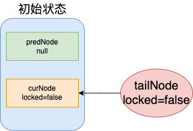
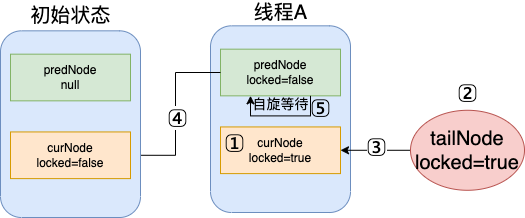
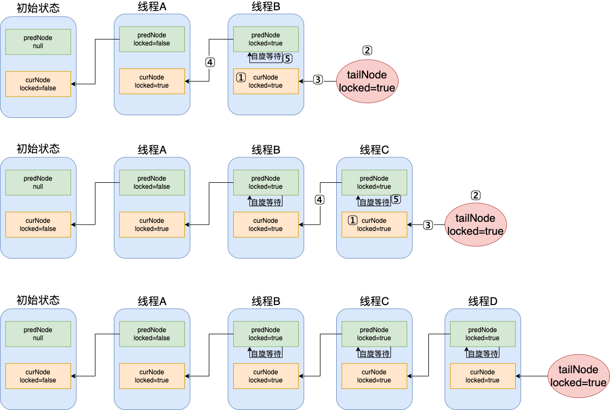
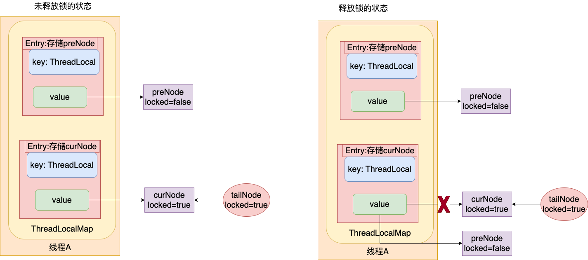

## 一、什么是公平锁

根据排队顺序获得锁叫做公平锁，那种通过竞争获得锁的叫不公平锁

## 二、CLH的实现

### 1. 代码实现

```java
/**
 * @author sunhw
 * @date 2022/5/9
 */
public class CLHLock {

    /**
     * CLH 锁节点
     */
    private static class Node {
        /**
         * 锁状态: 默认为false，表示线程没有获取到锁，true表示线程获取到了锁或者正在等待
         * 为了保证locked状态是线程可见的，使用volatile关键字修饰
         */
        volatile boolean locked = false;
    }

    /**
     * 尾节点，总是指向最后一个CLHNode节点\
     * AtomicReference 保证对象的原子性更新
     */
    private final AtomicReference<Node> tailNode;
    /**
     * 当前节点的前继节点
     */
    private final ThreadLocal<Node> predNode;
    /**
     * 当前节点
     */
    private final ThreadLocal<Node> curNode;

    /**
     * 初始化节点数据
     */
    public CLHLock() {
        // 尾节点初始化
        tailNode = new AtomicReference<>(new Node());
        // 初始化前继节点，此时的前继节点为null
        predNode = new ThreadLocal<>();
        // 初始化当前节点
        curNode = ThreadLocal.withInitial(CLHLock.Node::new);
    }

    /**
     * 获取锁
     */
    private void lock() {
        // 获取当前线程的ThreadLocal中存储的当前节点，初始化值是一个新建的Node，locked状态为false
        Node currNode = this.curNode.get();
        // 把当前节点设置为true表示获得了锁或者在等待锁的状态
        currNode.locked = true;
        // 当一个线程来到这里是，总是将尾节点取出来赋值给当前线程的前继节点,这样就能使后一个线程的前继节点指向前一个线程的当前节点
        // 然后把当前节点赋值给尾节点
        // tailNode节点里存的是前一个线程的当前节点，获取的也一样
        Node preNode = this.tailNode.getAndSet(currNode);
        // 将刚获取的尾结点（前一线程的当前节点）赋值给当前线程的前继节点
        this.predNode.set(preNode);
        // 若前继节点(前一个线程的当前节点)状态为false，则表示获得了锁，不用自旋等待
        // 若为false，则说明钱一个线程获得了锁或者正在等待，自璇等待
        while (preNode.locked) {
            System.out.println("线程" + Thread.currentThread().getName() + "没能获取到锁，进行自旋中...");
        }
        // 获得了锁
        System.out.println("线程" + Thread.currentThread().getName() + "获得了锁！！！");
    }

    /**
     * 释放锁
     */
    private void unlock() {
        // 获取线程的当前节点
        Node curNode = this.curNode.get();
        // 设置状态为false，此时执行了lock方法正在自旋等待的后继节点将会获取到锁，按照排队顺序获取锁，并不是所有的线程去竞争锁
        curNode.locked = false;
        System.out.println("线程" + Thread.currentThread().getName() + "释放了锁！！！");
        // 解决一个线程获得锁释放锁，再获得锁时自旋死锁问题
        this.curNode.set(this.predNode.get());
    }
}
```

**测试:**开启十个线程，每个线程累加1000遍，最后的结果还是10000

```java
/**
 * @author sunhw
 * @date 2022/5/10
 */
public class CLHTest {

    static int count = 0;

    public static void main(String[] args) throws InterruptedException {
        CLHLock clhLock = new CLHLock();
        for (int i = 0; i < 10; i++) {
            Thread thread = new Thread(() -> {
                add(clhLock);
            });
            thread.setName(i + "");
            thread.start();
        }
        Thread.sleep(1000);
        System.out.println(count);
    }

    private static void add(CLHLock clhLock) {
        try {
            clhLock.lock();
            for (int i = 0; i < 10000; i++) {
                count++;
            }
        } catch (Exception e) {
            e.printStackTrace();
        } finally {
            clhLock.unlock();
        }
    }
}
```

```java
线程9没能获取到锁，进行自旋中...
线程9没能获取到锁，进行自旋中...
线程9没能获取到锁，进行自旋中...
线程9没能获取到锁，进行自旋中...
线程9没能获取到锁，进行自旋中...
线程9没能获取到锁，进行自旋中...
线程8释放了锁！！！
线程9获得了锁！！！
线程9释放了锁！！！
10000
```

### 2. 图解lock过程

#### **初始状态**



```java
public CLHLock() {
    // 尾节点初始化
    tailNode = new AtomicReference<>(new Node());
    // 初始化前继节点，此时的前继节点为null
    predNode = new ThreadLocal<>();
    // 初始化当前节点
    curNode = ThreadLocal.withInitial(CLHLock.Node::new);
}
```

#### **当线程A进入，调用lock()方法时:**



**第一步**1⃣️：

- 获取A线程的当前节点，并赋值locked为true

```java
Node currNode = this.curNode.get();
currNode.locked = true;
```

**第二步**2⃣️3⃣️：

- 获取tailNode节点的值，也就是初始化(前一个线程)的时候那个locked=false
- 把A线程的当前节点locked=true赋值给tailNode

```java
Node preNode = this.tailNode.getAndSet(currNode);
```

**第三步**4⃣️:

- 由于perdNode就是前一个线程的当前节点，把当前线程的前继节点赋值前一个节点的当前节点

```java
this.predNode.set(preNode);
```

**第四步5⃣️:**

由于此时的preNode.locked为false，所以就直接获得了锁，并没有自旋等待

```java
while (preNode.locked)
```

#### 当线程B，C，D进入，调用lock()方法时:



执行步骤同上，只不过从B线程开始的prdNode.locked=true,5⃣️需要自旋等待，等到prdNode.locked=false时获得锁；

### 3. 图解unlock过程



```java
Node curNode = this.curNode.get();
curNode.locked = false;
// 解决一个线程获得锁释放锁，再获得锁时自旋死锁问题
this.curNode.set(this.predNode.get());
```