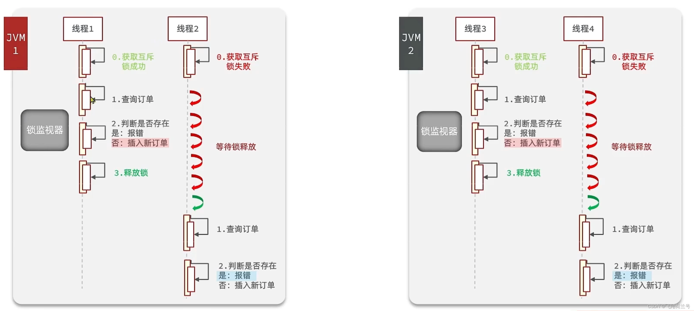
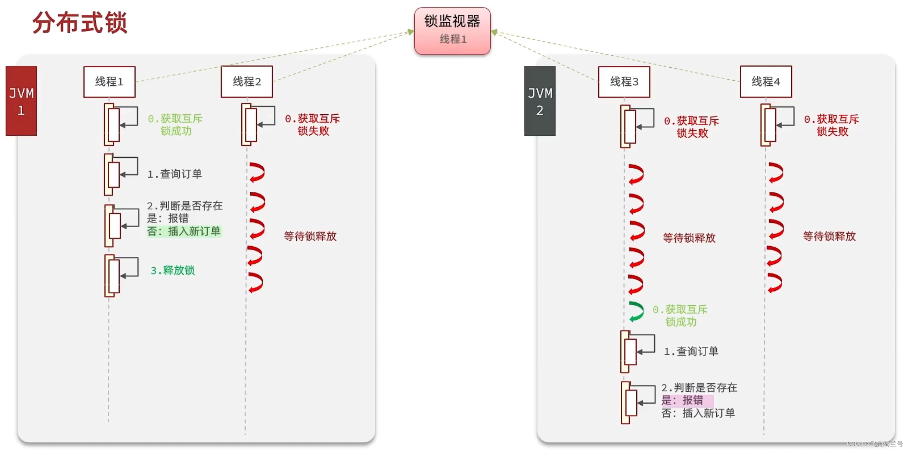
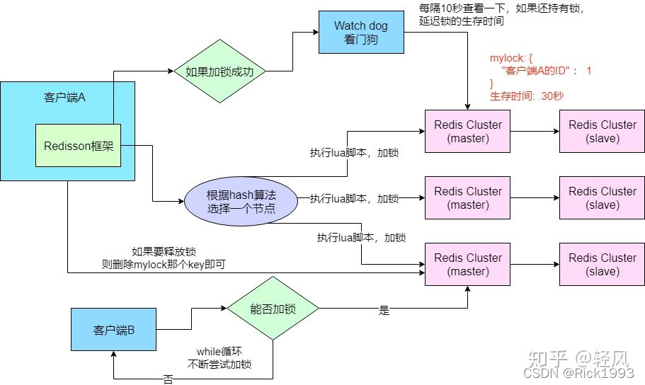

## 一、分布式锁

- 在集群模式下，synchronized只能保证单个JVM内部的线程互斥，不能保证跨JVM的互斥





## 二、Redisson

```java
	<!-- redis 分布式锁框架 -->
  <dependency>
  <groupId>org.redisson</groupId>
  <artifactId>redisson</artifactId>
  <version>3.12.5</version>
  </dependency>
```

**配置redisson**

```java
@Configuration
public class RedissonConfig {

    @Value("${spring.redis.host}")
    private String host;

    @Value("${spring.redis.port}")
    private String port;

    @Value("${spring.redis.password:}")
    private String password;

    @Value("${spring.redis.timeout:6000}")
    private Integer timeOut;


    @Bean
    @ConditionalOnProperty(prefix = "spring.redis", value = "enable", havingValue = "true", matchIfMissing = true)
    public RedissonClient getRedisson() {
        Config config = new Config();
        config.useSingleServer()
                .setTimeout(timeOut)
                .setAddress("redis://" + host + ":" + port);

        if (!StringUtils.isBlank(password)) {
            config.useSingleServer()
                    .setPassword(password);
        }

        return Redisson.create(config);
    }

}
```

**验证是否配置成功**

```java
redisson.getConfig().toJSON().toString()
```

**写法案例:**

```java
private void realHandle(ReportFileHandleAdapter reportFileHandleAdapter, String lockId, String reportId, String operationUserId) {
    // 对进来的研报id加锁
    RLock lock = redissonClient.getLock(lockId);
    try {
       // 尝试加锁, 3秒后自动解锁
        boolean getTryLock = lock.tryLock(3, TimeUnit.MINUTES);
            if (getTryLock) {
                // 执行业务。。。
            }
    } catch (InterruptedException e) {
        throw new BizException("操作频繁，请稍后重试");
    } catch (Exception e) {
        e.getStackTrace();
        log.error("研报文件操作异常：{}", e.getMessage());
    } finally {
      	// 判断是否为当前线程的锁
        if (lock.isLocked() && lock.isHeldByCurrentThread()) {
            lock.unlock();
        }
    }
}
```

**原理**

