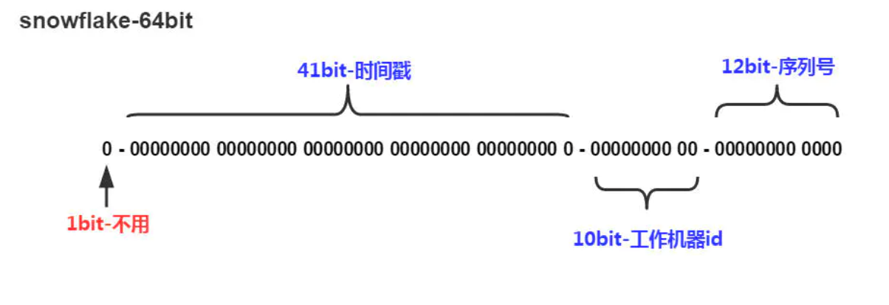

## 一、什么是雪花算法

snowflake是Twitter开源的分布式ID生成算法，结果是一个long型的ID；

SnowFlake算法生成id的结果是一个64bit大小的整数，它的结构如下图：



- 1bit: 因为二进制最高位表示符号位，所以1bit固定为0
- 10bit: 包括5位datacenterId和5位workerId,5bit可以表示的最大正整数是，即可以用0、1、2、3、....31这32个数字，来表示不同的datecenterId或workerId
- 12bit: 序列号，用来记录同毫秒内产生的不同id

## 二、为什么要用雪花算法

因为在分布式系统中，不可避免的需要使用分布式ID保证ID的唯一性，目前所知常用的分布式ID有雪花算法，UUID，Redis分发ID等，那为什么选用雪花算法呢？

- 性能好，速度快，每秒钟可以生成419万个ID
- ID按照时间在单机上是递增的，UUID是无规则的
- 产生的ID是Long数字，可读性高，UUID产生的是数字+字母，不可读

### snowflake算法时间回拨问题思考

##### 产生原因：

- 人为手动调整机器时间
- 由于有些业务等需要，机器需要同步时间服务器

##### 解决方案：

- 各机器不同步时间服务器，一劳永逸。

- 当回拨时间小于15ms，就等时间追上来之后继续生成。

- 当时间大于15ms时间我们通过更换workid来产生之前都没有产生过的来解决回拨问题。

  > 把所有的workId放入队列中，更换workid的时候从队列头部取，然后放回队列的尾部

- [Leaf——美团点评分布式ID生成系统](https://tech.meituan.com/2017/04/21/mt-leaf.html)：使用Zookeeper解决

## 三、Java编写

可在此基础上优化时间回拨问题；

```java
/**
 * Twitter_Snowflake<br>
 * SnowFlake的结构如下(每部分用-分开):<br>
 * 0 - 0000000000 0000000000 0000000000 0000000000 0 - 00000 - 00000 - 000000000000 <br>
 * 1位标识，由于long基本类型在Java中是带符号的，最高位是符号位，正数是0，负数是1，所以id一般是正数，最高位是0<br>
 * 41位时间截(毫秒级)，注意，41位时间截不是存储当前时间的时间截，而是存储时间截的差值（当前时间截 - 开始时间截)
 * 得到的值），这里的的开始时间截，一般是我们的id生成器开始使用的时间，由我们程序来指定的（如下下面程序IdWorker类的twepoch属性）。41位的时间截，可以使用69年，年T = (1L << 41) / (1000L * 60 * 60 * 24 * 365) = 69<br>
 * 10位的数据机器位，可以部署在1024个节点，包括5位datacenterId和5位workerId<br>
 * 12位序列，毫秒内的计数，12位的计数顺序号支持每个节点每毫秒(同一机器，同一时间截)产生4096个ID序号<br>
 * 加起来刚好64位，为一个Long型。<br>
 * SnowFlake的优点是，整体上按照时间自增排序，并且整个分布式系统内不会产生ID碰撞(由数据中心ID和机器ID作区分)，并且效率较高，经测试，SnowFlake每秒能够产生26万ID左右。
 */
public class SnowflakeIdWorker {

    // ==============================Fields===========================================
    /** 开始时间截 (2015-01-01) */
    private final long twepoch = 1420041600000L;

    /** 机器id所占的位数 */
    private final long workerIdBits = 5L;

    /** 数据标识id所占的位数 */
    private final long datacenterIdBits = 5L;

    /** 支持的最大机器id，结果是31 (这个移位算法可以很快的计算出几位二进制数所能表示的最大十进制数) */
    private final long maxWorkerId = -1L ^ (-1L << workerIdBits);

    /** 支持的最大数据标识id，结果是31 */
    private final long maxDatacenterId = -1L ^ (-1L << datacenterIdBits);

    /** 序列在id中占的位数 */
    private final long sequenceBits = 12L;

    /** 机器ID向左移12位 */
    private final long workerIdShift = sequenceBits;

    /** 数据标识id向左移17位(12+5) */
    private final long datacenterIdShift = sequenceBits + workerIdBits;

    /** 时间截向左移22位(5+5+12) */
    private final long timestampLeftShift = sequenceBits + workerIdBits + datacenterIdBits;

    /** 生成序列的掩码，这里为4095 (0b111111111111=0xfff=4095) */
    private final long sequenceMask = -1L ^ (-1L << sequenceBits);

    /** 工作机器ID(0~31) */
    private long workerId;

    /** 数据中心ID(0~31) */
    private long datacenterId;

    /** 毫秒内序列(0~4095) */
    private long sequence = 0L;

    /** 上次生成ID的时间截 */
    private long lastTimestamp = -1L;

    //==============================Constructors=====================================
    /**
     * 构造函数
     * @param workerId 工作ID (0~31)
     * @param datacenterId 数据中心ID (0~31)
     */
    public SnowflakeIdWorker(long workerId, long datacenterId) {
        if (workerId > maxWorkerId || workerId < 0) {
            throw new IllegalArgumentException(String.format("worker Id can't be greater than %d or less than 0", maxWorkerId));
        }
        if (datacenterId > maxDatacenterId || datacenterId < 0) {
            throw new IllegalArgumentException(String.format("datacenter Id can't be greater than %d or less than 0", maxDatacenterId));
        }
        this.workerId = workerId;
        this.datacenterId = datacenterId;
    }

    // ==============================Methods==========================================
    /**
     * 获得下一个ID (该方法是线程安全的)
     * @return SnowflakeId
     */
    public synchronized long nextId() {
        long timestamp = timeGen();

        //如果当前时间小于上一次ID生成的时间戳，说明系统时钟回退过这个时候应当抛出异常
        if (timestamp < lastTimestamp) {
            throw new RuntimeException(
                    String.format("Clock moved backwards.  Refusing to generate id for %d milliseconds", lastTimestamp - timestamp));
        }

        //如果是同一时间生成的，则进行毫秒内序列
        if (lastTimestamp == timestamp) {
            sequence = (sequence + 1) & sequenceMask;
            //毫秒内序列溢出
            if (sequence == 0) {
                //阻塞到下一个毫秒,获得新的时间戳
                timestamp = tilNextMillis(lastTimestamp);
            }
        }
        //时间戳改变，毫秒内序列重置
        else {
            sequence = 0L;
        }

        //上次生成ID的时间截
        lastTimestamp = timestamp;

        //移位并通过或运算拼到一起组成64位的ID
        return ((timestamp - twepoch) << timestampLeftShift) //
                | (datacenterId << datacenterIdShift) //
                | (workerId << workerIdShift) //
                | sequence;
    }

    /**
     * 阻塞到下一个毫秒，直到获得新的时间戳
     * @param lastTimestamp 上次生成ID的时间截
     * @return 当前时间戳
     */
    protected long tilNextMillis(long lastTimestamp) {
        long timestamp = timeGen();
        while (timestamp <= lastTimestamp) {
            timestamp = timeGen();
        }
        return timestamp;
    }

    /**
     * 返回以毫秒为单位的当前时间
     * @return 当前时间(毫秒)
     */
    protected long timeGen() {
        return System.currentTimeMillis();
    }

    //==============================Test=============================================
    /** 测试 */
    public static void main(String[] args) {
        SnowflakeIdWorker idWorker = new SnowflakeIdWorker(0, 0);
        for (int i = 0; i < 1000; i++) {
            long id = idWorker.nextId();
            System.out.println(Long.toBinaryString(id));
            System.out.println(id);
        }
    }
}
```

## 四、使用Hutool工具类中生成

没有解决时间回拨问题；

```java
Snowflake snowflake = IdUtil.getSnowflake(3, 10);
long nextId = snowflake.nextId();
```